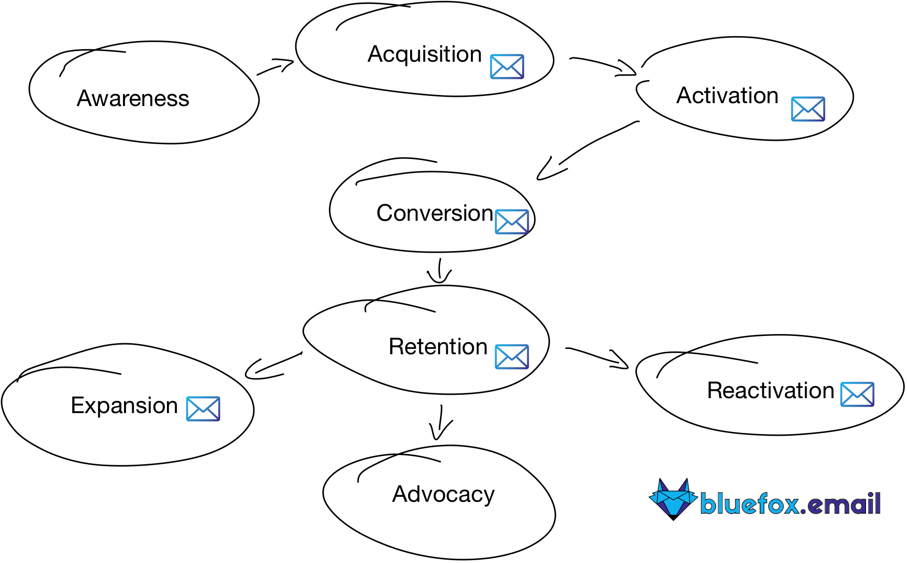
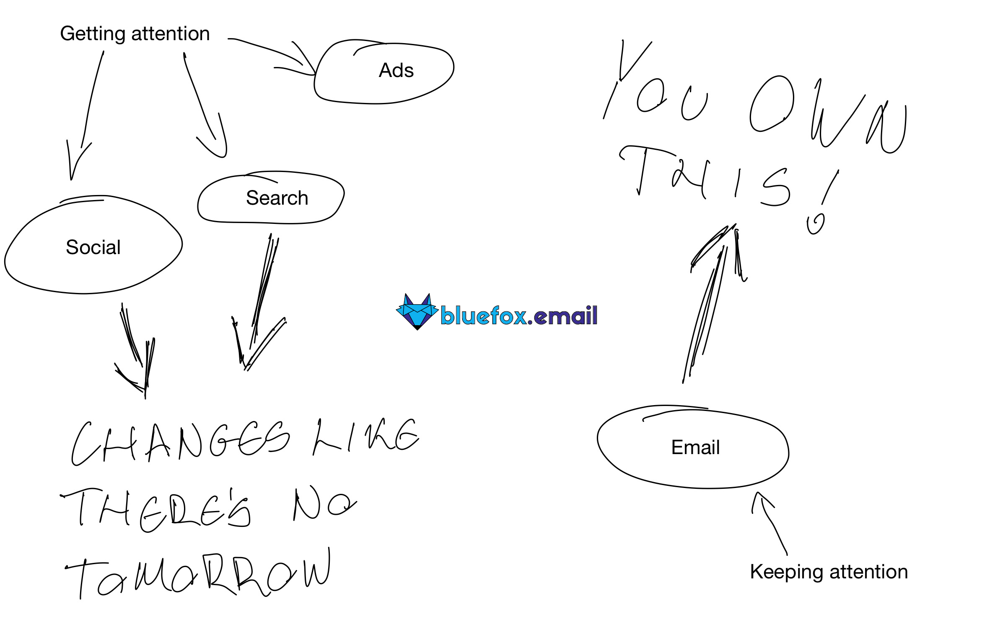

---
---

# No BS Email Marketing Course for Busy SaaS Founders

(TODO 90 SEC VIDEO HERE with a quick intro about myself as well)

*Marketing changes every day, algorithms shift constantly, and new tools make it even harder to keep up.
**Email is the one channel you control.** In this free 6-lesson No BS course, I’ll show you how to use it to grow your SaaS.*

---

We live in crazy times, especially when it comes to marketing. Everything changes rapidly, algorithms shift daily, and more and more people are starting to use LLMs instead of search engines.

In this highly unpredictable environment, we need to do our best to mitigate risks, or even better: turn them to our advantage. We need to stay connected with our prospects and users.

And this is where email comes in handy. Everyone has an email address, and we basically use it as our unique ID. If you can get people to sign up for your list, you'll have a direct way to communicate with them.

Even though many people claim they don't read their email, most of the time that's not true. They're just overwhelmed by the sheer volume of emails they receive. To get their attention, you need to send the right message to the right person at the right time. (I know, it's not easy. But that's why you are reading this course, right?)

::: tip My wife says she doesn't read email. But guess what... She DOES!
Here is a quick example from my own life. My wife often says she never reads emails and that she hates them. I was skeptical... not about the "hate" part, but about the "never reads" part. So I started to pay attention.

Turns out she checks her email multiple times a day. Not only that, but she also opens all the relevant marketing emails that provide real value. (In our case, one example is coupon codes on diapers, since we have two babies under two. Yeah! Those are quite relevant offers, right?)

The point is: if someone signs up to your list, and you send relevant, valuable emails (not spam), most of them will read what you send.
:::

**So, what can you expect from this course?**

In this course, we will show you how to actually set up an email marketing system as a SaaS founder that you can fine-tune later. No fancy jargon or 200-page “how-to” guides... Just 6 short lessons that cover everything you need to get started: sending your first newsletter, building onboarding flows, personalizing & segmenting your flows for better results, and creating lead magnets that actually bring new signups.

You can read the articles here, watch our YouTube videos, and sign up for the newsletter version to get access to the worksheets as well.

It only takes 6 weeks to get from zero to a functioning email marketing engine. Are you ready?

<SaaSEmailMarketingCourseSignup></SaaSEmailMarketingCourseSignup>

## Why Email Marketing Matters for SaaS Growth

Throughout the user lifecycle, email plays a very important role. You can use email in most stages as either your primary or secondary tool.

(TODO QUICK VIDEO HERE? or is the image enough?)

Let’s walk through the lifecycle stages of a user:  

### Awareness
Awareness is when people first discover your brand or product.  

Since we don’t know these people’s email addresses, we can’t really use email here (except for cold emails, but we won’t cover that topic in this course). The important part is: email becomes your **primary channel of contact in nearly all of the other lifecycle stages**.  

### Acquisition
Acquisition is when you get people to sign up.  

It can happen in different ways. For example, someone searches for a topic, finds your site, and then decides to sign up.

At this stage, you can use **email indirectly** through **lead magnets**. A lead magnet is a free, valuable resource you offer in exchange for someone’s email address. The goal is to convert visitors into leads.  

### Activation
Activation is when a new user reaches their first moment of real value.  

Here, you can guide users with **onboarding email flows** to help them succeed quickly.

### Conversion
Conversion is when you turn free users or leads into paying customers.  

You can use email to nurture leads with educational content, build trust, and send timely upgrade offers.  

### Retention
Retention is about keeping existing customers engaged and coming back.  

Email is one of the best tools here. For example, you can send:  
- Feature updates  
- “How to get more value” emails  
- Usage reminders and nudges  
- Tips, templates, or best practices
- and many more... 

### Expansion
Expansion is when you grow revenue from existing customers.  

With email, this usually happens through:  
- **Upgrade nudges**: highlighting the benefits of a higher plan  
- **Upsells**: promoting an additional product or service  

### Advocacy
Advocacy is when you turn happy customers into promoters.  

Email’s role here is more limited, but you can still:  
- Ask for testimonials or case studies  
- Run referral programs  
- Invite users to share feedback or reviews  

### Reactivation
Reactivation is bringing back churned or inactive customers.  

Email works well here through **re-engagement sequences** like win-back campaigns or “we miss you” messages.  

::: tip What we focus on in this course
In this course, we’ll focus mainly on **activation** (lesson 2), **retention** (lessons 1, 4, and 5), and **acquisition** (lessons 3 and 6). These are the most impactful stages for busy SaaS founders to master early.
:::

## How Email Fits Into the Bigger Marketing Mix

Think of **content (SEO), social, and ads** as channels for *getting attention*.  
Email, on the other hand, is about **keeping attention**, and moving people through activation, conversion, and retention, as we saw in the previous section.

The big difference? You don’t own your reach on social or search. Algorithms decide who sees your posts or ads. With email, once someone subscribes, that connection is yours. You have a direct line to their inbox... No middlemen, no changing rules. The only thing you need to do is send relevant content and make it easy for people to unsubscribe. (Because spamming is the fastest way to lose trust.)

One more thing: many people consider cold emails part of “email marketing.” We don’t.  
This course is not about cold emails. For us, email marketing starts the moment someone gives you their email address.  

## What You Will Learn from This Course

This is a **practical, no-fluff course built for busy SaaS founders**.  
In just 6 lessons, you’ll go from zero to having a simple, effective email marketing engine up and running:  

1. **Send Your First Newsletter**  
   Get your first message out the door and learn the basics.  

2. **Set Up Your First Welcome Flow**  
   Onboard new signups with a simple 3-email sequence.  

3. **Educational Email Series as a Lead Magnet**  
   Attract new leads by teaching and building trust.  

4. **Segmentation**  
   Organize your subscribers into meaningful groups.  

5. **Personalization**  
   Make your emails feel relevant without being creepy.  

6. **Other Lead Magnet Types**  
   Explore additional formats (checklists, ebooks, templates, etc.).  

---

::: warning Course material in progress
We’re still working on the course content. Sign up now and you’ll get updates (and worksheets) as soon as each lesson is released.
:::

(TODO SIGNUP FORM HERE)
