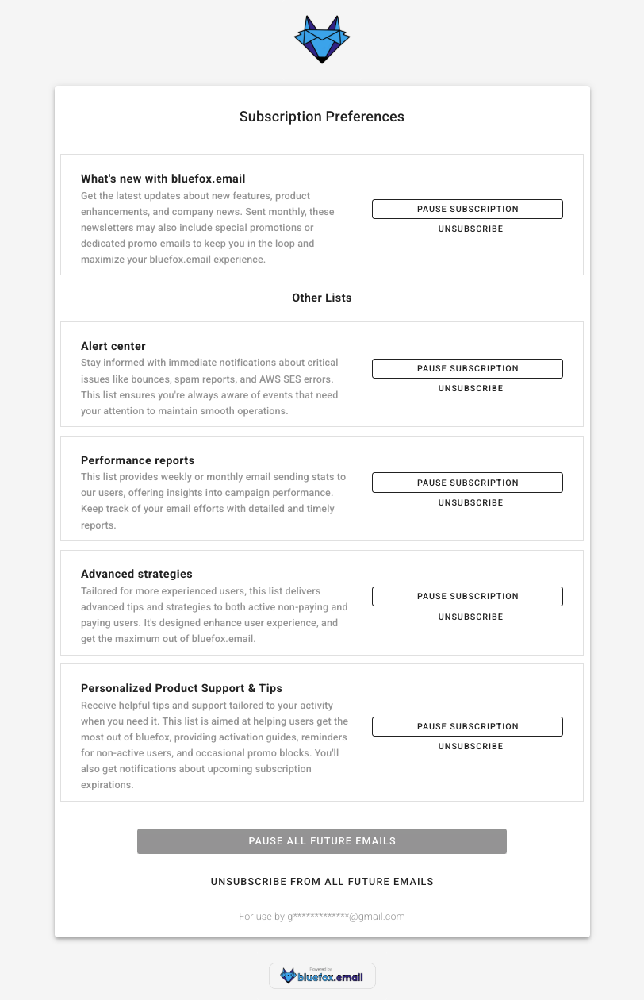
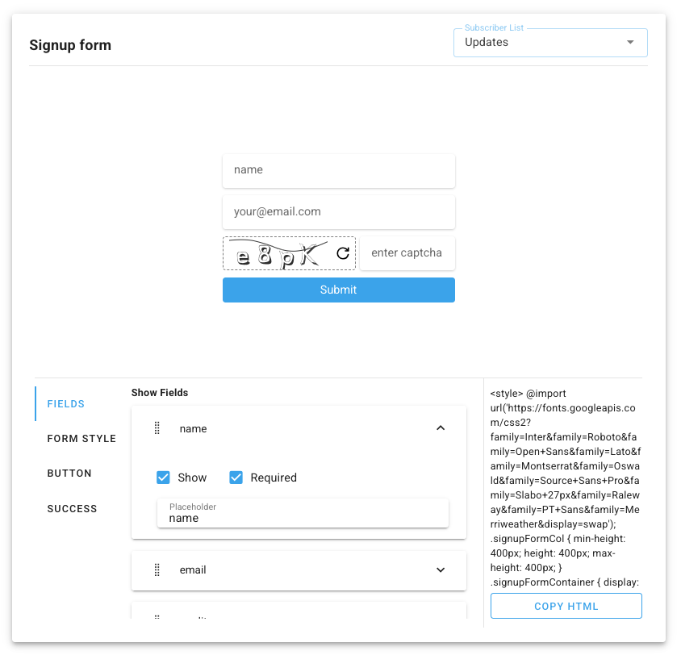

# Send Your First SaaS Newsletter

(TODO 60-90 SEC VIDEO HERE)

Early users don’t just want features, they want proof you’re alive and moving.  

---

Getting started with a newsletter is probably the easiest way to begin with email marketing. It has some clear benefits: it keeps you on top of your early users’ minds and shows them that you’re making progress. That’s especially important in the early days! You want your users to feel confident that *yes, we’re still working on the product and we’re not going anywhere*.  

Later, newsletters can evolve into automations, but their biggest value early on is building the habit of consistent communication. Email becomes part of your regular marketing activity, and more importantly, part of your product experience.  

The goal of this lesson is simple: send out your first newsletter, start building consistency, and make email communication a natural part of your SaaS.  

::: tip A quick note before we start
We’ll show examples inside BlueFox Email throughout this course. That’s the tool we know best since we built it (and yes, we’re biased).  

But the principles we teach here are not tied to any one platform. You can apply them no matter what you use.  

That said, if you want a tool that covers everything we talk about, BlueFox Email does it out of the box.  
:::

Before you can hit send, let’s step back and make sure you have the basics in place: your lists and your first contacts.  

## Defining Your Lists

One email list is rarely enough. As your product grows, your users will receive different types of emails. It’s better to think about that early, but don’t worry, you can always adjust later.

First, let’s separate the two big email categories:
- **Transactional emails**: password resets, confirmations, or receipts. These are required and do not depend on lists.
- **Marketing or product emails**: updates, tips, onboarding emails, or newsletters. ***These do require lists.***

For marketing and product emails, you always need to offer a **global unsubscribe** option (meaning: unsubscribing from ALL lists at once). That is non-negotiable. But it is also recommended to let users manage their preferences by list. If someone does not want product updates, they might still want notifications or onboarding tips. Giving them these options can reduce churn from your lists. Besides that, it's always a good practice to offer a [**one-click unsubscribe**](/email-sending-concepts/one-click-unsubscribe) option for every list.

**Example:**  
- A **Notifications** list: "Someone sent you a message while your app was closed."  
- A **Product Updates** list: "Here’s what’s new in the product this month."  

When you create your lists, always give them **clear titles and descriptions**. People should immediately understand what kind of emails they’ll receive. If you want, you can include frequency in the title (e.g. “Product Updates (Monthly)”), but it’s also fine to highlight it in the description instead. Clear communication reduces unsubscribes and builds trust.  

**Here’s what a subscription preferences page can look like:**  
  

In this example, users can see each list with a clear name and description. They can pause or unsubscribe from individual lists, or choose to stop all emails at once. This makes it easy for users to stay in control while still keeping the option to stay subscribed to the topics that matter most to them.  

**Best practices for defining your lists:**  
- Use clear, human-friendly list names.
- Add short descriptions that explain content and frequency.
- Always give both global and per-list unsubscribe options.
- Offer a pause option if possible. It’s not a silver bullet, but it can save you a few unsubscribes.  

As a SaaS founder, organizing your lists early helps you avoid headaches later when your product (and your communication) start to scale.  

## Collecting Your First Contacts

Before you can send a newsletter, you need people to send it to. Start small: the goal is to build momentum, not a massive list overnight.  

Here are a few easy places to get your first contacts:  

- **Friends and colleagues**: the people who want to see you succeed.  
- **Beta users and early adopters**: they’re already invested in your product.  
- **Waitlists**: if you already have a waitlist, that’s basically your first list. Don’t start from scratch, invite those people to keep hearing from you as you move forward.  
- **Social channels**: share the signup link on your profiles or in relevant groups.  

If you add people who signed up for your product directly to a list, make sure you **mention it in your Terms & Conditions** and always make it easy to unsubscribe. Transparency is key to building trust.  

And don’t overcomplicate this step. You probably don’t need ads yet. Focus on the people who already know you or care about your product: that’s enough to get your first newsletter out the door.  

When creating signup forms, you can decide which fields are **required** and which are **optional**. Sometimes asking for extra details (like name, company size, or role) can help you personalize emails later, but keep in mind that more fields often reduce conversions. Find the right balance for your audience.  

Two more things to always consider:  
- **Double opt-in**: This means the user confirms their subscription by clicking a link in a confirmation email. It reduces fake signups, prevents typos from polluting your list, and keeps your sender reputation clean.  
- **Captcha or bot protection**: Without it, bots or botnets can flood your list with random addresses. That leads to bounces, spam complaints, and hurts deliverability.  

With BlueFox, you can generate signup forms that handle required/optional fields out of the box, and you can also create subscribers programmatically via the [API](/docs/api/subscriber-list-management).  

**Here’s what a signup form builder looks like:**  
  

**Best practices for collecting contacts:**  
- Keep fields minimal. Only ask for what you really need.  
- Use double opt-in to confirm addresses.  
- Add captcha or bot protection.  
- Always provide an easy way to unsubscribe.  

As a SaaS founder, starting with even a handful of engaged contacts gives you a direct line to feedback and early traction. Make sure you also comply with regulations like GDPR or CCPA by collecting explicit consent and storing it properly.  

And don’t wait until you have hundreds or thousands of signups. If you have 10 people, that’s already enough to send your first newsletter and start building the habit.  

## Sending Your First Newsletter

Before we talk about the details, remember that every newsletter must include an unsubscribe link. This is not only the law in many places, it is also common sense. You would much rather have people unsubscribe than hit the spam button, right?  

Another thing: your first newsletter will not be perfect. And that is not a problem. The real goal here is to build a habit. Consistency is king.  

### Choose a Topic & Goal
Every newsletter should have one purpose, not five. It could be a progress announcement (a new feature, milestone, or launch), sharing something useful like a tip or resource, or inviting users to take action such as trying a feature, replying with feedback, or reading the docs.  

Probably the easiest way to start is with a monthly feature update newsletter. This not only gives you a clear structure, it also forces you to think through what happened every month. It will help you write documentation where needed and create materials you can reuse elsewhere.  

### Simple Design
... most likely it's easiest to pick a template or email theme that's look and feel is ok. Just set your primary (brand) color, select your font(s) and set up your logo... mention that it should not look weird to put images in the email... so text only email might now work well.

(TODO SHOW HOW TO SELECT A THEME + SET UP PARAMS LIKE LOGO, COLOR, FONT)

Make sure your email looks good on mobile and across clients — this can be trickier than it sounds. A simple on-brand template is enough. If you include screenshots, do not put them in columns, because that makes them harder to see. Instead, focus on the relevant parts, not the entire screen.  

Always include your logo and brand name, and keep the style consistent with your website (colors, typography, button styles, etc.). Your transactional and marketing emails should also look consistent. Nothing feels more unprofessional than when a password reset email looks completely different from a product update.

### Keep the Content Simple
Write like you are talking to a friend. Forget the corporate jargon and long-winded intros. People are busy, and they just want to know what’s new and why it matters. Stick to a single main topic, for example a feature or roadmap update, and make it easy to follow.  

When it comes to visuals, use them where they actually help explain something. Screenshots are especially powerful for feature updates, and gifs can be even better when you want to show how something works in just a few seconds. Occasionally, it also makes sense to add a partner’s logo, for example when you announce an integration with another tool. Outside of that, keep visuals light.  

CTAs (calls to action) are what turn your email into something actionable. In a newsletter, it’s fine to have more than one CTA. For example, if you are releasing two major features, link to both documentation pages. The goal here is to keep users engaged, not to push one single action. Just make sure every CTA is clear, visible, and easy to tap on mobile (buttons work better than text links).  

Don’t overthink the length. Your readers should not be scared by a wall of text, but they should be able to read it quickly and scan through easily.

(TODO SHOW AN EXAMPLE)

### Craft the Subject Line
The subject line is the single most important part of your newsletter. It decides whether people open your email or ignore it.  

Keep these principles in mind:  
- **Base it on the content**: the subject line should clearly reflect what’s inside. Don’t try to be too clever — clarity beats mystery.  
- **Avoid spam triggers**: words like “FREE,” “URGENT,” “!!!” or “100% Guaranteed” can land you in the spam folder.  
- **Keep it short**: aim for 5–8 words or under 50 characters. Long subject lines get cut off, especially on mobile.  
- **Make it personal**: if it fits your tone, mention the reader (“Your new feature is live”) or speak in the first person (“What we shipped this month”).  
- **Use curiosity carefully**: it’s fine to spark interest, but don’t clickbait. If your subject line says one thing and your content delivers another, you’ll lose trust fast.  

**Examples**  
- *“What We Shipped in September”*: simple, progress-focused.  
- *“New Dashboard: Try It Today”*: feature-specific, action-oriented.  
- *“3 Ways to Get More Out of [Product]”*: value-driven, helpful.  

If you are not sure which subject line works best, test it. Most email platforms let you A/B test subject lines by sending two versions to a small part of your list, then using the winner for everyone else.  

The subject line is small, but it’s worth the extra thought. Even a single word can double your open rate.  

### Email Address & Sender Name
Decide how you want to appear: personal, mascot, or formal (for example, “XY App”). Avoid “no-reply” addresses, because they tend to disappear in inboxes. If you can handle replies, consider using your personal address or at least a reply-to that goes to you, so you can ask users for feedback directly.  

(TODO AN IMAGE OF AN INBOX WITH LOT OF NO-REPLY EMAIL ADDRESSES TO SHOWCASE HOW EASY IT IS TO DISAPPEAR IN THE INBOX.)

### Test Send
This step is critical. Always send a test email to yourself before sending to your full list.

Rendering can go WRONG. (TALK SOME ABOUT LITMUS, EMAIL ON ACID, ETC.) (With BlueFox, it won't.)

Also, you probably want to make sure that all of the links work in your email, and they lead to the URLs that they are intended to ... (TODO LINK CHECKER)

### Scheduling
People already receive too many emails, so timing matters. Figure out a good time for your audience and try to stick to it. Consider their time zones and the day of the week. Frequency is also important: once you choose your rhythm, for example monthly, keep it consistent.  

Now, schedule that first newsletter.   

## Homework

1) Define the goal & topic of your newsletter
2) Figure out a simple set of email lists as a starting point
3) Create a signup page
4) Collect contacts for your newsletter
5) Create your first newsletter
   1) Select / Create a simple design
   2) Write the content, create visuals, add CTAs (buttons are better than simple links)
   3) Write a good subject line
   4) Select a good sender name & sender email address
6) Schedule your newsletter

Don't forget to send your newsletter on a regular basis. Again, it's very straightforward to start with a monthly (feature) updates newsletter. It shows your users that you are making steady progress, and that's what you want, right!?

--- signup form here explaining that in the email version, they get worksheets (& in the premium version they get extra materials)

(TODO CAN WE LINK OUR FREE DELIVERABILITY TOOL SOMWEHERE?)
