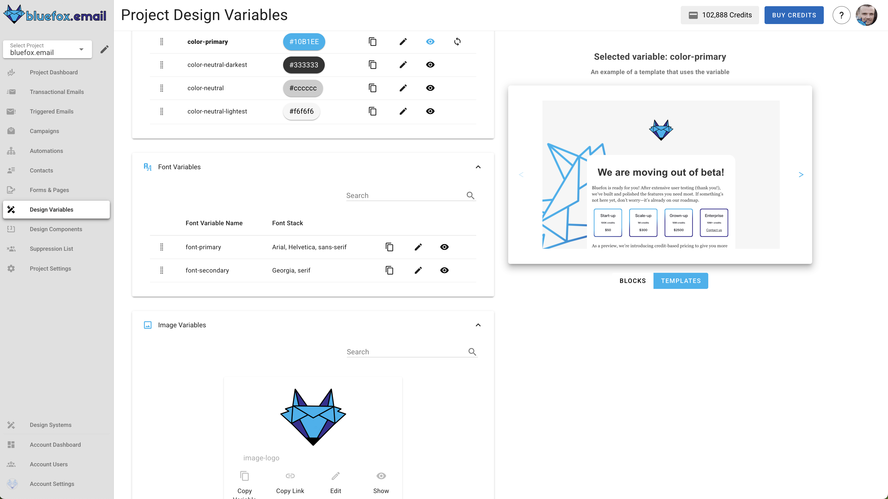
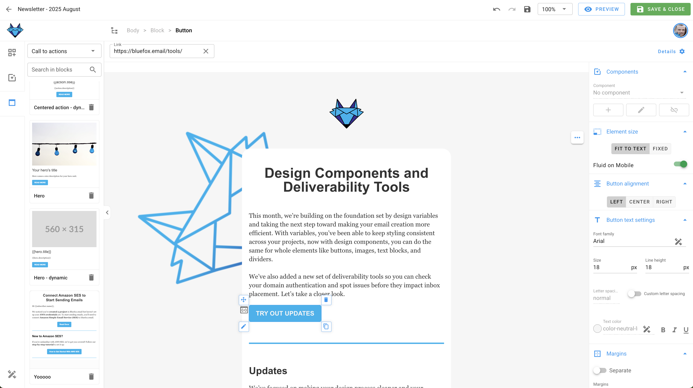
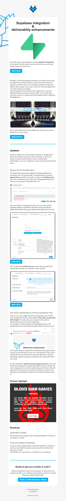
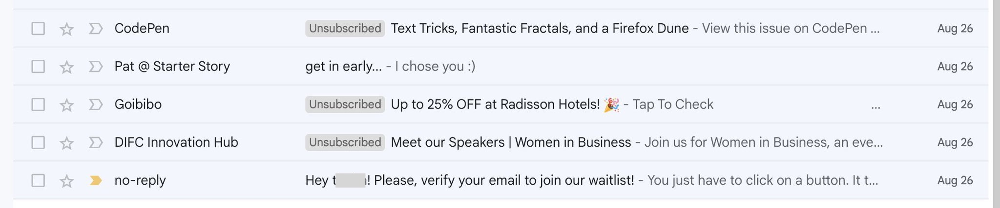

# Send Your First SaaS Newsletter

(TODO 60-90 SEC VIDEO HERE)

Early users don’t just want features, they want proof you’re alive and moving.  

---

Getting started with a newsletter is probably the easiest way to begin with email marketing. It has some clear benefits: it keeps you on top of your early users’ minds and shows them that you’re making progress. That’s especially important in the early days! You want your users to feel confident that *yes, we’re still working on the product and we’re not going anywhere*.  

Later, newsletters can evolve into automations, but their biggest value early on is building the habit of consistent communication. Email becomes part of your regular marketing activity, and more importantly, part of your product experience.  

The goal of this lesson is simple: send out your first newsletter, start building consistency, and make email communication a natural part of your SaaS.  

::: tip A quick note before we start
We’ll show examples inside BlueFox Email throughout this course. That’s the tool we know best since we built it (and yes, we’re biased).  

But the principles we teach here are not tied to any one platform. You can apply them no matter what you use.  

That said, if you want a tool that covers everything we talk about, BlueFox Email does it out of the box.  
:::

Before you can hit send, let’s step back and make sure you have the basics in place: your lists and your first contacts.  

## Defining Your Lists

One email list is rarely enough. As your product grows, your users will receive different types of emails. It’s better to think about that early, but don’t worry, you can always adjust later.

First, let’s separate the two big email categories:
- **Transactional emails**: password resets, confirmations, or receipts. These are required and do not depend on lists.
- **Marketing or product emails**: updates, tips, onboarding emails, or newsletters. ***These do require lists.***

For marketing and product emails, you always need to offer a **global unsubscribe** option (meaning: unsubscribing from ALL lists at once). That is non-negotiable. But it is also recommended to let users manage their preferences by list. If someone does not want product updates, they might still want notifications or onboarding tips. Giving them these options can reduce churn from your lists. Besides that, it's always a good practice to offer a [**one-click unsubscribe**](/email-sending-concepts/one-click-unsubscribe) option for every list.

**Example:**  
- A **Notifications** list: "Someone sent you a message while your app was closed."  
- A **Product Updates** list: "Here’s what’s new in the product this month."  

When you create your lists, always give them **clear titles and descriptions**. People should immediately understand what kind of emails they’ll receive. If you want, you can include frequency in the title (e.g. “Product Updates (Monthly)”), but it’s also fine to highlight it in the description instead. Clear communication reduces unsubscribes and builds trust.  

**Here’s what a subscription preferences page can look like:**  
  

In this example, users can see each list with a clear name and description. They can pause or unsubscribe from individual lists, or choose to stop all emails at once. This makes it easy for users to stay in control while still keeping the option to stay subscribed to the topics that matter most to them.  

**Best practices for defining your lists:**  
- Use clear, human-friendly list names.
- Add short descriptions that explain content and frequency.
- Always give both global and per-list unsubscribe options.
- Offer a pause option if possible. It’s not a silver bullet, but it can save you a few unsubscribes.  

As a SaaS founder, organizing your lists early helps you avoid headaches later when your product (and your communication) start to scale.  

## Collecting Your First Contacts

Before you can send a newsletter, you need people to send it to. Start small: the goal is to build momentum, not a massive list overnight.  

Here are a few easy places to get your first contacts:  

- **Friends and colleagues**: the people who want to see you succeed.  
- **Beta users and early adopters**: they’re already invested in your product.  
- **Waitlists**: if you already have a waitlist, that’s basically your first list. Don’t start from scratch, invite those people to keep hearing from you as you move forward.  
- **Social channels**: share the signup link on your profiles or in relevant groups.  

If you add people who signed up for your product directly to a list, make sure you **mention it in your Terms & Conditions** and always make it easy to unsubscribe. Transparency is key to building trust.  

And don’t overcomplicate this step. You probably don’t need ads yet. Focus on the people who already know you or care about your product: that’s enough to get your first newsletter out the door.  

When creating signup forms, you can decide which fields are **required** and which are **optional**. Sometimes asking for extra details (like name, company size, or role) can help you personalize emails later, but keep in mind that more fields often reduce conversions. Find the right balance for your audience.  

Two more things to always consider:  
- **Double opt-in**: This means the user confirms their subscription by clicking a link in a confirmation email. It reduces fake signups, prevents typos from polluting your list, and keeps your sender reputation clean.  
- **Captcha or bot protection**: Without it, bots or botnets can flood your list with random addresses. That leads to bounces, spam complaints, and hurts deliverability.  

With BlueFox, you can generate signup forms that handle required/optional fields out of the box, and you can also create subscribers programmatically via the [API](/docs/api/subscriber-list-management).  

**Here’s what a signup form builder looks like:**  
  

**Best practices for collecting contacts:**  
- Keep fields minimal. Only ask for what you really need.  
- Use double opt-in to confirm addresses.  
- Add captcha or bot protection.  
- Always provide an easy way to unsubscribe.  

As a SaaS founder, starting with even a handful of engaged contacts gives you a direct line to feedback and early traction. Make sure you also comply with regulations like GDPR or CCPA by collecting explicit consent and storing it properly.  

And don’t wait until you have hundreds or thousands of signups. If you have 10 people, that’s already enough to send your first newsletter and start building the habit.  

## Sending Your First Newsletter

Before we talk about the details, remember that every newsletter must include an unsubscribe link. This is not only the law in many places, it is also common sense. You would much rather have people unsubscribe than hit the spam button, right? Optionally, you can also include a pause subscription link. That might save you a few people churning from your list. 

Another thing: your first newsletter will not be perfect. And that is not a problem. The real goal here is to build a habit. Consistency is king.  

### Choose a Topic & Goal
Every newsletter should have one purpose, not five. It could be a progress announcement (a new feature, milestone, or launch), sharing something useful like a tip or resource, or inviting users to take action such as trying a feature, replying with feedback, or reading the docs.  

Probably the easiest way to start is with a monthly feature update newsletter. This not only gives you a clear structure, it also forces you to think through what happened every month. It will help you write documentation where needed and create materials you can reuse elsewhere.  

### Simple Design  

Designing emails that look good in every inbox is notoriously painful. Different email clients (Gmail, Outlook, Apple Mail, etc.) all render things a little differently. That’s why, instead of starting from scratch, it’s usually best to **pick a template or theme** and then customize it.  

**Start simple:**  
- Choose a base template or theme.  
- Add your **logo**, set your **brand colors**, and select your **typography**, maybe customize the **button** style.  
- Reuse these same design elements across **marketing, product, and transactional emails**, so your brand feels consistent everywhere.  

  
*Customizing your brand styles in BlueFox (logo, colors, fonts, buttons).*  

With BlueFox, you can set your brand styles once (logo, colors, fonts) in your email design system. Every campaign, product update, and even transactional message will stay consistent. To learn more about how modern design systems work and why they matter, check out our article on [the power of modern email design systems](/posts/the-power-of-modern-email-design-systems).  

  
*The email editor with your design system applied, keeping everything consistent.*  

**Keep in mind:**  
- Always include your logo and brand name.  
- Make sure your email looks good on **mobile as well as desktop** (most of your readers will be on their phones).  
- If you add screenshots, don’t cram them into columns. Zoom into the relevant part of the screen so it’s clear at a glance. The goal is that the reader can see what's on the screenshot regardless if they read your email on desktop or mobile.  

Consistency is the goal. With a simple, on-brand template, you’ll save time, avoid technical headaches, and build a recognizable look that users trust.  

### Keep the Content Simple
Write like you are talking to a friend. Forget the corporate jargon and long-winded intros — people are busy, and they just want to know what’s new and why it matters. Stick to a single main topic, for example a feature or roadmap update, and make it easy to follow.  

When it comes to visuals, use them where they actually help explain something. Screenshots are especially powerful for feature updates, and gifs can be even better when you want to show how something works in just a few seconds. Occasionally, it also makes sense to add a partner’s logo, for example when you announce an integration with another tool. Outside of that, keep visuals light.  

CTAs (calls to action) are what turn your email into something actionable. In a newsletter, it’s fine to have more than one CTA. For example, if you are releasing two major features, link to both documentation pages. The goal here is to keep users engaged, not to push one single action. Just make sure every CTA is clear, visible, and easy to tap on mobile (buttons work better than text links).  

If you want a starting point, here’s a simple structure for a monthly feature update newsletter:  
- A short friendly intro  
- A summary of the new feature(s)  
- Screenshots or gifs that make it clear  
- Links to docs or resources  
- A closing line or CTA button  

Don’t overthink the length. Your readers should not be scared by a wall of text, but they should be able to read it quickly and scan through easily.  

Here’s an example of a relatively long newsletter that still works well because of its structure. Notice the clear sections, headings, and multiple CTAs that make it easy to scan:  

  

A few things this example does well:  
- Breaks content into **clear sections with headings**, making it easy to skim.  
- Uses **visuals and screenshots** where they add clarity.  
- Includes **multiple CTAs**, but each one is relevant and tied to its section.  
- Adds a **partner highlight**, which brings a human touch and community feel.  

As you can see, even longer newsletters can work well as long as they are structured for readability and scanability.  

(We’ll give you a worksheet in the newsletter version of this course so you can plan your content step by step.)

### Craft the Subject Line
The subject line is the single most important part of your newsletter. It decides whether people open your email or ignore it.  

Keep these principles in mind:  
- **Base it on the content**: the subject line should clearly reflect what’s inside. Don’t try to be too clever, clarity beats mystery.  
- **Avoid spam triggers**: words like “FREE,” “URGENT,” “!!!” or “100% Guaranteed” can land you in the spam folder.  
- **Keep it short**: aim for 5–8 words or under 50 characters. Long subject lines get cut off, especially on mobile.  
- **Make it personal**: if it fits your tone, mention the reader (“Your new feature is live”) or speak in the first person (“What we shipped this month”).  
- **Use curiosity carefully**: it’s fine to spark interest, but don’t clickbait. If your subject line says one thing and your content delivers another, you’ll lose trust fast.  
- **Pair it with a good preheader**: the preheader text shows up next to or under the subject in most inboxes, so think of it as a second subject line. Don’t waste it on “View in browser.” See our article on [preheader text — the secret weapon for boosting open rates](/posts/preheader-text-the-secret-weapon-for-boosting-open-rates) for more.  
- **Emojis can help, but sparingly**: they can make your email stand out, but only use them when they fit your brand voice.  

**Examples**  
- *“What We Shipped in September”*: simple, progress-focused.  
- *“New Dashboard: Try It Today”*: feature-specific, action-oriented.  
- *“3 Ways to Get More Out of [Product]”*: value-driven, helpful.  

If you are not sure which subject line works best, test it. Most email platforms let you A/B test subject lines by sending two versions to a small part of your list, then using the winner for everyone else.  

As a SaaS founder, your subject lines should focus less on hype and more on clarity. Users want to know what changed and why it matters. The subject line is small, but it is worth the extra thought. Even a single word can double your open rate.  

For more depth and examples, check out our [subject line master-class: how to get people to actually open your emails](/posts/mastering-subject-lines-how-to-get-people-to-actually-open-your-emails).  

### Email Address & Sender Name
Decide how you want to appear when your email lands in the inbox. You generally have three options:  

- **Personal**: looks friendly and approachable, great for early-stage SaaS when you want direct feedback.  
- **Mascot or brand character**: works well if your brand has a playful side (for example, BlueFox).  
- **Formal brand**: “XY App” or “Company Support” feels professional, but can come across as distant if overused.  

What you should avoid is a **“no-reply” address**. These tend to disappear in inboxes, and they send the wrong message: “we want to talk at you, not with you.” If you can handle replies, use your personal address or at least a reply-to that goes somewhere monitored. That way you can even ask users for direct feedback.  

  
*Notice how the “no-reply” message looks anonymous and forgettable, while branded or personal sender names stand out.*  

The **sender name** itself also plays a big role. Along with the subject line and preheader, it is one of the first elements people use to decide whether to open. If you want a deeper dive, see our article on [sender name and email address: build trust before the open](/posts/sender-name-and-email-address-build-trust-before-the-open).  

Choosing the right sender name and address may sound minor, but it directly impacts whether your users notice and trust your emails.  

### Test Send
This step is critical: always send a test email to yourself before sending to your full list.  

Email rendering can be tricky. A design that looks perfect in Gmail might break in Outlook or Apple Mail. Tools like **Litmus** and **Email on Acid** can help you preview how your email looks across dozens of clients and devices, but they are expensive and probably overkill when you are just getting started.  

A simple alternative is to send yourself a test and check it quickly in your own inbox, both on desktop and on mobile. It is not as extensive as a full rendering test, but it will already help you catch most obvious layout or formatting issues.  

With BlueFox Email, you do not have to worry much about rendering problems. Since it is powered by the **Chamaileon SDK**, the HTML is built to render correctly across major clients from the start.  

And don’t forget your links. Nothing kills trust faster than a broken or misdirected link. Before you send, click through every CTA and link in your email to confirm they go where you expect. To make this faster, you can also run your draft through our [link checker tool](/tools/content/link-checker).  

Taking two minutes to test your email can save you from embarrassing mistakes and lost credibility.  

### Scheduling
People already receive too many emails, so timing matters. Figure out a good time for your audience and try to stick to it. Consider their time zones and the day of the week. Frequency is also important: once you choose your rhythm, for example monthly, keep it consistent.  

As a rule of thumb, mid-week and mid-morning often perform well, but the real key is to test with your own audience and adjust as you learn.  

Most email platforms, including BlueFox, let you schedule campaigns ahead of time. This means you can batch work on your content and avoid the stress of last-minute sending.  

For SaaS founders, a predictable newsletter rhythm does more than boost open rates. It reinforces to your users that the product is alive and progressing.  

**Now, schedule that first newsletter.**

---

**Quick checklist before sending your first newsletter:**  
- Define your lists and who will receive the email.  
- Collect your first contacts (friends, beta users, waitlist, social).  
- Choose one clear topic and keep the content simple.  
- Write content that is friendly, easy to scan, and supported by visuals or CTAs.  
- Craft a subject line that is clear and trustworthy.  
- Use a recognizable sender name and avoid “no-reply.”  
- Keep the design clean, mobile-friendly, and on-brand.  
- Send a test to check rendering and links.  
- Schedule it and stick to a consistent rhythm.  

## Homework

1. Define the goal and topic of your first newsletter.  
2. Set up a simple set of email lists as a starting point.  
3. Collect contacts for your newsletter (friends, beta users, waitlist, social).  
4. Draft your first newsletter:  
   - Pick or create a simple design.  
   - Write the content, add visuals, and include clear CTAs (buttons work better than links).  
   - Write a subject line that matches the content.  
   - Choose a recognizable sender name and email address.  
5. Create a signup page (optional at this stage, but highly recommended).  
6. Send a test to yourself to check rendering and links.  
7. Schedule your newsletter.  

Don’t forget to send your newsletter on a regular basis. A monthly product update is an easy and effective way to start: it shows your users steady progress and keeps your product top of mind.  

(TODO signup form here explaining that in the email version, they get worksheets (& in the premium version they get extra materials)  

