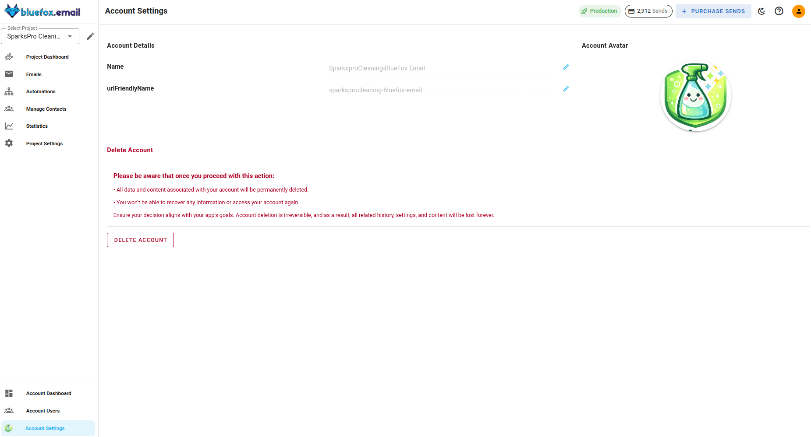

# Account Settings

Account settings hold the details of your BlueFox Email account itself, such as its name and avatar. Only [Admins](./account-users.md) can change these settings, other roles have read-only access to them.

## Account Name

The account name is the display name of your account inside BlueFox Email. Update it and save your changes to rename the account.

## URL-friendly Name

The URL-friendly name identifies your account in BlueFox Email URLs.

::: warning Keep in mind
Changing the URL-friendly name changes the links that point to your account. Previously bookmarked or shared links that use the old name will no longer work.
:::

## Account Avatar

You can upload an avatar for your account. The avatar helps you recognize the account quickly, which is useful if you switch between multiple accounts.

## Deleting Your Account

The account settings page also lets you delete your account.

::: danger This action cannot be undone
Deleting your account permanently removes your projects, subscriber lists, emails and statistics. Export anything you want to keep before you delete.
:::

## Account and Project Restrictions

BlueFox Email expects every sender to keep their sending parameters within acceptable limits, most importantly bounce rates and complaint rates.

If those parameters are not maintained, or if the activity on the account looks suspicious, the BlueFox Email team can restrict your account or an individual project. While a restriction is active, sending is blocked and a message explaining the reason is shown when you try to send.

To avoid restrictions, keep your lists clean and only send to contacts who opted in. You can check your current bounce and complaint rates against the allowed limits in [Maintaining Production Access](./projects/delivery-modes.md#maintaining-production-access). If your account or a project is restricted, contact the BlueFox Email team to resolve it.
