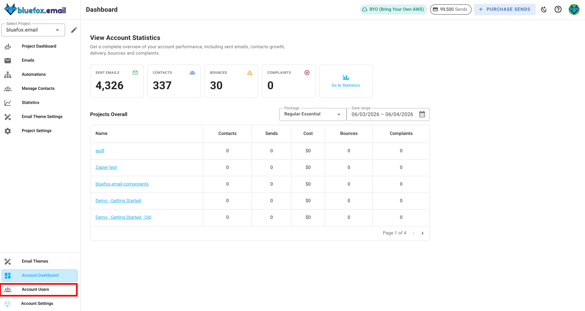
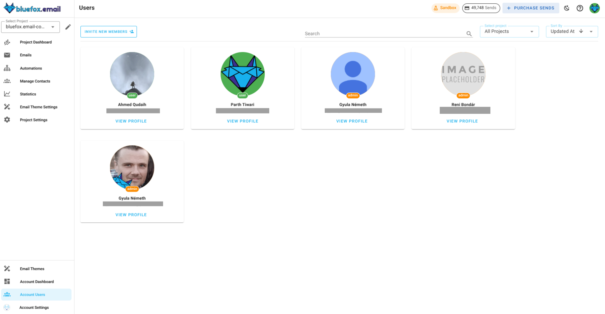
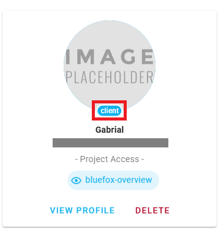
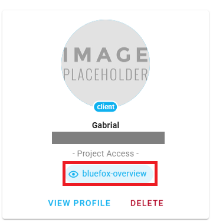
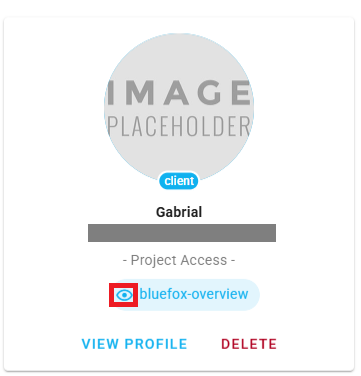

# Account Roles

BlueFox Email uses a role-based access control system to manage permissions within your account. Understanding these roles helps you control who can access your projects and what actions they can perform.

## Role Overview

There are two primary account roles in bluefox.email:

- **User**: Standard account member with access to projects.
- **Client**: A special role assigned to users who need access to specific projects with defined permissions. It can be either a editor access or just view only access.
- **Admin**: Account administrator with full control over projects, user and client access management.

You can find your account roles settings in **Account Users** tab. 
)

Here you can easily manager your user roles and client access levels.

## Member Invitations and role creation

To invite a member to your BlueFox Email account, check the **Invite New Member** button in top left corner of the **Account Users** tab.

Here you will be presented with a form. You can see the account for which you are inviting the member and you will need to enter :
- **Email Address**: The email address of the member you want to invite.
- **Confirm Email Address**: Re-enter the email address to confirm.
- **Role**: Select the role for the member. You can choose between **User**, **Client**, and **Admin** roles.

If you select the **Client** role, you will be presented with additional options to set the **Client Access Level**. You can choose between:
- **Editor Access**: Full control over the assigned project.
- **Viewer Access**: Read-only access to the assigned project.

## Understanding Roles and Permissions

### User Role 

User role is designed for standard members of your BlueFox Email account. Users have access to projects, they can create those and can perform tasks based on their permissions. 

You can identify a user by the **User** label below there avatar and also in **Account Users** tab.

Users are managed by Admins and don't have access to any of the account-wide settings.

### Admin Role

Admin role is designed for account administrators who need full control over the BlueFox Email account

You can identify an admin by the **Admin** label below there avatar and also in **Account Users** tab.

Admins have the ability to manage user roles, client access levels, and account settings.

### Client Access Levels

Client access levels determine what a client can do within a specific project. There are two levels of client access:

- **Editor Access**: Clients with editor access have full control over the assigned project. They can create, edit, and delete campaigns, automations, and templates. They can also manage subscriber lists and contacts, configure project settings, view analytics, and send emails.

- **Viewer Access**: Clients with viewer access have read-only access to the assigned project. They can view campaigns, automations, templates, analytics, and subscriber lists, but cannot make any changes or send emails.

You can identify a client by the **Client** label below there avatar and also in **Account Users** tab.

You can also identify the project access level of a client through this label. 

and the access level is indicated next to the **Client** label.

## Summary

| Role | Permissions |
|------|-------------|
| **User** | Access to projects only, restricted to any account related settings|
| **Admin** | Full account access, manage projects, and control team member permissions |
| **Editor** (Client Access) | Full project control: create, edit, delete, and send |
| **Viewer** (Client Access) | Read-only project access: view and analyze only |
