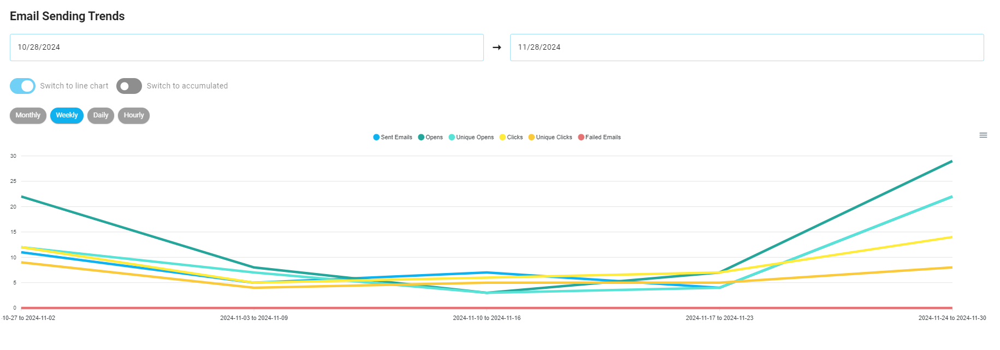
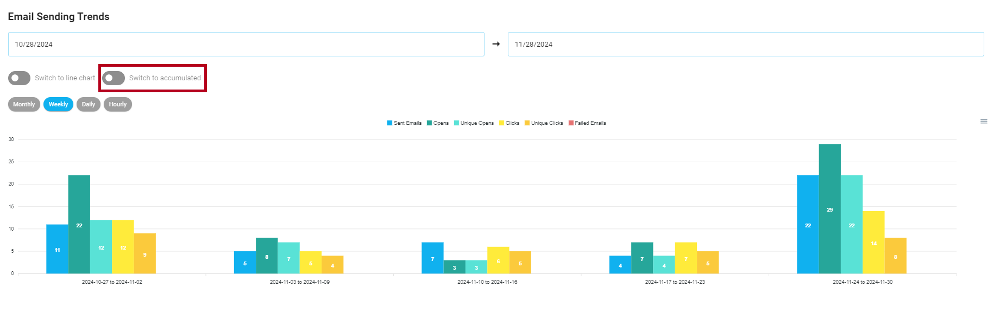

# Analytics

The Analytics section in your application provides a comprehensive analysis of email performance, subscription trends, and user engagement metrics. It is designed to cater to multiple scopes, such as [**account**](/docs/dashboard#key-metrics-in-the-account-dashboard), [**project**](/docs/projects/analytics#project-dashboard), [**transactional emails**](/docs/projects/transactional-emails#transactional-email-statistics), [**triggered emails**](/docs/projects/triggered-emails#triggered-email-statistics), [**campaigns**](/docs/projects/campaigns#campaign-email-statistics) and [**subscriber lists**](/docs/projects/subscriber-lists#subscriber-list-statistics). Each type of statistic is presented with clear visuals, detailed filters and actionable insights.

## Email Card Analytics
We provide the following analytics for all of our email types (transactional emails, triggered emails, and campaigns): sends, opens, clicks, bounces, and complaints.

You can view these analytics on the email cards, located right above the action buttons for each email type:

By default, these numbers reflect stats from the current week. If you want to change the time period, select from the options highlighted in the screenshot below: current week, previous week, current month, previous month, last 3 months, or overall.

## Overall Banners

At the top of every statistics page, a overall banner displays key metrics in separate boxes. Each box has a title and a numeric value that provides a quick overview of email performance or subscriber activity.

### **Overall Email Statistics Banner**

The Email Summary Banner provides key email performance metrics, such as **sent emails**, **failed**, **openes**, **unique Openes**, **clicks**, **unique clicks**, **bounced** and **complaints**. This banner is essential for tracking email performance at a glance, enabling users to monitor engagement and delivery quality effectively.

### **Overall Subscription Statistics Banner**

The Subscription Overall Banner provides an overview of your total subscribers and their current status. It displays metrics such as **subscribers**, **active**, **paused** and **unsubscribed**. This summary is key to understanding the distribution of your audience and tracking changes in subscriber engagement and retention.

## Email and Subscription Charts

### Email Metrics:
Email-related charts track key performance indicators for emails, including: **sent**, **open**, **unique opens**, **click**, **unique click** and **failed**
These metrics are displayed using either bar or line charts, depending on the user's preference for visualizing comparative data or tracking continuous trends.

### Subscription Metrics:
Subscription charts track key behaviors, including: **subscribed**, **resubscribed**, **unsubscribed**, **paused subscription**, **unpaused subscription**.  
In the **subscription metrics** section, users can monitor activities like new subscriptions, unsubscribes, paused, and resumed subscriptions. These metrics can be displayed as bar or line charts, offering flexible analysis of subscription trends.

# Charts and Graphs

The statistics page's main section features **interactive charts** that allow users to monitor and analyze the performance of their **email** and **subscription** metrics. These charts provide both **comparative data points**  and **continuous trends** over time, enabling users to choose the most relevant view for their analysis. The **time interval switcher** enhances this by offering detailed data exploration, helping users make more informed decisions.

## Chart Types

### 1. Bar Charts
Bar charts visualize **comparative data points**, highlighting how data points differ over time.  
They are ideal for comparing performance across specific periods, such as the number of emails sent or new subscriptions within a given timeframe.

### 2. Line Charts
Line charts showcase **continuous data trends** over time, making it easier to track data changes and trends.  
These charts are especially useful for monitoring long-term patterns, such as tracking email or subscription growth over weeks or months.

Both **email** and **subscription** metrics are available in **bar** and **line** formats, giving users the flexibility to select the chart type that best suits their needs for performance comparisons or trend analysis.

## Chart Type Switcher

Users can easily switch between **bar** and **line** charts using the **chart type toggle button**. This allows users to visualize the same data either as discrete, comparative data points or as continuous trends, depending on what they find most useful.

## Time Interval Switcher

Users can select from various **time intervals** to refine the displayed data, allowing them to analyze performance with different levels of granularity. This functionality makes it easier to track trends over different periods such as **hourly**, **daily**, **weekly**, or **monthly**, and monitor activity. The **time interval buttons** provide an intuitive way to switch between these intervals.

::: tip Chart Controls
**Switch between Line/Bar charts and adjust time intervals for both **email** and **subscription** metrics.
:::

## Filters

Filters allow users to refine data by selecting custom start and end dates, helping isolate trends and identify patterns within specific timeframes.

Filtering by **time interval** is crucial for monitoring performance at varying granularities. Adjusting the interval—whether for short-term fluctuations or long-term trends—enhances data analysis and provides clearer insights.

::: warning
- For **daily**, **weekly**, and **monthly** views, the maximum filter interval is 1 year.
- For **hourly view**, the maximum interval is 7 days.
:::

## Accumulated vs Regular Views

This feature allows users to toggle between accumulated and regular data presentations:

- **Regular View:** Displays individual data points for each time frame (e.g., daily sends or clicks). Useful for spotting immediate changes or fluctuations.
    

- **Accumulated View:** Shows cumulative values over time, offering a better understanding of overall growth or success.
    

Example: In an email campaign, users can see how many total opens and clicks occurred from the beginning of the campaign to the current date.

::: tip Chart Data Options
**Both accumulated and regular data are available for the **email** and **subscription** matrices, and can be visualized using both line and bar chart types.**
:::

## Data Table

Beneath the charts, **detailed data tables** provide raw, event-level information, allowing users to drill down into specific emails or subscribers to understand what actions have taken place. These tables help users to gain deeper insights into their data by offering granular details of each event.

- Lists each sent email along with its **status**, **time sent** and **events** sunch as Opened, Clicked, Unsubscribed, Complained Bounced and any associated errors.

**Note:** The data table for emails is available only within the **email and subscriber list scope**.

### **Filtering the Data Table**

Users can filter the data in the table by selecting one or more filter options. The filter buttons allow users to refine the table’s displayed data based on specific events or actions. Multiple filter buttons can be activated simultaneously, enabling flexible data analysis.

**Filter options include:** **opened** / **not opened**, **clicked** / **not clicked**,  **bounced** / **not bounced**, **complained** / **not complained** and **unsubscribed** / **not unsubscribed**

Users can click on the filter buttons to toggle between viewing records that match specific criteria. This functionality allows for more precise analysis, making it easier to identify patterns or issues related to email performance or subscriber behavior.

### **Download as CSV**

To facilitate data extraction, users can download the filtered data table as a **CSV file**. This feature allows users to save the displayed data for offline analysis, reporting, or sharing with others.

