# Statistics

The Statistics section in your application provides a comprehensive analysis of email performance, subscription trends, and user engagement metrics. It is designed to cater to multiple scopes, such as [**account**](/docs/dashboard#key-metrics-in-the-account-dashboard), [**project**](/docs/projects/dashboard), [**transactional emails**](/docs/projects/transactional-emails#transactional-email-statistics), [**triggered emails**](/docs/projects/triggered-emails#triggered-email-statistics), [**automations**](/docs/projects/automations#automation-stats), [**campaigns**](/docs/projects/campaigns#campaign-email-statistics) and [**subscriber lists**](/docs/projects/contacts#list-statistics). Each type of statistic is presented with clear visuals, detailed filters, and actionable insights.

## Overview

The Statistics page has two tabs: **Email Sending Trends** and **Subscription Trends**.

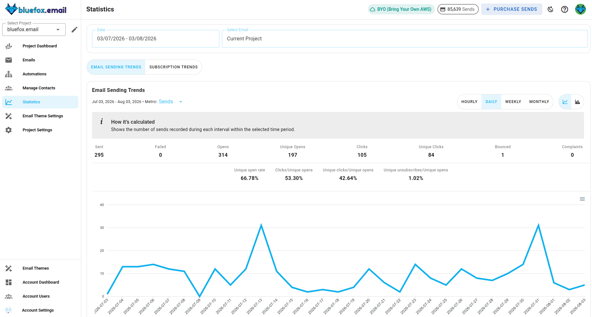

Both tabs default to a **daily** time interval. You can switch to **hourly**, **weekly**, or **monthly** using the time interval switcher above the chart.

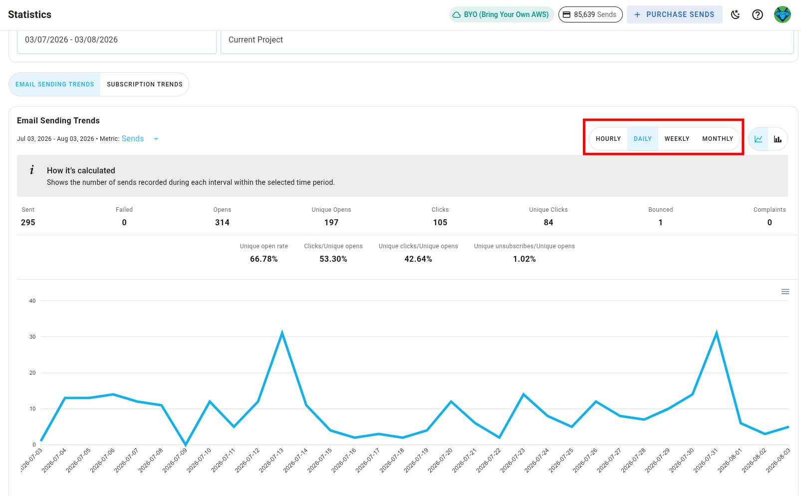

You can also switch the chart view between **line chart** and **bar chart** using the chart type toggle button.

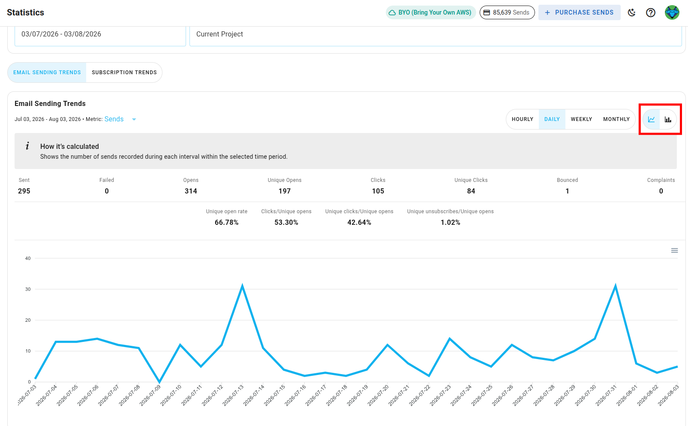

## Email Sending Trends

By default, the Statistics page shows this tab, displaying overall project metrics for the past month.

At the top of the tab, an overview banner shows **sent**, **failed**, **opens**, **unique opens**, **clicks**, **unique clicks**, **bounced**, and **complaints**, along with derived rates: **unique open rate**, **clicks/unique opens**, **unique clicks/unique opens**, and **unique unsubscribes/unique opens**.

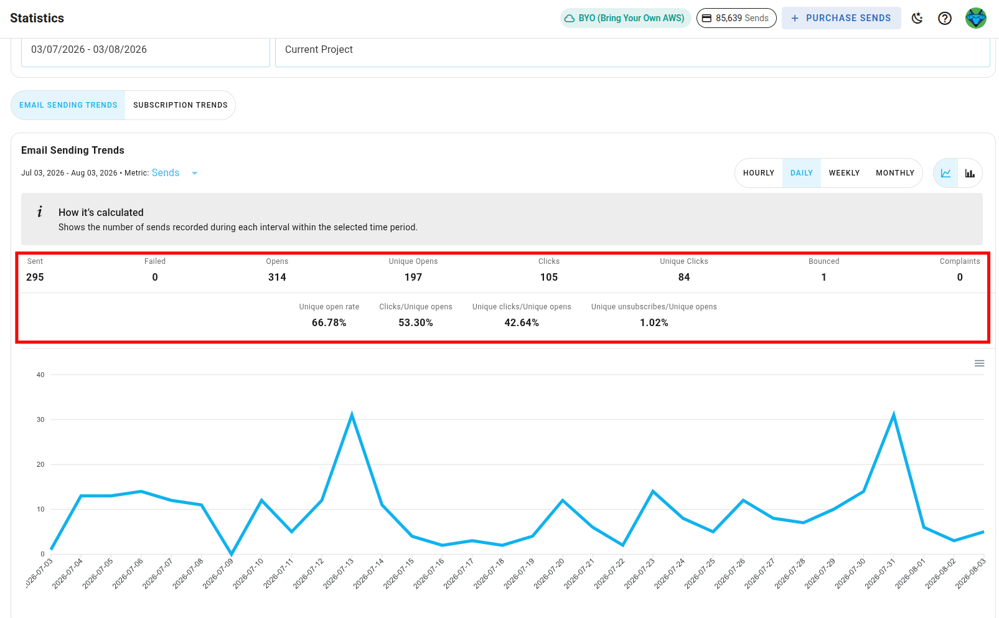

By default, the chart shows the **Sends** metric, along with a **How it's calculated** note explaining what the metric means.

You can change the metric using the dropdown next to the chart title.

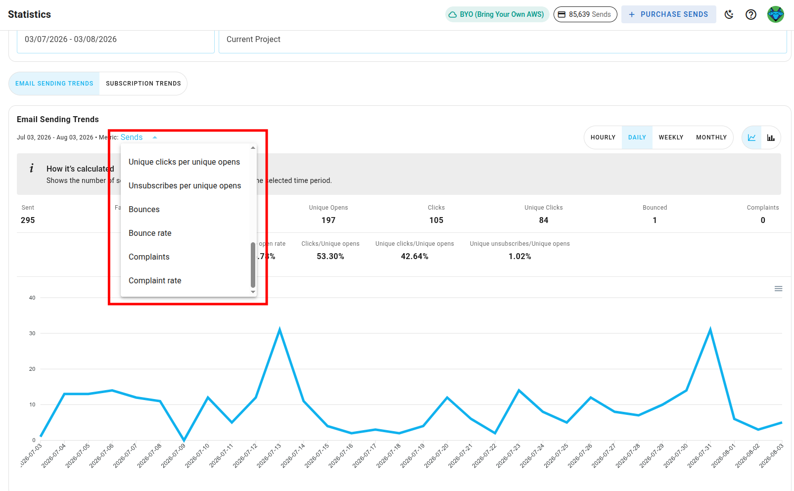

Available metrics are:

- **Sends**: total number of emails sent.
- **Send rate**: percentage of attempted sends that were successfully sent.
- **Failure**: total number of emails that failed to send.
- **Failure rate**: percentage of attempted sends that failed.
- **Opens**: total number of times emails were opened, including repeat opens.
- **Open rate**: opens as a percentage of sends.
- **Unique opens**: number of distinct recipients who opened the email.
- **Unique open rate**: unique opens as a percentage of sends.
- **Clicks**: total number of link clicks, including repeat clicks.
- **Click rate**: clicks as a percentage of sends.
- **Unique clicks**: number of distinct recipients who clicked a link.
- **Unique click rate**: unique clicks as a percentage of sends.
- **Clicks per unique opens**: total clicks as a percentage of unique opens.
- **Unique clicks per unique opens**: unique clicks as a percentage of unique opens.
- **Unsubscribes per unique opens**: unsubscribes as a percentage of unique opens.
- **Bounces**: total number of emails that bounced.
- **Bounce rate**: bounces as a percentage of sends.
- **Complaints**: total number of recipients who marked the email as spam.
- **Complaint rate**: complaints as a percentage of sends.

## Subscription Trends

To switch to subscription trends, click the **Subscription Trends** tab.

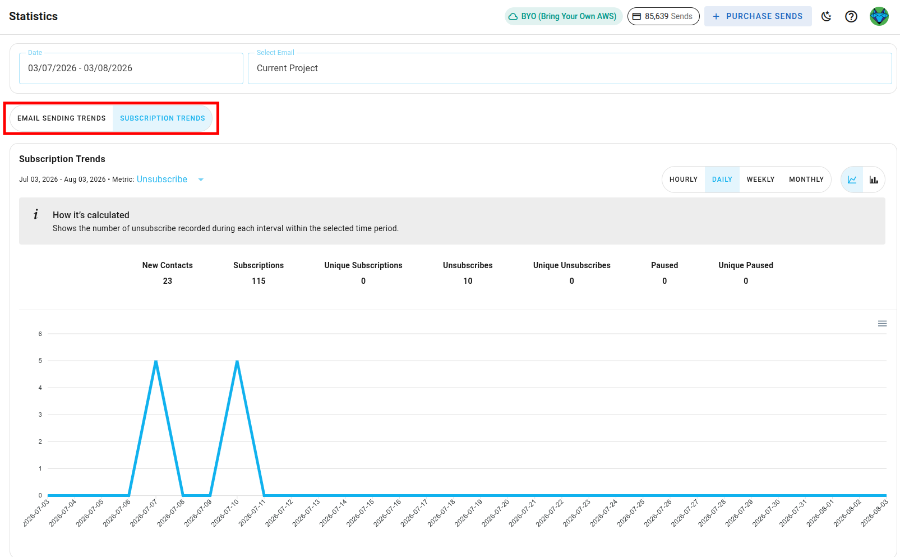

By default, you see the **unsubscribe** numbers for the current project over the past month.

At the top of the tab, an overview banner shows **new contacts**, **subscriptions**, **unique subscriptions**, **unsubscribes**, **unique unsubscribes**, **paused**, and **unique paused**.

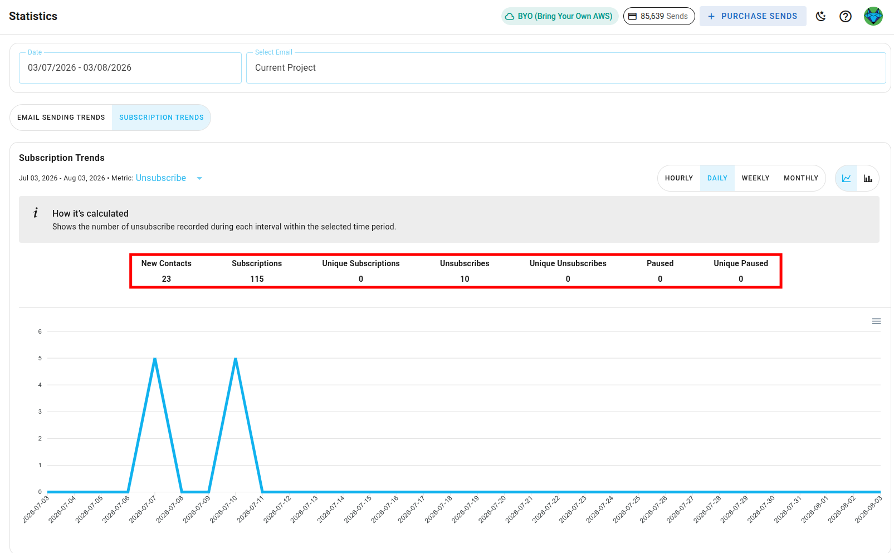

You can change the metric using the dropdown next to the chart title.

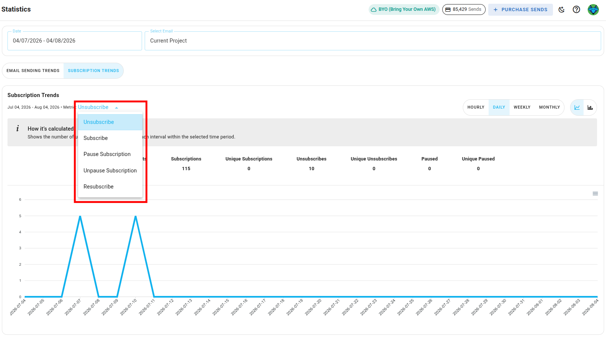

Available metrics are:

- **Subscribe**: number of new subscriptions.
- **Unsubscribe**: number of unsubscribes.
- **Pause Subscription**: number of subscriptions paused.
- **Unpause Subscription**: number of subscriptions unpaused.
- **Resubscribe**: number of contacts who resubscribed.

## Select Email

By default, the **Select Email** dropdown is set to **Current Project**, showing stats for the whole project. You can narrow it down to a specific **subscriber list**, **transactional email**, **triggered email**, **campaign**, or **automation**.

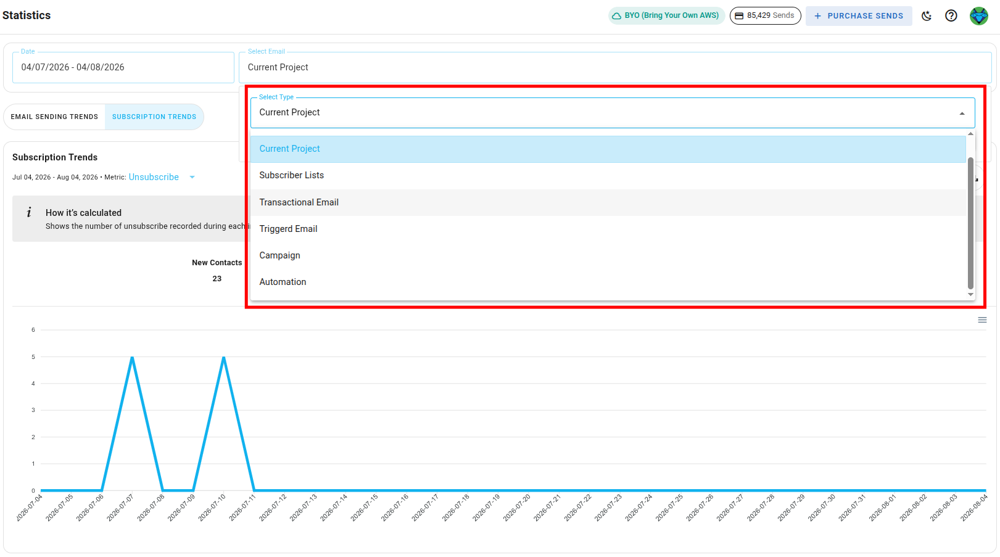

### Email Card Statistics

Each email card also shows a quick snapshot under **Overall stats**: sent, opens, clicks, [bounces](/email-sending-concepts/bounces), and [complaints](/email-sending-concepts/complaints), a subset of the full Email Sending Trends metrics covered above. These numbers reflect stats from the most recent send.

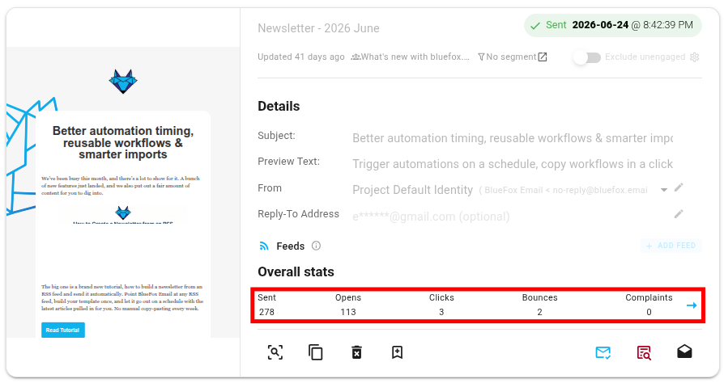

To view detailed statistics or change the time period, click the arrow icon on the card to open the full statistics page for that email.

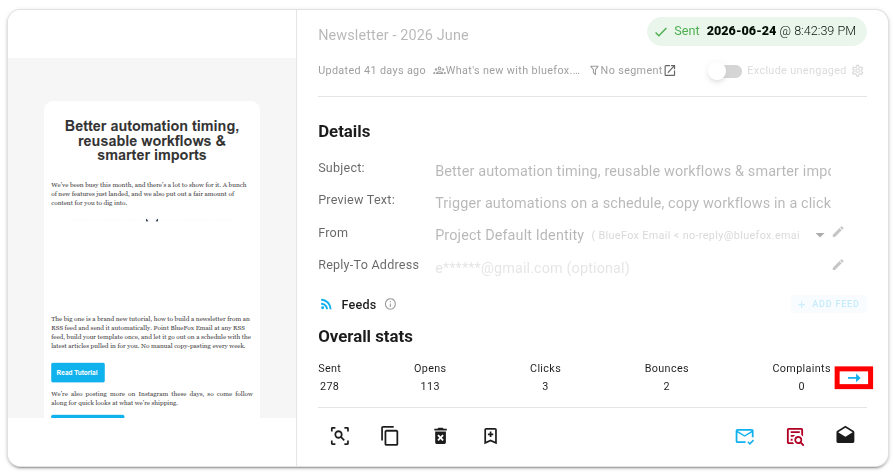

Here you'll see the same overview banner and chart as on the main Statistics page, but filtered to show data for that specific email only. You can change the time period and chart type as described above, and check different metrics using the dropdown next to the chart title.

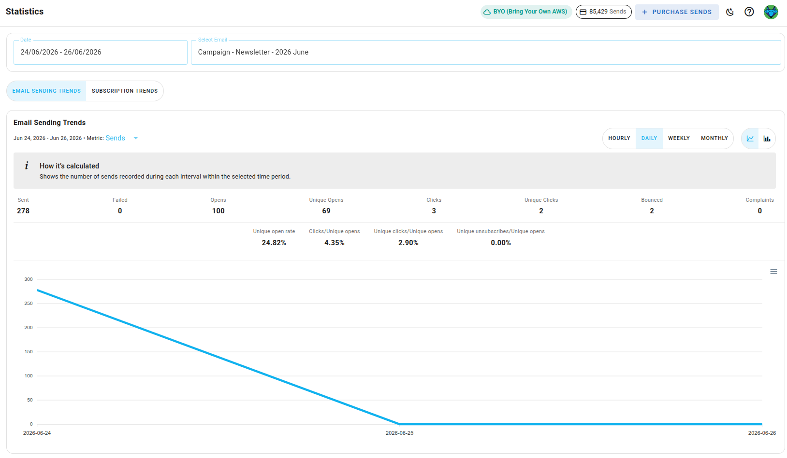

As you scroll down the page, you'll find a data table listing every contact who received the email. You can filter it by **opened**, **not opened**, **clicked**, **not clicked**, **bounced**, **not bounced**, **complained**, **not complained**, **unsubscribed**, and **not unsubscribed**.

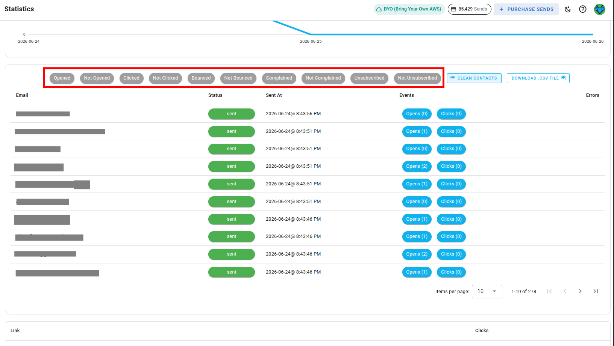

Next to these filters, you'll find a **Download .CSV File** button, along with a **Clean Contacts** option to clean the list based on bounces and complaints. To learn more about list cleaning, check our [List Cleaning](/docs/projects/contacts) documentation.

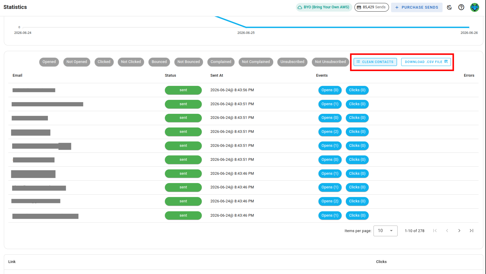

The table shows each contact's email, status, and the date the email was sent. You can also see the number of opens and clicks for each contact, as well as any errors.

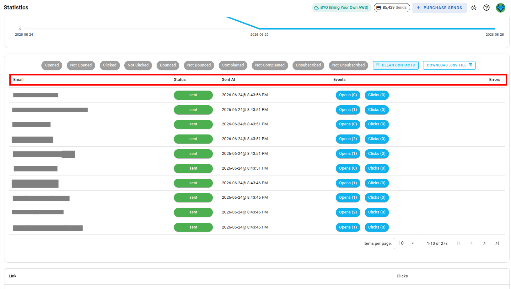

If you scroll down further, you'll see a list of all the links clicked in that email, along with the number of clicks for each link.

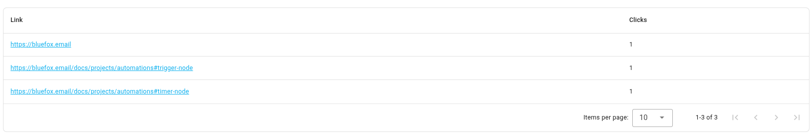

### Automation Card Statistics

Each automation card also shows quick stats: **runs**, **active**, **sends**, **opens**, and **clicks**.

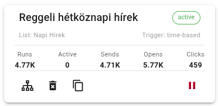

To view detailed statistics, go into that particular automation and click the arrow icon on the send email node card to open the full statistics page for that automation.

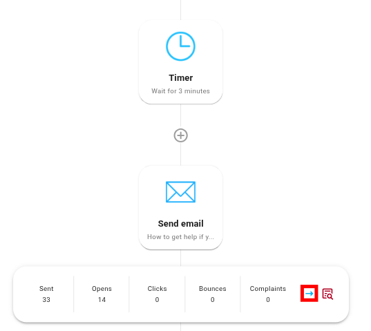

The detailed statistics page follows the same layout described in [Email Card Statistics](#email-card-statistics) above, overview banner, chart with metric dropdown, and data table, filtered to show data for that specific automation email.

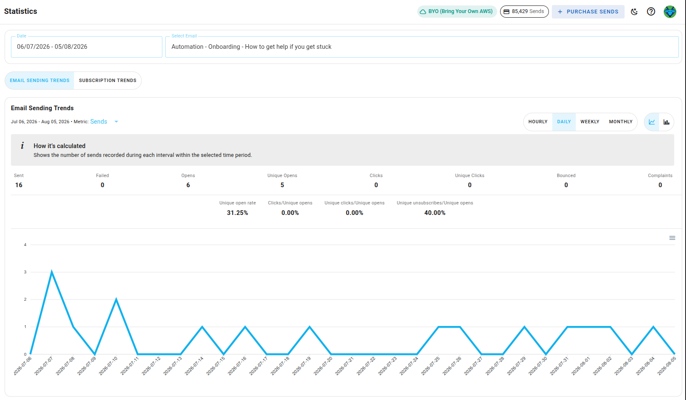

Here also if you scroll down, you'll find a data table listing every contact who received the automation email. You can filter it by **opened**, **not opened**, **clicked**, **not clicked**, **bounced**, **not bounced**, **complained**, **not complained**, **unsubscribed**, and **not unsubscribed**.

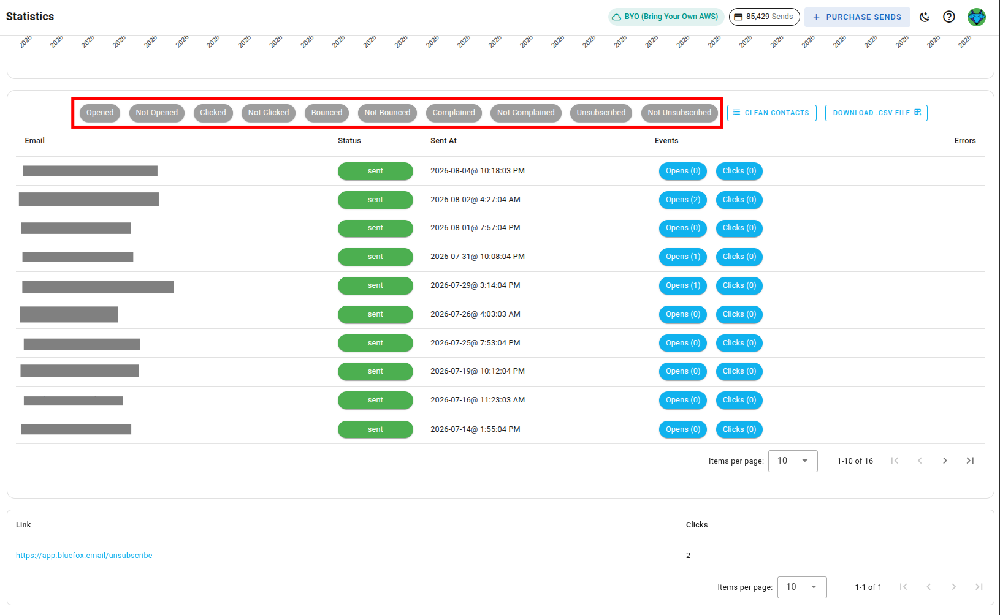

Beside these filters, you'll find a **Download .CSV File** button, along with a **Clean Contacts** option to clean the list based on bounces and complaints. To learn more about list cleaning, check our [List Cleaning](/docs/projects/contacts) documentation.

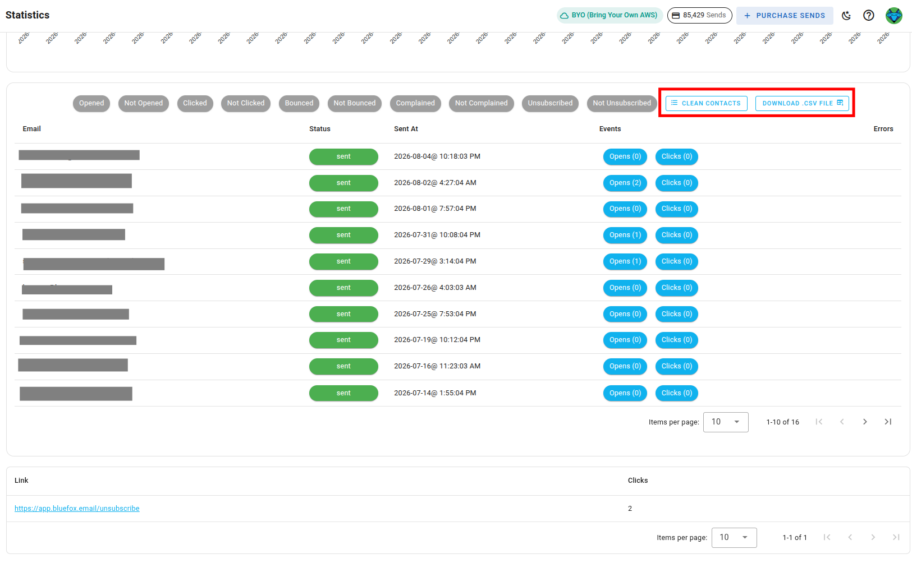

Below the filters, the table shows each contact's email, status, and the date the email was sent. You can also see the number of opens and clicks for each contact, as well as any errors.

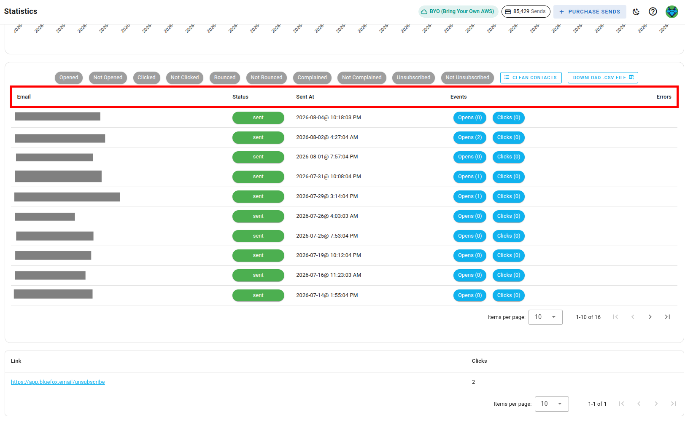

Scroll down further to see a list of all the links clicked in that automation email, along with the number of clicks for each link.

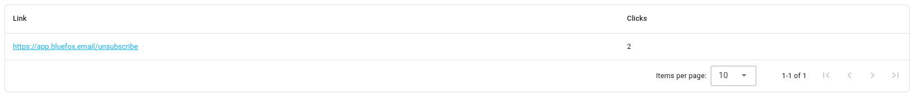

If you want to change the automation, just click on the **Select Automation** dropdown at the top of the page to choose a different automation. The statistics page will update to show data for that selected automation.

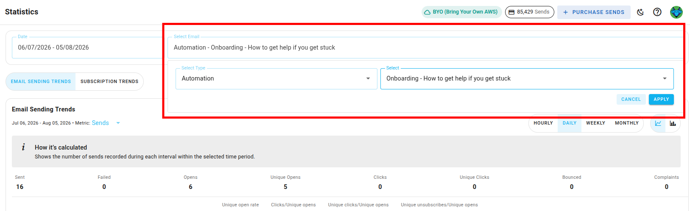

### Subscriber list statistics

To check stats for a specific subscriber list, go to the **Contacts** section and select the list you want to analyze.
There click on the **Manage List** button and then select **More Stats** from the dropdown menu.

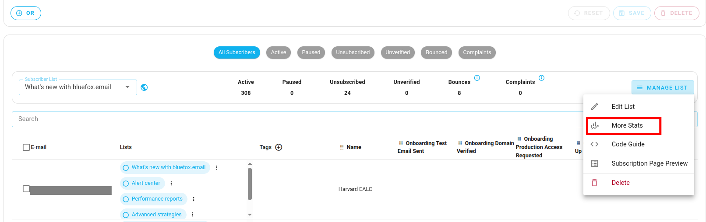

When you do, you will see similar statistics as described above, but filtered to show data for that specific subscriber list.

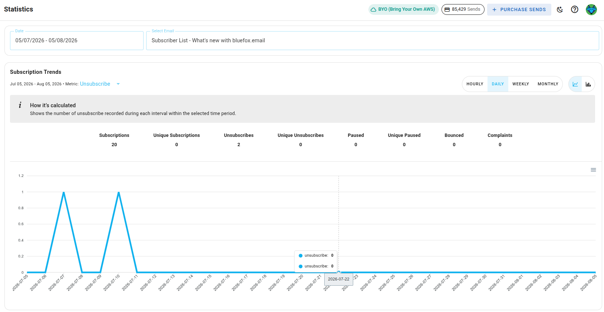

If you want to change the subscriber list, just click on the **Select List** dropdown at the top of the page to choose a different list. The statistics page will update to show data for that selected list.

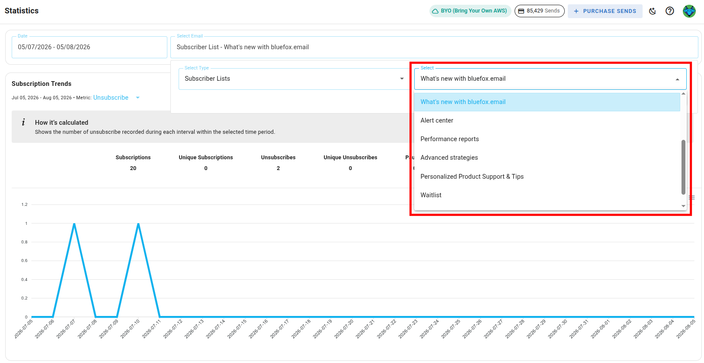

## Overall Banners

At the top of every statistics page, an overall banner displays key metrics in separate boxes. Each box has a title and a numeric value that provides a quick overview of email performance or subscriber activity.

### Overall Email Statistics Banner

The Email Summary Banner provides key email performance metrics, such as **sent emails**, **failed**, **opens**, **unique opens**, **clicks**, **unique clicks**, **bounced**, and **complaints**. This banner is essential for tracking email performance at a glance, enabling users to monitor engagement and [delivery quality](/email-sending-concepts/deliverability) effectively.

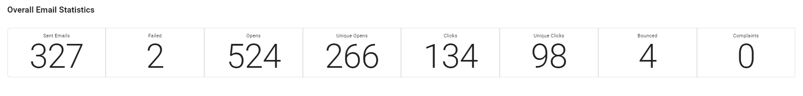

### Overall Subscription Statistics Banner

The Subscription Overall Banner provides an overview of your total subscribers and their current status. It displays metrics such as **contacts**, **subscriptions**, **active**, **paused**, and **unsubscribed**. This summary is key to understanding the distribution of your audience and tracking changes in subscriber engagement and retention.

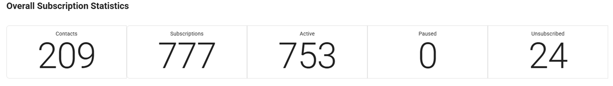

## Email and Subscription Charts

### Email Metrics

Email-related charts track key performance indicators for emails, including: **sent**, **open**, **unique opens**, **click**, **unique click**, and **failed**.

These metrics are displayed using either bar or line charts, depending on the user's preference for visualizing comparative data or tracking continuous trends.

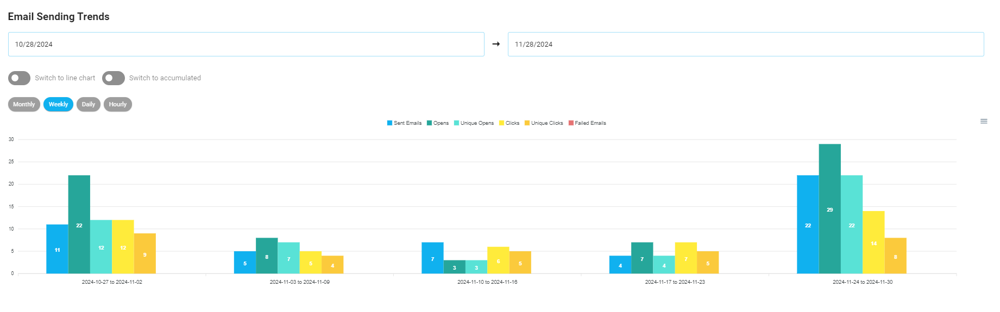

### Subscription Metrics

Subscription charts track key behaviors, including: **subscribed**, **resubscribed**, **unsubscribed**, **paused subscription**, and **unpaused subscription**.

In the **subscription metrics** section, users can monitor activities like new subscriptions, unsubscribes, paused, and resumed subscriptions. These metrics can be displayed as bar or line charts, offering flexible analysis of subscription trends.

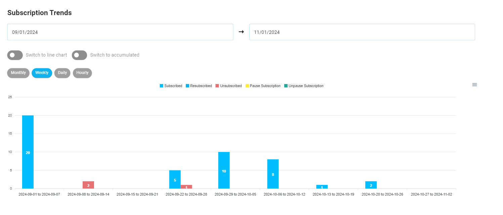

## Charts and Graphs

The statistics page's main section features **interactive charts** that allow users to monitor and analyze the performance of their **email** and **subscription** metrics. These charts provide both **comparative data points** and **continuous trends** over time, enabling users to choose the most relevant view for their analysis.

## Chart Types

#### Bar Charts

Bar charts visualize **comparative data points**, highlighting how data points differ over time. They are ideal for comparing performance across specific periods, such as the number of emails sent or new subscriptions within a given timeframe.

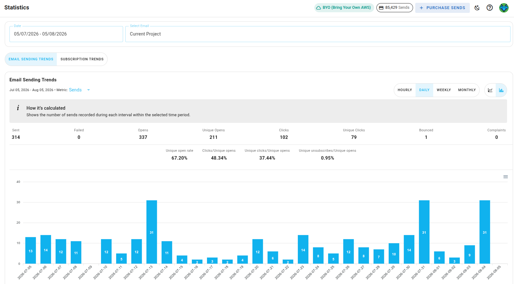

#### Line Charts

Line charts showcase **continuous data trends** over time, making it easier to track data changes and trends.

These charts are especially useful for monitoring long-term patterns, such as tracking email or subscription growth over weeks or months.

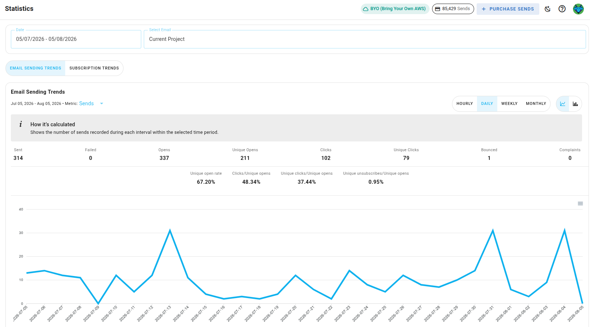