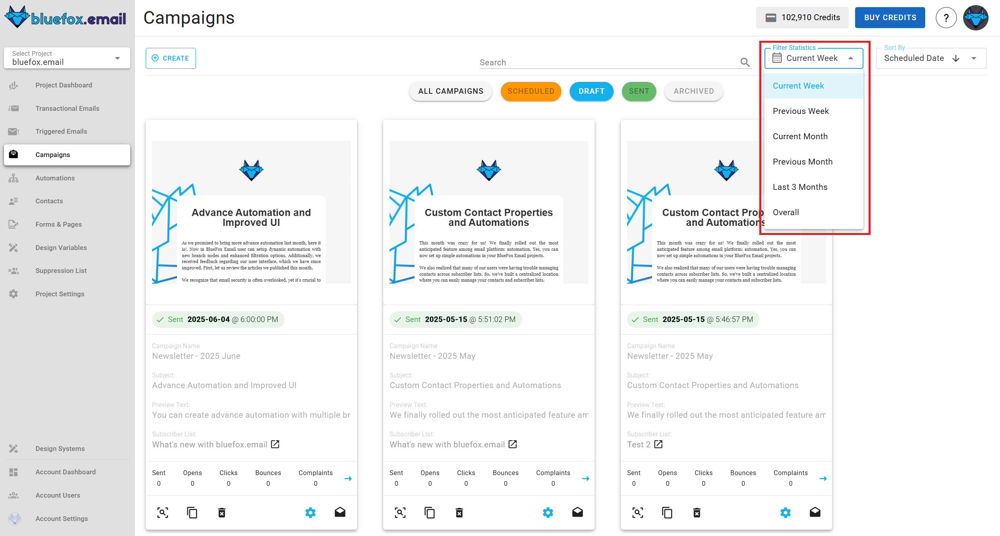
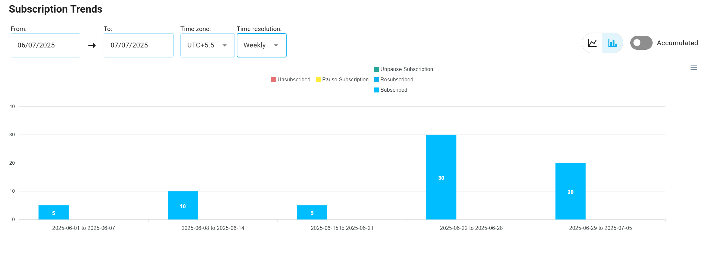
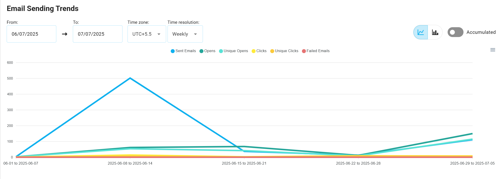
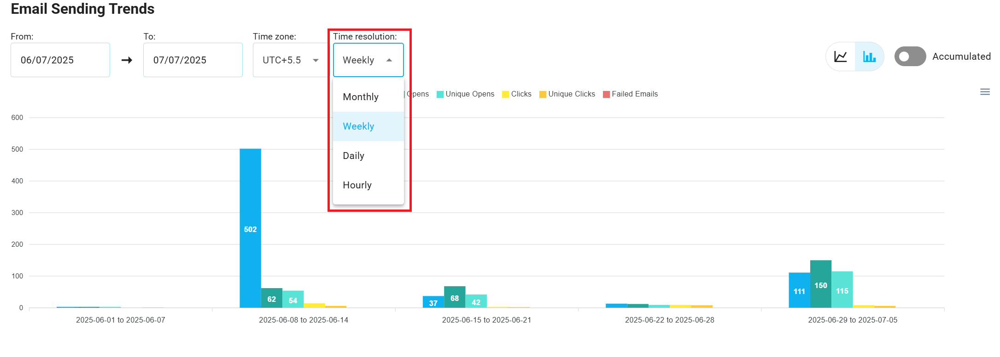
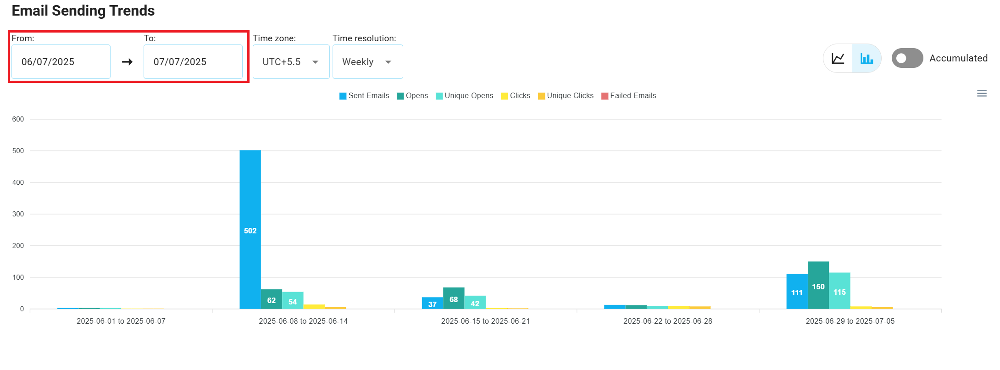

# Analytics

The Analytics section in your application provides a comprehensive analysis of email performance, subscription trends, and user engagement metrics. It is designed to cater to multiple scopes, such as [**account**](/docs/dashboard#key-metrics-in-the-account-dashboard), [**project**](/docs/projects/dashboard), [**transactional emails**](/docs/projects/transactional-emails#transactional-email-statistics), [**triggered emails**](/docs/projects/triggered-emails#triggered-email-statistics), [**campaigns**](/docs/projects/campaigns#campaign-email-statistics) and [**subscriber lists**](/docs/projects/contacts#list-statistics). Each type of statistic is presented with clear visuals, detailed filters, and actionable insights.

## Email Card Analytics

We provide the following analytics for all of our email types (transactional emails, triggered emails, and campaigns): sends, opens, clicks, [bounces](/email-sending-concepts/bounces.md), and [complaints](/email-sending-concepts/complaints.md).

You can view these analytics on the email cards, located right above the action buttons for each email type:

By default, these numbers reflect stats from the current week. If you want to change the time period, select from the options highlighted in the screenshot below: current week, previous week, current month, previous month, last 3 months, or overall.

## Overall Banners

At the top of every statistics page, an overall banner displays key metrics in separate boxes. Each box has a title and a numeric value that provides a quick overview of email performance or subscriber activity.

### Overall Email Statistics Banner

The Email Summary Banner provides key email performance metrics, such as **sent emails**, **failed**, **opens**, **unique opens**, **clicks**, **unique clicks**, **bounced**, and **complaints**. This banner is essential for tracking email performance at a glance, enabling users to monitor engagement and [delivery quality](/email-sending-concepts/deliverability.md) effectively.

### Overall Subscription Statistics Banner

The Subscription Overall Banner provides an overview of your total subscribers and their current status. It displays metrics such as **subscribers**, **active**, **paused**, and **unsubscribed**. This summary is key to understanding the distribution of your audience and tracking changes in subscriber engagement and retention.

## Email and Subscription Charts

### Email Metrics

Email-related charts track key performance indicators for emails, including: **sent**, **open**, **unique opens**, **click**, **unique click**, and **failed**.

These metrics are displayed using either bar or line charts, depending on the user's preference for visualizing comparative data or tracking continuous trends.

### Subscription Metrics

Subscription charts track key behaviors, including: **subscribed**, **resubscribed**, **unsubscribed**, **paused subscription**, and **unpaused subscription**.

In the **subscription metrics** section, users can monitor activities like new subscriptions, unsubscribes, paused, and resumed subscriptions. These metrics can be displayed as bar or line charts, offering flexible analysis of subscription trends.

## Charts and Graphs

The statistics page's main section features **interactive charts** that allow users to monitor and analyze the performance of their **email** and **subscription** metrics. These charts provide both **comparative data points** and **continuous trends** over time, enabling users to choose the most relevant view for their analysis.

### Chart Types

#### Bar Charts

Bar charts visualize **comparative data points**, highlighting how data points differ over time. They are ideal for comparing performance across specific periods, such as the number of emails sent or new subscriptions within a given timeframe.

#### Line Charts

Line charts showcase **continuous data trends** over time, making it easier to track data changes and trends.

These charts are especially useful for monitoring long-term patterns, such as tracking email or subscription growth over weeks or months.

## Chart Controls

### Chart Type Switcher

Users can easily switch between **bar** and **line** charts using the **chart type toggle button**. This allows users to visualize the same data either as discrete, comparative data points or as continuous trends.

### Time Interval Switcher

Users can select from various **time intervals** to refine the displayed data, allowing them to analyze performance with different levels of granularity.

## Filters

Filters allow users to refine data by selecting custom start and end dates, helping isolate trends and identify patterns within specific timeframes.

::: warning
- For **daily**, **weekly**, and **monthly** views, the maximum filter interval is 1 year.
- For **hourly view**, the maximum interval is 7 days.
:::

## Accumulated vs Regular Views

This feature allows users to toggle between accumulated and regular data presentations.

## Data Table

Beneath the charts, **detailed data tables** provide raw, event-level information, allowing users to drill down into specific emails or subscribers.

### Filtering the Data Table

Users can filter the data in the table by selecting one or more filter options.

### Download as CSV

To facilitate data extraction, users can download the filtered data table as a **CSV file**.

