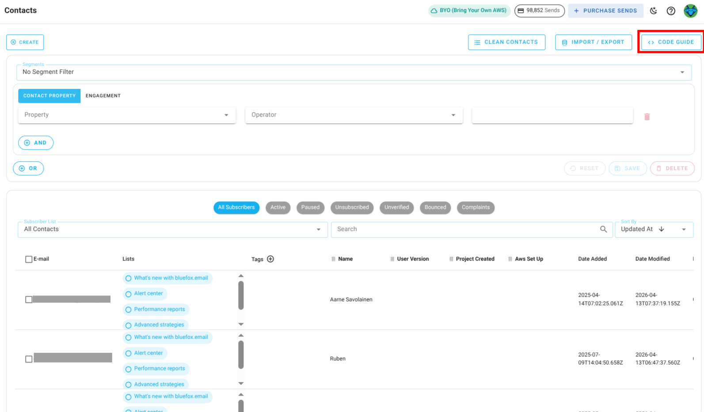
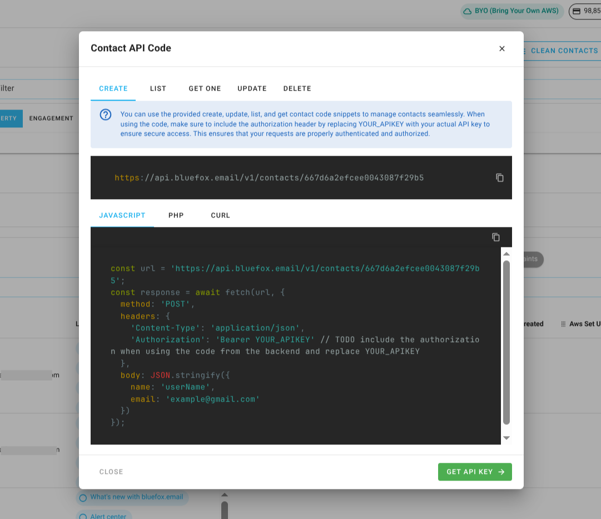
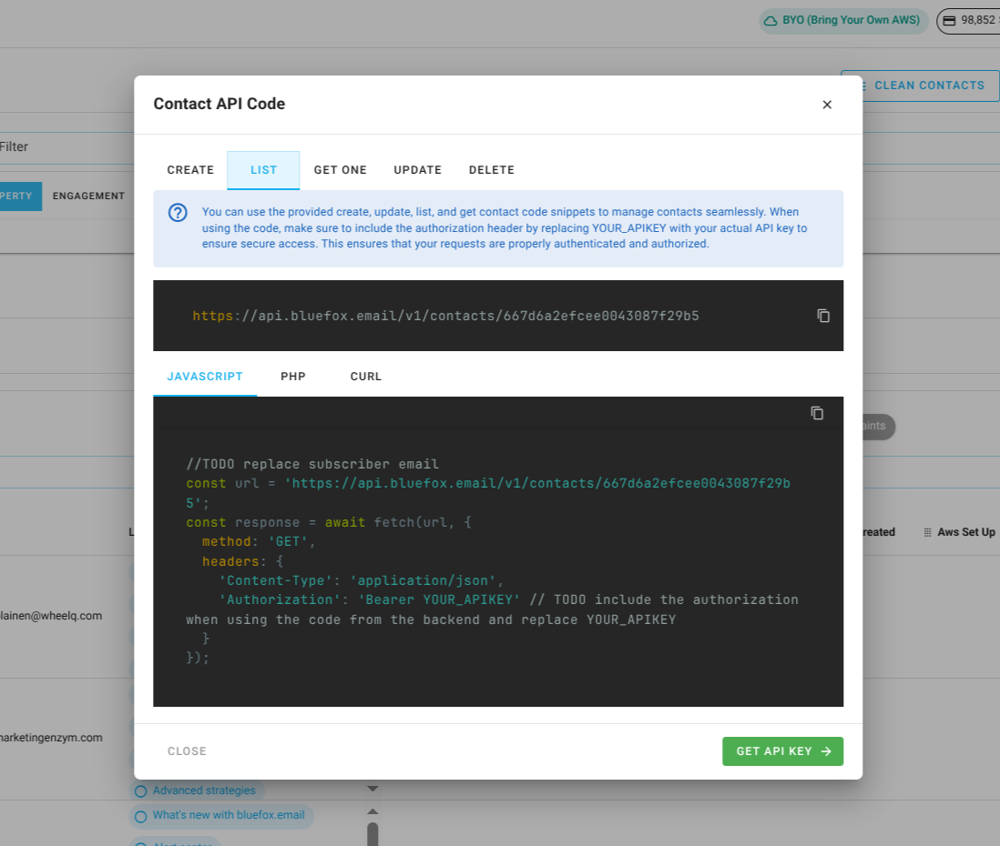
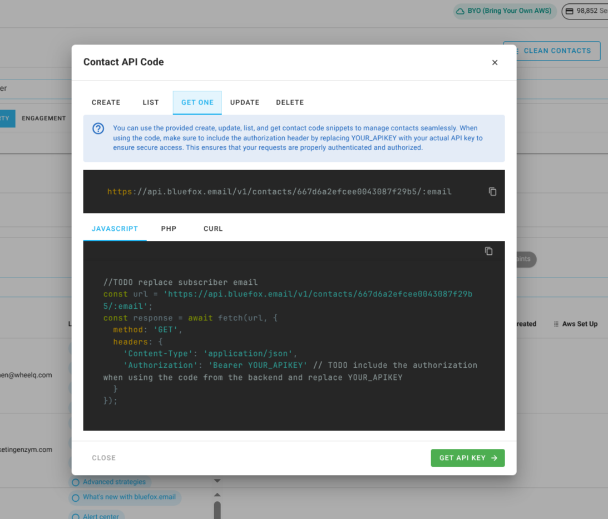
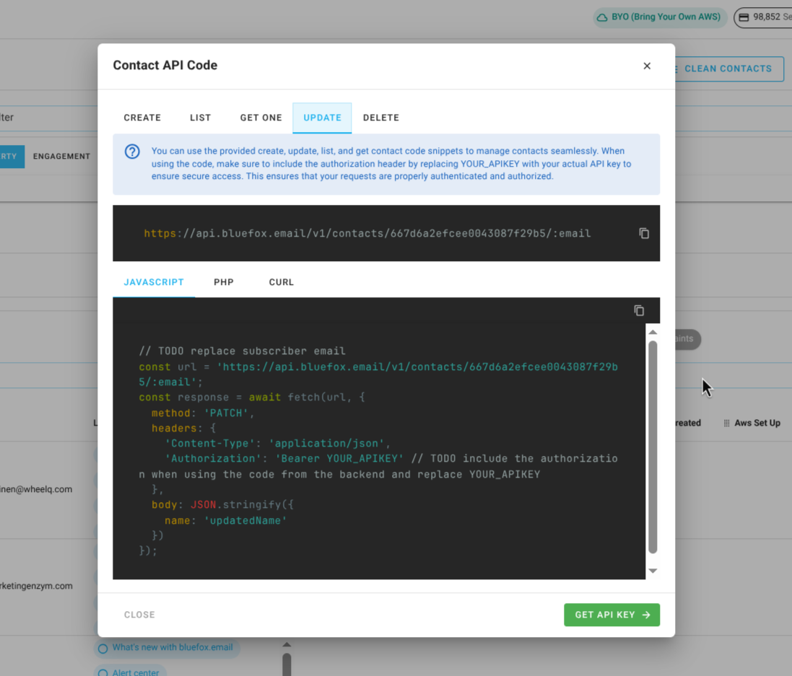
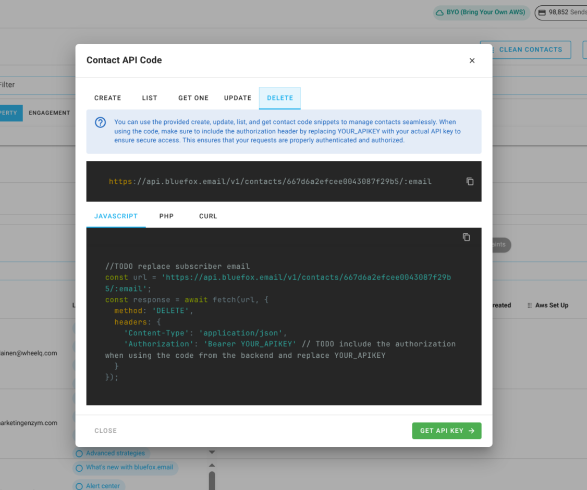

# Contacts and Contact Management via the API

This guide explains how to manage contacts using the **bluefox.email** API. You can create, retrieve, update, and delete contacts from your project. Follow the examples and code snippets to integrate these functionalities into your system.

## Create Contact

[Quick guide](/docs/projects/contacts#contacts-and-lists-integration)

To create a new contact in your project, use the following URL pattern:

```
https://api.bluefox.email/v1/contacts/##YOUR_PROJECT_ID##
```

Replace the placeholders with your specific information:
- `##YOUR_PROJECT_ID##`
- `##YOUR_API_KEY##`

You can find the IDs to replace by clicking on the code guide button in your contacts section:



In the code guide dialog, these values are automatically filled in. If you copy the code snippets, you only need to replace the `##YOUR_API_KEY##`.



**Request Body:**
```json
{
  "name": "Jon Doe",
  "email": "jon@doe.com"
}
```

:::info
You can pass values for [merge tags](/docs/email-personalization) and [contact custom properties](/docs/projects/settings#contact-properties) inside the `data` field in the request body.
Just make sure the keys match the merge tags or custom property names defined in your project settings.
:::

**cUrl**:
```bash
curl -X POST "https://api.bluefox.email/v1/contacts/667d6a2efcee0043087f29b5" -H "Content-Type: application/json" -H "Authorization: Bearer YOUR_API_KEY" -d '{"name": "userName", "email": "example@gmail.com"}'
```

**Javascript**:
```javascript
const url = `https://api.bluefox.email/v1/contacts/667d6a2efcee0043087f29b5`;
  const response = await fetch(url, {
    method: 'POST',
    headers: {
      'Content-Type': 'application/json',
      'Authorization': 'Bearer YOUR_APIKEY' // TODO include the authorization when using the code from the backend and replace YOUR_APIKEY
    },
    body: JSON.stringify({
      name: 'userName',
      email: 'example@gmail.com'
    })
  });
```

**PHP**:
```php
$apiKey = 'YOUR_API_KEY'; // TODO: Replace YOUR_APIKEY

  $url = "https://api.bluefox.email/v1/contacts/667d6a2efcee0043087f29b5";

  $data = array(
      'name' => 'userName',
      'email' => 'example@gmail.com'
  );

  $options = array(
      'http' => array(
          'header'  => "Content-Type: application/json" .
                      "Authorization: Bearer $apiKey",
          'method'  => 'POST',
          'content' => json_encode($data),
      ),
  );

  $context  = stream_context_create($options);
  $response = file_get_contents($url, false, $context);

  if ($response === FALSE) {
      die('Error');
  }

  var_dump($response);
```

::: danger Security Warning
Since an API key is very sensitive information, never store it in your frontend code. Always use it from your backend.
:::

## List Contacts

[Quick guide](/docs/projects/contacts#contacts-and-lists-integration)

To retrieve all contacts from your project, use the following URL pattern:

```
https://api.bluefox.email/v1/contacts/##YOUR_PROJECT_ID##
```

Replace the placeholders with your specific information:
- `##YOUR_PROJECT_ID##`
- `##YOUR_API_KEY##`

You can find the IDs to replace by clicking on the code guide button in your contacts section:


In the code guide dialog, these values are automatically filled in. If you copy the code snippets, you only need to replace the `##YOUR_API_KEY##`.



**cUrl**:
```bash
curl -X GET "https://api.bluefox.email/v1/contacts/667d6a2efcee0043087f29b5" -H "Content-Type: application/json" -H "Authorization: Bearer YOUR_API_KEY"
```

**Javascript**:
```javascript
const url = `https://api.bluefox.email/v1/contacts/667d6a2efcee0043087f29b5`;
  const response = await fetch(url, {
    method: 'GET',
    headers: {
      'Content-Type': 'application/json',
      'Authorization': 'Bearer YOUR_APIKEY' // TODO include the authorization when using the code from the backend and replace YOUR_APIKEY
    }
  });
```

**PHP**:
```php
$apiKey = 'YOUR_API_KEY'; // TODO: Replace YOUR_APIKEY

  $url = "https://api.bluefox.email/v1/contacts/667d6a2efcee0043087f29b5";

  $options = array(
      'http' => array(
          'header'  => "Content-Type: application/json" .
                      "Authorization: Bearer $apiKey",
          'method'  => 'GET'
      ),
  );

  $context  = stream_context_create($options);
  $response = file_get_contents($url, false, $context);

  if ($response === FALSE) {
      die('Error');
  }

  var_dump($response);
```

::: danger Security Warning
Since an API key is very sensitive information, never store it in your frontend code. Always use it from your backend.
:::

## Get One Contact

[Quick guide](/docs/projects/contacts#contacts-and-lists-integration)

To retrieve a specific contact from your project, use the following URL pattern:

```
https://api.bluefox.email/v1/contacts/667d6a2efcee0043087f29b5/##CONTACT_EMAIL_ADDRESS##
```

Replace the placeholders with your specific information:
- `##YOUR_PROJECT_ID##`
- `##CONTACT_EMAIL_ADDRESS##`
- `##YOUR_API_KEY##`

You can find the IDs to replace by clicking on the code guide button in your contacts section:


In the code guide dialog, these values are automatically filled in. If you copy the code snippets, you need to replace the `##YOUR_API_KEY##` and `##CONTACT_EMAIL_ADDRESS##`.



**cUrl**:
```bash
curl -X GET "https://api.bluefox.email/v1/contacts/667d6a2efcee0043087f29b5/:email" -H "Content-Type: application/json" -H "Authorization: Bearer YOUR_API_KEY"
```

**Javascript**:
```javascript
const url = `https://api.bluefox.email/v1/contacts/667d6a2efcee0043087f29b5/:email`;
  const response = await fetch(url, {
    method: 'GET',
    headers: {
      'Content-Type': 'application/json',
      'Authorization': 'Bearer YOUR_APIKEY' // TODO include the authorization when using the code from the backend and replace YOUR_APIKEY
    }
  });
```

**PHP**:
```php
$apiKey = 'YOUR_API_KEY'; // TODO: Replace YOUR_APIKEY

  $url = "https://api.bluefox.email/v1/contacts/667d6a2efcee0043087f29b5/:email";

  $options = array(
      'http' => array(
          'header'  => "Content-Type: application/json" .
                      "Authorization: Bearer $apiKey",
          'method'  => 'GET'
      ),
  );

  $context  = stream_context_create($options);
  $response = file_get_contents($url, false, $context);

  if ($response === FALSE) {
      die('Error');
  }

  var_dump($response);
```

::: danger Security Warning
Since an API key is very sensitive information, never store it in your frontend code. Always use it from your backend.
:::

## Update Contact

[Quick guide](/docs/projects/contacts#contacts-and-lists-integration)

To update a contact in your project, use the following URL pattern:

```
https://api.bluefox.email/v1/contacts/##YOUR_PROJECT_ID##/##CONTACT_EMAIL_ADDRESS##
```

Replace the placeholders with your specific information:
- `##YOUR_PROJECT_ID##`
- `##CONTACT_EMAIL_ADDRESS##`
- `##YOUR_API_KEY##`

You can find the IDs to replace by clicking on the code guide button in your contacts section:


In the code guide dialog, these values are automatically filled in. If you copy the code snippets, you need to replace the `##YOUR_API_KEY##` and `##CONTACT_EMAIL_ADDRESS##`.



**Request body:**
```json
{
  "name": "Updated Name",
  "email": "updated_email@gmail.com"
}
```

:::info
You can pass values for [merge tags](/docs/email-personalization) and [contact custom properties](/docs/projects/settings#contact-properties) inside the `data` field in the request body.
Just make sure the keys match the merge tags or custom property names defined in your project settings.
:::

**cUrl**:
```bash
curl -X PATCH "https://api.bluefox.email/v1/contacts/667d6a2efcee0043087f29b5/:email" -H "Content-Type: application/json" -H "Authorization: Bearer YOUR_API_KEY" -d '{"name": "updatedName"}'
```

**Javascript**:
```javascript
//TODO replace subscriber email
  const url = `https://api.bluefox.email/v1/contacts/667d6a2efcee0043087f29b5/:email`;
  const response = await fetch(url, {
    method: 'PATCH',
    headers: {
      'Content-Type': 'application/json',
      'Authorization': 'Bearer YOUR_APIKEY' // TODO include the authorization when using the code from the backend and replace YOUR_APIKEY
    },
    body: JSON.stringify({
      name: 'updatedName'
    })
  });
```

**PHP**:
```php
// TODO: Replace YOUR_APIKEY and subscriber email
  $apiKey = 'YOUR_API_KEY';

  $url = "https://api.bluefox.email/v1/contacts/667d6a2efcee0043087f29b5/:email";

  $data = array(
      'name' => 'updatedName'
  );

  $options = array(
      'http' => array(
          'header'  => "Content-Type: application/json\r\n" .
                      "Authorization: Bearer $apiKey\r\n",
          'method'  => 'PATCH',
          'content' => json_encode($data)
      ),
  );

  $context  = stream_context_create($options);
  $response = file_get_contents($url, false, $context);

  if ($response === FALSE) {
      die('Error');
  }

  var_dump($response);
```

::: danger Security Warning
Since an API key is very sensitive information, never store it in your frontend code. Always use it from your backend.
:::

## Delete Contact

[Quick guide](/docs/projects/contacts#contacts-and-lists-integration)

To delete a contact from your project, use the following URL pattern:

```
https://api.bluefox.email/v1/contacts/##YOUR_PROJECT_ID##/##CONTACT_EMAIL_ADDRESS##
```

Replace the placeholders with your specific information:
- `##YOUR_PROJECT_ID##`
- `##CONTACT_EMAIL_ADDRESS##`
- `##YOUR_API_KEY##`

You can find the IDs to replace by clicking on the code guide button in your contacts section:


In the code guide dialog, these values are automatically filled in. If you copy the code snippets, you need to replace the `##YOUR_API_KEY##` and `##CONTACT_EMAIL_ADDRESS##`.



**Request body:**
```json
{
  "name": "Updated Name",
  "email": "updated_email@gmail.com"
}
```

**cUrl**:
```bash
curl -X DELETE "https://api.bluefox.email/v1/contacts/667d6a2efcee0043087f29b5/:email" -H "Content-Type: application/json" -H "Authorization: Bearer YOUR_API_KEY"
```

**Javascript**:
```javascript
const url = `https://api.bluefox.email/v1/contacts/667d6a2efcee0043087f29b5/:email`;
  const response = await fetch(url, {
    method: 'DELETE',
    headers: {
      'Content-Type': 'application/json',
      'Authorization': 'Bearer YOUR_APIKEY' // TODO include the authorization when using the code from the backend and replace YOUR_APIKEY
    }
  });
```

**PHP**:
```php
$apiKey = 'YOUR_API_KEY'; // TODO: Replace YOUR_APIKEY

  $url = "https://api.bluefox.email/v1/contacts/667d6a2efcee0043087f29b5/:email";

  $options = array(
      'http' => array(
          'header'  => "Content-Type: application/json\r\n" .
                      "Authorization: Bearer $apiKey\r\n",
          'method'  => 'DELETE'
      ),
  );

  $context  = stream_context_create($options);
  $response = file_get_contents($url, false, $context);

  if ($response === FALSE) {
      die('Error');
  }

  var_dump($response);
```

::: danger Security Warning
Since an API key is very sensitive information, never store it in your frontend code. Always use it from your backend.
:::

## API Responses

| Code | Name                 | Message                                                               | Description | JSON Response Example |
|------|----------------------|-----------------------------------------------------------------------|-------------|-----------------------|
| 200  | -                    | -                                                                     | The request was successfully processed. | ```json { "status": 200, "result": { "accountId": "account_id", "projectId": "project_id", "name": "name", "email": "example@gmail.com", "_id": "contact_id", "createdAt": "Date", "updatedAt": "Date" } } ``` |
| 201  | -                    | -                                                                     | A new contact has been created as a result of the request. | ```json { "status": 201, "result": { "accountId": "account_id", "projectId": "project_id", "name": "name", "email": "example@gmail.com", "_id": "contact_id", "createdAt": "Date", "updatedAt": "Date" } } ``` |
| 204  | -                    | -                                                                     | The contact has been successfully deleted. No content is returned. | - |
| 400  | `VALIDATION_ERROR`   | Email already exists.                                                | The email address is already registered in the system. | ```json { "status": 400, "error": { "name": "VALIDATION_ERROR", "message": "Email already exists." } } ``` |
| 400  | `VALIDATION_ERROR`   | Invalid email format                                                  | The request contains improperly formatted email. Ensure `email` is valid email address. | ```json { "status": 400, "error": { "name": "VALIDATION_ERROR", "message": "Invalid email format" } } ``` |
| 404  | `NOT_FOUND`          | Contact not found                                                     | The requested contact does not exist in the system. | ```json { "status": 404, "error": { "name": "NOT_FOUND", "message": "Contact not found" } } ``` |
| 405  | `METHOD_NOT_ALLOWED` | The provided email has been flagged due to bouncing. If this is incorrect and the email is valid, please contact support. | The email address has been marked as undeliverable due to previous failed delivery attempts. | ```json { "status": 405, "error": { "name": "METHOD_NOT_ALLOWED", "message": "The provided email has been flagged due to bouncing. If this is incorrect and the email is valid, please contact support." } } ``` |