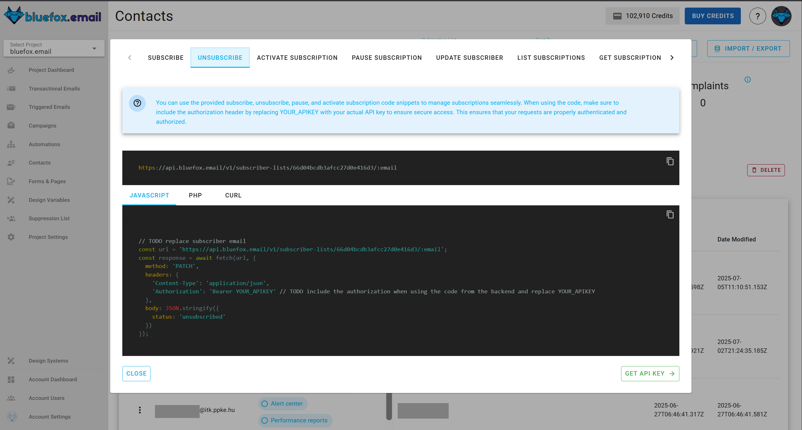

# API

This guide is for using the API from the backend. If it is possible to do it from the frontend, we will mention it clearly.

## Subscribe

[Quick guide](/docs/projects/subscriber-lists.html#subscriber-list-integration)

To subscribe a user to a [subscriber list](/docs/projects/subscriber-lists), use the following URL pattern:

```
https://api.bluefox.email/v1/subscriber-lists/##YOUR_SUBSCRIBER_LIST_ID##
```

Replace the placeholders with your specific information:
- `##YOUR_SUBSCRIBER_LIST_ID##`
- `##YOUR_API_KEY##`

You can find the IDs to replace by clicking on the code guide button in a subscriber list:


In the code guide dialog, these values are automatically filled in. If you copy the code snippets, you only need to replace the `##YOUR_API_KEY##`.


**Request Body:**
```json
{
  "name": "Jon Doe",
  "email": "jon@doe.com"
}
```

**cUrl**:
```bash
 curl -X POST "https://api.bluefox.email/v1/subscriber-lists/##YOUR_SUBSCRIBER_LIST_ID##" -H "Content-Type: application/json" -H "Authorization: Bearer ##YOUR_API_KEY##" -d '{"name": "Jon Doe", "email": "jon@doe.com"}'
```

**Javascript**:
```javascript
const url = 'https://api.bluefox.email/v1/subscriber-lists/##YOUR_SUBSCRIBER_LIST_ID##'

const response = await fetch(url, {
  method: 'POST',
  headers: {
    'Content-Type': 'application/json',
    'Authorization': 'Bearer ##YOUR_APIKEY##'
  },
  body: JSON.stringify({
    name: 'Jon Doe',
    email: 'jon@doe.com'
  })
})
```

**PHP**:
```php
  $apiKey = "##YOUR_API_KEY##"; // TODO: replace YOUR_APIKEY

  $url = "https://api.bluefox.email/v1/subscriber-lists/##YOUR_SUBSCRIBER_LIST_ID##";

  $data = array(
      'name' => 'userName',
      'email' => 'example@gmail.com'
  );

  $options = array(
      'http' => array(
          'header'  => "Content-Type: application/json\r\n" .
                      "Authorization: Bearer $apiKey\r\n",
          'method'  => 'POST',
          'content' => json_encode($data),
      ),
  );

  $context  = stream_context_create($options);
  $response = file_get_contents($url, false, $context);
```

::: danger Security Warning
Since an API key is very sensitive information, never store it in your frontend code. Always use it from your backend.
:::


## Unsubscribe

[Quick guide](/docs/projects/subscriber-lists.html#subscriber-list-integration)

To unsubscribe a user from a [subscriber list](/docs/projects/subscriber-lists), use the following URL pattern:
```
https://api.bluefox.email/v1/subscriber-lists/##YOUR_SUBSCRIBER_LIST_ID##/##SUBSCRIBER_EMAIL_ADDRESS##
```

Replace the placeholders with your specific information:
 - `##YOUR_SUBSCRIBER_LIST_ID##`
 - `##SUBSCRIBER_EMAIL_ADDRESS##`
 - `##YOUR_API_KEY##`

You can find the IDs to replace by clicking on the code guide button in a subscriber list:


In the code guide dialog, these values are automatically filled in. If you copy the code snippets, you need to replace the `##YOUR_API_KEY##` and `##SUBSCRIBER_EMAIL_ADDRESS##`.



**Requiest body**:
```json
{
  "status": "unsubscribed"
}
```


**cUrl**:
```bash
curl -X PATCH "https://api.bluefox.email/v1/subscriber-lists/##YOUR_SUBSCRIBER_LIST_ID##/##SUBSCRIBER_EMAIL_ADDRESS##" -H "Content-Type: application/json" -H "Authorization: Bearer ##YOUR_API_KEY##" -d '{"status": "unsubscribed"}'
```

**Javascript**:
```javascript
const url = 'https://api.bluefox.email/v1/subscriber-lists/##YOUR_SUBSCRIBER_LIST_ID##/##SUBSCRIBER_EMAIL_ADDRESS##'

const response = await fetch(url, {
  method: 'PATCH',
  headers: {
    'Content-Type': 'application/json',
    'Authorization': 'Bearer ##YOUR_API_KEY##'
  },
  body: JSON.stringify({
    status: 'unsubscribed'
  })
})
```

**PHP**:
```php
$apiKey = "##YOUR_API_KEY##";

$url = "https://api.bluefox.email/v1/subscriber-lists/##YOUR_SUBSCRIBER_LIST_ID##/##SUBSCRIBER_EMAIL_ADDRESS##";

$data = array(
    'status' => 'unsubscribed'
);

$options = array(
    "http" => array(
        "header"  => "Content-Type: application/json\r\n" .
                    "Authorization: Bearer $apiKey\r\n",
        "method"  => "PATCH",
        'content' => json_encode($data),
    ),
);

$context  = stream_context_create($options);
$response = file_get_contents($url, false, $context);
```

::: danger Security Warning
Since an API key is very sensitive information, never store it in your frontend code. Always use it from your backend.
:::

## Activate Subscription

[Quick guide](/docs/projects/subscriber-lists.html#subscriber-list-integration)

To activate a user from a [subscriber list](/docs/projects/subscriber-lists), use the following URL pattern:
```
https://api.bluefox.email/v1/subscriber-lists/##YOUR_SUBSCRIBER_LIST_ID##/##SUBSCRIBER_EMAIL_ADDRESS##
```

Replace the placeholders with your specific information:
 - `##YOUR_SUBSCRIBER_LIST_ID##`
 - `##SUBSCRIBER_EMAIL_ADDRESS##`
 - `##YOUR_API_KEY##`

You can find the IDs to replace by clicking on the code guide button in a subscriber list:


In the code guide dialog, these values are automatically filled in. If you copy the code snippets, you need to replace the `##YOUR_API_KEY##` and `##SUBSCRIBER_EMAIL_ADDRESS##`.


**Requiest body**:
```json
{
  "status": "active"
}
```


**cUrl**:
```bash
curl -X PATCH "https://api.bluefox.email/v1/subscriber-lists/##YOUR_SUBSCRIBER_LIST_ID##/##SUBSCRIBER_EMAIL_ADDRESS##" -H "Content-Type: application/json" -H "Authorization: Bearer ##YOUR_API_KEY##" -d '{"status": "active"}'
```

**Javascript**:
```javascript
const url = 'https://api.bluefox.email/v1/subscriber-lists/##YOUR_SUBSCRIBER_LIST_ID##/##SUBSCRIBER_EMAIL_ADDRESS##'

const response = await fetch(url, {
  method: 'PATCH',
  headers: {
    'Content-Type': 'application/json',
    'Authorization': 'Bearer ##YOUR_API_KEY##'
  },
  body: JSON.stringify({
    status: 'active'
  })
})
```

**PHP**:
```php
$apiKey = "##YOUR_API_KEY##";

$url = "https://api.bluefox.email/v1/subscriber-lists/##YOUR_SUBSCRIBER_LIST_ID##/##SUBSCRIBER_EMAIL_ADDRESS##";

$data = array(
    'status' => 'active'
);

$options = array(
    "http" => array(
        "header"  => "Content-Type: application/json\r\n" .
                    "Authorization: Bearer $apiKey\r\n",
        "method"  => "PATCH",
        'content' => json_encode($data),
    ),
);

$context  = stream_context_create($options);
$response = file_get_contents($url, false, $context);
```

::: danger Security Warning
Since an API key is very sensitive information, never store it in your frontend code. Always use it from your backend.
:::

## Pause Subscription

[Quick guide](/docs/projects/subscriber-lists.html#subscriber-list-integration)

To pause a user from a [subscriber list](/docs/projects/subscriber-lists), use the following URL pattern:
```
https://api.bluefox.email/v1/subscriber-lists/##YOUR_SUBSCRIBER_LIST_ID##/##SUBSCRIBER_EMAIL_ADDRESS##
```

Replace the placeholders with your specific information:
 - `##YOUR_SUBSCRIBER_LIST_ID##`
 - `##SUBSCRIBER_EMAIL_ADDRESS##`
 - `##YOUR_API_KEY##`
 - `##PAUSED_UNTIL##`

You can find the IDs to replace by clicking on the code guide button in a subscriber list:


In the code guide dialog, these values are automatically filled in. If you copy the code snippets, you need to replace the `##YOUR_API_KEY##`, `##SUBSCRIBER_EMAIL_ADDRESS##` and `##PAUSED_UNTIL##`.


**Requiest body**:
```json
{
  "status": "paused",
  "pausedUntil": "##PAUSED_UNTIL##" //TODO replace date (ISO date string format)
}
```


**cUrl**:
```bash
curl -X PATCH "https://api.bluefox.email/v1/subscriber-lists/##YOUR_SUBSCRIBER_LIST_ID##/##SUBSCRIBER_EMAIL_ADDRESS##" -H "Content-Type: application/json" -H "Authorization: Bearer ##YOUR_API_KEY##" -d '{"status": "paused", "pausedUntil": "##PAUSED_UNTIL##" }'
```

**Javascript**:
```javascript
const url = 'https://api.bluefox.email/v1/subscriber-lists/##YOUR_SUBSCRIBER_LIST_ID##/##SUBSCRIBER_EMAIL_ADDRESS##'

const response = await fetch(url, {
  method: 'PATCH',
  headers: {
    'Content-Type': 'application/json',
    'Authorization': 'Bearer ##YOUR_API_KEY##'
  },
  body: JSON.stringify({
    status: 'paused',
    pausedUntil: '##PAUSED_UNTIL##'
  })
})
```

**PHP**:
```php
$apiKey = "##YOUR_API_KEY##";

$url = "https://api.bluefox.email/v1/subscriber-lists/##YOUR_SUBSCRIBER_LIST_ID##/##SUBSCRIBER_EMAIL_ADDRESS##";

$data = array(
    'status' => 'paused',
    'pausedUntil' => '##PAUSED_UNTIL##'
);

$options = array(
    "http" => array(
        "header"  => "Content-Type: application/json\r\n" .
                    "Authorization: Bearer $apiKey\r\n",
        "method"  => "PATCH",
        'content' => json_encode($data),
    ),
);

$context  = stream_context_create($options);
$response = file_get_contents($url, false, $context);
```

::: danger Security Warning
Since an API key is very sensitive information, never store it in your frontend code. Always use it from your backend.
:::

## List Subscribers

[Quick guide](/docs/projects/subscriber-lists.html#subscriber-list-integration)

To list users from a [subscriber list](/docs/projects/subscriber-lists), use the following URL pattern:
```
https://api.bluefox.email/v1/subscriber-lists/##YOUR_SUBSCRIBER_LIST_ID##
```

Replace the placeholders with your specific information:
 - `##YOUR_SUBSCRIBER_LIST_ID##`
 - `##YOUR_API_KEY##`

You can find the IDs to replace by clicking on the code guide button in a subscriber list:


In the code guide dialog, these values are automatically filled in. If you copy the code snippets, you need to replace the `##YOUR_API_KEY##`.


**Requiest body**:

none.


**cUrl**:
```bash
curl -X GET "https://api.bluefox.email/v1/subscriber-lists/##YOUR_SUBSCRIBER_LIST_ID##" -H "Content-Type: application/json" -H "Authorization: Bearer ##YOUR_API_KEY##"
```

**Javascript**:
```javascript
const url = 'https://api.bluefox.email/v1/subscriber-lists/##YOUR_SUBSCRIBER_LIST_ID##'

const response = await fetch(url, {
  method: 'GET',
  headers: {
    'Content-Type': 'application/json',
    'Authorization': 'Bearer ##YOUR_API_KEY##'
  }
})
```

**PHP**:
```php
$apiKey = "##YOUR_API_KEY##";

$url = "https://api.bluefox.email/v1/subscriber-lists/##YOUR_SUBSCRIBER_LIST_ID##";

$options = array(
    "http" => array(
        "header"  => "Content-Type: application/json\r\n" .
                    "Authorization: Bearer $apiKey\r\n",
        "method"  => "GET"
    ),
);

$context  = stream_context_create($options);
$response = file_get_contents($url, false, $context);
```

::: danger Security Warning
Since an API key is very sensitive information, never store it in your frontend code. Always use it from your backend.
:::

## Get Subscriber

[Quick guide](/docs/projects/subscriber-lists.html#subscriber-list-integration)

To get user from a [subscriber list](/docs/projects/subscriber-lists), use the following URL pattern:
```
https://api.bluefox.email/v1/subscriber-lists/##YOUR_SUBSCRIBER_LIST_ID##/##SUBSCRIBER_EMAIL_ADDRESS##
```

Replace the placeholders with your specific information:
 - `##YOUR_SUBSCRIBER_LIST_ID##`
 - `##SUBSCRIBER_EMAIL_ADDRESS##`
 - `##YOUR_API_KEY##`

You can find the IDs to replace by clicking on the code guide button in a subscriber list:


In the code guide dialog, these values are automatically filled in. If you copy the code snippets, you need to replace the `##YOUR_API_KEY##` and `##SUBSCRIBER_EMAIL_ADDRESS##`.


**Requiest body**:

none.


**cUrl**:
```bash
curl -X GET "https://api.bluefox.email/v1/subscriber-lists/##YOUR_SUBSCRIBER_LIST_ID##/##SUBSCRIBER_EMAIL_ADDRESS##" -H "Content-Type: application/json" -H "Authorization: Bearer ##YOUR_API_KEY##"
```

**Javascript**:
```javascript
const url = 'https://api.bluefox.email/v1/subscriber-lists/##YOUR_SUBSCRIBER_LIST_ID##/##SUBSCRIBER_EMAIL_ADDRESS##'

const response = await fetch(url, {
  method: 'GET',
  headers: {
    'Content-Type': 'application/json',
    'Authorization': 'Bearer ##YOUR_API_KEY##'
  }
})
```

**PHP**:
```php
$apiKey = "##YOUR_API_KEY##";

$url = "https://api.bluefox.email/v1/subscriber-lists/##YOUR_SUBSCRIBER_LIST_ID##/##SUBSCRIBER_EMAIL_ADDRESS##";

$options = array(
    "http" => array(
        "header"  => "Content-Type: application/json\r\n" .
                    "Authorization: Bearer $apiKey\r\n",
        "method"  => "GET"
    ),
);

$context  = stream_context_create($options);
$response = file_get_contents($url, false, $context);
```

::: danger Security Warning
Since an API key is very sensitive information, never store it in your frontend code. Always use it from your backend.
:::

## Send transactional email
[Quick quide](/docs/projects/transactional-emails.html#transactional-email-integration)

To send a [transactional email](/docs/projects/transactional-emails), use the following URL pattern:

```
https://api.bluefox.email/v1/send-transactional
```

Replace the placeholders with your specific information:
 - `##EMAIL_ID##`
 - `##YOUR_API_KEY##`

You can find the IDs to replace by clicking on the code guide button on a transactional email card:


In the code guide dialog, these values are automatically filled in. If you copy the code snippets, you need to replace the `##YOUR_API_KEY##`.


**Request body**:
```json
{
  "email": "jon@doe.com",
  "transactionalId": "##EMAIL_ID##",
  "data": {
    "example": "example merge tag value"
  },
  "attachments": [] //optional
}
```

You can include personalization data (merge tags) in the data object. These tags are processed by [Handlebars](https://handlebarsjs.com/) when sent.


**cUrl**:
```bash
curl -X POST \
"https://api.bluefox.email/v1/send-transactional" \
-H "Content-Type: application/json" \
-H "Authorization: Bearer ##YOUR_API_KEY##" \
-d '{
  "email": "jon@doe.com", // TODO change email address
  "transactionalId": "##EMAIL_ID##",
  "data": {
    // TODO add the merge tags values
  }
}'
```

**Javascript**:
```javascript
const url = 'https://api.bluefox.email/v1/send-transactional'
const response = await fetch(url, {
  method: 'POST',
  headers: {
    'Content-Type': 'application/json',
    'Authorization': 'Bearer ##YOUR_API_KEY##' // TODO change YOUR_APIKEY
  },
  body: JSON.stringify({
    email: 'jon@doe.com', // TODO change email address
    transactionalId: '##EMAIL_ID##',
    data: {
    // TODO add the merge tags values
    }
  })
})
```

**PHP**:
```php
$apiKey = "##YOUR_API_KEY##";

$url = "https://api.bluefox.email/v1/send-transactional";

$email = "example@gmail.com"; // TODO change email address
$transactionalId = "##EMAIL_ID##";
$data = [
  // TODO add the merge tags values
];

$payload = json_encode([
  "email" => $email,
  "transactionalId" => $transactionalId,
  "data" => $data
]);

$options = [
  "http" => [
    "header"  => [
      "Content-Type: application/json",
      "Authorization: Bearer $apiKey"
    ],
    "method"  => "POST",
    "content" => $payload,
  ],
];

$context  = stream_context_create($options);
$result = file_get_contents($url, false, $context);
```

## Send triggered email

[Quick quide](/docs/projects/triggered-emails.html#triggered-email-integration)

To send a [triggered email](/docs/projects/triggered-emails),  use the following URL pattern:

```
https://api.bluefox.email/v1/send-triggered
```

Replace the placeholders with your specific information:
 - `##EMAIL_ID##`
 - `##YOUR_API_KEY##`

You can find the IDs to replace by clicking on the code guide button on a triggered email card:


In the code guide dialog, these values are automatically filled in. If you copy the code snippets, you need to replace the `##YOUR_API_KEY##`.


Request body:
```json
{
  "emails": ["jon@doe.com"],
  "triggeredId": "##EMAIL_ID##",
  "data": {
    "example": "example merge tag value"
  },
  "attachments": [] //optional  
}
```

You can include personalization data (merge tags) in the data object. These tags are processed by [Handlebars](https://handlebarsjs.com/) when sent.

**cUrl**:
```bash
curl -X POST \
"https://api.bluefox.email/v1/send-triggered" \
-H "Content-Type: application/json" \
-H "Authorization: Bearer ##YOUR_API_KEY##" \
-d '{
  "emails": ["jon@doe.com"], // TODO change email addresses
  "triggeredId": ##EMAIL_ID##,
  "data": {
    // TODO add the merge tags values
  }
}'
```

**Javascript**:
```javascript
const url = 'https://api.bluefox.email/v1/send-triggered'
const response = await fetch(url, {
  method: 'POST',
  headers: {
    'Content-Type': 'application/json',
    'Authorization': 'Bearer ##YOUR_API_KEY##' // TODO change YOUR_APIKEY
  },
  body: JSON.stringify({
    emails: ['jon@doe.com'], // TODO change email address
    triggeredId: "##EMAIL_ID##",
    data: {
    // TODO add the merge tags values
    }
  })
})
```

**PHP**:
```php
$apiKey = "##YOUR_API_KEY##";

$url = "https://api.bluefox.email/v1/send-triggered";

$emails = ["jon@doe.com"]; // TODO change email addresses
$triggeredId = "##EMAIL_ID##"
$data = [
  // TODO add the merge tags values
];

$payload = json_encode([
  "emails" => $emails,
  "triggeredId" => $triggeredId,
  "data" => $data
]);

$options = [
  "http" => [
    "header"  => [
      "Content-Type: application/json",
      "Authorization: Bearer $apiKey"
    ],
    "method"  => "POST",
    "content" => $payload,
  ],
];

$context  = stream_context_create($options);
$result = file_get_contents($url, false, $context);
```

## Send attachments

Attachments in **bluefox.email** allow you to include files in your emails. These files are specified as an array of objects, with each object representing a single attachment. Attachments can be used in both **transactional** and **triggered emails**.

::: warning
Attachments are cached for **1 hour**. If your email sending process is expected to take longer than an hour, please contact our support team to ensure uninterrupted delivery.
:::

### Attachment Object Structure

Each attachment object includes the following fields:

| Field      | Type   | Description                                                      | Required |
|------------|--------|------------------------------------------------------------------|----------|
| `fileName` | String | The name of the file, including the file extension (e.g., `report.pdf`). | Yes      |
| `content`  | String | The file content encoded in Base64 format.                      | Yes      |

### Example

Here’s an example of how to structure attachments:

```json
{
  "attachments": [
    {
      "fileName": "example.txt",
      "content": "Ymx1ZWZveC5lbWFpbCBhdHRhY2htZW50IGV4YW1wbGUh"
    }
  ]
}
```

## Webhook

Webhooks allow your application to receive real-time notifications about events such as email opens, clicks, bounces, complaints, subscriptions, and more. By setting up a webhook, you can stay informed and integrate email event data directly into your application.

### Features of Webhooks
- **Real-Time Updates**: Receive immediate notifications about email events.
- **Customizable Events**: Choose the specific events you wish to track.
- **Secure Communication**: Verify incoming requests using a secret key to ensure they are from a trusted source.
- **Easy Integration**: Seamlessly integrate webhook notifications into your app.

### Steps to Add a Webhook

1. **Navigate to the Webhooks Section**  
   Go to you project settings and scroll down to the Webhooks section.

2. **Add Webhook URL**  
   Enter the URL where you want to receive event notifications. Ensure your endpoint is able to handle `POST` requests.

3. **Select Events**  
   Choose the events you want to monitor, such as email opens, clicks, or bounces.

4. **Save and Obtain the Secret Key**  
   After saving, a **secret key** will be displayed. Copy and securely store this key, as it will be used to verify webhook requests in your endpoint.

5. **Test Webhook**  
   Use the "Test Webhook" feature to simulate a webhook request and verify your setup.

6. **Start Receiving Notifications**  
   Your endpoint will now receive real-time `POST` requests with event details.

### Verifying Webhook Requests

When a webhook is triggered, a request is sent to your endpoint with a signature to authenticate the source. To verify the request, you'll need to check the signature against the payload sent in the request.

#### Request Headers
- **`msg-signature`**: Signature of the payload, generated using your secret key.
- **`msg-timestamp`**: The timestamp when the event occurred.

#### Steps to Verify Requests

1. **Extract the Signature and Timestamp**  
   Retrieve the `msg-signature`, `msg-id` and `msg-timestamp` headers from the request.

2. **Recreate the Signature**  
   Concatenate the `msg-id`, `msg-timestamp` and the raw request body, then hash it using the secret key.

3. **Compare the Signatures**  
   Compare the received signature with the recreated signature to ensure authenticity.

    Below is a JavaScript code snippet to verify webhook signatures:
    #### Javascript:
    ```javascript
    const crypto = require('crypto');

    function compareSignatures(received, payload, secret) {
    return received === crypto.createHmac('sha256', secret).update(payload).digest('base64');
    }

    const receivedSignature = req.headers['msg-signature'];
    const payload = `${req.headers['msg-id']}.${req.headers['msg-timestamp']}.${JSON.stringify(req.body)}`;
    const secretKey = 'your-secret-key';

    compareSignatures(receivedSignature, payload, secretKey)
    ```
    - **`receivedSignature`**: Extracted from the `msg-signature` header in the incoming request.
    - **`payload`**: A concatenation of the `msg-id`, `msg-timestamp` header and the raw request body.
    - **`secretKey`**: The secret key you received when setting up the webhook.

    #### PHP:
    ```php
    function compareSignatures($received, $payload, $secret) {
        return $received === base64_encode(hash_hmac('sha256', $payload, $secret, true));
    }

    $receivedSignature = $_SERVER['HTTP_MSG_SIGNATURE']; // Extracted from the msg-signature header
    $payload = $_SERVER['HTTP_MSG_ID'] . '.' . $_SERVER['HTTP_MSG_TIMESTAMP'] . '.' . json_encode(file_get_contents('php://input'));
    $secretKey = 'your-secret-key';

    compareSignatures($receivedSignature, $payload, $secretKey)
    
    ```
    - **`$receivedSignature`**: Extracts the`msg-signature`header from the request.
    - **`$payload`**: Concatenates the `msg-id`, `msg-timestamp` header, and the raw request body (retrieved using file_get_contents('php://input')).
    - **`$secretKey`**: The secret key used to generate the HMAC.
   
4. **Respond to the Webhook**  
   If the request is valid, respond with a `200 OK` status code.


### Example of webhook event types body

When the webhook is triggered, the body of the request will contain information about the event. Here's an example of the payload you might receive:

#### Sent event
```json
{
  "type": "sent",
  "account": { "name": "Account name", "urlFriendlyName": "UrlFriendlyName" },
  "project": { "name": "Project name "},
  "createdAt": "2025-01-06T13:27:32.017Z",
  "emailData": {
    "sentAt": "2025-01-06T13:27:32.017Z",
    "to": "test@gmail.com",
    "type": "e.g. transactional, triggered or campaign",
    "subject": "This is bluefox.email webhook test"
  },
  "userAgent": "Mozilla/5.0 (Windows NT 10.0; Win64; x64) AppleWebKit/537.36 (KHTML, like Gecko) Chrome/89.0.4389.82 Safari/537.36",
  "referer": "https://www.example.com/some-page",
  "ipAddress": "203.0.113.195",
}
```

#### Failed event
```json
{
  "type": "failed",
  "account": { "_id": "accountId", "name": "Account name", "urlFriendlyName": "UrlFriendlyName" },
  "project": { "_id": "projectId", "name": "Project name "},
  "createdAt": "2025-01-06T13:27:32.017Z",
  "emailData": {
    "_id": "emailId",
    "sentAt": "2025-01-06T13:27:32.017Z",
    "to": "test@gmail.com",
    "type": "e.g. transactional, triggered or campaign",
    "subject": "This is bluefox.email webhook test"
  },
  "errors": ["error object"],
  "userAgent": "Mozilla/5.0 (Windows NT 10.0; Win64; x64) AppleWebKit/537.36 (KHTML, like Gecko) Chrome/89.0.4389.82 Safari/537.36",
  "referer": "https://www.example.com/some-page",
  "ipAddress": "203.0.113.195",
}
```

#### Click event
```json
{
  "type": "click",
  "account": { "_id": "accountId", "name": "Account name", "urlFriendlyName": "UrlFriendlyName" },
  "project": { "_id": "projectId", "name": "Project name "},
  "createdAt": "2025-01-06T13:27:32.017Z",
  "emailData": {
    "_id": "emailId",
    "sentAt": "2025-01-06T13:27:32.017Z",
    "to": "test@gmail.com",
    "type": "e.g. transactional, triggered or campaign",
    "subject": "This is bluefox.email webhook test"
  },
  "userAgent": "Mozilla/5.0 (Windows NT 10.0; Win64; x64) AppleWebKit/537.36 (KHTML, like Gecko) Chrome/89.0.4389.82 Safari/537.36",
  "referer": "https://www.example.com/some-page",
  "ipAddress": "203.0.113.195",
  "blockPosition": "Block position e.g. 1",
  "blockName": "Block name e.g. Hero",
  "link": "https://www.example.com/btn-link"
}
```

#### Open event
```json
{
  "type": "open",
  "account": { "_id": "accountId", "name": "Account name", "urlFriendlyName": "UrlFriendlyName" },
  "project": { "_id": "projectId", "name": "Project name "},
  "createdAt": "2025-01-06T13:27:32.017Z",
  "emailData": {
    "_id": "emailId",
    "sentAt": "2025-01-06T13:27:32.017Z",
    "to": "test@gmail.com",
    "type": "e.g. transactional, triggered or campaign",
    "subject": "This is bluefox.email webhook test"
  },
  "userAgent": "Mozilla/5.0 (Windows NT 10.0; Win64; x64) AppleWebKit/537.36 (KHTML, like Gecko) Chrome/89.0.4389.82 Safari/537.36",
  "referer": "https://www.example.com/some-page",
  "ipAddress": "203.0.113.195",
}
```

#### Bounce event
```json
{
  "type": "bounce",
  "account": { "_id": "accountId", "name": "Account name", "urlFriendlyName": "UrlFriendlyName" },
  "project": { "_id": "projectId", "name": "Project name "},
  "createdAt": "2025-01-06T13:27:32.017Z",
  "emailData": {
    "_id": "emailId",
    "sentAt": "2025-01-06T13:27:32.017Z",
    "to": "test@gmail.com",
    "type": "e.g. transactional, triggered or campaign",
    "subject": "This is bluefox.email webhook test"
  },
  "userAgent": "Mozilla/5.0 (Windows NT 10.0; Win64; x64) AppleWebKit/537.36 (KHTML, like Gecko) Chrome/89.0.4389.82 Safari/537.36",
  "referer": "https://www.example.com/some-page",
  "ipAddress": "203.0.113.195",
}
```

#### Complaint event
```json
{
  "type": "complaint",
  "account": { "_id": "accountId", "name": "Account name", "urlFriendlyName": "UrlFriendlyName" },
  "project": { "_id": "projectId", "name": "Project name "},
  "createdAt": "2025-01-06T13:27:32.017Z",
  "emailData": {
    "_id": "emailId",
    "sentAt": "2025-01-06T13:27:32.017Z",
    "to": "test@gmail.com",
    "type": "e.g. transactional, triggered or campaign",
    "subject": "This is bluefox.email webhook test"
  },
  "userAgent": "Mozilla/5.0 (Windows NT 10.0; Win64; x64) AppleWebKit/537.36 (KHTML, like Gecko) Chrome/89.0.4389.82 Safari/537.36",
  "referer": "https://www.example.com/some-page",
  "ipAddress": "203.0.113.195",
}
```

#### Subscription event
```json
{
"type": "pause-subscription, unsubscribe, subscribe' or resubscribe",
  "account": { "name": "Account name", "urlFriendlyName": "UrlFriendlyName" },
  "project": { "name": "Project name "},
  "createdAt": "2025-01-06T13:27:32.017Z",
  "subscription": {
    "_id": "subscriberId",
    "name": "Subscriber name",
    "email": "subscriber@gmail.com",
    "status": "e.g. unsubscribed, paused, active or unverified",
    "subscriberList": {
      "name": "SubscriberList name",
      "_id": "subscriberListId",
      "private": "e.g. true or false"
    }
  },
  "emailData": {
    "_id": "emailId",
    "sentAt": "2025-01-06T13:27:32.017Z",
    "to": "test@gmail.com",
    "type": "e.g. transactional, triggered or campaign",
    "subject": "This is bluefox.email webhook test"
  },
}
```
