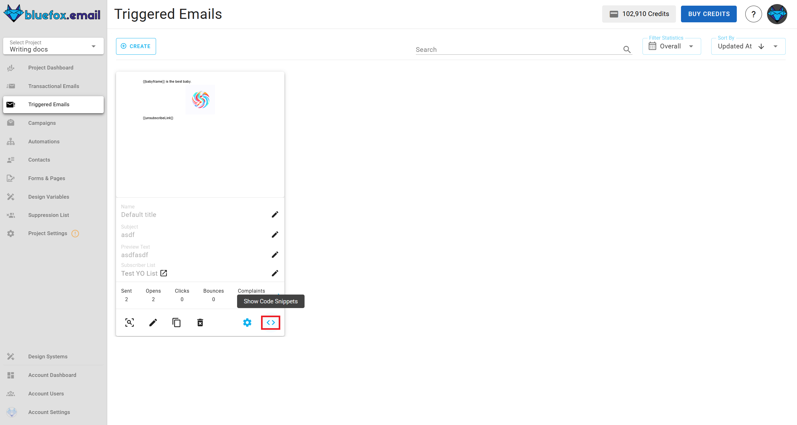

# API

Assuming backend. Where it's possible to do it from the frontend, there we state it clearly.

## Subscribe

[Quick guide](/docs/projects/subscriber-lists.html#subscriber-list-integration)

In order to subscribe a user to a [subscriber list](/docs/projects/subscriber-lists), you have to use the following URL pattern:
```
https://api.bluefox.email/v1/accounts/##YOUR_WORKSPACE_ID##/projects/##YOUR_PROJECT_ID##/subscriber-lists/##YOUR_SUBSCRIBER_LIST_ID##/subscribers/subscribe
```

You need to replace the following strings with yours:
 - `##YOUR_WORKSPACE_ID##`
 - `##YOUR_PROJECT_ID##`
 - `##YOUR_SUBSCRIBER_LIST_ID##`
 - `##YOUR_API_KEY##`

You can find the ids that you need to replace if you click on the code guide button in a subscriber list:


In the code guide dialog the aformentioned values will automatically applied, if you copy those code snippets, you only have to replace the `##YOUR_API_KEY##` string.


Request body:
```json
{
  "name": "Jon Doe",
  "email": "jon@doe.com"
}
```

cUrl:
```bash
 curl -X POST "https://api.bluefox.email/v1/accounts/##YOUR_WORKSPACE_ID##/projects/##YOUR_PROJECT_ID##/subscriber-lists/##YOUR_SUBSCRIBER_LIST_ID##/subscribers/subscribe" -H "Content-Type: application/json" -H "Authorization: Bearer ##YOUR_API_KEY##" -d '{"name": "Jon Doe", "email": "jon@doe.com"}'
```

Javascript:
```javascript
const url = 'https://api.bluefox.email/v1/accounts/##YOUR_WORKSPACE_ID##/projects/##YOUR_PROJECT_ID##/subscriber-lists/##YOUR_SUBSCRIBER_LIST_ID##/subscribers/subscribe'

const response = await fetch(url, {
  method: 'POST',
  headers: {
    'Content-Type': 'application/json',
    'Authorization': 'Bearer ##YOUR_APIKEY##'
  },
  body: JSON.stringify({
    name: 'Jon Doe',
    email: 'jon@doe.com'
  })
})
```

PHP:
```php
  $apiKey = "##YOUR_API_KEY##"; // TODO: replace YOUR_APIKEY

  $url = "https://api.bluefox.email/v1/accounts/##YOUR_WORKSPACE_ID##/projects/##YOUR_PROJECT_ID##/subscriber-lists/##YOUR_SUBSCRIBER_LIST_ID##/subscribers/subscribe";

  $data = array(
      'name' => 'userName',
      'email' => 'example@gmail.com'
  );

  $options = array(
      'http' => array(
          'header'  => "Content-Type: application/json\r\n" .
                      "Authorization: Bearer $apiKey\r\n",
          'method'  => 'POST',
          'content' => json_encode($data),
      ),
  );

  $context  = stream_context_create($options);
  $response = file_get_contents($url, false, $context);
```

::: danger Subscribe from the frontend

Never store your API keys on the frontend.

If you wanna subscribe a user from the frontend, remove the `Authorization` header from your request, you will need to add the domain from which you wanna do it to the domain whitelist in [project settings](/docs/projects/settings.html#domain-whitelists).

```javascript
const url = 'https://api.bluefox.email/v1/accounts/##YOUR_WORKSPACE_ID##/projects/##YOUR_PROJECT_ID##/subscriber-lists/##YOUR_SUBSCRIBER_LIST_ID##/subscribers/subscribe'

const response = await fetch(url, {
  method: 'POST',
  headers: {
    'Content-Type': 'application/json',
  },
  body: JSON.stringify({
    name: 'Jon Doe',
    email: 'jon@doe.com'
  })
})
```
:::


## Unsubscribe

[Quick guide](/docs/projects/subscriber-lists.html#subscriber-list-integration)

In order to subscribe a user to a [subscriber list](/docs/projects/subscriber-lists), you have to use the following URL pattern:
```
https://api.bluefox.email/v1/accounts/##YOUR_WORKSPACE_ID##/projects/##YOUR_PROJECT_ID##/subscriber-lists/##YOUR_SUBSCRIBER_LIST_ID##/subscribers/##SUBSCRIBER_EMAIL_ADDRESS##/unsubscribe
```

You need to replace the following strings with yours:
 - `##YOUR_WORKSPACE_ID##`
 - `##YOUR_PROJECT_ID##`
 - `##YOUR_SUBSCRIBER_LIST_ID##`
 - `##SUBSCRIBER_EMAIL_ADDRESS##`
 - `##YOUR_API_KEY##`

You can find the ids that you need to replace if you click on the code guide button in a subscriber list:


In the code guide dialog the aformentioned values will automatically applied, if you copy those code snippets, you only have to replace the `##YOUR_API_KEY##` string.


Requiest body:

none.

cUrl:
```bash
curl -X PATCH "https://api.bluefox.email/v1/accounts/##YOUR_WORKSPACE_ID##/projects/##YOUR_PROJECT_ID##/subscriber-lists/##YOUR_SUBSCRIBER_LIST_ID##/subscribers/##SUBSCRIBER_EMAIL_ADDRESS##/unsubscribe" -H "Content-Type: application/json" -H "Authorization: Bearer ##YOUR_API_KEY##"
```

```javascript
const url = 'https://api.bluefox.email/v1/accounts/##YOUR_WORKSPACE_ID##/projects/##YOUR_PROJECT_ID##/subscriber-lists/##YOUR_SUBSCRIBER_LIST_ID##/subscribers/##SUBSCRIBER_EMAIL_ADDRESS##/unsubscribe'

const response = await fetch(url, {
  method: 'PATCH',
  headers: {
    'Content-Type': 'application/json',
    'Authorization': 'Bearer ##YOUR_API_KEY##'
  }
})
```

PHP:
```php
$apiKey = "##YOUR_API_KEY##";

$url = "https://api.bluefox.email/v1/accounts/##YOUR_WORKSPACE_ID##/projects/##YOUR_PROJECT_ID##/subscriber-lists/##YOUR_SUBSCRIBER_LIST_ID##/subscribers/##SUBSCRIBER_EMAIL_ADDRESS##/unsubscribe";

$options = array(
    "http" => array(
        "header"  => "Content-Type: application/json\r\n" .
                    "Authorization: Bearer $apiKey\r\n",
        "method"  => "PATCH",
    ),
);

$context  = stream_context_create($options);
$response = file_get_contents($url, false, $context);
```

::: danger Unsubscribe from the frontend

Never store your API keys on the frontend.

If you wanna unsubscribe a user from the frontend, remove the `Authorization` header from your request, you will need to add the domain from which you wanna do it to the domain whitelist in [project settings](/docs/projects/settings.html#domain-whitelists).

```javascript
const url = 'https://api.bluefox.email/v1/accounts/##YOUR_WORKSPACE_ID##/projects/##YOUR_PROJECT_ID##/subscriber-lists/##YOUR_SUBSCRIBER_LIST_ID##/subscribers/##SUBSCRIBER_EMAIL_ADDRESS##/unsubscribe'

const response = await fetch(url, {
  method: 'PATCH',
  headers: {
    'Content-Type': 'application/json'
  }
})
```
:::

## Send transactional email
[Quick quide](/docs/projects/transactional-emails.html#transactional-email-integration)

In order to send a [transactional email](/docs/projects/transactional-emails), you have to use the following URL pattern:

```
https://api.bluefox.email/v1/accounts/##YOUR_WORKSPACE_ID##/projects/##YOUR_PROJECT_ID##/transactional-emails/##TRANSACTIONAL_EMAIL_ID##/send
```

You need to replace the following strings with yours:
 - `##YOUR_WORKSPACE_ID##`
 - `##YOUR_PROJECT_ID##`
 - `##TRANSACTIONAL_EMAIL_ID##`
 - `##YOUR_API_KEY##`

You can find the ids that you need to replace if you click on the code guide button on a transactional email card:


In the code guide dialog the aformentioned values will automatically applied, if you copy those code snippets, you only have to replace the ##YOUR_API_KEY## string.


Request body:
```json
{
  "email": "jon@doe.com",
  "data": {
    "example": "example merge tag value"
  }
}
```

You can send personalization data (merge tags) on the `data` object. These are applied by [Handlerbars](https://handlebarsjs.com/) when sent.

cUrl:
```bash
curl -X POST \
"https://api.bluefox.email/v1/accounts/##YOUR_WORKSPACE_ID##/projects/##YOUR_PROJECT_ID##/transactional-emails/##TRANSACTIONAL_EMAIL_ID##/send" \
-H "Content-Type: application/json" \
-H "Authorization: Bearer ##YOUR_API_KEY##" \
-d '{
  "email": "jon@doe.com", // TODO change email address
  "data": {
    // TODO add the merge tags values
  }
}'
```

Javascript:
```javascript
const url = 'https://api.bluefox.email/v1/accounts/##YOUR_WORKSPACE_ID##/projects/##YOUR_PROJECT_ID##/transactional-emails/##TRANSACTIONAL_EMAIL_ID##/send'
const response = await fetch(url, {
  method: 'POST',
  headers: {
    'Content-Type': 'application/json',
    'Authorization': 'Bearer ##YOUR_API_KEY##' // TODO change YOUR_APIKEY
  },
  body: JSON.stringify({
    email: 'jon@doe.com', // TODO change email address
    data: {
    // TODO add the merge tags values
    }
  })
})
```

PHP:
```php
$apiKey = "##YOUR_API_KEY##";

$url = "https://api.bluefox.email/v1/accounts/##YOUR_WORKSPACE_ID##/projects/##YOUR_PROJECT_ID##/transactional-emails/##TRANSACTIONAL_EMAIL_ID##/send";

$email = "example@gmail.com"; // TODO change email address
$data = [
  // TODO add the merge tags values
];

$payload = json_encode([
  "email" => $email,
  "data" => $data
]);

$options = [
  "http" => [
    "header"  => [
      "Content-Type: application/json",
      "Authorization: Bearer $apiKey"
    ],
    "method"  => "POST",
    "content" => $payload,
  ],
];

$context  = stream_context_create($options);
$result = file_get_contents($url, false, $context);
```

## Send triggered email

[Quick quide](/docs/projects/triggered-emails.html#triggered-email-integration)

In order to send a [triggered email](/docs/projects/triggered-emails), you have to use the following URL pattern:

```
https://api.bluefox.email/v1/accounts/##YOUR_WORKSPACE_ID##/projects/##YOUR_PROJECT_ID##/triggered-emails/##TRIGGERED_EMAIL_ID##/send
```

You need to replace the following strings with yours:
 - `##YOUR_WORKSPACE_ID##`
 - `##YOUR_PROJECT_ID##`
 - `##TRIGGERED_EMAIL_ID##`
 - `##YOUR_API_KEY##`

You can find the ids that you need to replace if you click on the code guide button on a triggered email card:


In the code guide dialog the aformentioned values will automatically applied, if you copy those code snippets, you only have to replace the ##YOUR_API_KEY## string.


Request body:
```json
{
  "emails": ["jon@doe.com"],
  "data": {
    "example": "example merge tag value"
  }
}
```

You can send personalization data (merge tags) on the `data` object. These are applied by [Handlerbars](https://handlebarsjs.com/) when sent.

cUrl:
```bash
curl -X POST \
"https://api.bluefox.email/v1/accounts/##YOUR_WORKSPACE_ID##/projects/##YOUR_PROJECT_ID##/triggered-emails/##TRIGGERED_EMAIL_ID##/send" \
-H "Content-Type: application/json" \
-H "Authorization: Bearer ##YOUR_API_KEY##" \
-d '{
  "emails": ["jon@doe.com"], // TODO change email addresses
  "data": {
    // TODO add the merge tags values
  }
}'
```

Javascript:
```javascript
const url = 'https://api.bluefox.email/v1/accounts/##YOUR_WORKSPACE_ID##/projects/##YOUR_PROJECT_ID##/triggered-emails/##TRIGGERED_EMAIL_ID##/send'
const response = await fetch(url, {
  method: 'POST',
  headers: {
    'Content-Type': 'application/json',
    'Authorization': 'Bearer ##YOUR_API_KEY##' // TODO change YOUR_APIKEY
  },
  body: JSON.stringify({
    emails: ['jon@doe.com'], // TODO change email address
    data: {
    // TODO add the merge tags values
    }
  })
})
```

PHP:
```php
$apiKey = "##YOUR_API_KEY##";

$url = "https://api.bluefox.email/v1/accounts/##YOUR_WORKSPACE_ID##/projects/##YOUR_PROJECT_ID##/triggered-emails/##TRIGGERED_EMAIL_ID##/send";

$emails = ["jon@doe.com"]; // TODO change email addresses
$data = [
  // TODO add the merge tags values
];

$payload = json_encode([
  "emails" => $emails,
  "data" => $data
]);

$options = [
  "http" => [
    "header"  => [
      "Content-Type: application/json",
      "Authorization: Bearer $apiKey"
    ],
    "method"  => "POST",
    "content" => $payload,
  ],
];

$context  = stream_context_create($options);
$result = file_get_contents($url, false, $context);
```
