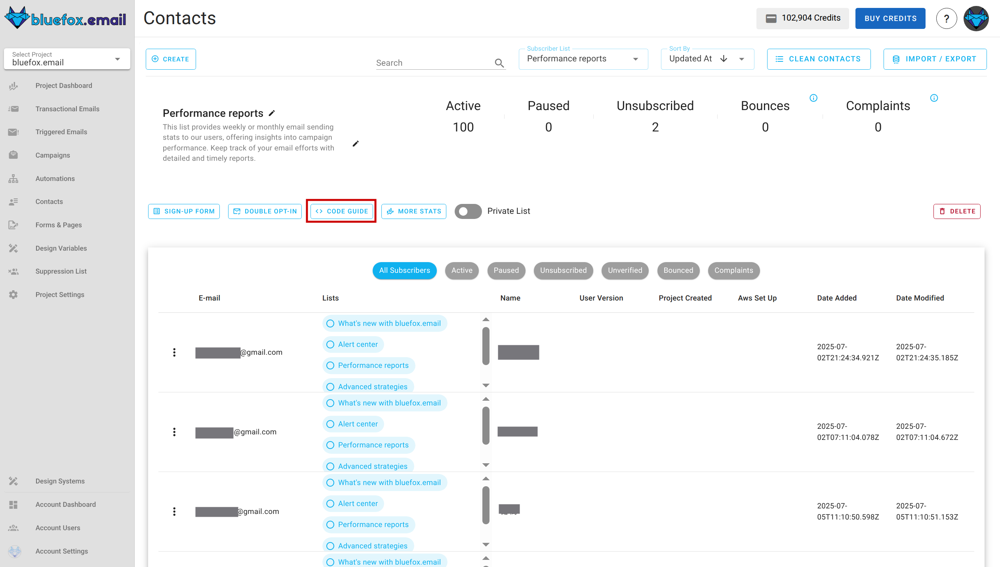
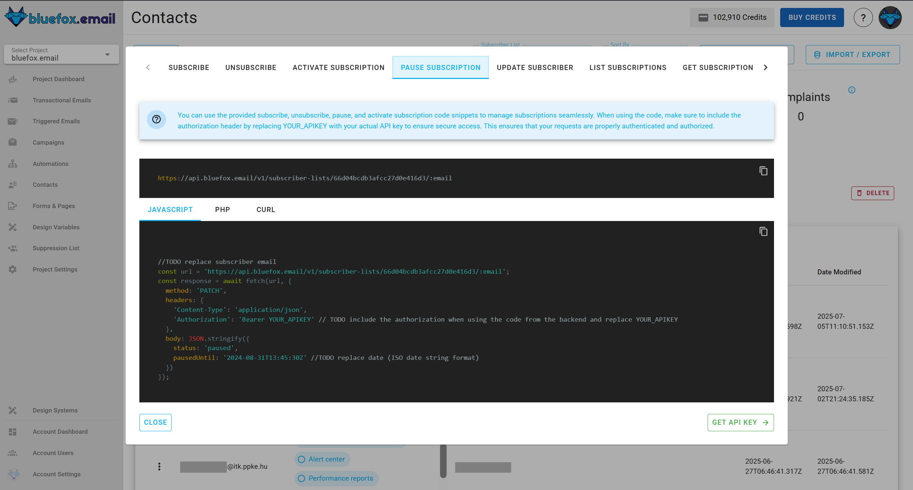
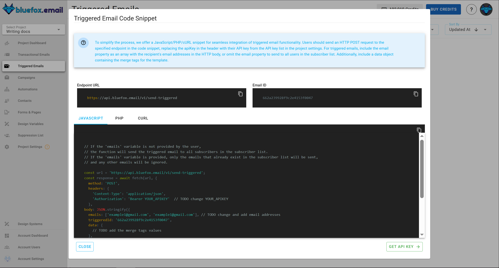

# API

This guide is for using the API from the backend. If it is possible to do it from the frontend, we will mention it clearly.

## Subscribe

[Quick guide](/docs/projects/subscriber-lists.html#subscriber-list-integration)

To subscribe a user to a [subscriber list](/docs/projects/subscriber-lists), use the following URL pattern:

```
https://api.bluefox.email/v1/subscriber-lists/##YOUR_SUBSCRIBER_LIST_ID##
```

Replace the placeholders with your specific information:
- `##YOUR_SUBSCRIBER_LIST_ID##`
- `##YOUR_API_KEY##`

You can find the IDs to replace by clicking on the code guide button in a subscriber list:



In the code guide dialog, these values are automatically filled in. If you copy the code snippets, you only need to replace the `##YOUR_API_KEY##`.


**Request Body:**
```json
{
  "name": "Jon Doe",
  "email": "jon@doe.com"
}
```

**cUrl**:
```bash
 curl -X POST "https://api.bluefox.email/v1/subscriber-lists/##YOUR_SUBSCRIBER_LIST_ID##" -H "Content-Type: application/json" -H "Authorization: Bearer ##YOUR_API_KEY##" -d '{"name": "Jon Doe", "email": "jon@doe.com"}'
```

**Javascript**:
```javascript
const url = 'https://api.bluefox.email/v1/subscriber-lists/##YOUR_SUBSCRIBER_LIST_ID##'

const response = await fetch(url, {
  method: 'POST',
  headers: {
    'Content-Type': 'application/json',
    'Authorization': 'Bearer ##YOUR_APIKEY##'
  },
  body: JSON.stringify({
    name: 'Jon Doe',
    email: 'jon@doe.com'
  })
})
```

**PHP**:
```php
  $apiKey = "##YOUR_API_KEY##"; // TODO: replace YOUR_APIKEY

  $url = "https://api.bluefox.email/v1/subscriber-lists/##YOUR_SUBSCRIBER_LIST_ID##";

  $data = array(
      'name' => 'userName',
      'email' => 'example@gmail.com'
  );

  $options = array(
      'http' => array(
          'header'  => "Content-Type: application/json\r\n" .
                      "Authorization: Bearer $apiKey\r\n",
          'method'  => 'POST',
          'content' => json_encode($data),
      ),
  );

  $context  = stream_context_create($options);
  $response = file_get_contents($url, false, $context);
```

::: danger Subscribe from the frontend

Never store your API keys in the frontend code.

If you want to subscribe a user from the frontend, remove the `Authorization` header from your request. You will need to add the domain you are using to the domain whitelist in [project settings](/docs/projects/settings.html#domain-whitelists).

```javascript
const url = 'https://api.bluefox.email/v1/subscriber-lists/##YOUR_SUBSCRIBER_LIST_ID##'

const response = await fetch(url, {
  method: 'POST',
  headers: {
    'Content-Type': 'application/json',
  },
  body: JSON.stringify({
    name: 'Jon Doe',
    email: 'jon@doe.com'
  })
})
```
:::


## Unsubscribe

[Quick guide](/docs/projects/subscriber-lists.html#subscriber-list-integration)

To unsubscribe a user from a [subscriber list](/docs/projects/subscriber-lists), use the following URL pattern:
```
https://api.bluefox.email/v1/subscriber-lists/##YOUR_SUBSCRIBER_LIST_ID##/##SUBSCRIBER_EMAIL_ADDRESS##
```

Replace the placeholders with your specific information:
 - `##YOUR_SUBSCRIBER_LIST_ID##`
 - `##SUBSCRIBER_EMAIL_ADDRESS##`
 - `##YOUR_API_KEY##`

You can find the IDs to replace by clicking on the code guide button in a subscriber list:


In the code guide dialog, these values are automatically filled in. If you copy the code snippets, you need to replace the `##YOUR_API_KEY##` and `##SUBSCRIBER_EMAIL_ADDRESS##`.


**Requiest body**:
```json
{
  "status": "unsubscribed"
}
```


**cUrl**:
```bash
curl -X PATCH "https://api.bluefox.email/v1/subscriber-lists/##YOUR_SUBSCRIBER_LIST_ID##/##SUBSCRIBER_EMAIL_ADDRESS##" -H "Content-Type: application/json" -H "Authorization: Bearer ##YOUR_API_KEY##" -d '{"status": "unsubscribed"}'
```

**Javascript**:
```javascript
const url = 'https://api.bluefox.email/v1/subscriber-lists/##YOUR_SUBSCRIBER_LIST_ID##/##SUBSCRIBER_EMAIL_ADDRESS##'

const response = await fetch(url, {
  method: 'PATCH',
  headers: {
    'Content-Type': 'application/json',
    'Authorization': 'Bearer ##YOUR_API_KEY##'
  },
  body: JSON.stringify({
    status: 'unsubscribed'
  })
})
```

**PHP**:
```php
$apiKey = "##YOUR_API_KEY##";

$url = "https://api.bluefox.email/v1/subscriber-lists/##YOUR_SUBSCRIBER_LIST_ID##/##SUBSCRIBER_EMAIL_ADDRESS##";

$data = array(
    'status' => 'unsubscribed'
);

$options = array(
    "http" => array(
        "header"  => "Content-Type: application/json\r\n" .
                    "Authorization: Bearer $apiKey\r\n",
        "method"  => "PATCH",
        'content' => json_encode($data),
    ),
);

$context  = stream_context_create($options);
$response = file_get_contents($url, false, $context);
```

::: danger Unsubscribe from the frontend

Never store your API keys in the frontend code.

If you want to unsubscribe a user from the frontend, remove the `Authorization` header from your request. You will need to add the domain you are using to the domain whitelist in [project settings](/docs/projects/settings.html#domain-whitelists).

```javascript
const url = 'https://api.bluefox.email/v1/subscriber-lists/##YOUR_SUBSCRIBER_LIST_ID##/##SUBSCRIBER_EMAIL_ADDRESS##'

const response = await fetch(url, {
  method: 'PATCH',
  headers: {
    'Content-Type': 'application/json'
  },
  body: JSON.stringify({
    status: 'unsubscribed'
  })
})
```
:::

## Activate Subscription

[Quick guide](/docs/projects/subscriber-lists.html#subscriber-list-integration)

To activate a user from a [subscriber list](/docs/projects/subscriber-lists), use the following URL pattern:
```
https://api.bluefox.email/v1/subscriber-lists/##YOUR_SUBSCRIBER_LIST_ID##/##SUBSCRIBER_EMAIL_ADDRESS##
```

Replace the placeholders with your specific information:
 - `##YOUR_SUBSCRIBER_LIST_ID##`
 - `##SUBSCRIBER_EMAIL_ADDRESS##`
 - `##YOUR_API_KEY##`

You can find the IDs to replace by clicking on the code guide button in a subscriber list:


In the code guide dialog, these values are automatically filled in. If you copy the code snippets, you need to replace the `##YOUR_API_KEY##` and `##SUBSCRIBER_EMAIL_ADDRESS##`.


**Requiest body**:
```json
{
  "status": "active"
}
```


**cUrl**:
```bash
curl -X PATCH "https://api.bluefox.email/v1/subscriber-lists/##YOUR_SUBSCRIBER_LIST_ID##/##SUBSCRIBER_EMAIL_ADDRESS##" -H "Content-Type: application/json" -H "Authorization: Bearer ##YOUR_API_KEY##" -d '{"status": "active"}'
```

**Javascript**:
```javascript
const url = 'https://api.bluefox.email/v1/subscriber-lists/##YOUR_SUBSCRIBER_LIST_ID##/##SUBSCRIBER_EMAIL_ADDRESS##'

const response = await fetch(url, {
  method: 'PATCH',
  headers: {
    'Content-Type': 'application/json',
    'Authorization': 'Bearer ##YOUR_API_KEY##'
  },
  body: JSON.stringify({
    status: 'active'
  })
})
```

**PHP**:
```php
$apiKey = "##YOUR_API_KEY##";

$url = "https://api.bluefox.email/v1/subscriber-lists/##YOUR_SUBSCRIBER_LIST_ID##/##SUBSCRIBER_EMAIL_ADDRESS##";

$data = array(
    'status' => 'active'
);

$options = array(
    "http" => array(
        "header"  => "Content-Type: application/json\r\n" .
                    "Authorization: Bearer $apiKey\r\n",
        "method"  => "PATCH",
        'content' => json_encode($data),
    ),
);

$context  = stream_context_create($options);
$response = file_get_contents($url, false, $context);
```

::: danger Activate Subscription from the frontend

Never store your API keys in the frontend code.

If you want to active a user from the frontend, remove the `Authorization` header from your request. You will need to add the domain you are using to the domain whitelist in [project settings](/docs/projects/settings.html#domain-whitelists).

```javascript
const url = 'https://api.bluefox.email/v1/subscriber-lists/##YOUR_SUBSCRIBER_LIST_ID##/##SUBSCRIBER_EMAIL_ADDRESS##'

const response = await fetch(url, {
  method: 'PATCH',
  headers: {
    'Content-Type': 'application/json'
  },
  body: JSON.stringify({
    status: 'active'
  })
})
```
:::

## Pause Subscription

[Quick guide](/docs/projects/subscriber-lists.html#subscriber-list-integration)

To pause a user from a [subscriber list](/docs/projects/subscriber-lists), use the following URL pattern:
```
https://api.bluefox.email/v1/subscriber-lists/##YOUR_SUBSCRIBER_LIST_ID##/##SUBSCRIBER_EMAIL_ADDRESS##
```

Replace the placeholders with your specific information:
 - `##YOUR_SUBSCRIBER_LIST_ID##`
 - `##SUBSCRIBER_EMAIL_ADDRESS##`
 - `##YOUR_API_KEY##`
 - `##PAUSED_UNTIL##`

You can find the IDs to replace by clicking on the code guide button in a subscriber list:


In the code guide dialog, these values are automatically filled in. If you copy the code snippets, you need to replace the `##YOUR_API_KEY##`, `##SUBSCRIBER_EMAIL_ADDRESS##` and `##PAUSED_UNTIL##`.



**Requiest body**:
```json
{
  "status": "paused",
  "pausedUntil": "##PAUSED_UNTIL##" //TODO replace date (ISO date string format)
}
```


**cUrl**:
```bash
curl -X PATCH "https://api.bluefox.email/v1/subscriber-lists/##YOUR_SUBSCRIBER_LIST_ID##/##SUBSCRIBER_EMAIL_ADDRESS##" -H "Content-Type: application/json" -H "Authorization: Bearer ##YOUR_API_KEY##" -d '{"status": "paused", "pausedUntil": "##PAUSED_UNTIL##" }'
```

**Javascript**:
```javascript
const url = 'https://api.bluefox.email/v1/subscriber-lists/##YOUR_SUBSCRIBER_LIST_ID##/##SUBSCRIBER_EMAIL_ADDRESS##'

const response = await fetch(url, {
  method: 'PATCH',
  headers: {
    'Content-Type': 'application/json',
    'Authorization': 'Bearer ##YOUR_API_KEY##'
  },
  body: JSON.stringify({
    status: 'paused',
    pausedUntil: '##PAUSED_UNTIL##'
  })
})
```

**PHP**:
```php
$apiKey = "##YOUR_API_KEY##";

$url = "https://api.bluefox.email/v1/subscriber-lists/##YOUR_SUBSCRIBER_LIST_ID##/##SUBSCRIBER_EMAIL_ADDRESS##";

$data = array(
    'status' => 'paused',
    'pausedUntil' => '##PAUSED_UNTIL##'
);

$options = array(
    "http" => array(
        "header"  => "Content-Type: application/json\r\n" .
                    "Authorization: Bearer $apiKey\r\n",
        "method"  => "PATCH",
        'content' => json_encode($data),
    ),
);

$context  = stream_context_create($options);
$response = file_get_contents($url, false, $context);
```

::: danger Pause Subscription from the frontend

Never store your API keys in the frontend code.

If you want to pause a user from the frontend, remove the `Authorization` header from your request. You will need to add the domain you are using to the domain whitelist in [project settings](/docs/projects/settings.html#domain-whitelists).

```javascript
const url = 'https://api.bluefox.email/v1/subscriber-lists/##YOUR_SUBSCRIBER_LIST_ID##/##SUBSCRIBER_EMAIL_ADDRESS##'

const response = await fetch(url, {
  method: 'PATCH',
  headers: {
    'Content-Type': 'application/json'
  },
  body: JSON.stringify({
    status: 'paused',
    pausedUntil: '##PAUSED_UNTIL##'
  })
})
```
:::

## List Subscribers

[Quick guide](/docs/projects/subscriber-lists.html#subscriber-list-integration)

To list users from a [subscriber list](/docs/projects/subscriber-lists), use the following URL pattern:
```
https://api.bluefox.email/v1/subscriber-lists/##YOUR_SUBSCRIBER_LIST_ID##
```

Replace the placeholders with your specific information:
 - `##YOUR_SUBSCRIBER_LIST_ID##`
 - `##YOUR_API_KEY##`

You can find the IDs to replace by clicking on the code guide button in a subscriber list:


In the code guide dialog, these values are automatically filled in. If you copy the code snippets, you need to replace the `##YOUR_API_KEY##`.


**Requiest body**:

none.


**cUrl**:
```bash
curl -X GET "https://api.bluefox.email/v1/subscriber-lists/##YOUR_SUBSCRIBER_LIST_ID##" -H "Content-Type: application/json" -H "Authorization: Bearer ##YOUR_API_KEY##"
```

**Javascript**:
```javascript
const url = 'https://api.bluefox.email/v1/subscriber-lists/##YOUR_SUBSCRIBER_LIST_ID##'

const response = await fetch(url, {
  method: 'GET',
  headers: {
    'Content-Type': 'application/json',
    'Authorization': 'Bearer ##YOUR_API_KEY##'
  }
})
```

**PHP**:
```php
$apiKey = "##YOUR_API_KEY##";

$url = "https://api.bluefox.email/v1/subscriber-lists/##YOUR_SUBSCRIBER_LIST_ID##";

$options = array(
    "http" => array(
        "header"  => "Content-Type: application/json\r\n" .
                    "Authorization: Bearer $apiKey\r\n",
        "method"  => "GET"
    ),
);

$context  = stream_context_create($options);
$response = file_get_contents($url, false, $context);
```

::: danger List Subscribers from the frontend

Never store your API keys in the frontend code.

If you want to list subscribers from the frontend, remove the `Authorization` header from your request. You will need to add the domain you are using to the domain whitelist in [project settings](/docs/projects/settings.html#domain-whitelists).

```javascript
const url = 'https://api.bluefox.email/v1/subscriber-lists/##YOUR_SUBSCRIBER_LIST_ID##'

const response = await fetch(url, {
  method: 'GET',
  headers: {
    'Content-Type': 'application/json'
  }
})
```
:::

## Get Subscriber

[Quick guide](/docs/projects/subscriber-lists.html#subscriber-list-integration)

To get user from a [subscriber list](/docs/projects/subscriber-lists), use the following URL pattern:
```
https://api.bluefox.email/v1/subscriber-lists/##YOUR_SUBSCRIBER_LIST_ID##/##SUBSCRIBER_EMAIL_ADDRESS##
```

Replace the placeholders with your specific information:
 - `##YOUR_SUBSCRIBER_LIST_ID##`
 - `##SUBSCRIBER_EMAIL_ADDRESS##`
 - `##YOUR_API_KEY##`

You can find the IDs to replace by clicking on the code guide button in a subscriber list:


In the code guide dialog, these values are automatically filled in. If you copy the code snippets, you need to replace the `##YOUR_API_KEY##` and `##SUBSCRIBER_EMAIL_ADDRESS##`.


**Requiest body**:

none.


**cUrl**:
```bash
curl -X GET "https://api.bluefox.email/v1/subscriber-lists/##YOUR_SUBSCRIBER_LIST_ID##/##SUBSCRIBER_EMAIL_ADDRESS##" -H "Content-Type: application/json" -H "Authorization: Bearer ##YOUR_API_KEY##"
```

**Javascript**:
```javascript
const url = 'https://api.bluefox.email/v1/subscriber-lists/##YOUR_SUBSCRIBER_LIST_ID##/##SUBSCRIBER_EMAIL_ADDRESS##'

const response = await fetch(url, {
  method: 'GET',
  headers: {
    'Content-Type': 'application/json',
    'Authorization': 'Bearer ##YOUR_API_KEY##'
  }
})
```

**PHP**:
```php
$apiKey = "##YOUR_API_KEY##";

$url = "https://api.bluefox.email/v1/subscriber-lists/##YOUR_SUBSCRIBER_LIST_ID##/##SUBSCRIBER_EMAIL_ADDRESS##";

$options = array(
    "http" => array(
        "header"  => "Content-Type: application/json\r\n" .
                    "Authorization: Bearer $apiKey\r\n",
        "method"  => "GET"
    ),
);

$context  = stream_context_create($options);
$response = file_get_contents($url, false, $context);
```

::: danger List Subscribers from the frontend

Never store your API keys in the frontend code.

If you want to list subscribers from the frontend, remove the `Authorization` header from your request. You will need to add the domain you are using to the domain whitelist in [project settings](/docs/projects/settings.html#domain-whitelists).

```javascript
const url = 'https://api.bluefox.email/v1/subscriber-lists/##YOUR_SUBSCRIBER_LIST_ID##/##SUBSCRIBER_EMAIL_ADDRESS##'

const response = await fetch(url, {
  method: 'GET',
  headers: {
    'Content-Type': 'application/json'
  }
})
```
:::

## Send transactional email
[Quick quide](/docs/projects/transactional-emails.html#transactional-email-integration)

To send a [transactional email](/docs/projects/transactional-emails), use the following URL pattern:

```
https://api.bluefox.email/v1/send-transactional
```

Replace the placeholders with your specific information:
 - `##EMAIL_ID##`
 - `##YOUR_API_KEY##`

You can find the IDs to replace by clicking on the code guide button on a transactional email card:


In the code guide dialog, these values are automatically filled in. If you copy the code snippets, you need to replace the `##YOUR_API_KEY##`.


**Request body**:
```json
{
  "email": "jon@doe.com",
  "transactionalId": "##EMAIL_ID##",
  "data": {
    "example": "example merge tag value"
  }
}
```

You can include personalization data (merge tags) in the data object. These tags are processed by [Handlebars](https://handlebarsjs.com/) when sent.


**cUrl**:
```bash
curl -X POST \
"https://api.bluefox.email/v1/send-transactional" \
-H "Content-Type: application/json" \
-H "Authorization: Bearer ##YOUR_API_KEY##" \
-d '{
  "email": "jon@doe.com", // TODO change email address
  "transactionalId": "##EMAIL_ID##",
  "data": {
    // TODO add the merge tags values
  }
}'
```

**Javascript**:
```javascript
const url = 'https://api.bluefox.email/v1/send-transactional'
const response = await fetch(url, {
  method: 'POST',
  headers: {
    'Content-Type': 'application/json',
    'Authorization': 'Bearer ##YOUR_API_KEY##' // TODO change YOUR_APIKEY
  },
  body: JSON.stringify({
    email: 'jon@doe.com', // TODO change email address
    transactionalId: '##EMAIL_ID##',
    data: {
    // TODO add the merge tags values
    }
  })
})
```

**PHP**:
```php
$apiKey = "##YOUR_API_KEY##";

$url = "https://api.bluefox.email/v1/send-transactional";

$email = "example@gmail.com"; // TODO change email address
$transactionalId = "##EMAIL_ID##";
$data = [
  // TODO add the merge tags values
];

$payload = json_encode([
  "email" => $email,
  "transactionalId" => $transactionalId,
  "data" => $data
]);

$options = [
  "http" => [
    "header"  => [
      "Content-Type: application/json",
      "Authorization: Bearer $apiKey"
    ],
    "method"  => "POST",
    "content" => $payload,
  ],
];

$context  = stream_context_create($options);
$result = file_get_contents($url, false, $context);
```

## Send triggered email

[Quick quide](/docs/projects/triggered-emails.html#triggered-email-integration)

To send a [triggered email](/docs/projects/triggered-emails),  use the following URL pattern:

```
https://api.bluefox.email/v1/send-triggered
```

Replace the placeholders with your specific information:
 - `##EMAIL_ID##`
 - `##YOUR_API_KEY##`

You can find the IDs to replace by clicking on the code guide button on a triggered email card:


In the code guide dialog, these values are automatically filled in. If you copy the code snippets, you need to replace the `##YOUR_API_KEY##`.



Request body:
```json
{
  "emails": ["jon@doe.com"],
  "triggeredId": "##EMAIL_ID##",
  "data": {
    "example": "example merge tag value"
  }
}
```

You can include personalization data (merge tags) in the data object. These tags are processed by [Handlebars](https://handlebarsjs.com/) when sent.

**cUrl**:
```bash
curl -X POST \
"https://api.bluefox.email/v1/send-triggered" \
-H "Content-Type: application/json" \
-H "Authorization: Bearer ##YOUR_API_KEY##" \
-d '{
  "emails": ["jon@doe.com"], // TODO change email addresses
  "triggeredId": ##EMAIL_ID##,
  "data": {
    // TODO add the merge tags values
  }
}'
```

**Javascript**:
```javascript
const url = 'https://api.bluefox.email/v1/send-triggered'
const response = await fetch(url, {
  method: 'POST',
  headers: {
    'Content-Type': 'application/json',
    'Authorization': 'Bearer ##YOUR_API_KEY##' // TODO change YOUR_APIKEY
  },
  body: JSON.stringify({
    emails: ['jon@doe.com'], // TODO change email address
    triggeredId: "##EMAIL_ID##",
    data: {
    // TODO add the merge tags values
    }
  })
})
```

**PHP**:
```php
$apiKey = "##YOUR_API_KEY##";

$url = "https://api.bluefox.email/v1/send-triggered";

$emails = ["jon@doe.com"]; // TODO change email addresses
$triggeredId = "##EMAIL_ID##"
$data = [
  // TODO add the merge tags values
];

$payload = json_encode([
  "emails" => $emails,
  "triggeredId" => $triggeredId,
  "data" => $data
]);

$options = [
  "http" => [
    "header"  => [
      "Content-Type: application/json",
      "Authorization: Bearer $apiKey"
    ],
    "method"  => "POST",
    "content" => $payload,
  ],
];

$context  = stream_context_create($options);
$result = file_get_contents($url, false, $context);
```
