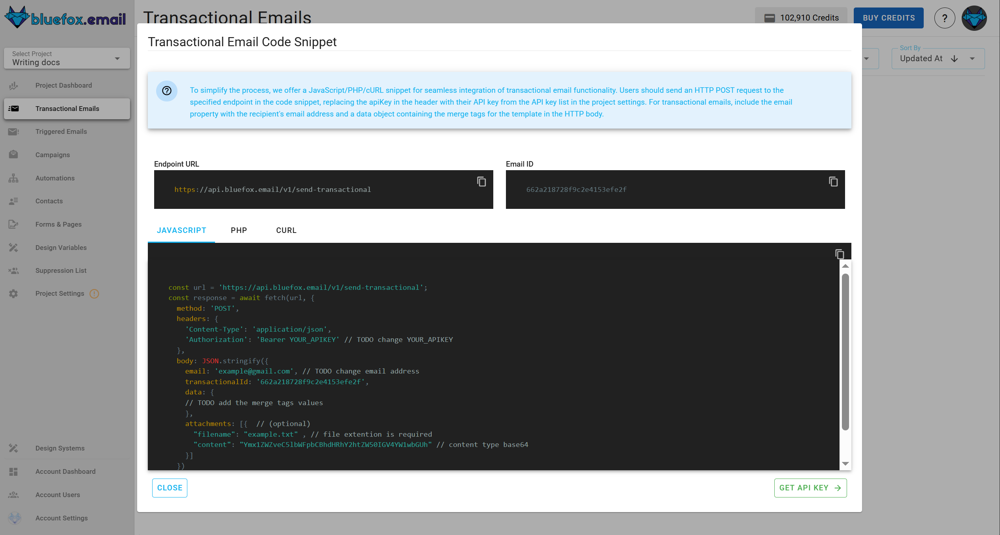

# Send Transactional Email
[Quick guide](/docs/projects/transactional-emails.html#transactional-email-integration)

To send a [transactional email](/docs/projects/transactional-emails), use the following URL pattern:

```
https://api.bluefox.email/v1/send-transactional
```

Replace the placeholders with your specific information:
- `##EMAIL_ID##`
- `##YOUR_API_KEY##`

You can find the required IDs by clicking the **Code Guide** button on a transactional email card:


In the **Code Guide** dialog, these values are automatically filled in. If you copy the code snippets, make sure to replace `##YOUR_API_KEY##`.



## Request Body
```json
{
  "email": "jon@doe.com",
  "transactionalId": "##EMAIL_ID##",
  "data": {
    "example": "example merge tag value"
  },
  "attachments": [] // optional
}
```

You can include personalization data (merge tags) in the `data` object. These tags are processed by [Handlebars](https://handlebarsjs.com/) when the email is sent.

## cURL Example
```bash
curl -X POST \
"https://api.bluefox.email/v1/send-transactional" \
-H "Content-Type: application/json" \
-H "Authorization: Bearer ##YOUR_API_KEY##" \
-d '{
  "email": "jon@doe.com", // TODO: Change email address
  "transactionalId": "##EMAIL_ID##",
  "data": {
    // TODO: Add merge tag values
  }
}'
```

## JavaScript Example
```javascript
const url = 'https://api.bluefox.email/v1/send-transactional';

const response = await fetch(url, {
  method: 'POST',
  headers: {
    'Content-Type': 'application/json',
    'Authorization': 'Bearer ##YOUR_API_KEY##' // TODO: Replace ##YOUR_API_KEY##
  },
  body: JSON.stringify({
    email: 'jon@doe.com', // TODO: Change email address
    transactionalId: '##EMAIL_ID##',
    data: {
      // TODO: Add merge tag values
    }
  })
});
```

## PHP Example
```php
$apiKey = "##YOUR_API_KEY##";

$url = "https://api.bluefox.email/v1/send-transactional";

$email = "example@gmail.com"; // TODO: Change email address
$transactionalId = "##EMAIL_ID##";
$data = [
  // TODO: Add merge tag values
];

$payload = json_encode([
  "email" => $email,
  "transactionalId" => $transactionalId,
  "data" => $data
]);

$options = [
  "http" => [
    "header"  => [
      "Content-Type: application/json",
      "Authorization: Bearer $apiKey"
    ],
    "method"  => "POST",
    "content" => $payload,
  ],
];

$context  = stream_context_create($options);
$result = file_get_contents($url, false, $context);
```


## API Responses  

| Code | Name                 | Message                                      | Description                                            | JSON Response Example |
|------|----------------------|----------------------------------------------|--------------------------------------------------------|-----------------------|
| 200  | -                    | -                                            | The request was successfully processed.                | ```json { "status": 200 , "result": {"success": true} } ``` |
| 400  | `VALIDATION_ERROR`   | Project Email AWS configurations not found.  | Missing AWS configurations in project.                 | ```json { "status": 400, "error": {"name": "VALIDATION_ERROR", "message": "Project Email AWS configurations not found."} } ``` |
| 400  | `VALIDATION_ERROR`   | Missing required parameters: `email` and `transactionalId`. | The request is missing mandatory fields for processing. | ```json { "status": 400, "error": {"name": "VALIDATION_ERROR", "message": "Missing required parameters: email and transactionalId."}} ``` |
| 405  | `METHOD_NOT_ALLOWED` | Insufficient credits available.              | Occurs when the account lacks the necessary credits to send an email. | ```json { "status": 405 , "error": {"name": "METHOD_NOT_ALLOWED", "message": "Insufficient credits available."} } ``` |
| 405  | `METHOD_NOT_ALLOWED` | The provided email has been flagged due to bouncing. If this is incorrect and the email is valid, please contact support. | The email address has been marked as undeliverable due to previous failed delivery attempts. | ```json { "status": 405,  "error": {"name": "METHOD_NOT_ALLOWED", "message": "The provided email has been flagged due to bouncing. If this is incorrect and the email is valid, please contact support."} } ``` |
