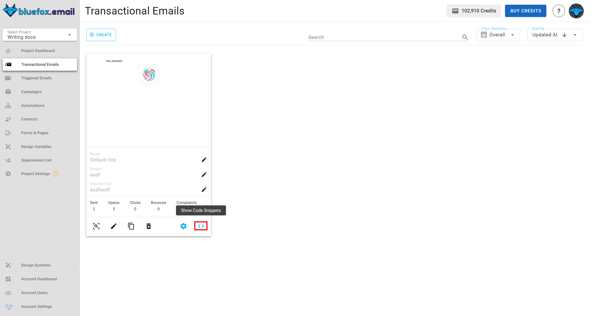

# Send transactional email
[Quick quide](/docs/projects/transactional-emails.html#transactional-email-integration)

To send a [transactional email](/docs/projects/transactional-emails), use the following URL pattern:

```
https://api.bluefox.email/v1/send-transactional
```

Replace the placeholders with your specific information:
 - `##EMAIL_ID##`
 - `##YOUR_API_KEY##`

You can find the IDs to replace by clicking on the code guide button on a transactional email card:


In the code guide dialog, these values are automatically filled in. If you copy the code snippets, you need to replace the `##YOUR_API_KEY##`.


**Request body**:
```json
{
  "email": "jon@doe.com",
  "transactionalId": "##EMAIL_ID##",
  "data": {
    "example": "example merge tag value"
  },
  "attachments": [] //optional
}
```

You can include personalization data (merge tags) in the data object. These tags are processed by [Handlebars](https://handlebarsjs.com/) when sent.


**cUrl**:
```bash
curl -X POST \
"https://api.bluefox.email/v1/send-transactional" \
-H "Content-Type: application/json" \
-H "Authorization: Bearer ##YOUR_API_KEY##" \
-d '{
  "email": "jon@doe.com", // TODO change email address
  "transactionalId": "##EMAIL_ID##",
  "data": {
    // TODO add the merge tags values
  }
}'
```

**Javascript**:
```javascript
const url = 'https://api.bluefox.email/v1/send-transactional'
const response = await fetch(url, {
  method: 'POST',
  headers: {
    'Content-Type': 'application/json',
    'Authorization': 'Bearer ##YOUR_API_KEY##' // TODO change YOUR_APIKEY
  },
  body: JSON.stringify({
    email: 'jon@doe.com', // TODO change email address
    transactionalId: '##EMAIL_ID##',
    data: {
    // TODO add the merge tags values
    }
  })
})
```

**PHP**:
```php
$apiKey = "##YOUR_API_KEY##";

$url = "https://api.bluefox.email/v1/send-transactional";

$email = "example@gmail.com"; // TODO change email address
$transactionalId = "##EMAIL_ID##";
$data = [
  // TODO add the merge tags values
];

$payload = json_encode([
  "email" => $email,
  "transactionalId" => $transactionalId,
  "data" => $data
]);

$options = [
  "http" => [
    "header"  => [
      "Content-Type: application/json",
      "Authorization: Bearer $apiKey"
    ],
    "method"  => "POST",
    "content" => $payload,
  ],
];

$context  = stream_context_create($options);
$result = file_get_contents($url, false, $context);
```
