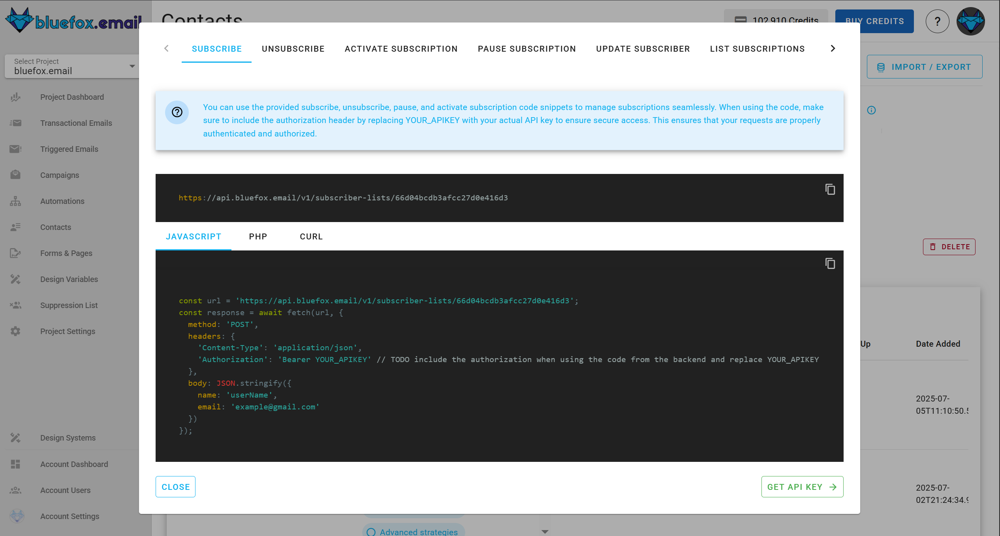
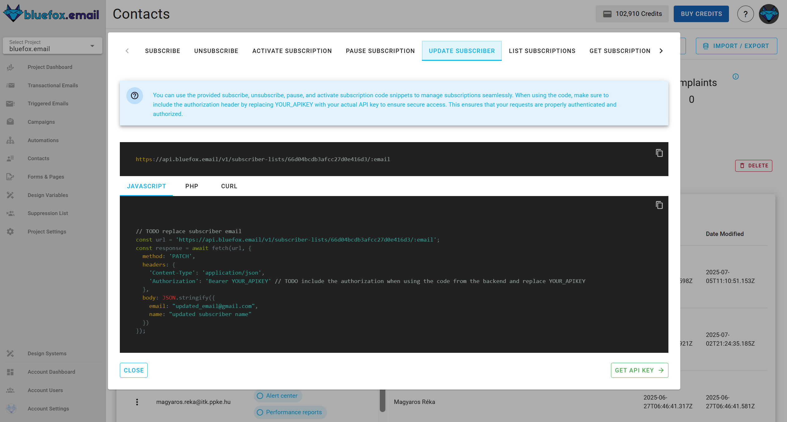
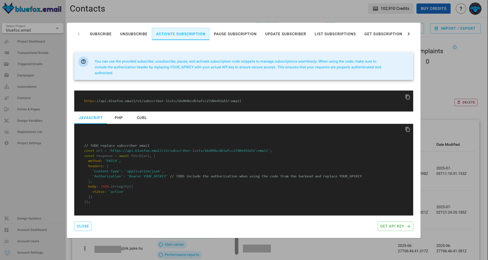
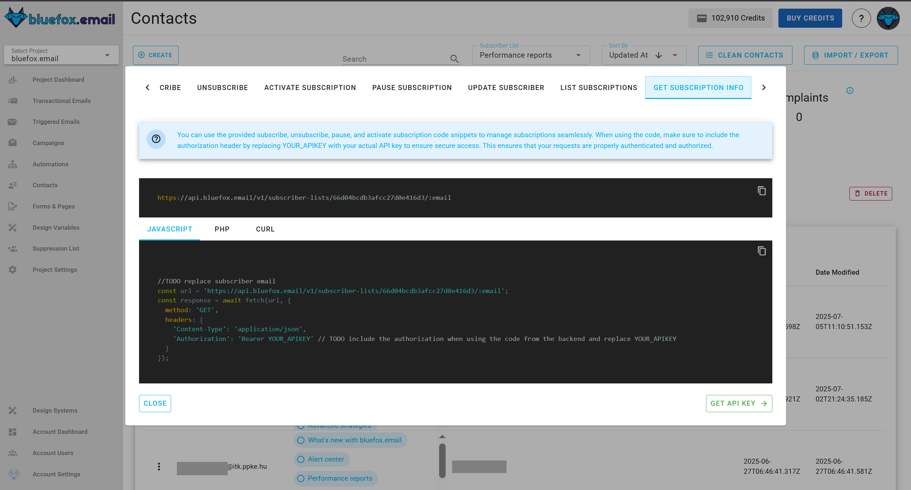

# Contacts and Subscriber List Management via the API

This guide explains how to manage subscribers using the **bluefox.email** API. You can subscribe, unsubscribe, pause, activate, and list subscribers from your email lists. Follow the examples and code snippets to integrate these functionalities into your system.

## Subscribe

[Quick guide](/docs/projects/contacts#contacts-and-lists-integration)

To subscribe a user to a [subscriber list](/docs/projects/contacts), use the following URL pattern:

```
https://api.bluefox.email/v1/subscriber-lists/##YOUR_SUBSCRIBER_LIST_ID##
```

Replace the placeholders with your specific information:
- `##YOUR_SUBSCRIBER_LIST_ID##`
- `##YOUR_API_KEY##`

You can find the IDs to replace by clicking on the code guide button in a subscriber list:


In the code guide dialog, these values are automatically filled in. If you copy the code snippets, you only need to replace the `##YOUR_API_KEY##`.



**Request Body:**
```json
{
  "name": "Jon Doe",
  "email": "jon@doe.com"
}
```

:::info
You can pass values for [merge tags](/docs/email-personalization) and [contact custom properties](/docs/projects/settings#contact-properties) inside the `data` field in the request body.
Just make sure the keys match the merge tags or custom property names defined in your project settings.
:::

:::info NOTE
 If [double Opt-In](docs/projects/forms-and-pages#double-opt-in) is enabled, you can **bypass** it by setting the contact’s status to active directly through the API. This will mark the contact as confirmed without sending a confirmation email.
:::

**cUrl**:
```bash
 curl -X POST "https://api.bluefox.email/v1/subscriber-lists/##YOUR_SUBSCRIBER_LIST_ID##" -H "Content-Type: application/json" -H "Authorization: Bearer ##YOUR_API_KEY##" -d '{"name": "Jon Doe", "email": "jon@doe.com"}'
```

**Javascript**:
```javascript
const url = 'https://api.bluefox.email/v1/subscriber-lists/##YOUR_SUBSCRIBER_LIST_ID##'

const response = await fetch(url, {
  method: 'POST',
  headers: {
    'Content-Type': 'application/json',
    'Authorization': 'Bearer ##YOUR_APIKEY##'
  },
  body: JSON.stringify({
    name: 'Jon Doe',
    email: 'jon@doe.com'
  })
})
```

**PHP**:
```php
  $apiKey = "##YOUR_API_KEY##"; // TODO: replace YOUR_APIKEY

  $url = "https://api.bluefox.email/v1/subscriber-lists/##YOUR_SUBSCRIBER_LIST_ID##";

  $data = array(
      'name' => 'userName',
      'email' => 'example@gmail.com'
  );

  $options = array(
      'http' => array(
          'header'  => "Content-Type: application/json\r\n" .
                      "Authorization: Bearer $apiKey\r\n",
          'method'  => 'POST',
          'content' => json_encode($data),
      ),
  );

  $context  = stream_context_create($options);
  $response = file_get_contents($url, false, $context);
```

::: danger Security Warning
Since an API key is very sensitive information, never store it in your frontend code. Always use it from your backend.
:::


## Update Subscriber

[Quick guide](/docs/projects/contacts#contacts-and-lists-integration)

To update a user from a [subscriber list](/docs/projects/contacts), use the following URL pattern:
```
https://api.bluefox.email/v1/subscriber-lists/##YOUR_SUBSCRIBER_LIST_ID##/##SUBSCRIBER_EMAIL_ADDRESS##
```

Replace the placeholders with your specific information:
 - `##YOUR_SUBSCRIBER_LIST_ID##`
 - `##SUBSCRIBER_EMAIL_ADDRESS##`
 - `##YOUR_API_KEY##`

You can find the IDs to replace by clicking on the code guide button in a subscriber list:


In the code guide dialog, these values are automatically filled in. If you copy the code snippets, you need to replace the `##YOUR_API_KEY##` and `##SUBSCRIBER_EMAIL_ADDRESS##`.



**Requiest body**:
```json
{
  "email": "updated_email@gmail.com",
  "name": "updated subscriber name"
}
```
:::info
You can pass values for [merge tags](/docs/email-personalization) and [contact custom properties](/docs/projects/settings#contact-properties) inside the `data` field in the request body.
Just make sure the keys match the merge tags or custom property names defined in your project settings.
:::


**cUrl**:
```bash
curl -X PATCH "https://api.bluefox.email/v1/subscriber-lists/##YOUR_SUBSCRIBER_LIST_ID##/##SUBSCRIBER_EMAIL_ADDRESS##" -H "Content-Type: application/json" -H "Authorization: Bearer ##YOUR_API_KEY##" -d '{"email": "updated_email@gmail.com", "name": "updated subscriber name"}'
```

**Javascript**:
```javascript
const url = 'https://api.bluefox.email/v1/subscriber-lists/##YOUR_SUBSCRIBER_LIST_ID##/##SUBSCRIBER_EMAIL_ADDRESS##'

const response = await fetch(url, {
  method: 'PATCH',
  headers: {
    'Content-Type': 'application/json',
    'Authorization': 'Bearer ##YOUR_API_KEY##'
  },
  body: JSON.stringify({
    email: "updated_email@gmail.com",
    name: "updated subscriber name"
  })
})
```

**PHP**:
```php
$apiKey = "##YOUR_API_KEY##";

$url = "https://api.bluefox.email/v1/subscriber-lists/##YOUR_SUBSCRIBER_LIST_ID##/##SUBSCRIBER_EMAIL_ADDRESS##";

$data = array(
    'email' => 'updated_email@gmail.com'
    'name' => 'updated subscriber name'
);

$options = array(
    "http" => array(
        "header"  => "Content-Type: application/json\r\n" .
                    "Authorization: Bearer $apiKey\r\n",
        "method"  => "PATCH",
        'content' => json_encode($data),
    ),
);

$context  = stream_context_create($options);
$response = file_get_contents($url, false, $context);
```

::: danger Security Warning
Since an API key is very sensitive information, never store it in your frontend code. Always use it from your backend.
:::


## Unsubscribe

[Quick guide](/docs/projects/contacts#contacts-and-lists-integration)

To unsubscribe a user from a [subscriber list](/docs/projects/contacts), use the following URL pattern:
```
https://api.bluefox.email/v1/subscriber-lists/##YOUR_SUBSCRIBER_LIST_ID##/##SUBSCRIBER_EMAIL_ADDRESS##
```

Replace the placeholders with your specific information:
 - `##YOUR_SUBSCRIBER_LIST_ID##`
 - `##SUBSCRIBER_EMAIL_ADDRESS##`
 - `##YOUR_API_KEY##`

You can find the IDs to replace by clicking on the code guide button in a subscriber list:


In the code guide dialog, these values are automatically filled in. If you copy the code snippets, you need to replace the `##YOUR_API_KEY##` and `##SUBSCRIBER_EMAIL_ADDRESS##`.


**Requiest body**:
```json
{
  "status": "unsubscribed"
}
```


**cUrl**:
```bash
curl -X PATCH "https://api.bluefox.email/v1/subscriber-lists/##YOUR_SUBSCRIBER_LIST_ID##/##SUBSCRIBER_EMAIL_ADDRESS##" -H "Content-Type: application/json" -H "Authorization: Bearer ##YOUR_API_KEY##" -d '{"status": "unsubscribed"}'
```

**Javascript**:
```javascript
const url = 'https://api.bluefox.email/v1/subscriber-lists/##YOUR_SUBSCRIBER_LIST_ID##/##SUBSCRIBER_EMAIL_ADDRESS##'

const response = await fetch(url, {
  method: 'PATCH',
  headers: {
    'Content-Type': 'application/json',
    'Authorization': 'Bearer ##YOUR_API_KEY##'
  },
  body: JSON.stringify({
    status: 'unsubscribed'
  })
})
```

**PHP**:
```php
$apiKey = "##YOUR_API_KEY##";

$url = "https://api.bluefox.email/v1/subscriber-lists/##YOUR_SUBSCRIBER_LIST_ID##/##SUBSCRIBER_EMAIL_ADDRESS##";

$data = array(
    'status' => 'unsubscribed'
);

$options = array(
    "http" => array(
        "header"  => "Content-Type: application/json\r\n" .
                    "Authorization: Bearer $apiKey\r\n",
        "method"  => "PATCH",
        'content' => json_encode($data),
    ),
);

$context  = stream_context_create($options);
$response = file_get_contents($url, false, $context);
```

::: danger Security Warning
Since an API key is very sensitive information, never store it in your frontend code. Always use it from your backend.
:::

## Pause Subscription

[Quick guide](/docs/projects/contacts#contacts-and-lists-integration)

At our subscription preferences page we provide you, we offer users to pause their subscriptions. It is a great way to reduce unsubscribe rates.

To pause a user from a [subscriber list](/docs/projects/contacts), use the following URL pattern:
```
https://api.bluefox.email/v1/subscriber-lists/##YOUR_SUBSCRIBER_LIST_ID##/##SUBSCRIBER_EMAIL_ADDRESS##
```

Replace the placeholders with your specific information:
 - `##YOUR_SUBSCRIBER_LIST_ID##`
 - `##SUBSCRIBER_EMAIL_ADDRESS##`
 - `##YOUR_API_KEY##`
 - `##PAUSED_UNTIL##`

You can find the IDs to replace by clicking on the code guide button in a subscriber list:


In the code guide dialog, these values are automatically filled in. If you copy the code snippets, you need to replace the `##YOUR_API_KEY##`, `##SUBSCRIBER_EMAIL_ADDRESS##` and `##PAUSED_UNTIL##`.


**Requiest body**:
```json
{
  "status": "paused",
  "pausedUntil": "##PAUSED_UNTIL##" //TODO replace date (ISO date string format)
}
```


**cUrl**:
```bash
curl -X PATCH "https://api.bluefox.email/v1/subscriber-lists/##YOUR_SUBSCRIBER_LIST_ID##/##SUBSCRIBER_EMAIL_ADDRESS##" -H "Content-Type: application/json" -H "Authorization: Bearer ##YOUR_API_KEY##" -d '{"status": "paused", "pausedUntil": "##PAUSED_UNTIL##" }'
```

**Javascript**:
```javascript
const url = 'https://api.bluefox.email/v1/subscriber-lists/##YOUR_SUBSCRIBER_LIST_ID##/##SUBSCRIBER_EMAIL_ADDRESS##'

const response = await fetch(url, {
  method: 'PATCH',
  headers: {
    'Content-Type': 'application/json',
    'Authorization': 'Bearer ##YOUR_API_KEY##'
  },
  body: JSON.stringify({
    status: 'paused',
    pausedUntil: '##PAUSED_UNTIL##'
  })
})
```

**PHP**:
```php
$apiKey = "##YOUR_API_KEY##";

$url = "https://api.bluefox.email/v1/subscriber-lists/##YOUR_SUBSCRIBER_LIST_ID##/##SUBSCRIBER_EMAIL_ADDRESS##";

$data = array(
    'status' => 'paused',
    'pausedUntil' => '##PAUSED_UNTIL##'
);

$options = array(
    "http" => array(
        "header"  => "Content-Type: application/json\r\n" .
                    "Authorization: Bearer $apiKey\r\n",
        "method"  => "PATCH",
        'content' => json_encode($data),
    ),
);

$context  = stream_context_create($options);
$response = file_get_contents($url, false, $context);
```

::: danger Security Warning
Since an API key is very sensitive information, never store it in your frontend code. Always use it from your backend.
:::


## Activate Subscription

[Quick guide](/docs/projects/contacts#contacts-and-lists-integration)

Users with paused subscription or users who unsubscribed, can be activated.

To activate a user from a [subscriber list](/docs/projects/contacts), use the following URL pattern:
```
https://api.bluefox.email/v1/subscriber-lists/##YOUR_SUBSCRIBER_LIST_ID##/##SUBSCRIBER_EMAIL_ADDRESS##
```

Replace the placeholders with your specific information:
 - `##YOUR_SUBSCRIBER_LIST_ID##`
 - `##SUBSCRIBER_EMAIL_ADDRESS##`
 - `##YOUR_API_KEY##`

You can find the IDs to replace by clicking on the code guide button in a subscriber list:


In the code guide dialog, these values are automatically filled in. If you copy the code snippets, you need to replace the `##YOUR_API_KEY##` and `##SUBSCRIBER_EMAIL_ADDRESS##`.



**Requiest body**:
```json
{
  "status": "active"
}
```


**cUrl**:
```bash
curl -X PATCH "https://api.bluefox.email/v1/subscriber-lists/##YOUR_SUBSCRIBER_LIST_ID##/##SUBSCRIBER_EMAIL_ADDRESS##" -H "Content-Type: application/json" -H "Authorization: Bearer ##YOUR_API_KEY##" -d '{"status": "active"}'
```

**Javascript**:
```javascript
const url = 'https://api.bluefox.email/v1/subscriber-lists/##YOUR_SUBSCRIBER_LIST_ID##/##SUBSCRIBER_EMAIL_ADDRESS##'

const response = await fetch(url, {
  method: 'PATCH',
  headers: {
    'Content-Type': 'application/json',
    'Authorization': 'Bearer ##YOUR_API_KEY##'
  },
  body: JSON.stringify({
    status: 'active'
  })
})
```

**PHP**:
```php
$apiKey = "##YOUR_API_KEY##";

$url = "https://api.bluefox.email/v1/subscriber-lists/##YOUR_SUBSCRIBER_LIST_ID##/##SUBSCRIBER_EMAIL_ADDRESS##";

$data = array(
    'status' => 'active'
);

$options = array(
    "http" => array(
        "header"  => "Content-Type: application/json\r\n" .
                    "Authorization: Bearer $apiKey\r\n",
        "method"  => "PATCH",
        'content' => json_encode($data),
    ),
);

$context  = stream_context_create($options);
$response = file_get_contents($url, false, $context);
```

::: danger Security Warning
Since an API key is very sensitive information, never store it in your frontend code. Always use it from your backend.
:::


## List Subscribers

[Quick guide](/docs/projects/contacts#contacts-and-lists-integration)

To list users from a [subscriber list](/docs/projects/contacts), use the following URL pattern:
```
https://api.bluefox.email/v1/subscriber-lists/##YOUR_SUBSCRIBER_LIST_ID##
```

Replace the placeholders with your specific information:
 - `##YOUR_SUBSCRIBER_LIST_ID##`
 - `##YOUR_API_KEY##`

You can find the IDs to replace by clicking on the code guide button in a subscriber list:


In the code guide dialog, these values are automatically filled in. If you copy the code snippets, you need to replace the `##YOUR_API_KEY##`.


**Requiest body**:

none.


**cUrl**:
```bash
curl -X GET "https://api.bluefox.email/v1/subscriber-lists/##YOUR_SUBSCRIBER_LIST_ID##" -H "Content-Type: application/json" -H "Authorization: Bearer ##YOUR_API_KEY##"
```

**Javascript**:
```javascript
const url = 'https://api.bluefox.email/v1/subscriber-lists/##YOUR_SUBSCRIBER_LIST_ID##'

const response = await fetch(url, {
  method: 'GET',
  headers: {
    'Content-Type': 'application/json',
    'Authorization': 'Bearer ##YOUR_API_KEY##'
  }
})
```

**PHP**:
```php
$apiKey = "##YOUR_API_KEY##";

$url = "https://api.bluefox.email/v1/subscriber-lists/##YOUR_SUBSCRIBER_LIST_ID##";

$options = array(
    "http" => array(
        "header"  => "Content-Type: application/json\r\n" .
                    "Authorization: Bearer $apiKey\r\n",
        "method"  => "GET"
    ),
);

$context  = stream_context_create($options);
$response = file_get_contents($url, false, $context);
```

::: danger Security Warning
Since an API key is very sensitive information, never store it in your frontend code. Always use it from your backend.
:::

## Get One Subscriber

[Quick guide](/docs/projects/contacts#contacts-and-lists-integration)

To get user from a [subscriber list](/docs/projects/contacts), use the following URL pattern:
```
https://api.bluefox.email/v1/subscriber-lists/##YOUR_SUBSCRIBER_LIST_ID##/##SUBSCRIBER_EMAIL_ADDRESS##
```

Replace the placeholders with your specific information:
 - `##YOUR_SUBSCRIBER_LIST_ID##`
 - `##SUBSCRIBER_EMAIL_ADDRESS##`
 - `##YOUR_API_KEY##`

You can find the IDs to replace by clicking on the code guide button in a subscriber list:


In the code guide dialog, these values are automatically filled in. If you copy the code snippets, you need to replace the `##YOUR_API_KEY##` and `##SUBSCRIBER_EMAIL_ADDRESS##`.



**Requiest body**:

none.


**cUrl**:
```bash
curl -X GET "https://api.bluefox.email/v1/subscriber-lists/##YOUR_SUBSCRIBER_LIST_ID##/##SUBSCRIBER_EMAIL_ADDRESS##" -H "Content-Type: application/json" -H "Authorization: Bearer ##YOUR_API_KEY##"
```

**Javascript**:
```javascript
const url = 'https://api.bluefox.email/v1/subscriber-lists/##YOUR_SUBSCRIBER_LIST_ID##/##SUBSCRIBER_EMAIL_ADDRESS##'

const response = await fetch(url, {
  method: 'GET',
  headers: {
    'Content-Type': 'application/json',
    'Authorization': 'Bearer ##YOUR_API_KEY##'
  }
})
```

**PHP**:
```php
$apiKey = "##YOUR_API_KEY##";

$url = "https://api.bluefox.email/v1/subscriber-lists/##YOUR_SUBSCRIBER_LIST_ID##/##SUBSCRIBER_EMAIL_ADDRESS##";

$options = array(
    "http" => array(
        "header"  => "Content-Type: application/json\r\n" .
                    "Authorization: Bearer $apiKey\r\n",
        "method"  => "GET"
    ),
);

$context  = stream_context_create($options);
$response = file_get_contents($url, false, $context);
```

::: danger Security Warning
Since an API key is very sensitive information, never store it in your frontend code. Always use it from your backend.
:::

## API Responses  

| Code | Name                 | Message                                                               | Description | JSON Response Example |
|------|----------------------|-----------------------------------------------------------------------|-------------|-----------------------|
| 200  | -                    | -                                                                     | The request was successfully processed. | ```json { "status": 200 , "result": { "accountId": "account_id", "projectId": "project_id", "subscriberListId": "subscriberList_id", "name": "name", "email": "example@gmail.com", "status": "status", "_id": "subscriber_id", "createdAt": "Date", "updatedAt": "Date" } } ``` |
| 201  | -                    | -                                                                     | A new subscriber has been created as a result of the request. | ```json { "status": 201 , "result": { "accountId": "account_id", "projectId": "project_id", "subscriberListId": "subscriberList_id", "name": "name", "email": "example@gmail.com", "status": "status", "_id": "subscriber_id", "createdAt": "Date", "updatedAt": "Date" } }``` |
| 201  | -                    | -                                                                     | In case of ``double opt-in``, a new subscriber has been created as a result of the request and a confirmation email is sent. | ```json { "status": 201 , "result": {"success": true} } ``` |
| 400  | `VALIDATION_ERROR`   | Email already exists.                                                | The email address is already registered in the system. | ```json { "status": 400, "error": {"name": "VALIDATION_ERROR", "message": "Email already exists."} } ``` |
| 400  | `VALIDATION_ERROR`   | Invalid email format  | The request contains improperly formatted email. Ensure `email` is valid email address. | ```json { "status": 400, "error": {"name": "VALIDATION_ERROR", "message": "Invalid email format"}  } ``` |
| 400  | `VALIDATION_ERROR`   | The pausedUntil date must be set in the future.                      | The provided date cannot be in the past. | ```json { "status": 400, "error": {"name": "VALIDATION_ERROR", "message": "The pausedUntil date must be set in the future."} } ``` |
| 405  | `METHOD_NOT_ALLOWED` | The provided email has been flagged due to bouncing. If this is incorrect and the email is valid, please contact support. | The email address has been marked as undeliverable due to previous failed delivery attempts. | ```json { "status": 405, "error": { "name": "METHOD_NOT_ALLOWED", "message": "The provided email has been flagged due to bouncing. If this is incorrect and the email is valid, please contact support." } } ``` |
