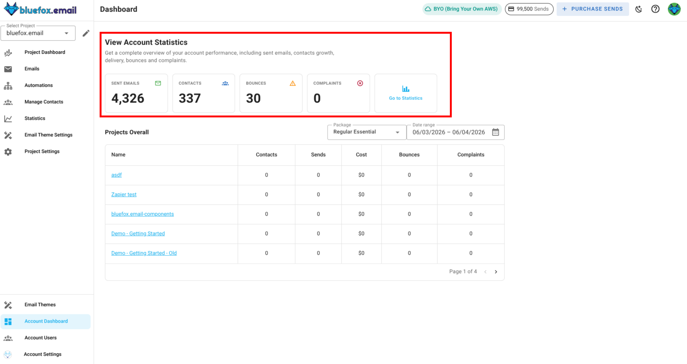
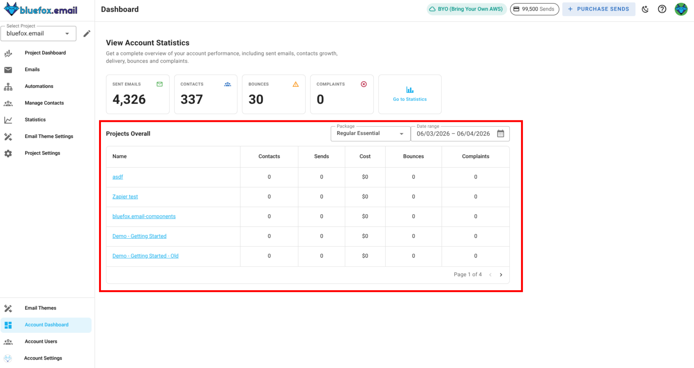
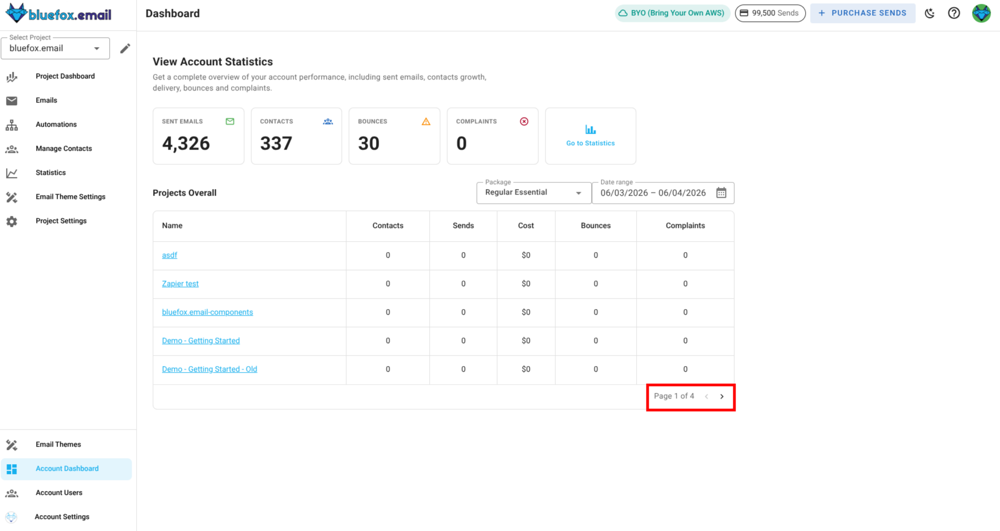
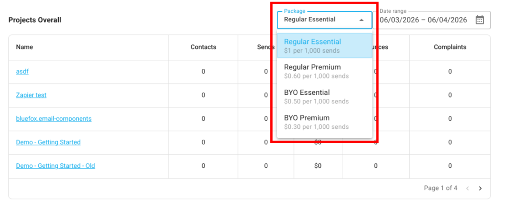
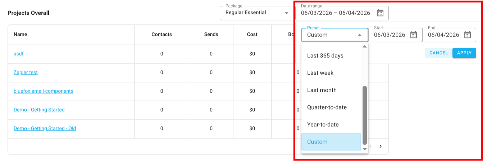

# Account Dashboard

The **Account Dashboard** gives you an overview of your entire account’s email and subscription performance across multiple projects. It allows you to track key metrics like number of email sents, total contacts, bounces, complaints accross every project. The dashboard also provides insights into other project specific statistics, such as contacts, sends, cost, bounces and complaints.

## Key Metrics in the Account Dashboard

The **Account Dashboard** provides both **overall account-level** statistics and **project-specific** insights. Below are the key metrics you can track in the dashboard:

## Overall Account-Level Email Performance

- **Total Emails Sent**: The total number of emails sent across all projects in your account.
- **Total Contacts**: The total number of unique contacts across all projects in your account.
- **Total Bounces**: The total number of bounced emails across all projects in your account
- **Total Complaints**: The total number of complaints received across all projects in your account.

You can directly go to the [statistics page](/docs/analytics) for a more detailed breakdown of these metrics and to analyze the performance of your email campaigns across all projects.

## Project-Specific Email Performance

For each project in your account, you can view the following email performance metrics:
- **Contacts**: The total number of unique contacts in the project.
- **Sends**: The total number of emails sent from the project.  
- **Cost**: The total cost incurred for sending emails from the project.
- **Bounces**: The total number of bounced emails from the project.
- **Complaints**: The total number of complaints received from the project.

There is pagination at the bottom of the project list, allowing you to navigate through multiple pages of projects.

The **Package** dropdown allows you to see how much each project costs based on its package type (e.g., Essential, Premium). Click on the **Package** dropdown to select a package type and view the associated cost for projects under that package.

There is also a filter for dates, allowing you to select a specific date range to view the performance of your projects during that period. Click on the **Date** dropdown to choose a date range or enter custom dates and view the performance of your projects during that period.

