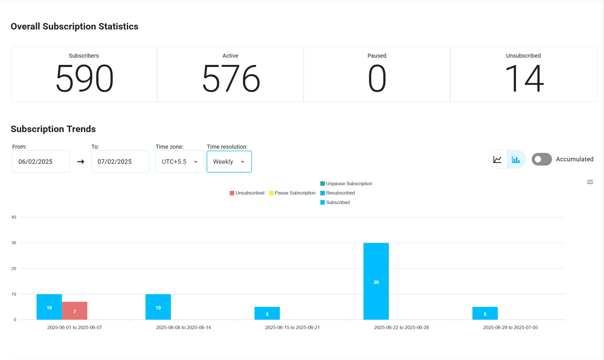
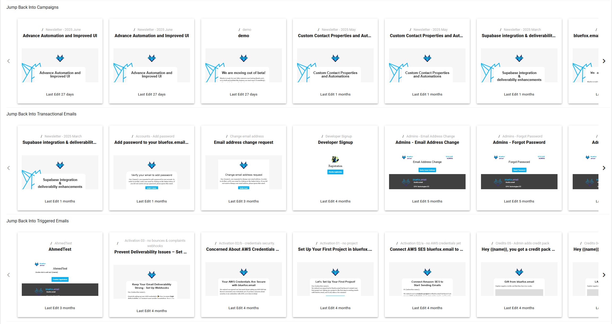
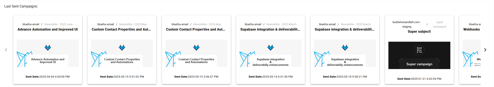

# Account Dashboard

The **Account Dashboard** gives you an overview of your entire account’s email and subscription performance across multiple projects. It allows you to track key metrics for [**transactional emails**](/docs/projects/transactional-emails#transactional-email-statistics), [**triggered emails**](/docs/projects/triggered-emails#triggered-email-statistics), [**campaign Emails**](/docs/projects/campaigns#campaign-email-statistics), and [**subscriber lists**](/docs/projects/contacts#list-statistics). The dashboard also provides insights into subscriber behaviors, such as subscriptions, pauses, unsubscribes, and re-subscriptions, giving you a holistic view of your account’s health.

## How the Account Dashboard Enhances Your Strategy

The **Account Dashboard** helps you:

- **Monitor All Projects at Once**: Track the performance of your emails and subscribers across all your projects in one place.
- **Get a 360° View of Email Effectiveness**: Measure the performance of different types of emails (transactional, triggered, and campaign emails) across your entire account.
- **Track Subscriber Trends**: See how subscribers are engaging with your emails, including their subscription, pause, unpause, and unsubscribe behaviors.
- **Identify Performance Issues**: Quickly detect trends like [high bounce rates](/email-sending-concepts/bounce-rate.md) or low open rates across all projects, helping you to address potential issues before they escalate.
- **Enhance Subscriber Engagement**: Use data from multiple projects to optimize future emails and improve subscriber retention and conversions.

## Key Metrics in the Account Dashboard

The **Account Dashboard** provides both **email performance** and **subscriber activity** metrics across all your projects, giving you a comprehensive view of your account's performance.

### 1. Email Performance Metrics Across All Projects
- **Sent Emails**: The total number of emails sent across all projects, including transactional, triggered, and campaign emails.
- **Opens**: The total number of email opens across all projects.
- **Unique Opens**: The number of unique recipients who opened emails across all your projects.
- **Clicks**: The total number of clicks on links inside your emails, reflecting how engaging your content is.
- **Unique Clicks**: The number of unique recipients who clicked on links, highlighting how effective your emails are at driving action.
- **Bounces**: The total number of emails that failed to be delivered, indicating any [deliverability](/email-sending-concepts/deliverability.md) issues.
- **Complaints**: The total number of [complaints](/email-sending-concepts/complaints.md) (e.g., emails marked as spam), which can indicate issues with your content quality.

The chart below displays the performance of transactional, triggered, and campaign emails across the account, highlighting opens, clicks, and complaints.

### 2. Subscriber Metrics Across All Projects
- **Total Subscribers**: The total number of subscribers across all projects in your account.
- **Active Subscribers**: The number of subscribers who are actively receiving emails across all your projects.
- **Paused Subscribers**: The number of subscribers who have paused their subscriptions across all projects.
- **Unsubscribed Subscribers**: The number of subscribers who have unsubscribed from receiving emails across all projects.
- **New Subscriptions**: The number of new subscribers added across all your projects in a given time period.
- **Unsubscribed**: The number of subscribers who unsubscribed during a specific time period.
- **Paused Subscriptions**: The number of subscriptions that were paused during a specific period.
- **Unpaused Subscriptions**: The number of subscriptions that were unpaused during a specific period.
- **Resubscribed**: The number of subscribers who have resubscribed after previously unsubscribing.

The chart above visualizes the subscriber metrics across the account, including active, paused, unsubscribed, and resubscribed users, providing insights into user engagement and retention.

## Jump Back to Latest Updated Emails

The **Jump Back** section allows you to quickly access the latest emails you were working on across different types ([**campaign emails**](/docs/projects/campaigns), [**transactional emails**](/docs/projects/transactional-emails), [**triggered emails**](/docs/projects/triggered-emails)). This section contains cards showing recent email updates, including the email type and the project it belongs to. By clicking on these cards, you can quickly jump back to the email in the project and continue editing or review its performance.

## Last Sent Campaigns

The **Last Sent Campaigns** section showcases the most recent campaigns sent across all projects, providing you with important details such as email previews, project names, and performance metrics. This section allows you to see the effectiveness of your most recent campaigns and quickly review their performance.

For more information on how to use the **Account Dashboard Statistics**, refer to the [Analytics Documentation](/docs/analytics).
