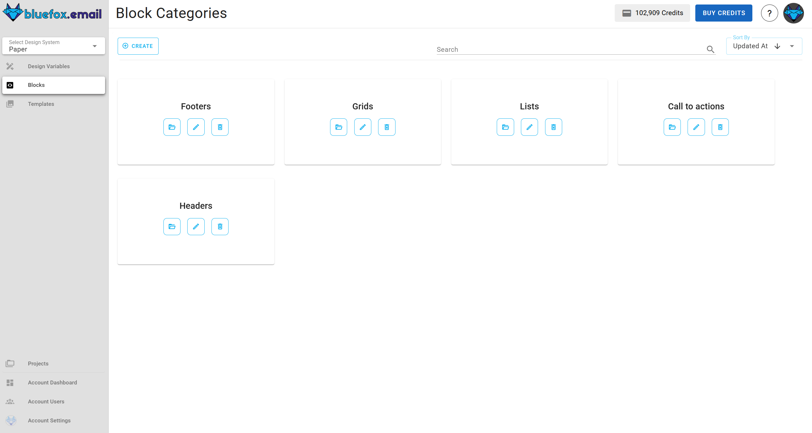
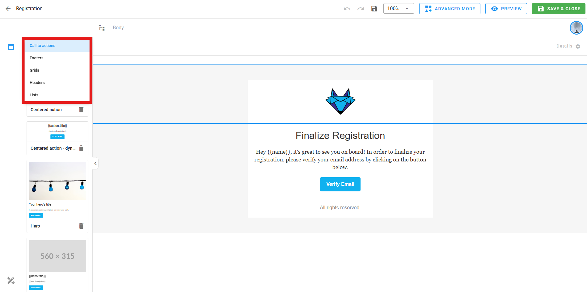
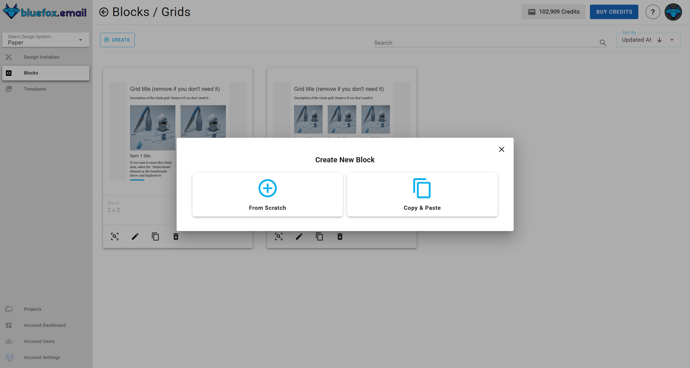

# Design system blocks (modules)

Blocks are reusable design components that serve as building elements for email templates. Each block represents a specific section of a design, such as a header, footer, button, or content section. By organizing content into blocks, users can efficiently build, customize, and maintain email designs with ease.

### **The importance of blocks**:

- **Reusability**: Blocks allow users to create standardized components that can be reused across multiple templates.

- **Customization**: Each block can be edited, updated, or copied to fit different designs.

- **Efficiency**: Instead of redesigning sections from scratch, users can modify existing blocks and integrate them into new templates.

## Block categories

Blocks are grouped inside **block categories**, which help organize them based on functionality or design purpose. Each category can contain multiple blocks, making it easier to manage and locate relevant components.

Users can:

- **Create, update, or delete** block categories.
- **Add blocks** within a category.

::: info 
Block categories appear in the editor whenever someone is editing a template in the design system or a template within a project connected to this design system.
:::

Block categories in the design system

Block categories in the editor:

## Viewing blocks

Inside each block category, users will find a list of blocks displayed as cards. Each block card includes:

- **Block preview** – A quick look at the block's design.
- **Block name** – The assigned name of the block.
- **Edit name** – Clicking the pencil icon next to the name allows users to rename the block.
- **Full preview** – Clicking the magnifier icon or "Preview" button opens a larger preview.
- **Edit block** – Clicking the pencil icon on the card allows editing the block's content.
- **Copy block** – Users can duplicate a block to create a new one with similar content.
- **Delete block** – Users can remove a block permanently.

## Creating blocks

Users can create a new block in two ways:

**1. From scratch**: Clicking the "Create" button opens a dialog where users can:
- Enter a block name.
- Open the editor to design the block using drag-and-drop elements.
- Save the block to add it to the category.
2. **Copy & Paste**: Users can duplicate an existing block, preserving its content and name, then edit it as needed.

## Blocks customization

Blocks can be fully customized in the editor using:

- **Drag-and-drop elements** – Add or rearrange design elements.
- **Variables** – Use predefined design variables for consistency.
- **Content customization** – Adjust text, images, buttons, and more.

## Using blocks in templates

Blocks are essential building units for email templates. A template can contain multiple blocks, allowing users to assemble layouts flexibly. For example:

- A **footer block** can be reused across multiple templates.
- Different footer designs can be stored as blocks and swapped as needed.
- Blocks can be dragged into templates to create complete email structures.

## Conclusion

Blocks and block categories provide a structured way to manage email components efficiently. By using reusable blocks, users can maintain consistency, speed up template creation, and ensure flexibility in design. Whether modifying an existing block or creating a new one from scratch, the block system streamlines email customization and enhances the overall user experience.