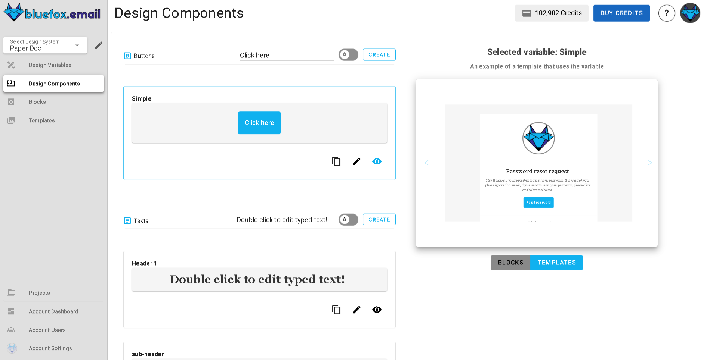
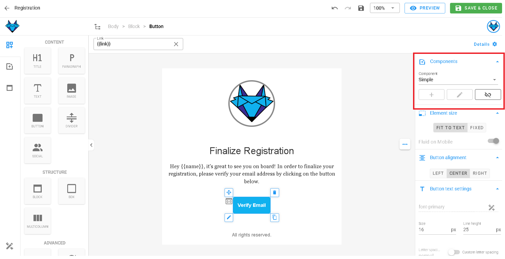
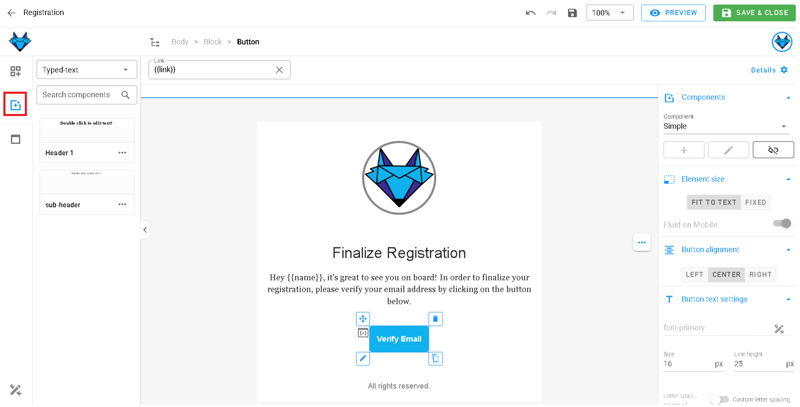
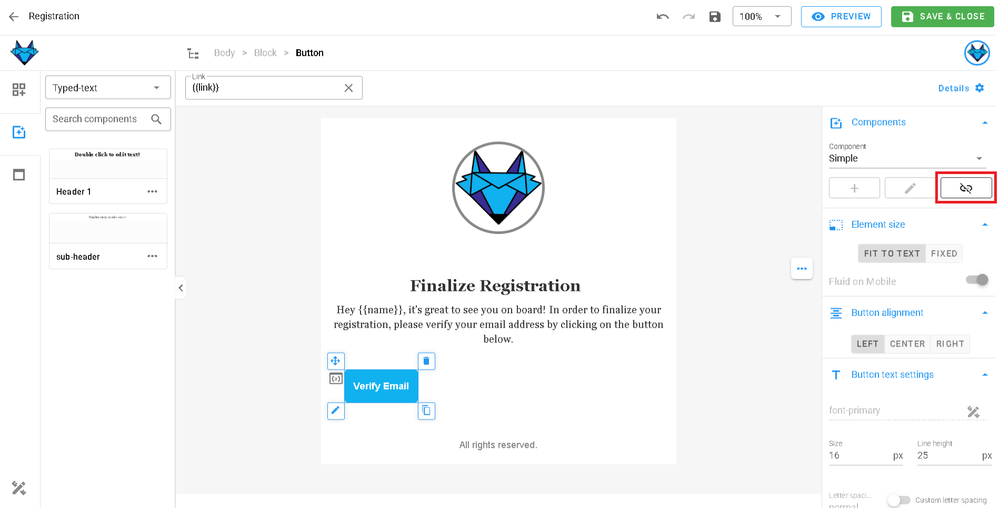

# Design System Components

Components in the design system allow you to create reusable design elements that can be applied across templates and campaigns. They ensure consistency and make it easy to update design elements across multiple emails without manually modifying each template.

When a component is updated, all templates and campaigns using that component will automatically reflect the changes. This allows for efficient design management and helps maintain a unified brand identity across projects.

## Components Page
The **components page** is divided into two main sections:

- **Left panel (components list)**: Displays different types of components (buttons, images, text, dividers). Users can create, edit, delete, and manage components.
- **Right panel (preview section)**: Shows how the selected component is applied in templates by displaying a live example, providing immediate feedback on its effect on designs.

## Types of Components

### 1. Button Components
Button components store reusable call-to-action buttons. Each component includes:

- **Component name** (e.g., `btn-primary`)

**Managing button components**
- **Create**: Click "Create" to add a new button component.
- **Edit**: Click the pencil icon to modify component name, element size, button alignment, button text settings, margins, paddings, border, and button background.
- **Delete**: Click the trash icon to remove a button component.
- **Preview**: Click the eye icon to see where the button is used in templates.

---

### 2. Text Components
Text components store reusable text elements, such as headings, taglines, disclaimers, or signature paragraphs. Each component includes:

- **Component name** (e.g., `text-disclaimer`)

**Managing text components**
- **Create**: Click "Create" to add a new text component.
- **Edit**: Click the pencil icon to modify component name, text content, text alignment, link, paddings, and text background.
- **Delete**: Click the trash icon to remove a text component.
- **Preview**: Click the eye icon to see where the text is used in templates.

::: tip 
Sometimes you might want to convert `text` to `type text` by clicking the button on the right panel which says the same to use text components.
:::

---

### 3. Divider Components
Divider components store reusable horizontal lines or section breaks to separate content visually. Each component includes:

- **Component name** (e.g., `divider-primary`)

**Managing divider components**
- **Create**: Click "Create" to add a new divider component.
- **Edit**: Click the pencil icon to modify component name, paddings, line properties, and divider background.
- **Delete**: Click the trash icon to remove a divider component.
- **Preview**: Click the eye icon to see where the divider is used in templates.

---

### 4. Image Components
Image components store reusable images (e.g., company logos, product images, banners). Each component includes:

- **Component name** (e.g., `image-logo`)

**Managing image components**
- **Create**: Click "Create" to add a new image component.
- **Edit**: Click the pencil icon to modify component name, element size, image alignment, margins, paddings, border, and image background.
- **Delete**: Click the trash icon to remove an image component.
- **Preview**: Click the eye icon to see where the image is used in templates.

## Using Components in Templates

Once created, components can be used in any email template. Just click on any component and check the right side panel to insert it into your template.

For example check the button component in the right panel to see how it can be added to your email.

You can also "drag and drop" the component styles. Click on the `Components` icon in the left panel to see all available components.

If you want to detach the component and edit the styles independently, you can do so by selecting the component and choosing the `Detach` option from the right side panel.

## Conclusion

Components make it easy to manage design consistency across templates and campaigns. The **eye icon** provides a quick preview of where each component is used, ensuring smooth editing. Components put your design building blocks in one place ready to be used anywhere you need them.
