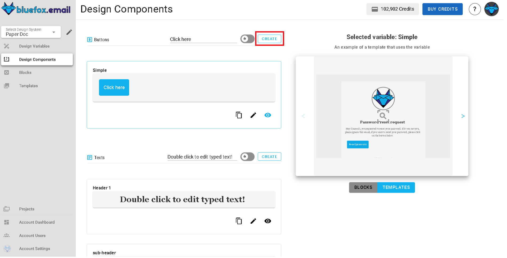
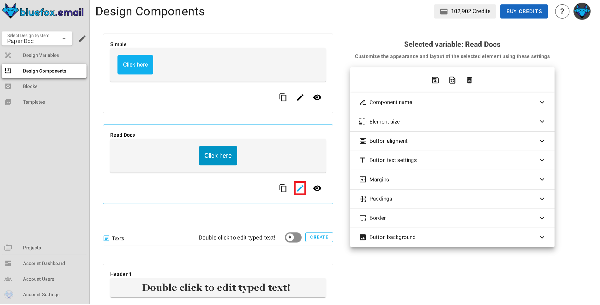

# Design System Components

Components in the design system let you create reusable design elements that can be inserted anywhere in your email templates and campaigns. They act like dynamic building blocks whether it’s a button, an image, a text section, or a divider, once a component is created, you can use it across multiple templates with just a click.  

When a component is updated, **all templates and emails using it will automatically reflect the changes**, saving you time and ensuring visual and functional consistency across every email you send.

## Components Page

The **components page** is divided into two main sections:

- **Left panel (components list)** – Displays your saved components, organized by types. You can create, edit, delete, and manage components from here.
- **Right panel (preview section)** – Shows a live preview of the selected component and how it will appear inside an email. This allows you to make changes with confidence, knowing exactly how they will be rendered.

## Types of Components

### 1. Button Components
Button components store reusable call‑to‑action buttons (e.g., “Buy Now”, “Learn More”, “Sign Up”).
  
Each button component includes:
- **Component name** (e.g., `btn-primary`)
- **Button label** (e.g., `Shop Now`)
- **Link URL**
- **Style properties** (color, border radius, font, padding, etc.)

**Managing button components**
- **Create**: Click "Create" to build a new button with your preferred styles and link.
- **Edit**: Update styles, label, or URL by clicking the pencil icon.
- **Delete**: Click the trash icon to remove the button from your library.
- **Preview**: See how the button looks in an email by clicking the eye icon.

### 2. Image Components
Image components store reusable images (e.g., company logos, product images, banners).

- **Component name** (e.g., `image-logo`)
- **Image file or URL**
- **Alt text** (optional)
- **Linked URL** (optional)

**Managing image components**
- **Create**: Click "Create" to upload or select an image.
- **Edit**: Replace or update image properties via the pencil icon.
- **Delete**: Remove an image by clicking the trash icon.
- **Preview**: See image placement by clicking the eye icon.

### 3. Text Components
Text components store blocks of reusable text such as headings, taglines, disclaimers, or signature paragraphs.

- **Component name** (e.g., `footer-disclaimer`)
- **Text content** (can include basic formatting)
- **Style properties** (font, size, color)

**Managing text components**
- **Create**: Add a new text block by clicking "Create".
- **Edit**: Update content or style in the editor via the pencil icon.
- **Delete**: Remove a text block by clicking the trash icon.
- **Preview**: View the component’s appearance via the eye icon.

::: tip 
Sometimes you might wanna convert `text` to `type text` by clicking the button on the right panel which says the same to use text components.
:::

### 4. Divider Components
Divider components are reusable horizontal lines or section breaks to separate content visually.

- **Component name** (e.g., `divider-primary`)
- **Style settings** (line thickness, color, padding)

**Managing divider components**
- **Create**: Add a new divider by clicking "Create".
- **Edit**: Change line style or properties using the pencil icon.
- **Delete**: Remove a divider by clicking the trash icon.
- **Preview**: See how the divider appears in an email by clicking the eye icon.

## Creating Components

To create a new component, click the "Create" button on the preferred component tab.

You can either start from scratch or paste component styles you copied. Give your new component a name, and voila! You have successfully created a component. 

Click on the edit icon to modify your component. You will be able to change its properties and styles from left side panel. 

## Using Components in Templates

Once created, components can be used in any email template. Just click on any component and check the right side panel to insert it into your template.

For example check the button component in the right panel to see how it can be added to your email.

You can also "drag and drop" the component styles. Click on the `Components` icon in the left panel to see all available components.

## Conclusion

Components help you maintain brand consistency, save time, and make bulk updates easy. Whether it’s reusing your company’s call-to-action button, a product image, or footer text, components put your design building blocks in one place ready to be used anywhere you need them.
