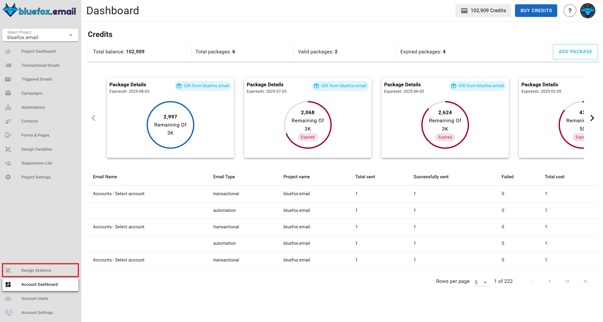

# Design systems

The design system in our email product is a comprehensive framework that helps users build, customize, and manage email designs efficiently. It allows for the creation of reusable components, ensuring consistency across all email communications. With this system, you can design emails from start to finish without needing to write any code, using our drag-and-drop editor.

It provides a streamlined approach to email design. Users can create reusable blocks and templates, define variables for global customization, and associate design systems with specific projects. This makes the process of managing email styles and content consistent and efficient across all campaigns.

## Design System Principles
The design system follows Atomic Design, breaking emails into reusable components for consistency and scalability.

- Atoms – Basic elements like colors and text styles.
- Molecules – Functional groups, such as buttons with icons.
- Organisms – Larger sections like headers or footers.
- Templates – Define email layouts.

This modular approach keeps email designs structured, flexible, and easy to manage.

## Components of the Design System
Every design system in bluefox.email includes:

- [Variables](./variables)
- [Blocks](./blocks)
- [Templates](./templates)

Everything in a design system is built to be reusable and scalable, ensuring that all emails within a project maintain a consistent style and structure

## Navigating to Design System

You can find the design system section by clicking on it's icon on the left-hand side.

## Creating a New Design System
To create a new design system, navigate to the design system section and click on "Create" You can choose to start from scratch or use a default design system as your base. Once created, you can add variables, blocks, and templates to build your system.

## Associating a Design System with a Project
Every project must be linked to a design system to ensure consistency in design and functionality. When you create a new project, you will have the option to associate it with an existing design system. This association allows the project to inherit templates, blocks, and variables from the design system, making the design process more efficient.

::: info Note
A project can only be associated with one design system at a time. If you need to switch design systems, you can do so in the project settings, but this may affect existing templates and variables.
:::

### Overriding Variables at the Project Level
While the design system provides a consistent foundation, you might need to customize certain elements for specific projects. You can override variable values at the project level without affecting the main design system. For instance, if the default color variable "primary" is set to red in the design system, you can override it to blue in a specific project. Similarly, if the design system includes a default logo, you can replace it with a project-specific logo without altering the original. These changes will only apply to the project, leaving the original design system unchanged.

::: info Note
 Overriding variables at the project level allows for customization without altering the global design system, ensuring that other projects remain unaffected.
:::

##  Best Practices

### Maintaining Consistency

Consistency is key to effective email design. Using variables instead of hardcoded values ensures that changes can be made quickly and uniformly across all templates and blocks. Organizing templates and blocks into categories helps keep your design assets structured and easy to manage. Reusing predefined blocks not only saves time but also ensures that your brand identity remains consistent across all emails.

### Efficient Use of Variables
Defining a primary color scheme through color variables allows you to update the design across all templates with minimal effort. Storing frequently used text snippets in text variables ensures that important content remains consistent and easy to update. Managing important URLs through link variables reduces the risk of errors and simplifies the process of updating links across multiple emails.

::: info Note
 Efficient use of variables can significantly reduce the time and effort required to maintain and update your email designs, especially when managing multiple projects.
:::
