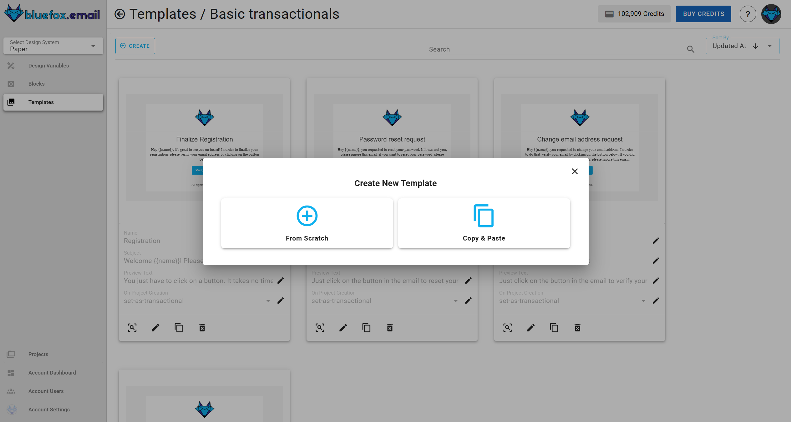

# Design system templates

Templates are structured email designs that serve as a foundation for email campaigns, transactional messages, or triggered emails. Unlike blocks, which represent smaller reusable components, templates provide a complete email structure by combining multiple blocks along with additional elements such as buttons and variables.

### **The importance of templates**:

Templates play a crucial role in maintaining brand consistency, reducing design time, and ensuring email content aligns with predefined styles. They allow for efficient email creation by reusing blocks and applying custom variables, making them adaptable to different marketing or transactional needs.

## Template categories

Templates are grouped inside **Template categories**, which help organize them based on functionality or design purpose. Each category can contain multiple templates, making it easier to manage and locate relevant components.

Users can:

- **Create, update, or delete** template categories.
- **Add templates** within a category.

## Viewing templates

Inside each template category, users will find a list of templates displayed as cards. Each template card includes:

- **Template preview** – A quick look at the template's design.
- **Template name** – The assigned name of the template.

- **Edit name** – Clicking the pencil icon next to the name allows users to rename the template.

- **Subject** – The subject line of the email, essential for email deliverability and engagement.

- **Edit subject** – Clicking the pencil icon next to the subject allows users to update the subject.

- **Preview text** – A short preview of the email content displayed in inboxes.

- **Edit preview text** – Clicking the pencil icon next to the preview text allows users to update the preview text.

- **On project creation** – A dropdown that defines the template’s role within a project. When a project is created, selected templates are automatically added as transactional, triggered, or campaign emails, ensuring they are ready for use from the start. Options include:

    - **Do nothing** – The template remains available but is not assigned any specific function.

    - **Set as transactional email** – The template is designated for automated one-to-one communication, such as order confirmations or password resets.

    - **Set as triggered email** – The template is used for event-based emails, triggered by specific user actions.

    - **Set as campaign** – The template is used for email marketing campaigns targeting a list of recipients.

- **Full preview** – Clicking the magnifier icon or "Preview" button opens a larger preview.
- **Edit template** – Clicking the pencil icon on the card allows editing the template's content.
- **Copy template** – Users can duplicate a template to create a new one with similar content.
- **Delete template** – Users can remove a template permanently.

## Creating templates

Users can create a new template in two ways:

**1. From scratch**: Clicking the "Create" button opens a dialog where users can:
- Enter a template name, subject, preview text and on project creation.
- Open the editor to design the template using drag-and-drop elements.
- Save the template to add it to the category.
2. **Copy & Paste**: Users can duplicate an existing template, preserving its content and name, then edit it as needed.

## Template customization

Templates can be fully customized in the editor using:

- **Drag and drop blocks and additional elements** to assemble the email layout.
- **Variables** – Use predefined design variables for consistency.
- **Content customization** – Adjust text, images, buttons, and more.

## Conclusion

Templates provide a structured way to build and manage email designs efficiently. By utilizing blocks, additional elements, and variables, templates enable users to create highly customizable emails tailored to different use cases. The ability to categorize templates and assign them predefined roles within projects ensures seamless email automation and campaign execution.