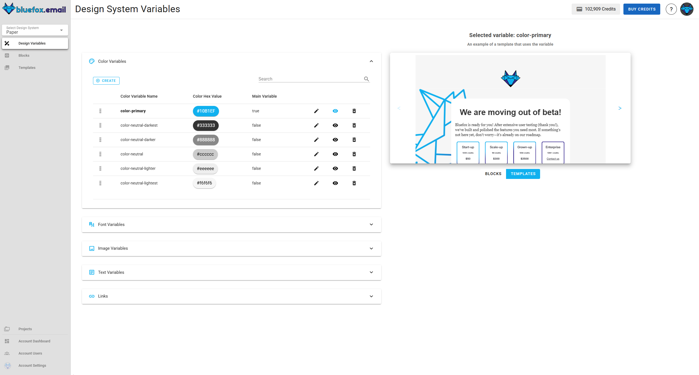

# Design system variables

Variables in the design system allow you to define reusable values that can be applied across templates and blocks. They ensure consistency and make it easy to update design elements across multiple emails without manually modifying each template or block.

When a variable is updated, all templates and blocks using that variable will automatically reflect the changes. This allows for efficient design management and helps maintain a unified brand identity across projects.

## Variables Page
The **Variables Page** is divided into two main sections:

- **Left Panel (Variable List)**: Displays different types of variables (colors, fonts, images, text, links). Users can create, edit, delete, and manage variables.
- **Right Panel (Preview Section)**: Shows how the selected variable is applied in templates or blocks by displaying a live example, providing immediate feedback on its effect on designs.

## Types of Variables

### 1. Color Variables
Color variables store reusable colors, such as primary colors, neutrals, and accent colors. Each variable includes:

- **Color Name** (e.g., `color-primary`)
- **Hex Value** (e.g., `#1B1E1F`)
- **Main Variable** (true/false value indicates whether the variable is visible in the design system preview.)

**Managing Color Variables**
- **Create**: Click "Create" to add a new color.
- **Edit**: Click the pencil icon to change the color name or value.
- **Delete**: Click the trash icon to remove a color.
- **Preview**: Click the eye icon to see where the color is used in templates/blocks.

---

### 2. Font Variables
Font variables define typography styles applied across templates. Each variable includes:

- **Font Name** (e.g., `font-primary`)
- **Font Stack** (e.g., `Arial, Helvetica, sans-serif`)
- **Main Variable** (true/false value indicates whether the variable is visible in the design system preview.)

**Managing Font Variables**
- **Create**: Click "Create" to add a new font.
- **Edit**: Modify font styles by clicking the pencil icon.
- **Delete**: Remove fonts by clicking the trash icon.
- **Preview**: See where the font is used by clicking the eye icon.

---

### 3. Image Variables
Image variables store reusable images (e.g., brand logos, background images).

- **Image**
- **Variable Name** (e.g., `image-logo`)
- **Main Variable** (true/false value indicates whether the variable is visible in the design system preview.)

**Managing Image Variables**
- **Copy**: Copy the image link by clicking the link icon.
- **Create**: Click "Create" to add a new image.
- **Edit**: Modify the image by clicking the pencil icon.
- **Delete**: Remove image by clicking the trash icon.
- **Preview**: See where the image is used by clicking the eye icon.

---

### 4. Text Variables
Text variables store reusable text elements, such as company slogans, default headings, or dynamic text values.

- **Variable Name** (e.g., `alt-text-website`)
- **Variable Text** (e.g., `Visit our website at https://bluefox.email`)
- **Main Variable** (true/false value indicates whether the variable is visible in the design system preview.)

**Managing text Variables**
- **Create**: Click "Create" to add a new text.
- **Edit**: Modify text by clicking the pencil icon.
- **Delete**: Remove text by clicking the trash icon.
- **Preview**: See where the text is used by clicking the eye icon.

---

### 5. Links Variables
Text variables store reusable text elements, such as company slogans, default headings, or dynamic text values.

- **Variable Name** (e.g., `link-website`)
- **Variable URL** (e.g., `https://bluefox.email`)
- **Main Variable** (true/false value indicates whether the variable is visible in the design system preview.)

**Managing text Variables**
- **Create**: Click "Create" to add a new link.
- **Edit**: Modify link by clicking the pencil icon.
- **Delete**: Remove link by clicking the trash icon.
- **Preview**: See where the link is used by clicking the eye icon.

## Conclusion

Variables make it easy to manage design consistency across blocks and templates. The **eye icon** provides a quick preview of where each variable is used, ensuring smooth editing. **Main variables** appear in the design system Preview, while **Non-Main variables** remain available inside projects for flexible use.