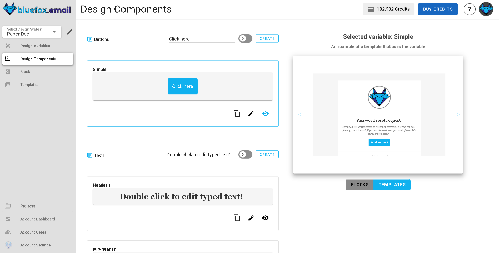

# Design System Components

Components in design systems enable you to define reusable design elements that can be applied across blocks and templates. They help you maintain consistency and efficiency by letting you update visual elements in a single place, with changes reflected instantly across all associated emails.

For example, a **`primary-button`** component could store the style and settings for your main call‑to‑action button. Once created, you can insert it into any block or template.

When a component is updated, every block or template using it automatically reflects the change, streamlining design management and supporting unified branding across projects.

## Components Page

The **components page** is divided into two main sections:

- **Left panel (components list)**: Displays different types of components, buttons, images, text, dividers. Users can create, edit, delete, and manage components.
- **Right panel (preview section)**: Shows a live example of how the selected component is used in templates, providing immediate feedback on changes.

## Types of Components

All components include a **component name**, which identifies them. Each type also includes a unique set of configurable properties.

### 1. Button Components

Button components store reusable call-to-action buttons.

**Managing button components**
- **Create**: Click "Create" to add a new button. Select either "From Scratch" or "Copy & Paste".
- **Edit**: Click the pencil icon to adjust element size, button alignment, button text settings, margins, paddings, border, and button background.
- **Delete**: Click the trash icon to remove a button component.
- **Preview**: Click the eye icon to see where the button is used in templates.

---

### 2. Text Components

Text components store reusable text elements, such as headings, taglines, disclaimers, or signature paragraphs.

**Managing text components**
- **Create**: Click "Create" to add a new text. Select either "From Scratch" or "Copy & Paste".
- **Edit**: Click the pencil icon to adjust text content, text alignment, link formatting, paddings, and text background.
- **Delete**: Click the trash icon to remove a text component.
- **Preview**: Click the eye icon to see where the text is used in templates.

---

### 3. Divider Components

Divider components store reusable horizontal lines or section breaks to visually separate content.

**Managing divider components**
- **Create**: Click "Create" to add a new divider. Select either "From Scratch" or "Copy & Paste".
- **Edit**: Click the pencil icon to adjust paddings, line properties, and divider background.
- **Delete**: Click the trash icon to remove a divider component.
- **Preview**: Click the eye icon to see where the divider is used in templates.

---

### 4. Image Components

Image components store reusable images (such as company logos, product images, or banners).

**Managing image components**
- **Create**: Click "Create" to add a new image. Select either "From Scratch" or "Copy & Paste".
- **Edit**: Click the pencil icon to adjust element size, image alignment, margins, paddings, border, and image background.
- **Delete**: Click the trash icon to remove an image component.
- **Preview**: Click the eye icon to see where the image is used in templates.

## Using Components in Templates

Once created, components can be used in any email template. Click a component and use the right side panel to insert it into your template.

For example, check the button component in the right panel to see how it can be added to your email.

You can also drag and drop component styles. Click the `Components` icon in the left panel to see all available components.

If you want to detach the component and edit the styles independently, you can do so by selecting the component and choosing the `Detach` option from the right side panel.

## Conclusion

Components allow you to efficiently manage design consistency and reusability across blocks and templates. The **eye icon** provides a quick preview of where each component is used, making updates and edits straightforward. Components centralize your building blocks, ready to be used wherever you need them.