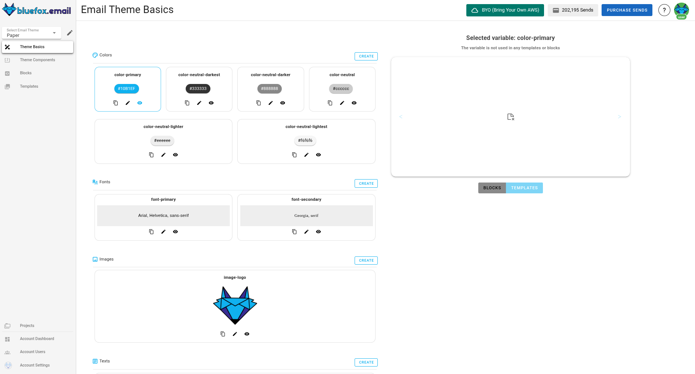

# Email Theme Basics

Email theme basics allow you to define reusable values that can be applied across templates and blocks. They ensure consistency and make it easy to update design elements across multiple emails without manually modifying each template or block.

When a basic is updated, all templates and blocks using it will automatically reflect the changes. This allows for efficient design management and helps maintain a unified brand identity across projects.

## Email Theme Basics Page
The **email theme basics page** is divided into two main sections:

- **Left panel (basics list)**: Displays different settings including colors, fonts, images, text, and links. Users can create, edit, delete, and manage these basics.
- **Right panel (preview section)**: Shows how the selected basic is applied in templates or blocks by displaying a live example, providing immediate feedback on its effect on designs.

## Settings in Email Theme Basics

### 1. Colors
Color settings store reusable colors, such as primary colors, neutrals, and accent colors. Each color basic includes:

- **Color name** (e.g., `color-primary`)
- **Hex value** (e.g., `#1B1E1F`)
- **Description**

**Managing colors**
- **Create**: Click "Create" to add a new color. Select either "From Scratch" or "Copy & Paste". 
- **Edit**: Click the pencil icon to change the color name or value.
- **Delete**: Click the trash icon to remove a color.
- **Preview**: Click the eye icon to see where the color is used in templates/blocks.

---

### 2. Fonts
Font settings define typography styles applied across templates. Each font basic includes:

- **Font name** (e.g., `font-primary`)
- **Font stack** (e.g., `Arial, Helvetica, sans-serif`)
- **Description**

**Managing fonts**
- **Create**: Click "Create" to add a new font. Select either "From Scratch" or "Copy & Paste".
- **Edit**: Modify font styles by clicking the pencil icon.
- **Delete**: Remove fonts by clicking the trash icon.
- **Preview**: See where the font is used by clicking the eye icon.

---

### 3. Images
Image settings store reusable images (e.g., brand logos, background images).

- **Image**
- **Variable Name** (e.g., `image-logo`)
- **Description**

**Managing images**
- **Copy**: Copy the image link by clicking the link icon.
- **Create**: Click "Create" to add a new image. Select either "From Scratch" or "Copy & Paste".
- **Edit**: Modify the image by clicking the pencil icon.
- **Delete**: Remove image by clicking the trash icon.
- **Preview**: See where the image is used by clicking the eye icon.

---

### 4. Text
Text settings store reusable text elements, such as company slogans, default headings, dynamic text values, or legal copy in the footer. For example, a legal disclaimer or copyright notice in the footer can be managed as a text basic, ensuring consistency across all emails while allowing easy updates.

- **Variable name** (e.g., `alt-text-website`)
- **Variable text** (e.g., `Visit our website at https://bluefox.email`)
- **Description**

**Managing text**
- **Create**: Click "Create" to add a new text. Select either "From Scratch" or "Copy & Paste".
- **Edit**: Modify text by clicking the pencil icon.
- **Delete**: Remove text by clicking the trash icon.
- **Preview**: See where the text is used by clicking the eye icon.

---

### 5. Links
Link settings store reusable URLs, such as website links, social media profiles, or call-to-action buttons.

- **Variable Name** (e.g., `link-website`)
- **Variable URL** (e.g., `https://bluefox.email`)
- **Description**

**Managing links**
- **Create**: Click "Create" to add a new link. Select either "From Scratch" or "Copy & Paste".
- **Edit**: Modify link by clicking the pencil icon.
- **Delete**: Remove link by clicking the trash icon.
- **Preview**: See where the link is used by clicking the eye icon.
