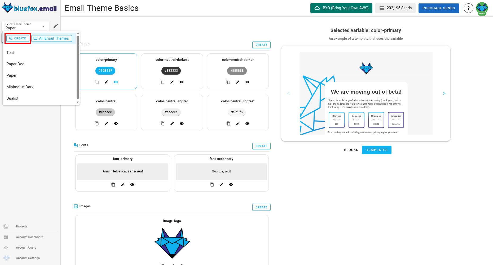

# Email Theme Settings

The Email Themes in our email product is a comprehensive framework that helps users build, customize, and manage email designs efficiently. It allows for the creation of reusable email theme components, ensuring consistency across all email communications. With this system, you can design emails from start to finish without needing to write any code, using our drag-and-drop editor.

It provides a streamlined approach to email design. Users can create reusable blocks and templates, define email theme basics for global customization, and associate email theme settings with specific projects. This makes the process of managing email styles and content consistent and efficient across all campaigns.

## Email Theme Principles
The email theme follows [Atomic Design](https://bradfrost.com/blog/post/atomic-web-design), breaking emails into reusable email theme components for consistency and scalability.

- Atoms – Basic elements like colors and text styles.
- Molecules – Functional groups, such as buttons with icons.
- Organisms – Larger sections like headers or footers.
- Templates – Define email layouts.

This modular approach keeps email designs structured, flexible, and easy to manage.

## Email Theme Components
Every email theme in bluefox.email includes:

- [Email theme basics](./email-theme-basics)
- [Blocks](./blocks)
- [Templates](./templates)

Everything in an email theme is built to be reusable and scalable, ensuring that all emails within a project maintain a consistent style and structure

## Navigating to Email Themes

You can find the email theme section in sidebar on left-hand side.

## Creating a New Email Theme
To create a new email theme, navigate to the email theme section and click on "Create", you can find this button in drop-down menu.

You can choose to start from scratch or use a default email theme as your base. Once created, you can add email theme basics, blocks, and templates to build your system.

## Associating an Email Theme with a Project
Every project must be linked to an email theme to ensure consistency in design and functionality. When you create a new project, you will have the option to associate it with an existing email theme. This association allows the project to inherit templates, blocks, and email theme basics from the email theme, making the design process more efficient.

::: info Note
A project can only be associated with one email theme at a time. If you need to switch email themes, you can do so in the project settings, but this may affect existing templates and email theme basics.
:::

### Overriding Theme Basics at the Project Level
While the email theme provides a consistent foundation, you might need to customize certain elements for specific projects. You can override theme basics values at the project level without affecting the main email theme. For instance, if the default color email theme basic "primary" is set to red in the email theme, you can override it to blue in a specific project. Similarly, if the email theme includes a default logo, you can replace it with a project-specific logo without altering the original. These changes will only apply to the project, leaving the original email theme unchanged.

::: info Note
 Overriding **Email Theme Basics** at the project level allows for customization without altering the global email theme, ensuring that other projects remain unaffected.
:::

##  Best Practices

### Maintaining Consistency

Consistency is key to effective email design. Using email theme basics instead of hardcoded values ensures that changes can be made quickly and uniformly across all templates and blocks. Organizing templates and blocks into categories helps keep your design assets structured and easy to manage. Reusing predefined blocks not only saves time but also ensures that your brand identity remains consistent across all emails.

### Efficient Use of Theme Basics
Defining a primary color scheme through color email theme basics allows you to update the design across all templates with minimal effort. Storing frequently used text snippets in text email theme basics ensures that important content remains consistent and easy to update. Managing important URLs through link email theme basics reduces the risk of errors and simplifies the process of updating links across multiple emails.

::: info Note
 Efficient use of email theme basics can significantly reduce the time and effort required to maintain and update your email designs, especially when managing multiple projects.
:::
