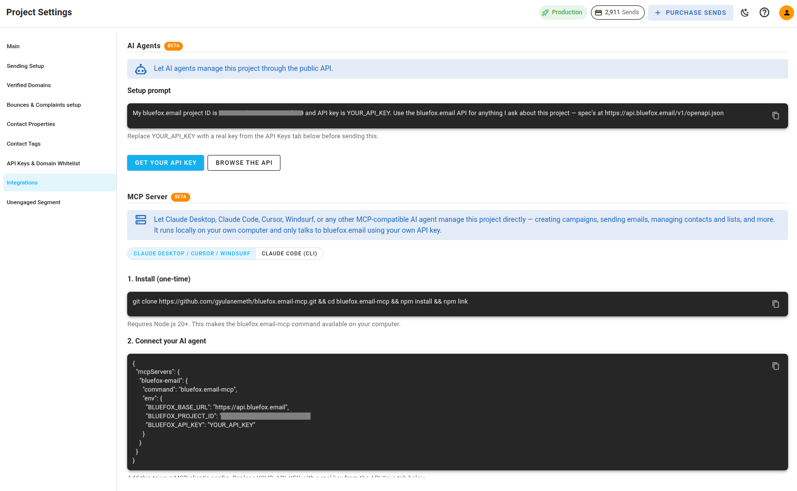
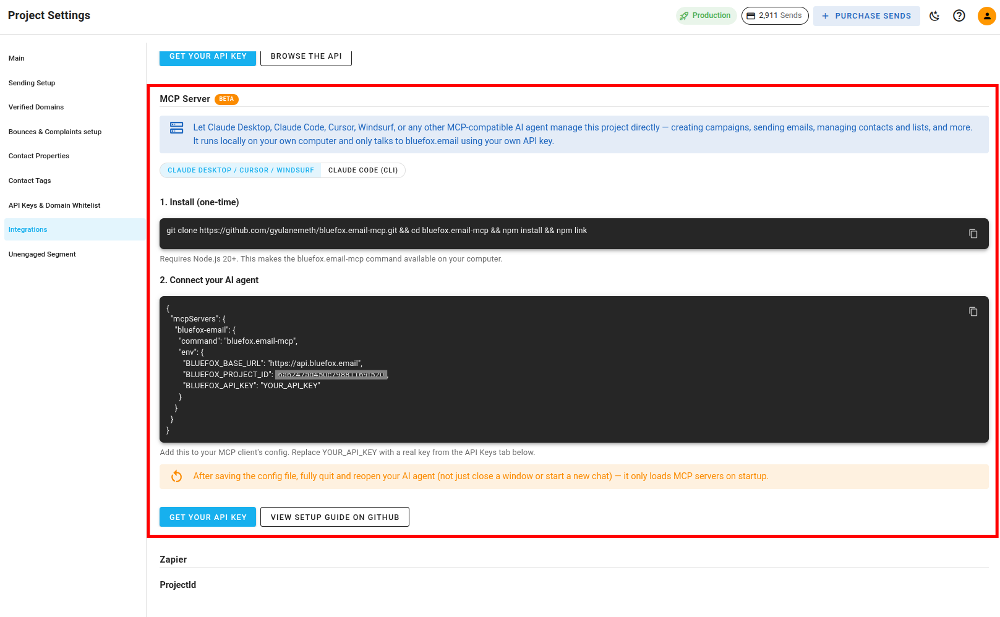

# MCP Server Integration with BlueFox Email

The **MCP server integration** lets an AI agent work directly inside one of your projects. You can ask it to draft and schedule campaigns, manage contacts and subscriber lists, check your sending setup, and review deliverability, all in plain language from your AI client.

It is a [Model Context Protocol](https://modelcontextprotocol.io) server that runs locally on your own computer as a small Node.js program. Nothing is hosted on our side. The server is the only thing that talks to BlueFox Email on your behalf, using the API key you give it, so your key never reaches the AI model itself.

:::info Quick Note
Every action the agent takes is a separate tool call, and you see its arguments and its result as it happens. The agent can only use the tools listed below, so it can never reach beyond them.
:::

## Requirements

You need **Node.js 20 or newer**, and three environment variables set before the server will start. All three come from you, never from the agent.

| Variable | What it is | Where to find it |
| --- | --- | --- |
| `BLUEFOX_BASE_URL` | The API endpoint | Always `https://api.bluefox.email` |
| `BLUEFOX_PROJECT_ID` | The project the server works in | Already filled in for you under **Project Settings > Integrations > MCP Server** |
| `BLUEFOX_API_KEY` | The key the server authenticates with | **Project Settings > [API Keys and Domain Whitelist](/docs/projects/settings#api-keys-and-domain-whitelist)** |

If any of them is missing, the server stops with an error instead of starting up half-connected.

## Finding the Setup in Your Project Settings

Your project generates both setup snippets for you, with your project ID already filled in, so you never have to put them together by hand.

1. Open your project and go to **Project Settings**.

2. Choose **Integrations** in the settings sub-menu.

   

3. Scroll to the **MCP Server** section, below **AI Agents**.

   

4. Pick the tab for your client: **Claude Desktop / Cursor / Windsurf** if your client is set up with a config file, or **Claude Code (CLI)** if you set it up from a terminal.

Each tab gives you two copyable blocks, one for each of the next two sections: a one-time [install command](#installation), and a [connection snippet](#connecting-your-ai-client) for your client. Both already contain your project ID. Replace `YOUR_API_KEY` in the connection snippet with a real key from the **API Keys and Domain Whitelist** section, creating one there first if your project does not have one yet.

:::info Quick Note
The **AI Agents** section just above **MCP Server** is a different thing. It gives you a setup prompt that points an agent at our public API and its OpenAPI spec, with no local server involved. Use that one for AI clients that cannot run a local server, such as ChatGPT.
:::

## Installation

Clone the server, install its dependencies, and link it so your AI client can start it by name:

```bash
git clone https://github.com/bluefox-email/bluefox.email-mcp.git
cd bluefox.email-mcp
npm install
npm link
```

The **MCP Server** section in your project settings gives you the same commands as a single copyable line. Once `npm link` finishes, the `bluefox.email-mcp` command is available on your computer, and that is what every configuration below refers to.

## Connecting Your AI Client

Add the server to your client along with the three environment variables, then restart or reload the client. The tools show up in every new conversation after that, with nothing to repeat per session.

### Claude Desktop

Open **Settings > Developer > Edit Config** and add the server to `claude_desktop_config.json`:

```json
{
  "mcpServers": {
    "bluefox-email": {
      "command": "bluefox.email-mcp",
      "env": {
        "BLUEFOX_BASE_URL": "https://api.bluefox.email",
        "BLUEFOX_PROJECT_ID": "YOUR_PROJECT_ID",
        "BLUEFOX_API_KEY": "YOUR_API_KEY"
      }
    }
  }
}
```

Restart Claude Desktop once you have saved the file.

::: info Windows Note
On Windows, replace the `command` line with `"command": "cmd"` and add `"args": ["/c", "bluefox.email-mcp.cmd"]` next to it. The `env` block stays exactly the same.
:::

### Claude Code

There is no config file to edit here. Register the server from your terminal instead. The **Claude Code (CLI)** tab in your project settings shows this command with your project ID already in it:

```bash
claude mcp add bluefox-email \
  --env BLUEFOX_BASE_URL=https://api.bluefox.email \
  --env BLUEFOX_PROJECT_ID=YOUR_PROJECT_ID \
  --env BLUEFOX_API_KEY=YOUR_API_KEY \
  -- bluefox.email-mcp
```

### Cursor

Add the same `mcpServers` block shown for Claude Desktop to `.cursor/mcp.json` to use it in one project, or to `~/.cursor/mcp.json` to make it available everywhere.

### Windsurf

Add the same block to `~/.codeium/windsurf/mcp_config.json`.

### Cline

Add the server through Cline's **MCP Servers** panel in VS Code, using the same command and environment variables.

### ChatGPT

ChatGPT cannot connect to this integration. Its connectors expect a server reachable at a web address, and this one runs locally on your own computer. Use our [API](/docs/api/) directly instead. The **AI Agents** section of your project settings gives you a ready-made setup prompt for exactly that, with your project ID already in it.

## How the Agent Works

A few things are built into the server itself, so they hold no matter which AI client you use:

- **You can use names instead of IDs**: nearly every tool takes either an ID or the name you see in the app, so you can say "the newsletter list" rather than looking up an ID.
- **Nothing is sent by accident**: creating a campaign or a triggered email saves a draft. Sending it, or scheduling it, is always a separate step you have to ask for.
- **The agent asks instead of guessing**: subject lines, preview text, and sender identity all affect your open rates and deliverability, so the tools tell the agent to ask you rather than invent them.
- **Dates are worked out before the call**: "tomorrow at 8am" is turned into an exact date and time by the agent, since the tools themselves do not read dates written in plain language.
- **One bad row does not stop an import**: `import_contacts` and `bulk_update_contacts` work through contacts one at a time, and you get a report of what went through and what did not.
- **Email content is HTML or plain text**: the agent writes the body itself as a Handlebars template. All the usual [merge tags](/docs/email-personalization) work, including `&#123;&#123;contact.name&#125;&#125;`, your own contact properties, `&#123;&#123;unsubscribeLink&#125;&#125;` and `&#123;&#123;pauseSubscriptionLink&#125;&#125;` on campaigns and triggered emails, and `&#123;&#123;verifyLink&#125;&#125;` in a transactional email used for double opt-in confirmation.

## Available Tools

There are 52 tools in total, grouped the same way the app is. Wherever a tool takes both an ID and a name, you only need one of the two.

### Emails

Tools for [campaigns](/docs/projects/campaigns), [transactional emails](/docs/projects/transactional-emails), and [triggered emails](/docs/projects/triggered-emails).

- **`create_campaign`**: Create a campaign for a subscriber list, optionally narrowed down by a [segment](/docs/projects/segments). It is saved as a draft unless you give a send time and time zone.
- **`create_transactional_email`**: Create a reusable transactional email to send to one recipient later.
- **`send_transactional_email`**: Send a transactional email now to one address, with your own data for the merge tags and optional attachments.
- **`create_triggered_email`**: Create a triggered email tied to a subscriber list, such as a welcome email.
- **`send_triggered_email`**: Send an existing triggered email now, either to specific addresses or to everyone active on its list.
- **`update_email`**: Update a campaign, transactional, or triggered email. This is also how a scheduled campaign is rescheduled or moved back to draft, which is not possible within 6 minutes of its send time.
- **`get_email`**: Look up one email together with its statistics, or list every email of one type.
- **`get_email_recipients`**: See what each recipient did with one particular send: received, opened, clicked, bounced, complained, unsubscribed, paused, or resubscribed.
- **`delete_email`**: Delete a campaign, transactional, or triggered email.
- **`list_email_error_log`**: Review sending and delivery errors for one email over the last 30 days.
- **`send_test_email`**: Send a [test email](/docs/projects/send-test-email) that does not affect your statistics, either to one address or to a private subscriber list.

### Contacts

Tools for the same things you can do on the [contacts](/docs/projects/contacts) page.

- **`create_contact`**: Add a contact, with tags and contact properties. New tags are created for you.
- **`get_contact`**: Look up one contact, with its list memberships and property values.
- **`update_contact`**: Change a contact, including its email address. Passing tags replaces the whole set.
- **`delete_contact`**: Delete a contact and remove it from every list.
- **`import_contacts`**: Import many contacts at once, optionally subscribing them to a list as active or unverified.
- **`bulk_update_contacts`**: Apply one change to many contacts: delete them, add or remove tags, add them to the suppression list, or subscribe and unsubscribe them.
- **`clean_contacts`**: Find contacts that have already bounced or complained, and optionally delete them.
- **`export_contacts`**: Export all of your contacts to a CSV file on your computer.
- **`resend_verification_email`**: Send the double opt-in confirmation again to a contact who has not confirmed yet.

### Subscriber Lists

- **`create_subscriber_list`**: Create a list, with double opt-in, confirmation messages, and sign-up form styling. A double opt-in email has to contain `&#123;&#123;verifyLink&#125;&#125;`, otherwise the list cannot be saved.
- **`update_subscriber_list`**: Change any of those settings on an existing list.
- **`get_subscriber_list`**: Look up one list, or list all of them with their statistics.
- **`delete_subscriber_list`**: Delete a list, as long as no triggered email, campaign, or automation still uses it.
- **`list_list_subscribers`**: See everyone on one list with their [subscription status](/docs/projects/contacts#subscription-statuses).
- **`get_list_subscriber`**: Check one contact's status on one list.
- **`add_list_subscriber`**: Subscribe a contact to a list, creating the contact if it does not exist yet.
- **`update_list_subscriber`**: Change a contact's status on one list only, including pausing it until a date you choose.

### Signup Forms

Tools for the sign-up forms described in [Forms & Pages](/docs/projects/forms-and-pages).

- **`create_signup_form`**: Create a form for one or more lists, choosing which contact properties appear, how the form looks, and whether it uses a captcha.
- **`update_signup_form`**: Change an existing form.
- **`get_signup_form`**: Look up one form, or list all of them.
- **`delete_signup_form`**: Delete a form. Everyone who signed up through it stays subscribed.
- **`get_signup_form_embed_html`**: Save the ready-to-embed HTML of a form to a file, so you can hand it to whoever looks after your website.

### Project Settings

- **`manage_segment`**: List, create, change, or delete [segments](/docs/projects/segments). A segment still used by a campaign or automation cannot be deleted.
- **`manage_project_settings`**: Change your project name and logo, your [unengaged segment](/docs/projects/settings#unengaged-segment), what happens to contacts that bounce or complain, and your domain whitelist. It cannot read or change API keys.
- **`manage_contact_fields_and_tags`**: Manage which contact properties and tags exist in your project. Properties can be added and removed but not renamed, and removing one loses the values stored under it.
- **`manage_design_system`**: Read or override parts of your [email theme](/docs/projects/email-theme-settings), such as colors, fonts, and button styles. It can only override the theme you already use, not switch to another one.
- **`manage_sending_setup`**: Manage your domains, [sender identities](/docs/projects/delivery-modes#managing-sender-identities), and regions. A sender identity needs a verified domain first, and the first identity in the list is the default one.
- **`manage_webhook`**: Read, set, or remove your project's [webhook](/docs/integrations/webhooks). Setting it replaces the whole configuration, so every event you want has to be included each time.
- **`test_webhook`**: Send a test event to your webhook URL to check that it is reachable.
- **`manage_suppression_list`**: Add to, remove from, or review your project's [suppression list](/docs/projects/suppression-list).
- **`manage_templates`**: List, inspect, duplicate, rename, or delete your [templates](/docs/projects/predesigned-templates).

### Production Access and Sending Limits

Tools for the [delivery modes](/docs/projects/delivery-modes) described in your project settings.

- **`apply_for_production_access`**: Apply to leave sandbox mode. You need at least one domain with SPF, MX, and DKIM verified.
- **`get_production_access_status`**: Check where your request stands, along with your current limits and sending rates.
- **`request_limit_increase`**: Ask for a higher monthly sending limit once you are in production mode.
- **`get_sandbox_deliverability`**: See how many emails you have sent today in sandbox mode, and your [bounce](/email-sending-concepts/bounce-rate) and [complaint](/email-sending-concepts/complaints) rates.
- **`get_production_deliverability`**: See your worst bounce and complaint rates over the last 7, 30, and 90 days, broken down by domain.
- **`export_domain_dns`**: Save a domain's DKIM, SPF, DMARC, and MX records to a CSV file, for whoever manages your DNS.

### AWS SES

Tools for projects that send through their own AWS account rather than our shared infrastructure.

- **`set_byo_aws_config`**: Set your AWS credentials, region, sending rate, and sender identities, and switch the project over to your own AWS account.
- **`get_aws_config`**: Read back your region, limits, and sender identities. Your actual credentials are never returned.
- **`check_aws_credentials`**: Check against AWS that your credentials work, your sender identities are verified, and your sending rate fits your account.
- **`get_cloudformation_link`**: Get the CloudFormation link that creates the role we need in your AWS account.

## What the MCP Server Cannot Do

- **It cannot design emails in the visual editor.** Every email it creates is written as HTML or plain text. It cannot open, edit, or produce visual editor content, and it cannot start a new email from one of your templates.
- **It cannot see your API keys.** No tool can read, create, or rotate them, not even the project settings tool. Anything that needs a key, such as a webhook secret, has to be pasted in by you.
- **It cannot filter by date range.** Lists can only be filtered on exact values, so something like "campaigns from this month" means fetching them all and sorting through them afterwards.
- **It works in one project at a time.** The project ID is fixed when the server starts, so a second project means adding a second server to your client.

## Example Workflow

Here is what putting together a first campaign usually looks like:

1. The agent lists your sender identities and subscriber lists so you can pick who the campaign comes from and who receives it.
2. You settle on a subject line and preview text together, and the campaign is saved **as a draft**.
3. The agent writes the HTML body and updates the draft with it.
4. You send yourself a test email, which does not affect your statistics.
5. Only when you ask for it is the campaign scheduled or sent.

Nothing reaches a real recipient until that last step.

## Additional Resources

- [API Documentation](/docs/api/)
- [Email Personalization (Merge Tags)](/docs/email-personalization)
- [Model Context Protocol documentation](https://modelcontextprotocol.io)
