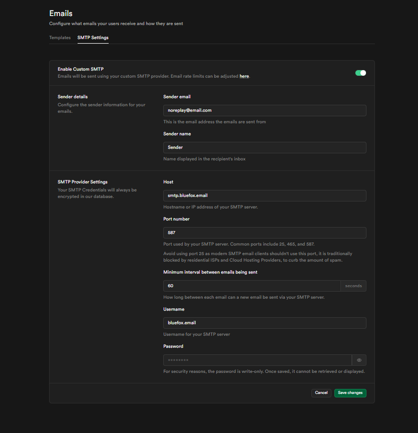
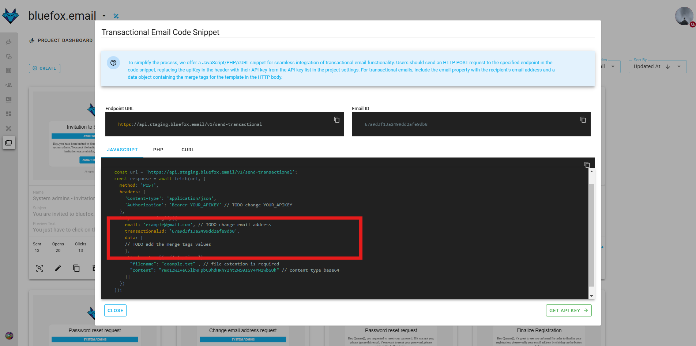
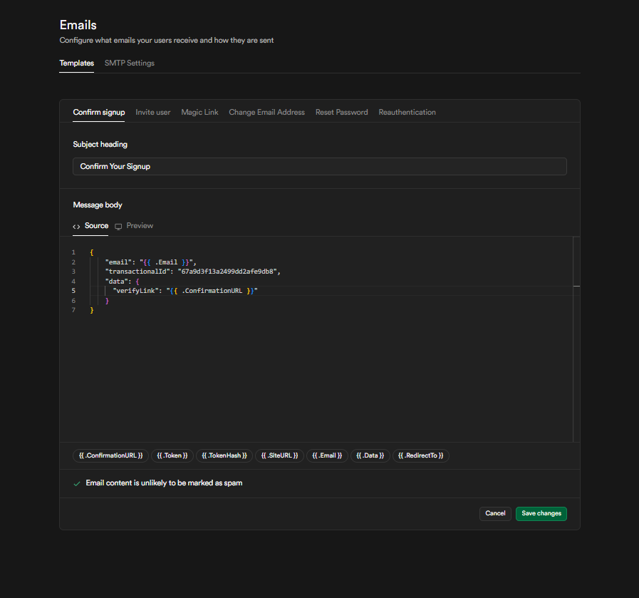
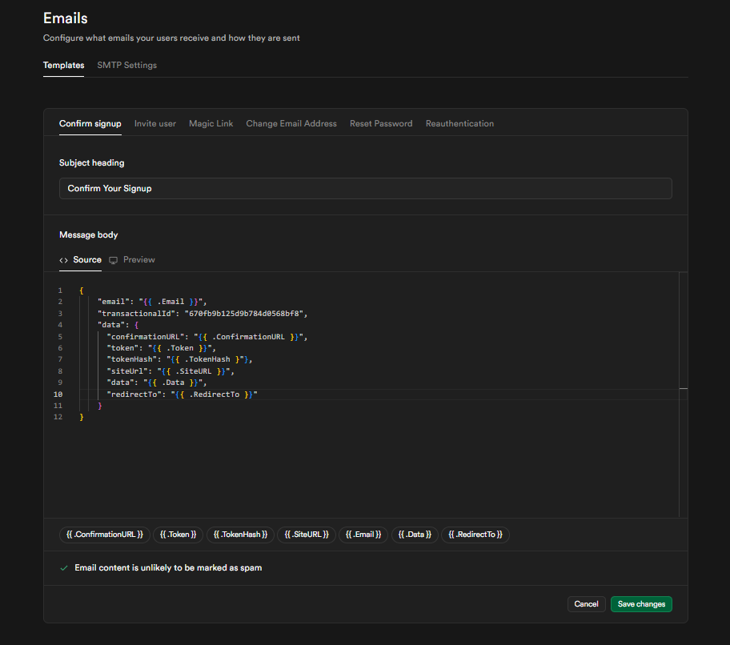
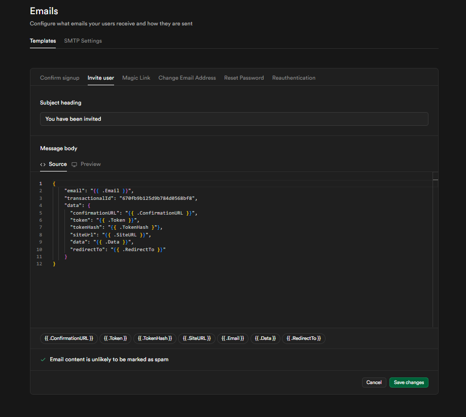
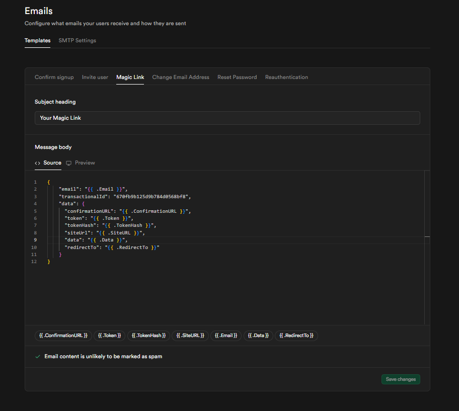
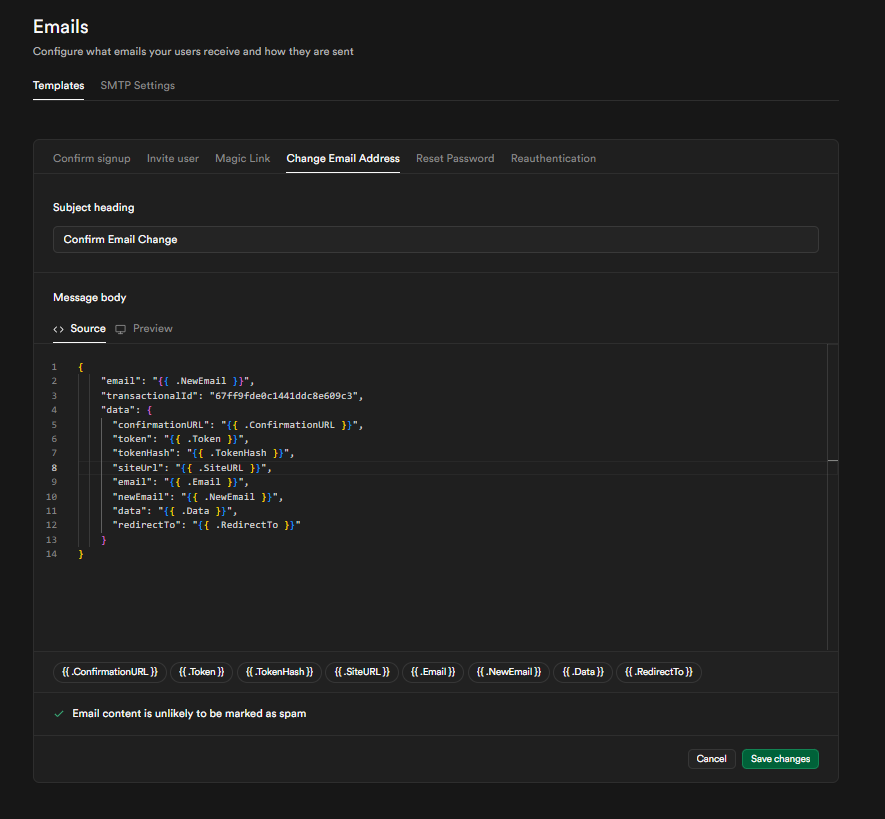
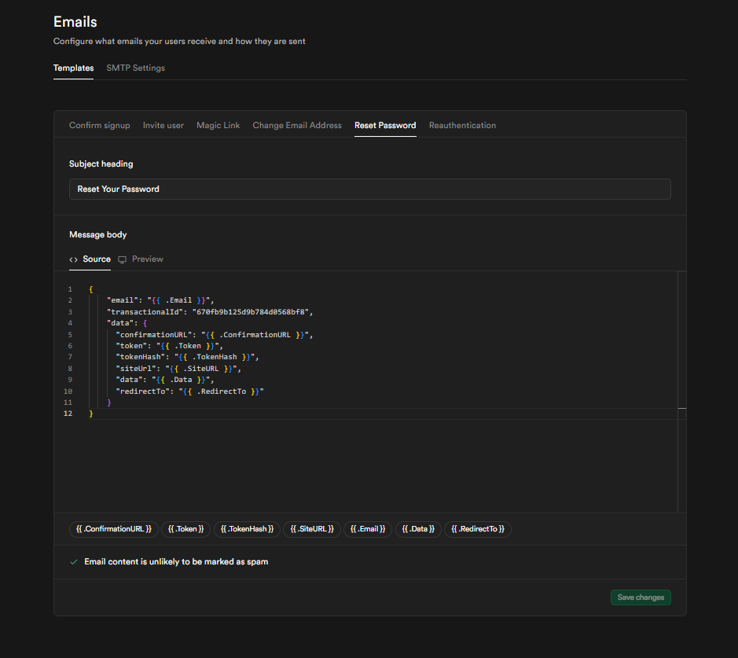
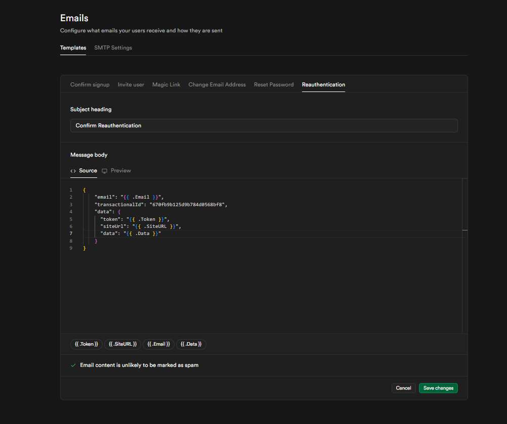

# Supabase

Supabase provides built-in authentication that requires sending various transactional emails, such as signup confirmations, password resets, and magic links. By integrating bluefox.email, you can ensure better email deliverability, branding, and tracking while maintaining full control over your email templates.

## Setting Up Supabase

To send emails through bluefox.email, you need to configure supabase to use a custom SMTP server. Start by logging into your supabase project and navigating to **Project Settings > Authentication**. In this section, locate **Email Settings**, where you’ll find the option to enable **Custom SMTP**.

Once enabled, enter the following SMTP configuration details:

| Field          | Value                                              |
|---------------|--------------------------------------------------|
| **SMTP Host**  | `smtp.bluefox.email`                             |
| **Port**       | `587`                                            |
| **Username**   | `bluefox.email`                                  |
| **Password**   | Use an [API key](/docs/projects/settings.html#api-keys) from your Blufox.email project settings |

In the Sender Details section, supabase requires you to enter values for Sender Email and Sender Name. However, these fields will not affect your outgoing emails —bluefox.email will always override them with the settings from your email templates in the next step.




After entering these details, save the configuration.

Keep in mind that supabase's interval and rate limit settings will still apply when sending emails through bluefox.email. Additionally, your email sending will be subject to your project's sending rate limit per second, so ensure your configuration stays within this limit to avoid delivery issues

## Creating a Transactional Email

To enable supabase to send authentication emails through bluefox.email, you need to create ``transactional email`` for each email type. At a minimum ``Confirm Signup`` and ``Magic Link`` must be set up for proper integration.

**Supabase email types:**
- Confirm Signup
- Magic Link
- Change Email Address
- Password Reset
- Reauthentication
- User Invitation

To create a **transactional email**, navigate to your **bluefox.email** project and [create a new transactional email](/docs/projects/transactional-emails#creating-a-transactional-email). This email will be used to send authentication-related messages based on supabase triggers.

Inside the email template, use **merge tags** to dynamically insert content from supabase. For example, in a Confirm Signup email, link the ``{ { verifyLink } }`` merge tag in your email template to ``{ { .ConfirmationURL } }``from supabase.

The following merge tags provided by supabase allow you to personalize and structure the email content dynamically:

  ```plaintext
  {{ .ConfirmationURL }} - URL to confirm the e-mail address for the new account
  {{ .Token }} - The 6-digit numeric email OTP
  {{ .TokenHash }} - The hashed token used in the URL
  {{ .SiteURL }} - The URL of the site
  {{ .Email }} - The user's email address
  {{ .Data }} - The user's `user_metadata`
  {{ .RedirectTo }} – The URL of `emailRedirectTo` passed in options
  ```

Once your template is set up, save the transactional email. In the next step, you’ll configure supabase to use this template by mapping the JSON data structure correctly.


## Configuring the Transactional Email in Supabase

After setting up your transactional email, you need to configure supabase to use it:

1. In **bluefox.email**, navigate to the **code guide** section of your transactional email and locate the JSON body and copy it.

 

2. In **supabase**, go to **Authentication > Email Templates** and select the email type to configure.
3. Paste the copied JSON inside the **Email Source** field and modify the `"data"` object to ensure it passes the correct supabase variables.

 

Example JSON:
  ```json
   {
     "email": "{{ .Email }}",
     "transactionalId": "YOUR_TRANSACTIONAL_EMAIL_ID",
     "data": {
       "verifyLink": "{{ .ConfirmationURL }}"
     }
   }
  ```

::: info Note
You can use any variable name inside the "data" object, but ensure that it correctly maps to the corresponding Supabase data. For example, if you name your variable "verifyLink", you must reference it in your transactional email template as { { verifyLink } }. Always verify that the variables passed in the JSON match the merge tags used in your transactional  email template.
:::


By following this guide and save the email template, you can successfully configure supabase to send authentication emails through bluefox.email, ensuring reliable email delivery and full customization.

## Confirm Signup Email

After setting up your transactional email, you need to configure supabase to use it:

:::tip If you're using one of the Supabase prebuilt templates inside bluefox.email, you don't need to configure the merge tags manually they’re already set up in the template. 
:::

1. In **bluefox.email**, navigate to the **code guide** section of your transactional email and locate the JSON body and copy it.

 

2. In **supabase**, go to **Authentication > Email Templates** and select the email type to configure.
3. Paste the copied JSON inside the **Email Source** field and modify the `"data"` object to ensure it passes the correct supabase variables.

 

Example JSON:
  ```json
   {
     "email": "{{ .Email }}",
     "transactionalId": "YOUR_TRANSACTIONAL_EMAIL_ID",
     "data": {
      "confirmationURL": "{{ .ConfirmationURL }}",
      "token": "{{ .Token }}",
      "tokenHash": "{{ .TokenHash }}",
      "siteUrl": "{{ .SiteURL }}",
      "data": "{{ .Data }}",
      "redirectTo": "{{ .RedirectTo }}"
     }
   }
  ```

::: info Note
You can use any variable name inside the "data" object, but ensure that it correctly maps to the corresponding Supabase data. Always verify that the variables passed in the JSON match the merge tags used in your transactional  email template.
:::


By following this guide and save the email template, you can successfully configure supabase to send authentication emails through bluefox.email, ensuring reliable email delivery and full customization.

## Invite User Email

After setting up your transactional email, you need to configure supabase to use it:

:::tip If you're using one of the Supabase prebuilt templates inside bluefox.email, you don't need to configure the merge tags manually they’re already set up in the template. 
:::

1. In **bluefox.email**, navigate to the **code guide** section of your transactional email and locate the JSON body and copy it.

 

2. In **supabase**, go to **Authentication > Email Templates** and select the email type to configure.
3. Paste the copied JSON inside the **Email Source** field and modify the `"data"` object to ensure it passes the correct supabase variables.

 

Example JSON:
  ```json
   {
     "email": "{{ .Email }}",
     "transactionalId": "YOUR_TRANSACTIONAL_EMAIL_ID",
     "data": {
      "confirmationURL": "{{ .ConfirmationURL }}",
      "token": "{{ .Token }}",
      "tokenHash": "{{ .TokenHash }}",
      "siteUrl": "{{ .SiteURL }}",
      "data": "{{ .Data }}",
      "redirectTo": "{{ .RedirectTo }}"
     }
   }
  ```

::: info Note
You can use any variable name inside the "data" object, but ensure that it correctly maps to the corresponding Supabase data. Always verify that the variables passed in the JSON match the merge tags used in your transactional  email template.
:::


By following this guide and save the email template, you can successfully configure supabase to send authentication emails through bluefox.email, ensuring reliable email delivery and full customization.


## Magic Link Email

After setting up your transactional email, you need to configure supabase to use it:

:::tip If you're using one of the Supabase prebuilt templates inside bluefox.email, you don't need to configure the merge tags manually they’re already set up in the template. 
:::

1. In **bluefox.email**, navigate to the **code guide** section of your transactional email and locate the JSON body and copy it.

 

2. In **supabase**, go to **Authentication > Email Templates** and select the email type to configure.
3. Paste the copied JSON inside the **Email Source** field and modify the `"data"` object to ensure it passes the correct supabase variables.

 

Example JSON:
  ```json
   {
     "email": "{{ .Email }}",
     "transactionalId": "YOUR_TRANSACTIONAL_EMAIL_ID",
     "data": {
      "confirmationURL": "{{ .ConfirmationURL }}",
      "token": "{{ .Token }}",
      "tokenHash": "{{ .TokenHash }}",
      "siteUrl": "{{ .SiteURL }}",
      "data": "{{ .Data }}",
      "redirectTo": "{{ .RedirectTo }}"
     }
   }
  ```

::: info Note
You can use any variable name inside the "data" object, but ensure that it correctly maps to the corresponding Supabase data. Always verify that the variables passed in the JSON match the merge tags used in your transactional  email template.
:::


By following this guide and save the email template, you can successfully configure supabase to send authentication emails through bluefox.email, ensuring reliable email delivery and full customization.

## Change Email Address Email

After setting up your transactional email, you need to configure supabase to use it:

:::tip If you're using one of the Supabase prebuilt templates inside bluefox.email, you don't need to configure the merge tags manually they’re already set up in the template. 
:::

1. In **bluefox.email**, navigate to the **code guide** section of your transactional email and locate the JSON body and copy it.

 

2. In **supabase**, go to **Authentication > Email Templates** and select the email type to configure.
3. Paste the copied JSON inside the **Email Source** field and modify the `"data"` object to ensure it passes the correct supabase variables.

 

Example JSON:
  ```json
   {
     "email": "{{ .NewEmail }}",
     "transactionalId": "YOUR_TRANSACTIONAL_EMAIL_ID",
     "data": {
      "confirmationURL": "{{ .ConfirmationURL }}",
      "token": "{{ .Token }}",
      "tokenHash": "{{ .TokenHash }}",
      "siteUrl": "{{ .SiteURL }}",
      "email": "{{ .Email }}",
      "data": "{{ .Data }}",
      "redirectTo": "{{ .RedirectTo }}"
     }
   }
  ```

::: info Note
You can use any variable name inside the "data" object, but ensure that it correctly maps to the corresponding Supabase data. Always verify that the variables passed in the JSON match the merge tags used in your transactional  email template.
:::


By following this guide and save the email template, you can successfully configure supabase to send authentication emails through bluefox.email, ensuring reliable email delivery and full customization.


## Reset Password Email

After setting up your transactional email, you need to configure supabase to use it:

:::tip If you're using one of the Supabase prebuilt templates inside bluefox.email, you don't need to configure the merge tags manually they’re already set up in the template. 
:::

1. In **bluefox.email**, navigate to the **code guide** section of your transactional email and locate the JSON body and copy it.

 

2. In **supabase**, go to **Authentication > Email Templates** and select the email type to configure.
3. Paste the copied JSON inside the **Email Source** field and modify the `"data"` object to ensure it passes the correct supabase variables.

 

Example JSON:
  ```json
   {
     "email": "{{ .Email }}",
     "transactionalId": "YOUR_TRANSACTIONAL_EMAIL_ID",
     "data": {
      "confirmationURL": "{{ .ConfirmationURL }}",
      "token": "{{ .Token }}",
      "tokenHash": "{{ .TokenHash }}",
      "siteUrl": "{{ .SiteURL }}",
      "data": "{{ .Data }}",
      "redirectTo": "{{ .RedirectTo }}"
     }
   }
  ```

::: info Note
You can use any variable name inside the "data" object, but ensure that it correctly maps to the corresponding Supabase data. Always verify that the variables passed in the JSON match the merge tags used in your transactional  email template.
:::


By following this guide and save the email template, you can successfully configure supabase to send authentication emails through bluefox.email, ensuring reliable email delivery and full customization.


## Reauthentication Email

After setting up your transactional email, you need to configure supabase to use it:

:::tip If you're using one of the Supabase prebuilt templates inside bluefox.email, you don't need to configure the merge tags manually they’re already set up in the template. 
:::

1. In **bluefox.email**, navigate to the **code guide** section of your transactional email and locate the JSON body and copy it.

 

2. In **supabase**, go to **Authentication > Email Templates** and select the email type to configure.
3. Paste the copied JSON inside the **Email Source** field and modify the `"data"` object to ensure it passes the correct supabase variables.

 

Example JSON:
  ```json
   {
     "email": "{{ .Email }}",
     "transactionalId": "YOUR_TRANSACTIONAL_EMAIL_ID",
     "data": {
      "token": "{{ .Token }}",
      "siteUrl": "{{ .SiteURL }}",
      "data": "{{ .Data }}"
     }
   }
  ```

::: info Note
You can use any variable name inside the "data" object, but ensure that it correctly maps to the corresponding Supabase data. Always verify that the variables passed in the JSON match the merge tags used in your transactional  email template.
:::


By following this guide and save the email template, you can successfully configure supabase to send authentication emails through bluefox.email, ensuring reliable email delivery and full customization.


## Testing

After setup, test your configuration by creating a new user in supabase.

Start by navigating to **Authentication > Users** in your supabase project. Click **Add User**, then select **Create New User** and enter an email address you have access to.

Once the user is created, select them from the list and click **Send Magic Link**. This action will trigger supabase to send the Magic Link email through bluefox.email SMTP, allowing you to confirm that the integration is functioning properly.

::: info Troubleshooting

If you encounter any issues with email delivery, supabase provides authentication logs that can help diagnose problems.
Navigate to **Logs > Auth** in your supabase project. To quickly find relevant entries, use search terms like "magiclink" or "invite" to filter logs related to authentication emails. These logs can provide insights into whether emails are being triggered correctly and if there are any errors in the delivery process.

:::


