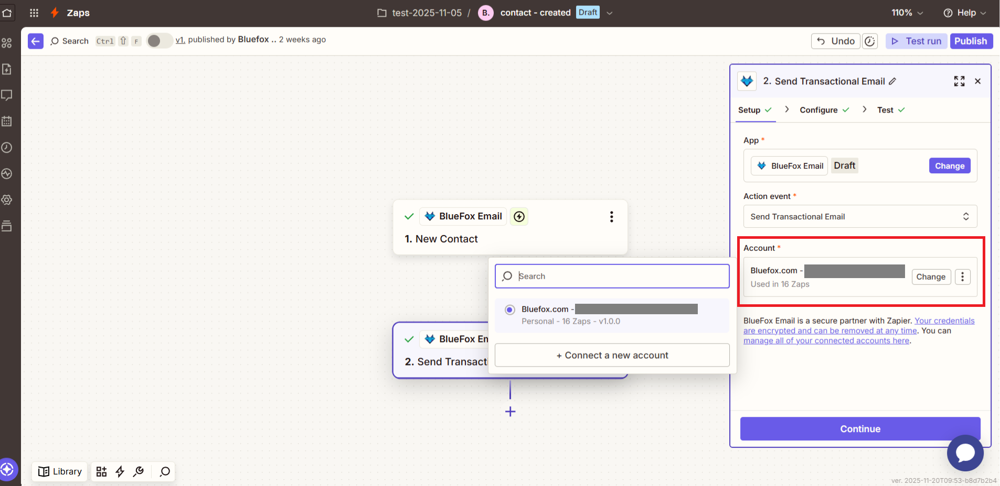
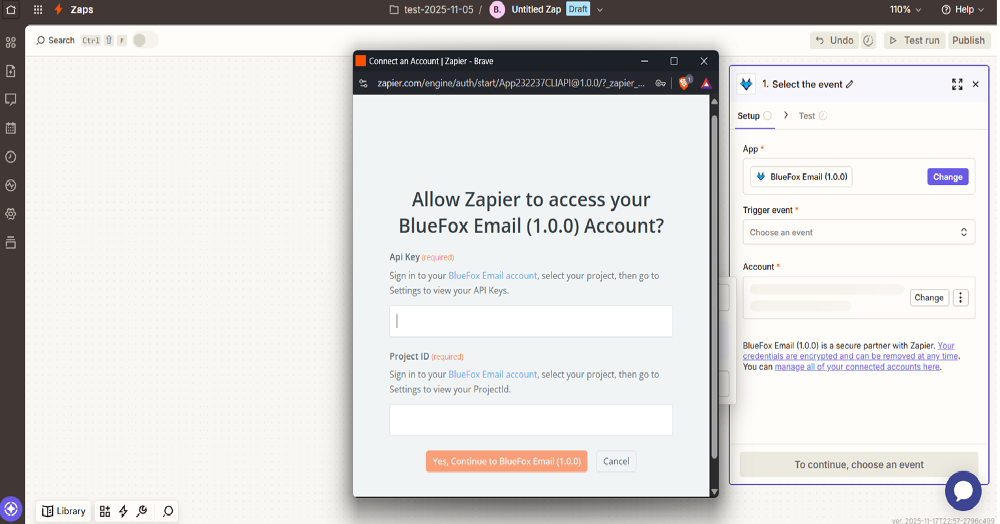
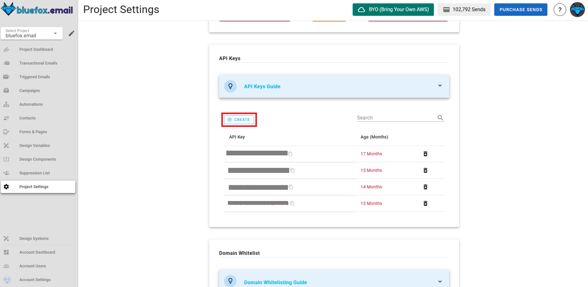
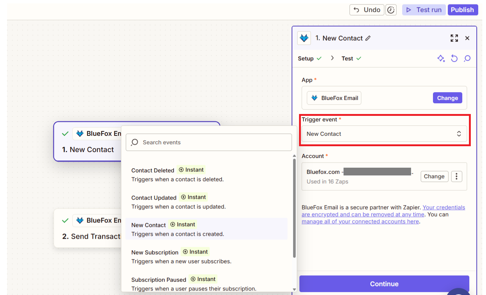
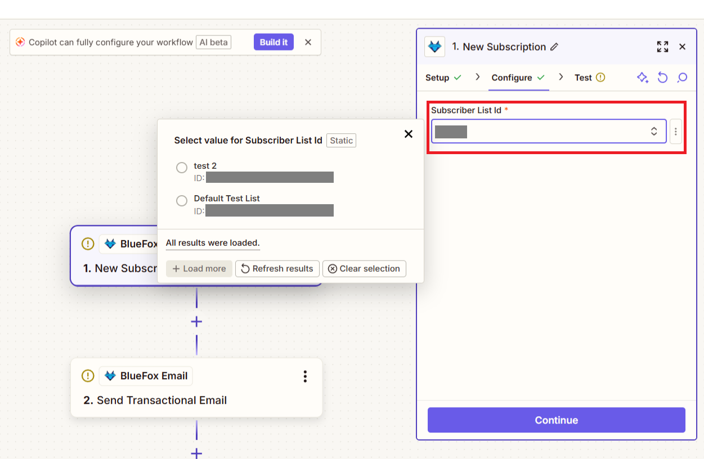
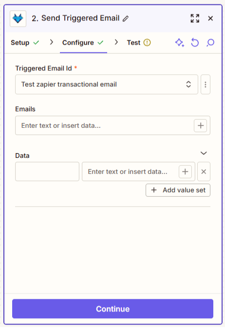
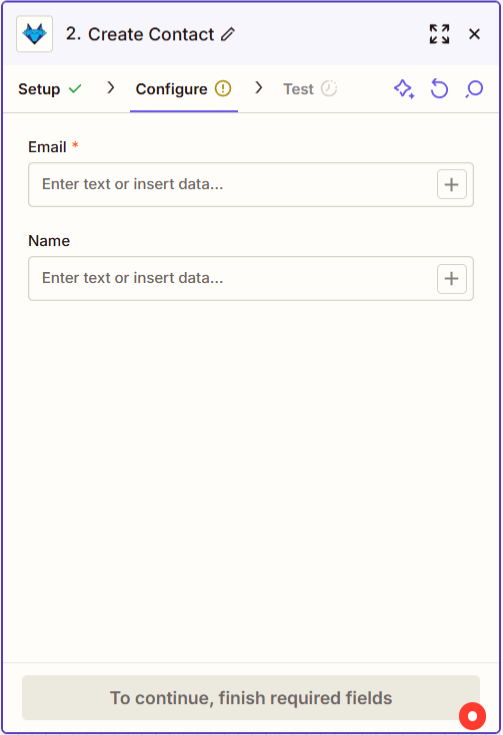

# Zapier Integration with BlueFox Email

The **Zapier integration** allows you to automate your email workflows by connecting BlueFox Email with thousands of apps available on the Zapier platform. This integration enables you to streamline processes such as managing contacts, sending emails, and handling subscriptions without any coding knowledge just create your Zapier accounts and start automating.

:::info Quick Note
For Zapier related documents and support, please refer to the official Zapier documentation and support channels. This document focuses on the integration aspects specific to BlueFox Email.
:::

## A short overview of Zapier

Zapier is a powerful automation platform that connects your favorite apps and services to automate repetitive tasks. With Zapier, you can create "Zaps" that consist of a trigger and one or more actions. When the trigger event occurs in one app, Zapier automatically performs the specified actions in other connected apps. This allows you to streamline workflows, save time, and reduce manual effort across various applications.

## Authentication

To authenticate your BlueFox Email account in Zapier, you will need your BlueFox Email API key and project ID. Follow these steps:

1. In the Zaps setup, when prompted for account connection either for triggers or actions, click on "Accounts".

2. Here select connect a new account.

3. A pop-up window will appear asking for your BlueFox Email API key and project ID. You can find your API key in your [BlueFox Email project settings](/docs/projects/settings) and your project ID in the [BlueFox Email Contacts](/docs/projects/contacts).

4. In your BlueFox Email Project Settings, navigate to the bottom of the page to find Zapier Integration section where you can copy your API key and project ID.

7. Enter the API key and project ID in that Zapier pop-up window from earlier, then click "Yes, Continue to BlueFox Email" to authorize Zapier to access your BlueFox Email project.

And thats it! Your BlueFox Email account is now connected to Zapier, and you can start creating Zaps using BlueFox Email triggers and actions. Lets explore the available triggers and actions.

## Available Triggers and Actions

### Triggers

Click on triggers to see the available options.

- **New Contact**: Triggered when a new contact is added to your BlueFox Email project.
- **Contact Updated**: Triggered when an existing contact is updated in your BlueFox Email project.
- **Contact Deleted**: Triggered when a contact is removed from your BlueFox Email project.

Once you select a trigger, click "Continue" to set up and test the trigger.

- **New Subscription**: Triggered when a new contact subscribes to a subscription list.
- **Unsubscription**: Triggered when a contact unsubscribes from a subscription list.
- **Subscription Paused**: Triggered when a contact's subscription is paused.

Here once you select subscription based trigger and click continue you will be asked to select the subscription list for which you want to set up the trigger.

Hit continue and test the trigger.

### Actions
Click on actions to see the available options.

- **Send Transactional Email**: Send a transactional email to a specified contact.
- **Send Triggered Email**: Send a triggered email based on specific events.

While working with these actions, you will be asked to map various fields.

These fields will change for triggered email action.

- **Create Contact**: Add a new contact in your BlueFox Email project.
- **Update Contact**: Update an existing contact's details in your BlueFox Email project.
- **Delete Contact**: Remove a contact from your BlueFox Email project

In these actions, you will be asked to provide contact details like email and name.

- **Subscribe Email**: Subscribe a contact to a specific subscription list.
- **Unsubscribe Contact**: Unsubscribe a contact from a specific subscription list.
- **Pause Subscription**: Pause a contact's subscription to a subscription list.

In these actions, you will be asked to provide the contact email and select the subscription list.

After setting up the action, click "Continue" to test it. If the test is successful, you can turn on your Zap to start automating your workflows.

### Additional Resources

- [BlueFox Email API Documentation](https://bluefox.email/docs/api)
- [Zapier Help Center](https://zapier.com/help)