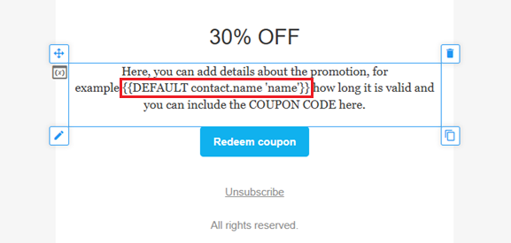

# Email personalization (merge tags)

Email personalization is essential for modern companies. You need to grab your customers' attention, otherwise they won't click and won't open your next email. If you send nice, personalized emails to your users, that increases the likelyhood that they will love your emails!

In bluefox.email, we use [handlebars](https://handlebarsjs.com/) for personalization. It means, that you will be able to put merge tags into your emails with the **&#123;&#123;mustageSyntax&#125;&#125;**.

There are two primary ways to refer to data from your emails:
 - send the data with your request
 - use data from bluefox.email

A straightforward was of personalizing an emails is that you send data with your API call. You can only do it with transactional and triggered emails. For example, if you want to send your users favorite animal with your request, you put a `favoriteAnimal` property to your request:

```
...
"data": {
  "favoriteAnimal": "fox"
},
...
```

Within your email, you can use the **&#123;&#123;favoriteAnimal&#125;&#125;** merge tag:


And as you could have guessed it, the sent out email will look like this:


You can also personalize your emails with data stored in bluefox.email. You can read about it in the two upcoming sections: "Built-in merge-tags" and "Contact properties".

## Built-in merge-tags

There are a few built-in variables that you can use in your emails without sending them in your request. It means that these variables can also be used in campaigns.

### Contact's email address
The first example is the contact's email address:

```
{{contact.email}}
```
This variable is always available in all emails.

### Unsubscribe link
Every non-transactional email must have an unsubscribe link. You can use the following merge tag to put an unsubscribe link into your email:
```
{{unsubscribeLink}}
```
This variable is not available in transactional emails.

### Pause subscription link
Similarly, you can put a [pause subscription](/email-best-practices-for-saas/unsubscribe-and-pause-subscription) link into the emial. When users click on this one, the unsubscribe option will be hidden on the subscription preferences page.
```
{{pauseSubscriptionLink}}
```
This variable is not available in transactional emails.


## Contact properties
Contact properties will also always be available without sending them in your request.

As you previously could see, there is a built-in contact property, and it's the contact's email address:
```
{{contact.email}}
```
Besides this, all of the contact properties are optional. You can [add or remove](/docs/projects/settings#contact-properties) as many as you want, and you can update the property values via [API calls](/docs/api/subscriber-list-management#update-subscriber) or you can edit them on the UI. // TODO INSERT LINK

You can reach the contact properties via the `contact` object, as you could previously see. So for example, if you defined a `firstName` property for your contacts, you will be able to refer it with the following merge tag:

```
{{firstName}}
```

## Text personalization

When it comes to personalization, probably the most important thing is to personalize texts. Besides typing in the merge tags themselves, while editing a text element, you can also click the merge tag button higlighted on the screenshot below.


It will open a dialog that contains all the possible merge built-in merge tags, and the contact-related merge tags that you defined.


You just need to click on the one you want to insert.



You can also use merge tags in your links within your text. Open the link dialog by clicking on the highlighted icon:


You can see the merge tags icon highlighted on the right hand side. That opens the same dialog that you saw previously. Keep in mind, that you will need to change the protocol to other, if the link inserted by your merge tag already contains a protocol.


If you want to refer to data that you send on the request body when you send a triggered or transactional email, you will still need to type in the merge tag itself. Just follow the same object structure that you had on the request. So for example, if you send the following data:

```json
...
"body": {
  "parent": {
    "name": "Joe Doe"
  }
}
...
```
And you wanna refer to the parent's name, then you will need to type in the following merge tag in your text element:
```
{{parent.name}}
```


## Button personalization

For button elements, you can set the `src` property with merge tags. Similarly to links in *text* elements, you have to set the protocol to other, if the merged variable already contains the protocol, such as `https://`. Besides the link itself, you can also set the `title` attribute of the link. (Whenever a someone hovers over the link, the title attribute will show up in a tooltip in your email.)


## Image personalization

Similarly to buttons, you can customize the link around an image with merge tags. Besides that, you can also set the `alt` text of the image with merge tags. Alt text is great for accessibility, just think about it: screen readers can't read out images, but they can the alt text!


If you also need to personalize the image itself (for example, you want to show the profile picture of a user), you will need to use a "Dynamic Image". Dynamic images in the editor are just placeholders, their `src` is always set at send time by replacing a merge tag with a real link.


You can drag 'n' drop a new dynamic image to the canvas from the left-hand-side.


## Conditionals

You can create optional content for your recipients with conditionals. For example, if a subscriber is a premium user, you migh show extra content for them, or you can even create geolocation-dependent content (or anything else that you can come up with).

In the screenshot below, the expression button is highlighted. That will open up the same dialog that merge tag buttons opened. (Note that in conditionals, you don't need to add the curly braces!)


As you can see, a conditional can contain complex layouts, not only basic elements.

You can drag conditionals from the left-hand side of the editor.


## Loops

With loops, you can iterate over an array of elements. It means, that a section of a template can be repeated as many times as many elements your array contains. Your array can contain objects, and within the loop, you can refer to the actual object with the `this` keyword. For example, you can show multiple messages, or articles. The expression you set for loops has to be the name of the array you want to iterate through. A loop in bluefox.email translates to an `each` in handlebars.


You can drag a loop element from the lef-hand-side of the editor:


## Handlebars extensions

Since handlebars' default functionality is quite limited, we made some extensions to make your lives easier.

### each

We overrode the default behaviour of `each` by adding `SKIP` and `LIMIT`.

The example below, skips the first two articles, and only iterates through three items.
```
{{#each articles SKIP=2 LIMIT=3}}
```

### Logical operators

#### AND

#### OR

#### NOT

#### EQ

#### INCLUDES

### String manipulation

#### CAPITALIZE

#### TRUNCATE
