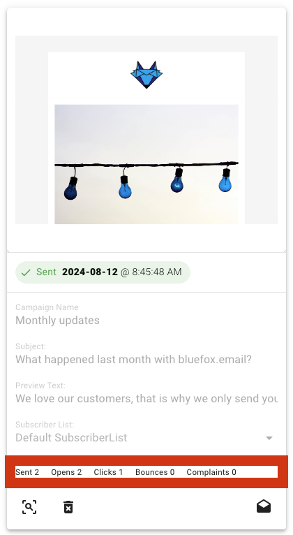
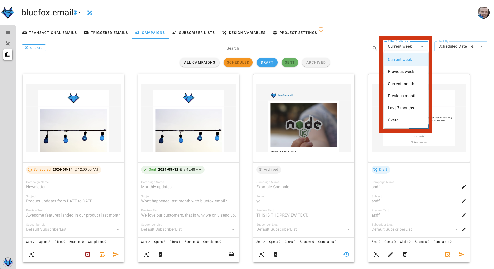

# Email Analytics

We provide the following analytics for all of our email types (transactional emails, triggered emails, and campaigns): sends, opens, clicks, bounces, and complaints.

You can view these analytics on the email cards, located right above the action buttons for each email type:

By default, these numbers reflect stats from the current week. If you want to change the time period, select from the options highlighted in the screenshot below: current week, previous week, current month, previous month, last 3 months, or overall.

