# Automations

An **automation** is a workflow that runs once per contact: a trigger admits the contact, and that contact then travels through the nodes you have laid out until it exits. Each contact moves independently, so at any moment different contacts sit at different points in the same automation. That is the detail most of this page turns on, and it is why editing a live automation needs care. Below: building one, what each node type does, publishing and pausing, updating one that is already running, and the statistics it reports.

<Primer>

- **Deleting a node terminates every contact currently sitting on it, once you apply the change to in-progress contacts.** Choosing **Apply to upcoming events only** leaves contacts already in the automation on the old version, unaffected. Check the contact count on a node before you remove it.
- **The Notify node does not email the contact flowing through the automation.** It sends to a subscriber list you choose, or to specific addresses from it, which is what makes it useful for alerting your own team. Because it targets a list, it also offers **Exclude unengaged**, driven by the project-wide [unengaged segment](/docs/projects/settings#unengaged-segment) definition.
- **The editor you pick for a node's email decides which design features you get.** Pre-designed and [design system templates](/docs/email-themes/templates) are available only in the Visual Editor, and an email written in Raw HTML or Plain Text cannot be saved back as a reusable template. This applies to Send Email and Notify nodes alike.
- **An automation can be copied into a different project, not just duplicated within one.** Copy and paste works across every project in the same account, so a working flow can be reused for another client instead of rebuilt.

<template #next>

[Transactional, triggered, campaign or automation?](/posts/transactional-triggered-campaign-or-automation-understanding-email-types) · [Build a newsletter from an RSS feed](/posts/how-to-create-a-newsletter-from-rss-and-send-it-automatically) · [Free link checker](/tools/content/link-checker)

</template>

</Primer>

You can manage and view your automations under the **Automations** tab in your project.

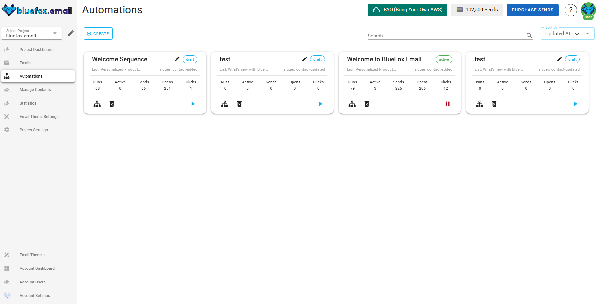

## Creating an Automation

To create a new automation email click on the Create button.

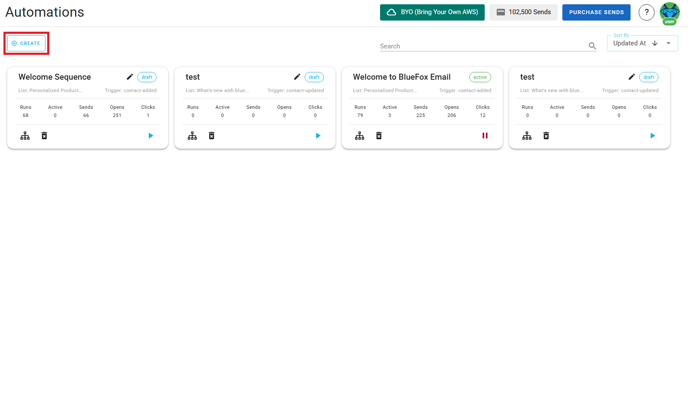

Next, Enter the name and select the trigger type

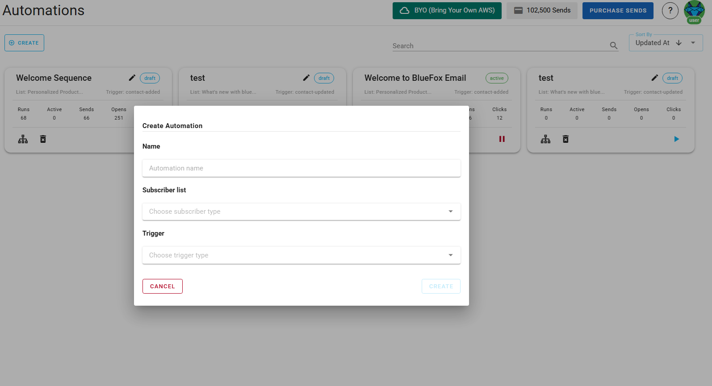

When you're done, click create. You can make changes later as well.

Once created, you’ll be taken to the automation builder, where you can configure the flow by adding different types of nodes.

## Copying and Pasting Automations

Instead of rebuilding an automation from scratch, you can copy an existing one and paste it elsewhere. This is useful when a new automation is close to one you have already configured.

Click the copy icon on the automation card to copy it. You can then paste it:

- Within the same project
- Within the same account, across your projects

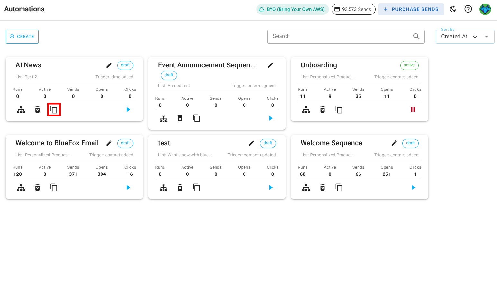

## Automation Structure

Each automation starts with a **Trigger Node**, which determines how and when the automation starts. From there, you can add additional nodes by hovering over the line below the node and clicking the **+** icon. This opens a selector for adding one of the available node types.

The available node types are:
- **Send Email**
- **Notify** 
- **Timer**
- **Audience Filter**
- **Branching**
- **Set Value**
- **Manage Tags**
- **Webhook**
- **Complete Node**

Let’s go through each one in detail.

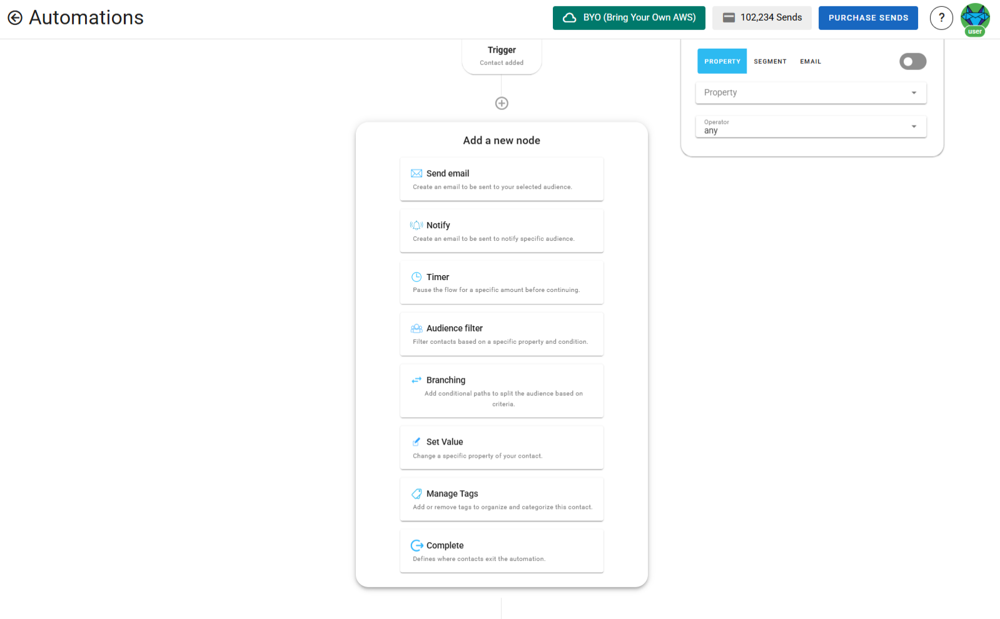

## Trigger Node

The **Trigger Node** is the starting point of every automation. It defines when the automation will run and for which list of contacts.

To configure the trigger, click on the trigger card:

- **Subscriber List**: Select the list the trigger should monitor.
- **Frequency**: Choose whether to trigger only once per contact, or every time the condition is met.
- **Trigger Type**: Choose between:
  - **Contact Added**
  - **Contact Updated**: 
    If you select **Contact Updated** as the trigger type, you’ll be asked to provide additional fields to define the change that should trigger the automation.

    You’ll need to specify:

    - A **Contact Property** to evaluate (selected from your [Contact Properties](/docs/projects/settings#contact-properties)).
    - A **From** condition:
      - Operation: `any`, `equals`, `does not equal`, `contains`, `does not contain`, `is empty`, `is not empty`
      - Value: the previous value of the property
    - A **To** condition:
      - Operation: same options as above
      - Value: the new value the property changed to

    The automation will trigger **only if the contact's property changed and matches both the "from" and "to" conditions**.
  - **Enter Segment**: 
      - If a contact is added with properties which falls into the segment, the automation will trigger.        
      - If a contact which was not in the segment before, is updated and now falls into the segment, the automation will trigger.
  - **Leave Segment**: If a contact is removed from a segment, the automation will trigger.

    In both segment cases, you’ll need to select the specific segment to monitor. You can also create a segment on the fly by clicking the **plus** icon besides the select segment drop-down menu.

    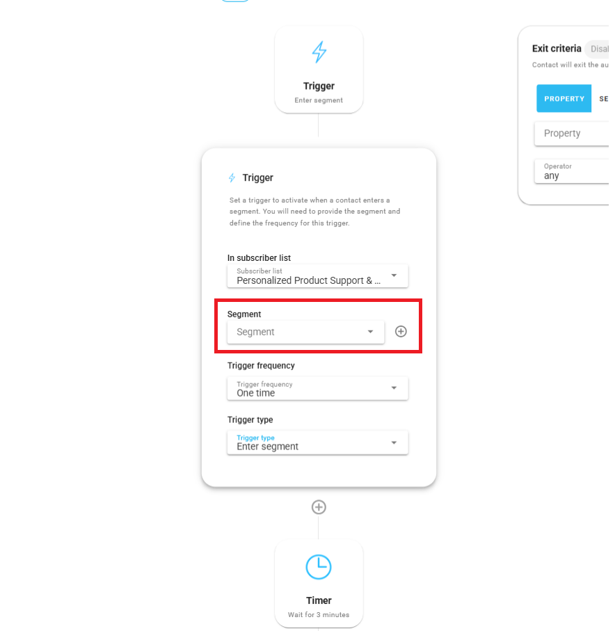

  - **Time Based**: Triggers the automation on a schedule rather than in response to a contact event. When you select **Time Based**, you define a **Schedule** that controls when the automation runs. A schedule is required, and each run processes the whole selected **Subscriber List** (the **Frequency** field does not apply, since the schedule controls timing instead).

   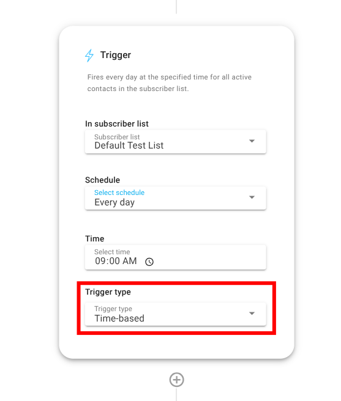

    The available schedule options are:
    - **Every day**: Runs once a day at a set time (for example, 9:00 AM).
    - **Weekdays**: Runs Monday through Friday at a set time.
    - **Weekly**: Runs on the days of the week you choose, at a set time (for example, Monday, Tuesday, and Thursday at 9:00 AM).
    - **Monthly**: Runs once a month, on the same date the trigger was activated (for example, if activated on the 20th, it runs on the 20th every month).
    - **Monthly on the nth day**: Runs once a month on a relative day (for example, the first Monday of every month).

    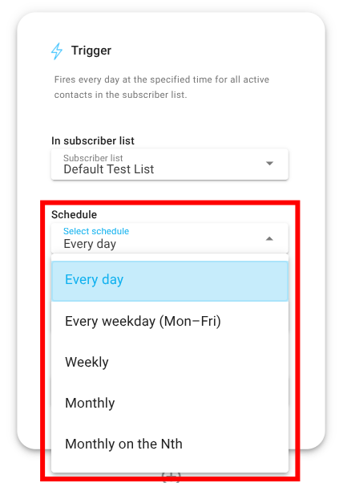

These fields let you define exactly what kind of property change should activate your automation.

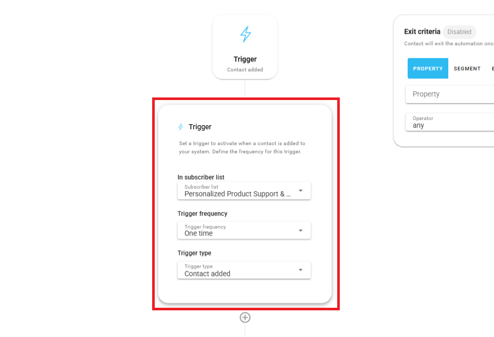

## Timer Node

The **Timer Node** pauses the automation before moving to the next step. You can pause for a fixed duration, or wait until a specific point in time.

**Wait for a duration**
- Set the **duration** (e.g., 1 day, 4 hours).
- Choose the **unit**: Minutes, Hours, Days.
- Optionally, set it to continue **immediately** if you want the next node to run without delay.

**Wait until a point in time**
- **Wait until time**: Holds the contact until the next occurrence of a clock time you specify. For example, a contact entering at any point waits until the next 9:00 AM.
- **Wait until day**: Holds the contact until a specific day and time (for example, next Tuesday at 7:00 AM).
- **Wait until next weekday**: Releases the contact on the next weekday. You can keep the same time the contact entered the node, or set a specific exit time.

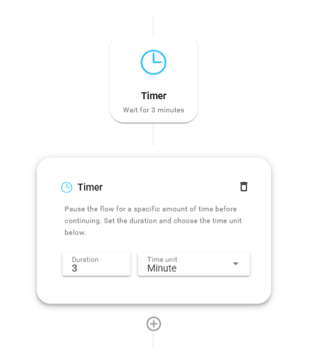

## Audience Filter Node

The **Audience Filter Node** allows you to include or exclude contacts based on their properties or email Activites.

When configuring the filter:
### Property Tab
- Select a **property** (e.g., `premium`).
- Choose an **operator**: Any, Equals, Does Not Equal, Contains, Does Not Contain.
- Enter a **value** (e.g., `true`).

If the contact **passes** the filter, the automation continues to the next node. If it **fails**, the automation stops for that contact.

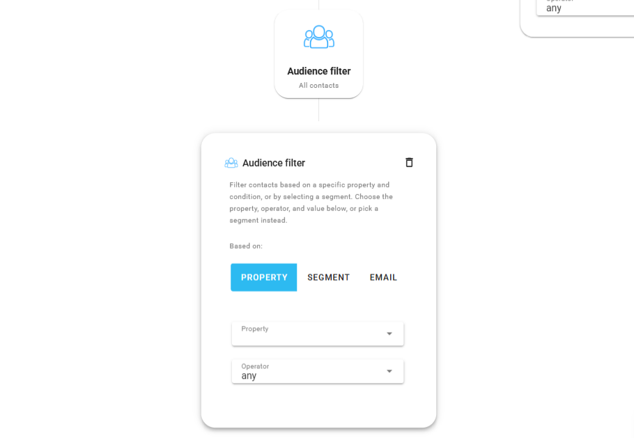

### Segments Tab

- Select or create a **segment** to filter contacts.

If the contact is in the selected segment, the automation continues to the next node. If not, the automation stops for that contact.

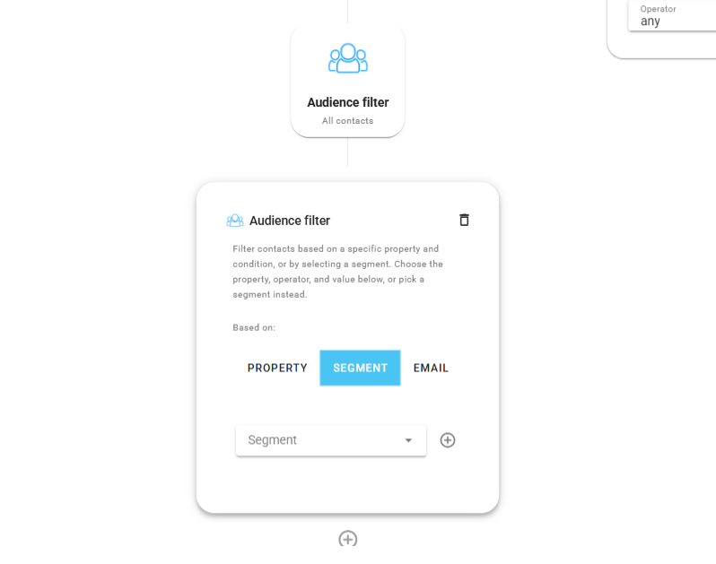

### Email Activity Tab
- Choose an **operator**: is-opened, is-clicked, is-not-opened, is-not-clicked.
- Choose an earlier **Send Email** node from the automation to evaluate.
- Link (only shown if using `is-clicked` or `is-not-clicked`): 
  - Optionally specify a link (URL) from the email.
  - If set, the condition checks whether that **specific link** was clicked or not.
  - f left blank, it checks whether **any link** in the email was clicked or not.

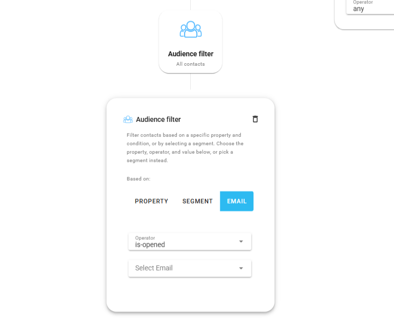

## Send Email Node

The **Send Email Node** allows you to configure and send an email to the contact.

Inside the email node, click **Create Email**. You'll be asked to choose one of four options:

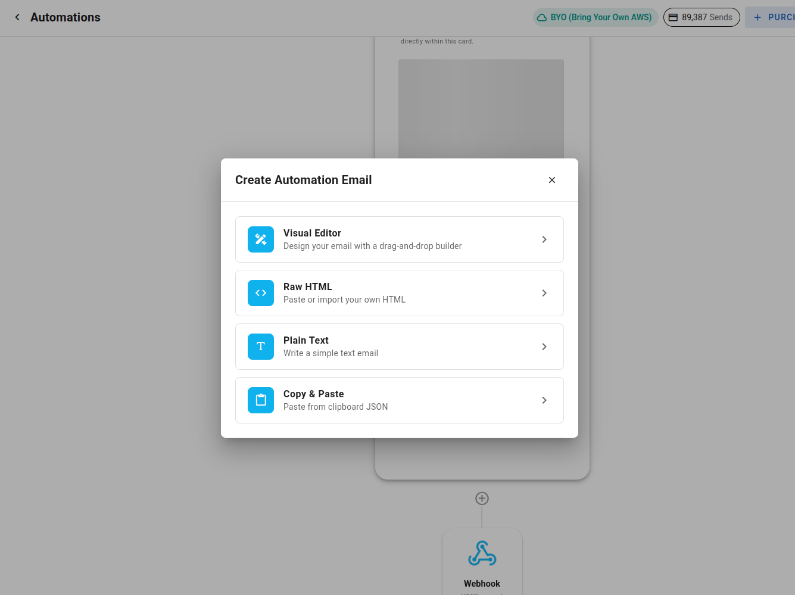

- **Visual Editor**: the drag-and-drop Chamaileon editor, with full access to your design system's blocks, components, and templates.
- **Raw HTML**: write your own HTML directly.
- **Plain Text**: a plain-text-only email, no HTML.
- **Copy & Paste**: paste in a previously copied email design. This works no matter which editor the original email was built with.

::: info
Design system templates and [pre-designed templates](/docs/projects/predesigned-templates) are only available when starting with the Visual Editor. Emails built with Raw HTML or Plain Text also can't be saved back as a reusable [design system template](/docs/email-themes/templates). Everything else, personalization, feeds, sending, and analytics, works the same regardless of which editor you pick.
:::

::: tip
If you use Copy & Paste to reuse content from a Chamaileon-built (Visual Editor) email inside a Raw HTML or Plain Text email, strip out any Chamaileon-specific merge tag or component markup first, it won't resolve there. Everything else should carry over as-is.
:::

You'll also be asked to add:
- **Subject**
- **Preview Text**

### Visual Editor

To start from a [pre-designed template](/docs/projects/predesigned-templates):

1. Click **Create Email**.
2. Choose to start from a template, then switch to **pre-designed templates**.
3. Select a template and click **Open Editor** to continue.

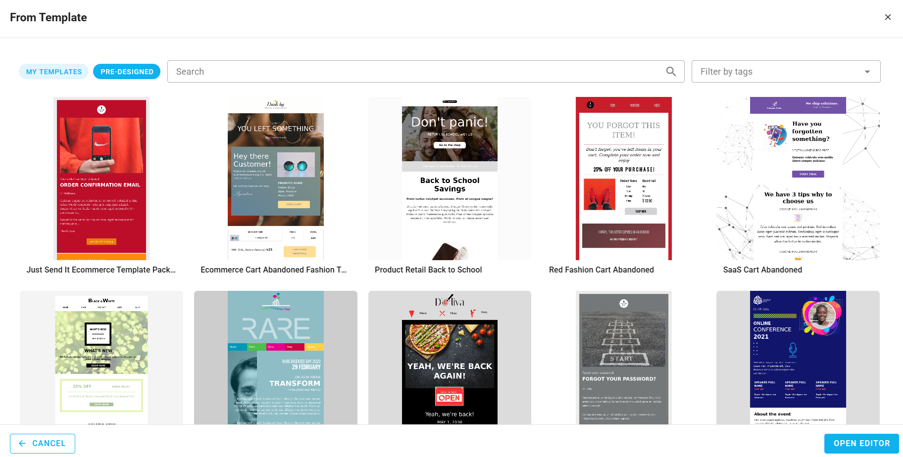

### Raw HTML / Plain Text

These two editors always start from scratch, there's no template selection step. Once you click **Open Editor**, you get the same code/text editor used everywhere else in bluefox.email. The Raw HTML editor also has an **Import** button. Both editors give you **Merge Tags**, **Preview** (including **Preview with data**), **Save**, and **Save & Close** controls. Merge tags and [feed](/docs/projects/data-feeds) variables are inserted via a side panel at your cursor position, rather than bound to a selected element like in the Visual Editor.

- **Raw HTML**:

  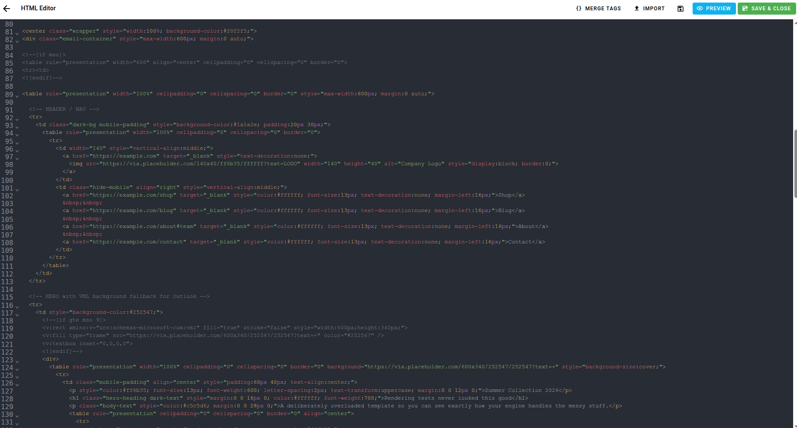

- **Plain Text**:

  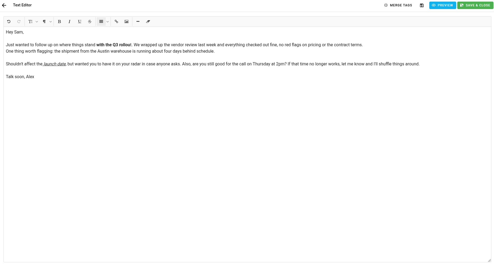

You can also add [data feeds](/docs/projects/data-feeds) to a Send Email node's Raw HTML or Plain Text email the same way as any other email, from the **Feeds** section on the email card. The only difference is how you reference feed items inside the editor: through the merge tag side panel instead of a drag-and-drop Loop block.

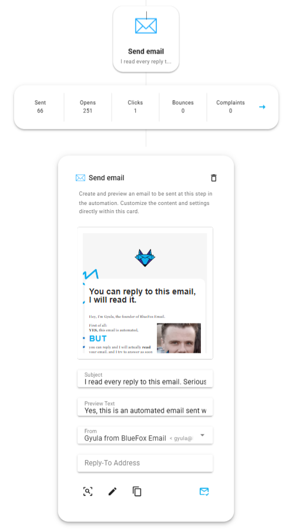
Under the email node, you’ll also see delivery stats:
- **Sent**
- **Opened**
- **Clicked**
- **[Bounced](/email-sending-concepts/bounces)**
- **[Complaints](/email-sending-concepts/complaints)**

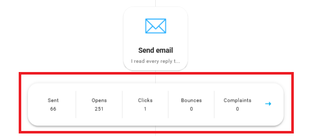

You can also see detail stats by clicking on the arrow at the end.

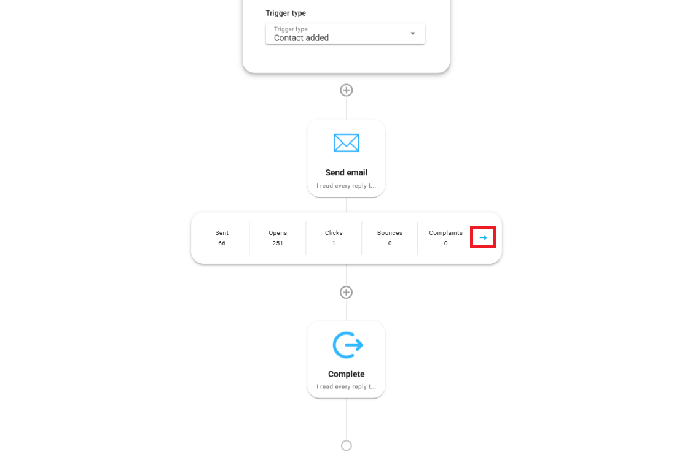

Here you can see a detailed statstics overview.

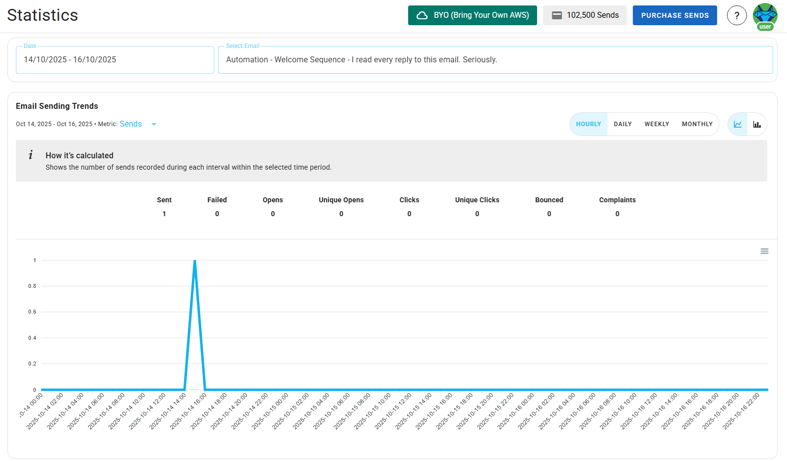

You can edit the email at any time **while the automation is in draft mode**.

::: info Note
You can access the **Advanced Settings** feature that allows you to customize key email-sending options by clicking the gear icon

For a detailed guide on using the **Advanced Settings**, refer to the [Advanced Settings Documentation](/docs/projects/transactional-emails#advanced-settings).
:::

## Notify Node

The **Notify Node** allows you to send a notification email to a specific set of audience as a subscriber list or to specific email addresses from the list when a particular action occurs in the automation. This is useful for alerting your team, admins, or any designated group about key events such as when a contact signs up, reaches a specific step, or meets certain criteria.

Inside the notify node, click **Create Email**. You'll be asked to choose one of four options:

- **Visual Editor**: the drag-and-drop Chamaileon editor, with full access to your design system's blocks, components, and templates.
- **Raw HTML**: write your own HTML directly.
- **Plain Text**: a plain-text-only email, no HTML.
- **Copy & Paste**: paste in a previously copied email design. This works no matter which editor the original email was built with.

::: info
Design system templates and [pre-designed templates](/docs/projects/predesigned-templates) are only available when starting with the Visual Editor. Emails built with Raw HTML or Plain Text also can't be saved back as a reusable [design system template](/docs/email-themes/templates). Everything else, personalization, feeds, sending, and analytics, works the same regardless of which editor you pick.
:::

::: tip
If you use Copy & Paste to reuse content from a Chamaileon-built (Visual Editor) email inside a Raw HTML or Plain Text email, strip out any Chamaileon-specific merge tag or component markup first, it won't resolve there. Everything else should carry over as-is.
:::

You'll also be asked to add:
- **Subject**
- **Preview Text**
- **From Address**
- **Reply-To Address**

### Visual Editor

To start from a [pre-designed template](/docs/projects/predesigned-templates):

1. Click **Create Email**.
2. Choose to start from a template, then switch to **pre-designed templates**.
3. Select a template and click **Open Editor** to continue.

### Raw HTML / Plain Text

These two editors always start from scratch, there's no template selection step. Once you click **Open Editor**, you get the same code/text editor used everywhere else in bluefox.email. The Raw HTML editor also has an **Import** button. Both editors give you **Merge Tags**, **Preview** (including **Preview with data**), **Save**, and **Save & Close** controls. Merge tags and [feed](/docs/projects/data-feeds) variables are inserted via a side panel at your cursor position, rather than bound to a selected element like in the Visual Editor.

- **Raw HTML**:

  

- **Plain Text**:

  

You can also add [data feeds](/docs/projects/data-feeds) to a Notify node's Raw HTML or Plain Text email the same way as any other email, from the **Feeds** section on the email card. The only difference is how you reference feed items inside the editor: through the merge tag side panel instead of a drag-and-drop Loop block.

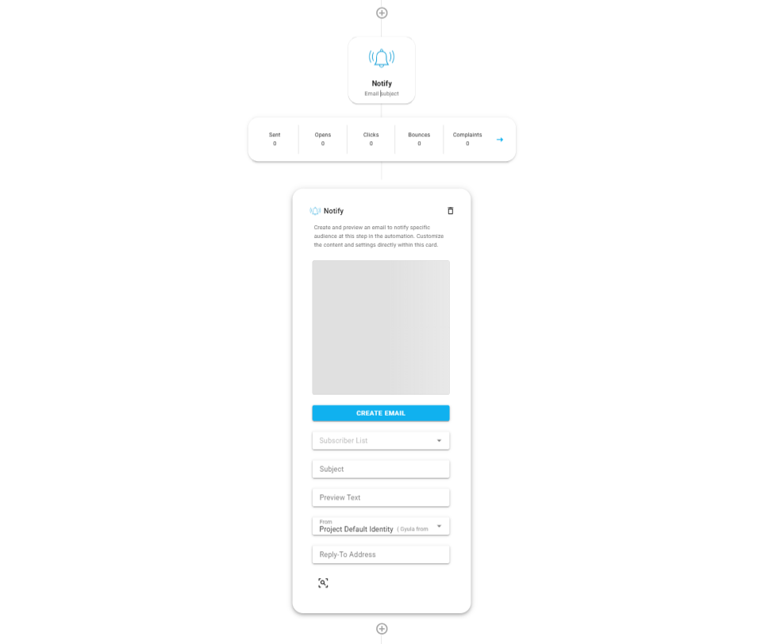

::: info Note
Unlike the Send Email node, which sends to the contact flowing through the automation, the Notify Node sends to a subscriber list of your choice. You can also specify individual email addresses from the list, so you don't necessarily need to send to the entire list. This makes it ideal for internal notifications or alerting a separate audience about automation activity.
:::

Because the Notify node sends to a subscriber list, it also offers the **Exclude unengaged** option, the same one you get on campaigns and triggered emails. Turn it on and every contact matching your project's [unengaged segment](/docs/projects/settings#unengaged-segment) definition is skipped for that notification. The definition itself lives in project settings and is shared across the whole project.

## Branching Node

The **Branch Node** allows you to create conditional flows based on contact data or email activity. It splits your automation into **multiple paths** and continues only down the path whose **condition is met first**.

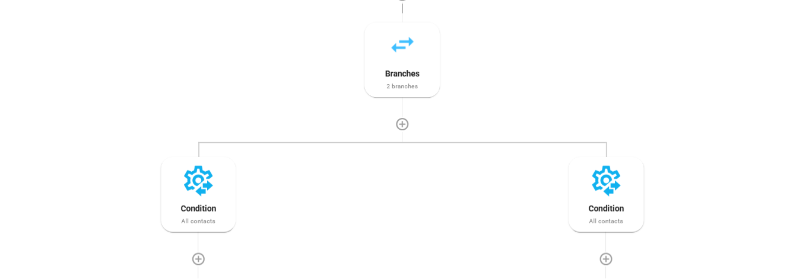

### Condition Node

The **Condition Node** allows you to build dynamic decision paths in your automation. It checks if a contact meets a specific condition based on property values or email activity. If the condition is true, it follows that condition’s sequence, if false, it moves on to evaluate the next condition.

When configuring the filter:
#### Property Tab
- Select a **property** (e.g., `premium`).
- Choose an **operator**: Any, Equals, Does Not Equal, Contains, Does Not Contain.
- Enter a **value** (e.g., `true`).

If the contact **passes** the filter, the automation continues to the next node. If it **fails**, the automation stops for that contact.

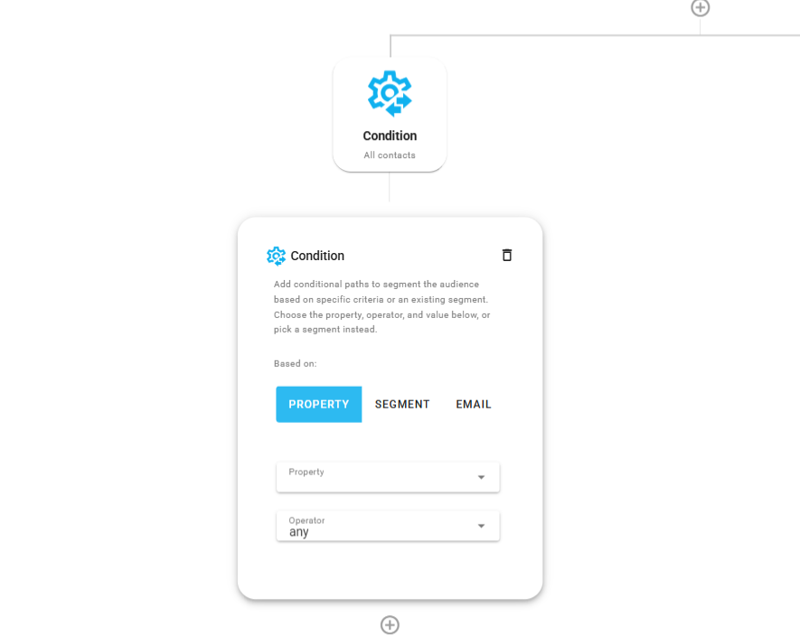

#### Segments Tab

- Select or create a **segment** to filter contacts.

If the contact is in the selected segment, the automation continues to the next node. If not, the automation stops for that contact.

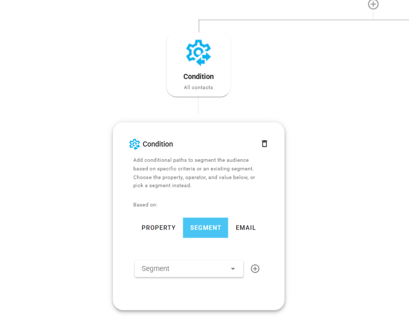

#### Email Activity Tab
- Choose an **operator**: is-opened, is-clicked, is-not-opened, is-not-clicked.
- Choose an earlier **Send Email** node from the automation to evaluate.
- Link (only shown if using `is-clicked` or `is-not-clicked`): 
  - Optionally specify a link (URL) from the email.
  - If set, the condition checks whether that **specific link** was clicked or not.
  - f left blank, it checks whether **any link** in the email was clicked or not.

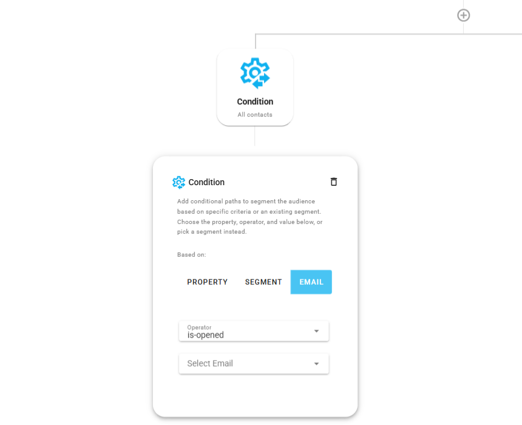

## Set Value Node

The **Set Value Node** allows you to update a contact property within the automation flow.

When configuring the Set Value node:
- Select a **Contact Property** to update (from your [Contact Properties](/docs/projects/settings#contact-properties)).
- Enter a **Value** (e.g., `true`, `5`, `new value`).

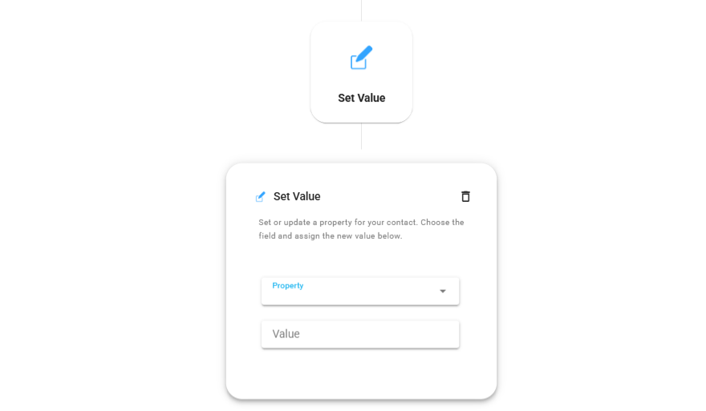

## Manage Tags Node
The **Manage Tags Node** allows you to add or remove tags from a contact within the automation flow.

When configuring the Manage Tags node:
- In the **Add** field, select the tags you want to add to the contact.
- In the **Remove** field, select the tags you want to remove from the contact.

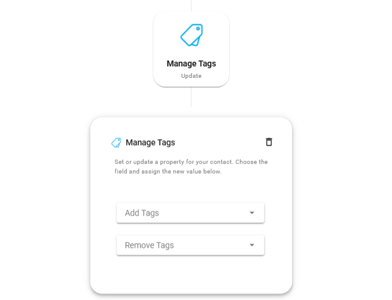

## Webhook Node

The **Webhook Node** sends an HTTP request to an external URL from within the automation flow. This lets you push automation activity to other systems or trigger actions outside BlueFox Email.

When configuring the Webhook node:
- **Method**: Choose the HTTP method, `POST`, `GET`, `PUT`, or `PATCH`.
- **URL**: Enter the endpoint the request is sent to.
- **Pass Contact Data**: When this toggle is on, the data of the contact running the automation is included in the request.
- **Headers**: Optionally add custom headers as key and value pairs. For example, add an `Authorization` header with a bearer token if the endpoint requires authentication.

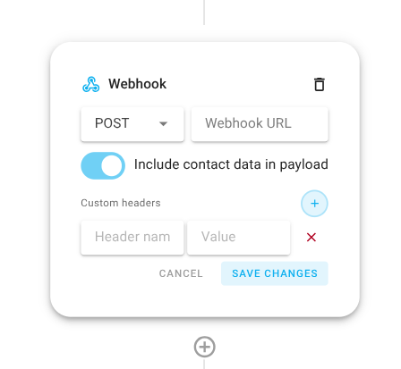

## Complete Node

The **Complete Node** defines where contacts exit the automation. Contacts reaching this node leave the flow. Automations without a Complete Node will keep contacts queued at their final step.

Without a Complete Node, contacts will be queued indefinitely at the last node, which can lead to unintended consequences. For example, if you have a Timer Node at the end of your automation and no Complete Node, contacts will keep accumulating there and never exit the automation.

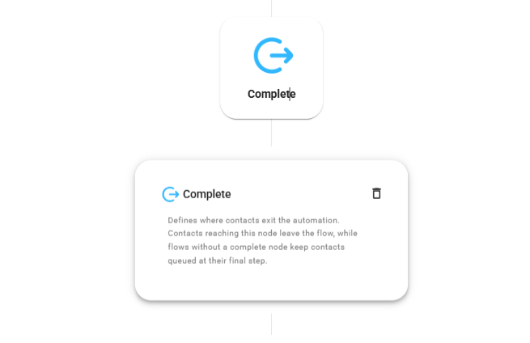

## Exit Critera

The **Exit Criteria** allows you to define conditions under which a contact will exit the automation before reaching the end. This is useful for stopping contacts from continuing in the automation if they meet certain criteria. Check the **Exit Criteria** card to configure it.

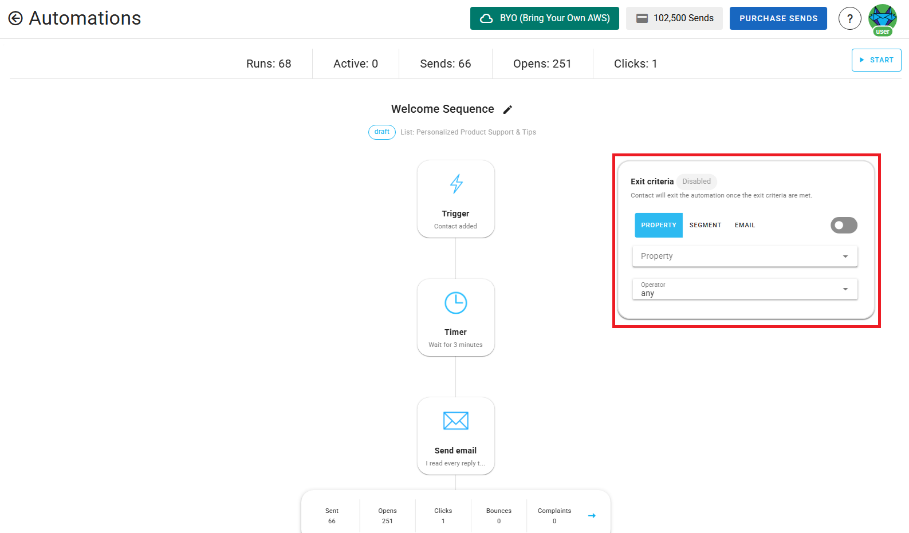

Use the toggle button to enable or disable the exit criteria.

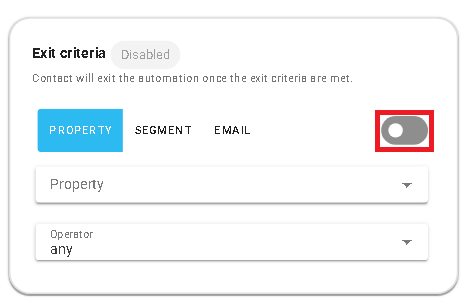

When configuring the exit criteria you have the following options:

- **Property Tab**: Exit if a contact property meets a specific condition.
    - Select a **property** (e.g., `premium`).
    - Choose an **operator**: Any, Equals, Does Not Equal, Contains, Does Not Contain.
    - Enter a **value** (e.g., `true`).

  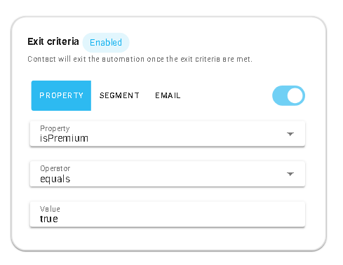

- **Segment Tab**: Exit a contact based on their segment membership.
    - Select or create a **segment**.
    - Use the **Contact Exit** switch to control when the contact exits:
      - **Off**: The contact exits the automation when they enter the selected segment.
      - **On**: The contact exits the automation when they leave the selected segment.

  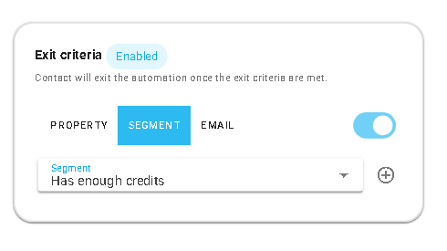

- **Email Activity Tab**: Exit based on email interactions.
    - Choose an **operator**: is-opened, is-clicked, is-not-opened, is-not-clicked.
    - Link (only shown if using `is-clicked` or `is-not-clicked`): 
      - Optionally specify a link (URL) from the email.
      - If set, the condition checks whether that **specific link** was clicked or not.
      - If left blank, it checks whether **any link** in the email was clicked or not.

  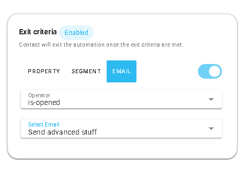

## Managing Automations

- To **start** an automation, all required fields in all nodes must be completed.
- If any field is missing, an error message will indicate what needs to be fixed.
- You **cannot edit** an automation while it’s active. Switch to **Draft Mode** to make changes, then re-activate when ready.

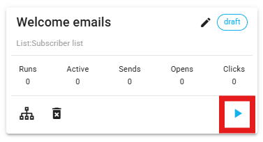

While an automation is running, you can see exact number of contacts currently in the node by looking at the top right corner of each node.

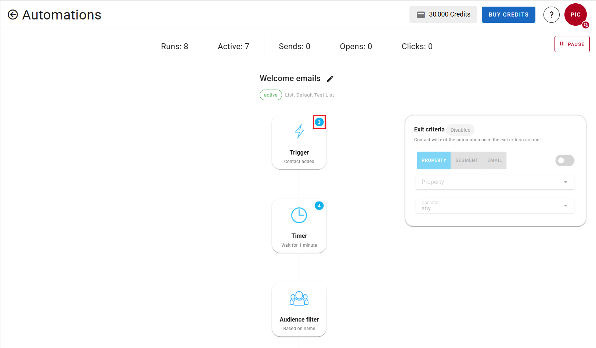

When you click on that circle, you can see the list of contacts currently running in that node. You can select which contacts you want to remove at once using the checkboxes and delete them all together by clicking 'Remove Selected' button .

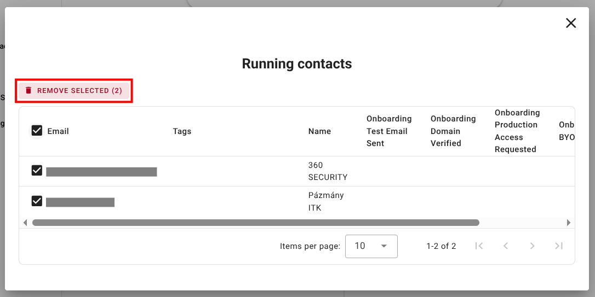

## Pausing an Automation

To pause a running automation, click the **Pause** button, available from both the automation list and the automation details page.

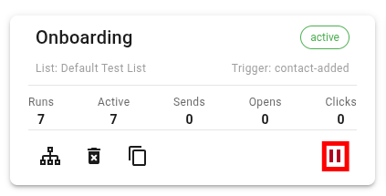

A confirmation dialog explains that any contacts currently in the automation will be paused at their current step, and will resume from that same step once the automation is reactivated.

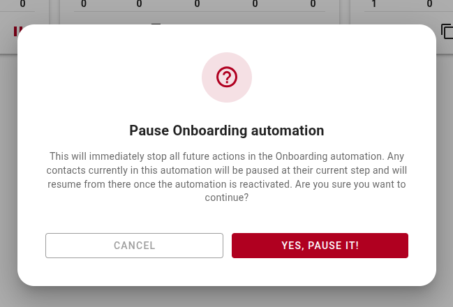

Contacts do not exit or restart the automation when it's paused, they hold at whatever node they were on until the automation is started again.

## Resuming a Paused Automation

Click **Start** to resume a paused automation.

If the automation has unpublished (draft) changes, a dialog opens asking how to apply them:

- **Apply to upcoming only**: New contacts entering the automation use the updated version. In-progress contacts continue on the old version.
- **Apply to upcoming and in-progress**: Both new and already in-progress contacts get the updated version.
- **Cancel**: Closes the dialog without publishing or discarding anything. The automation stays paused and the draft stays intact.

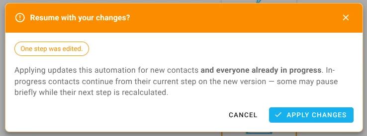

::: info Note
This dialog previously included a **Discard changes** option. It has been removed, use the dedicated **Discard changes** button instead (see below).
:::

:::warning
When editing an automation, whether it's **active** or **paused**, deleting a node that currently has contacts on it will terminate those contacts from the automation. Always check the contact count on a node before removing it.
:::

## Discarding Unpublished Changes

When a paused (or draft) automation has unpublished changes, a **Discard changes** button appears next to the **Start** button on the automation details page. Hovering over it shows a tooltip explaining there are unpublished changes and that clicking will discard them, reverting the automation to its last published version.

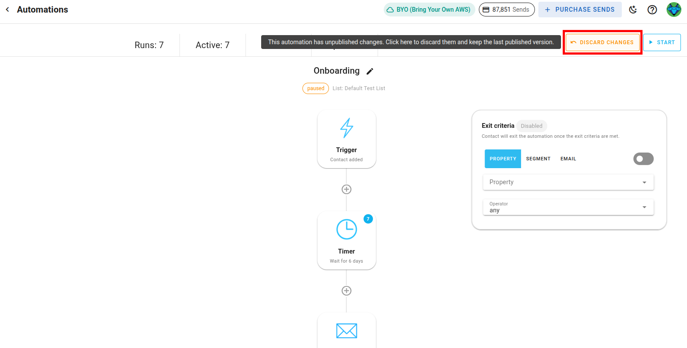

This is separate from the banner shown for **active** automations with pending changes (**Apply to upcoming** / **Apply to upcoming and in-progress** / **Discard changes**), which is unchanged, see [Updating running automations](#updating-running-automations).

## Updating running automations

If you need to make changes to an automation that's currently active, you can do it by following these steps:

1. Make your updates in the automation builder. You can edit any node or add new nodes as needed.
2. Whenever you make a change you will see few options at the top of the builder:

    - **Apply to upcoming events only**: Will only apply the changes to contacts that are newly entering the automation. Contacts that are already running the automation will not be affected and will continue with the old version.

    - **Apply to upcoming and in-progress contacts**: Will apply the changes to both new contacts entering the automation and contacts that are currently running it. This means that in-progress contacts will be updated to reflect the changes you made.

    - **Discard changes**: Will discard any changes you made and keep the old version of the automation for both new and in-progress contacts.

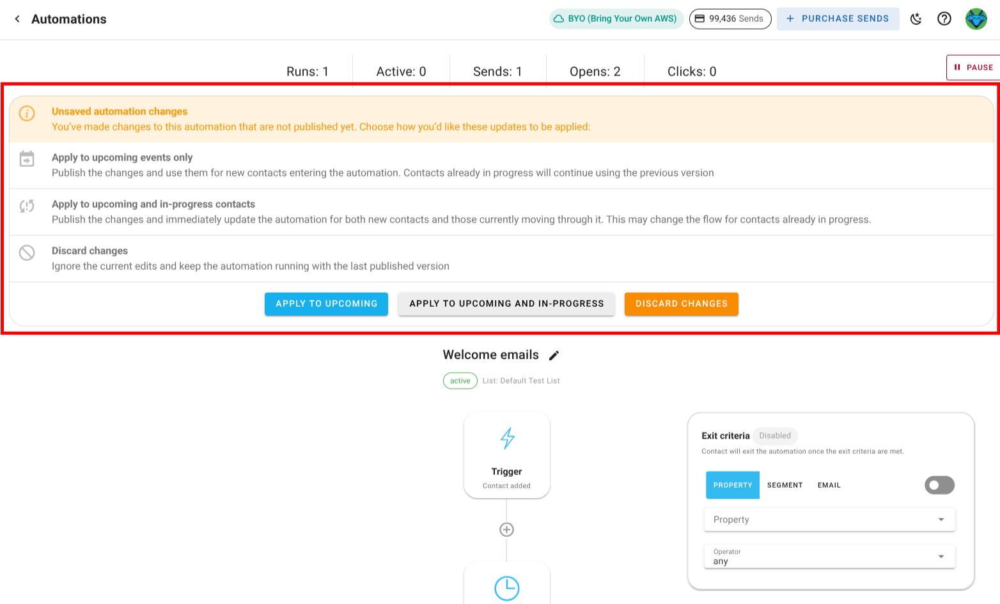

:::warning Be cautious when applying changes to in-progress contacts. 

If you remove a node, it will terminate the automation for all contacts currently in that node. Always double-check the changes you make before applying them to in-progress contacts.
::: 

## Automation Stats
On the automation card, you’ll see the following stats:

- **Runs**: The number of times the automation has been triggered.  
  This is important because it helps you track how often your automation is being executed and whether it’s running as expected.

- **Active**: The number of automations currently running.  
  This is crucial for understanding the status of your ongoing automations and ensuring that they're working properly.

- **Sends**: The sum of all email sends within the automation.  
  This metric shows how many emails have been sent as part of your automation, giving you an idea of its reach and activity.

- **Opens / Clicks**: Aggregate email stats for opens and clicks.  
  These are key performance indicators that help you measure the effectiveness of your emails in terms of engagement and user interaction.

By monitoring these stats, you can gain insights into the performance of your automations and make data-driven decisions to optimize them.

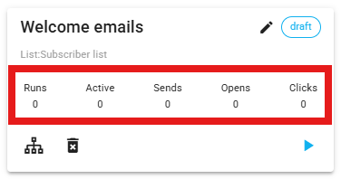