# Automations

Automations allow you to create powerful workflows that streamline and automate your email processes. By triggering emails or actions based on specific events like when a contact is added or updated. You can automate tasks such as sending welcome emails, follow-ups, or reminders. This helps save time while ensuring your audience receives timely and relevant communication.

With our email automation feature, you can easily configure automations to meet your needs, without the need for coding. You can add nodes such as timers, filters, condition branches, and email sends to build custom workflows that fit your project.

You can manage and view your automations under the **Automations** tab in your project.

## Creating an Automation

To create a new automation email click on the Create button.

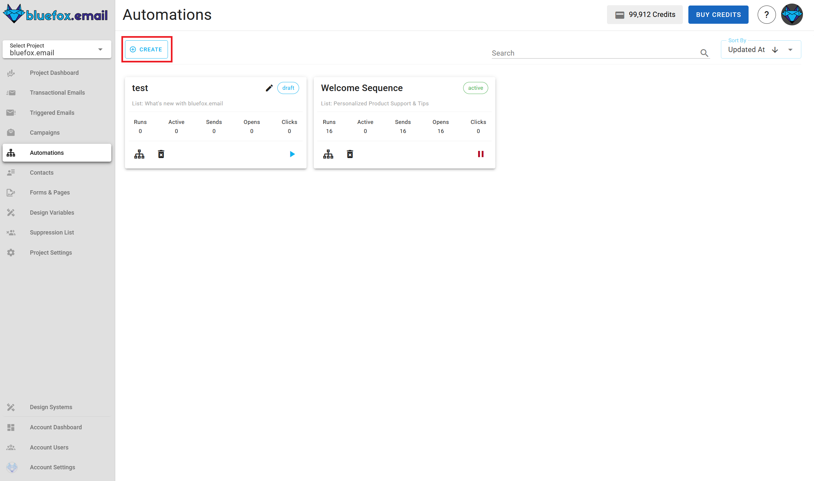

Next, Enter the name and select the trigger type

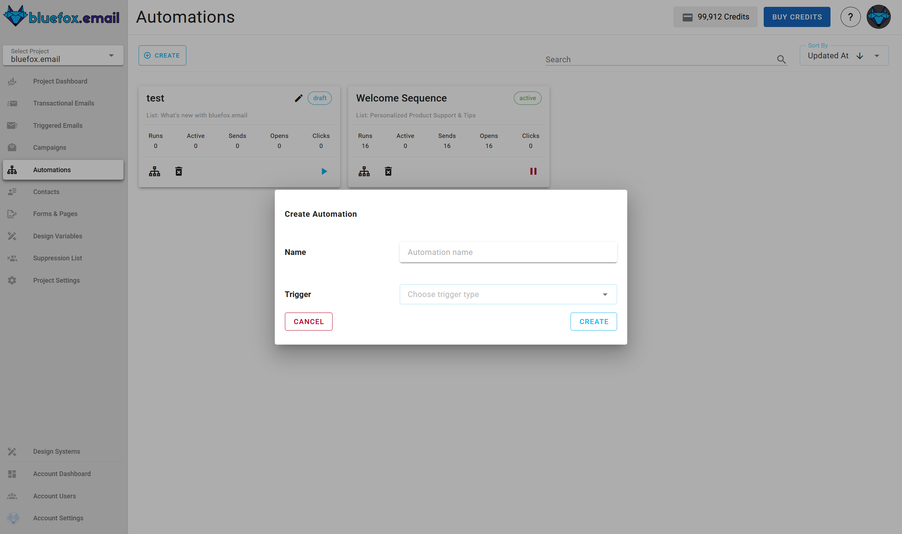

When you're done, click create. You can make changes later as well.

Once created, you’ll be taken to the automation builder, where you can configure the flow by adding different types of nodes.

## Automation Structure

Each automation starts with a **Trigger Node**, which determines how and when the automation starts. From there, you can add additional nodes by hovering over the line below the node and clicking the **+** icon. This opens a selector for adding one of the available node types.

The available node types are:
- **Send Email**
- **Timer**
- **Audience Filter**
- **Branching**
- **Set Value**

Let’s go through each one in detail.

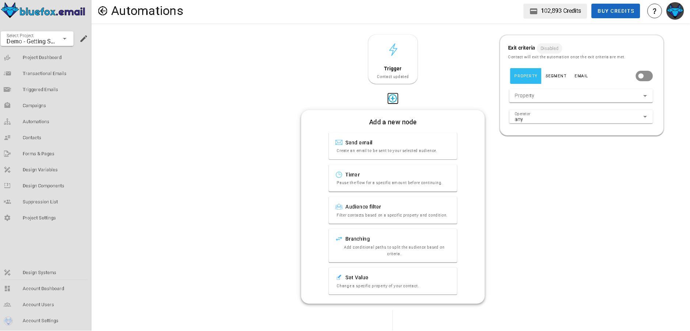

## Trigger Node

The **Trigger Node** is the starting point of every automation. It defines when the automation will run and for which list of contacts.

To configure the trigger, click on the trigger card:

- **Subscriber List**: Select the list the trigger should monitor.
- **Frequency**: Choose whether to trigger only once per contact, or every time the condition is met.
- **Trigger Type**: Choose between:
  - **Contact Added**
  - **Contact Updated**: 
    If you select **Contact Updated** as the trigger type, you’ll be asked to provide additional fields to define the change that should trigger the automation.

    You’ll need to specify:

    - A **Contact Property** to evaluate (selected from your [Contact Properties](/docs/projects/settings#contact-properties)).
    - A **From** condition:
      - Operation: `any`, `equals`, `does not equal`, `contains`, `does not contain`, `is empty`, `is not empty`
      - Value: the previous value of the property
    - A **To** condition:
      - Operation: same options as above
      - Value: the new value the property changed to

    The automation will trigger **only if the contact's property changed and matches both the "from" and "to" conditions**.
    - **Enter Segment**: 
        - If a contact is added with properties which falls into the segment, the automation will trigger.
        - If a contact which was not in the segment before, is updated and now falls into the segment, the automation will trigger.
    - **Leave Segment**: If a contact is removed from a segment, the automation will trigger.

    In both segment cases, you’ll need to select the specific segment to monitor. You can also create a segment on the fly by clicking the **plus** icon besides the select segment drop-down menu.

    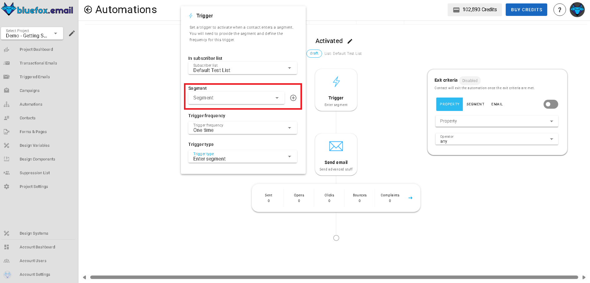

These fields let you define exactly what kind of property change should activate your automation.

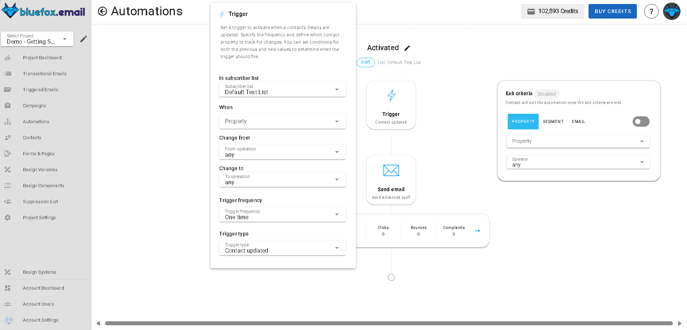

## Timer Node

The **Timer Node** pauses the automation for a specific duration before moving to the next step.

When you click on the timer node:

- Set the **duration** (e.g., 1 day, 4 hours).
- Choose the **unit**: Minutes, Hours, Days.
- Optionally, set it to continue **immediately** if you want the next node to run without delay.

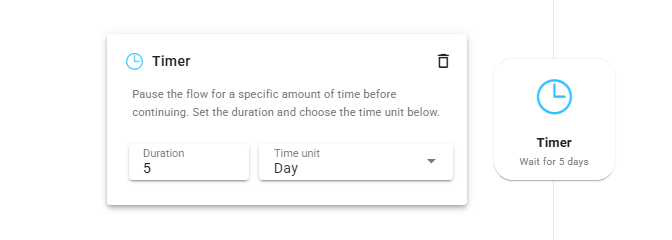

## Audience Filter Node

The **Audience Filter Node** allows you to include or exclude contacts based on their properties or email Activites.

When configuring the filter:
### Property Tab
- Select a **property** (e.g., `premium`).
- Choose an **operator**: Any, Equals, Does Not Equal, Contains, Does Not Contain.
- Enter a **value** (e.g., `true`).

If the contact **passes** the filter, the automation continues to the next node. If it **fails**, the automation stops for that contact.

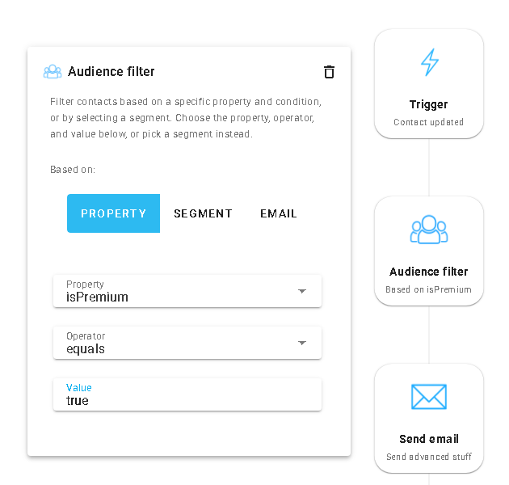

### Segments Tab

- Select or create a **segment** to filter contacts.

If the contact is in the selected segment, the automation continues to the next node. If not, the automation stops for that contact.

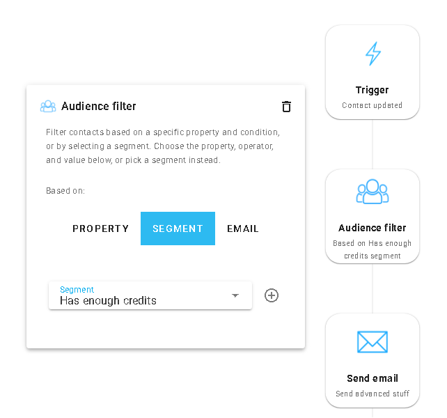

### Email Activity Tab
- Choose an **operator**: is-opened, is-clicked, is-not-opened, is-not-clicked.
- Choose an earlier **Send Email** node from the automation to evaluate.
- Link (only shown if using `is-clicked` or `is-not-clicked`): 
  - Optionally specify a link (URL) from the email.
  - If set, the condition checks whether that **specific link** was clicked or not.
  - f left blank, it checks whether **any link** in the email was clicked or not.

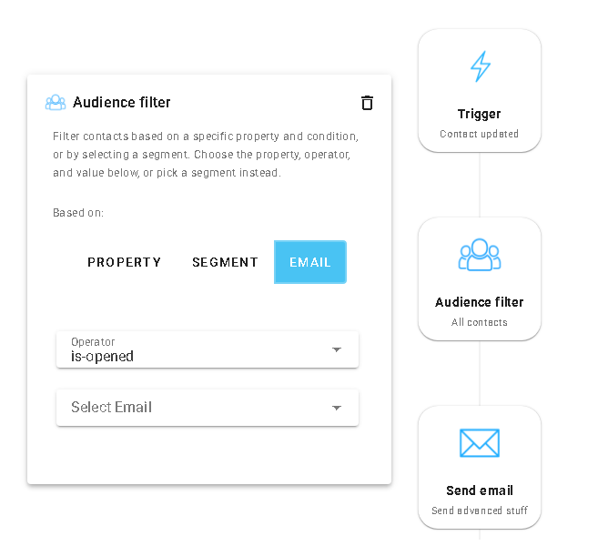

## Send Email Node

The **Send Email Node** allows you to configure and send an email to the contact.

Inside the email node, you can:
- Click **Create Email** to start from scratch or reuse an existing design.
- Add:
  - **Subject**
  - **Preview Text**

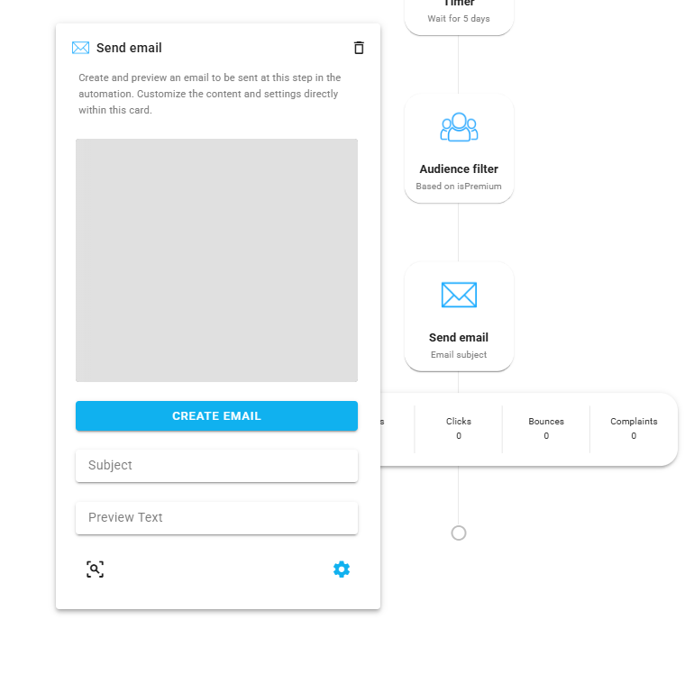
Under the email node, you’ll also see delivery stats:
- **Sent**
- **Opened**
- **Clicked**
- **Bounced**
- **Complaints**

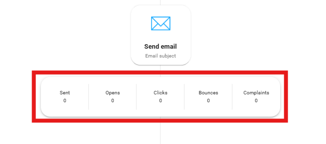

You can edit the email at any time **while the automation is in draft mode**.

::: info Note
You can access the **Advanced Settings** feature that allows you to customize key email-sending options by clicking the gear icon

For a detailed guide on using the **Advanced Settings**, refer to the [Advanced Settings Documentation](/docs/projects/settings.html#advanced-settings).
:::

## Branching Node

The **Branch Node** allows you to create conditional flows based on contact data or email activity. It splits your automation into **multiple paths** and continues only down the path whose **condition is met first**.

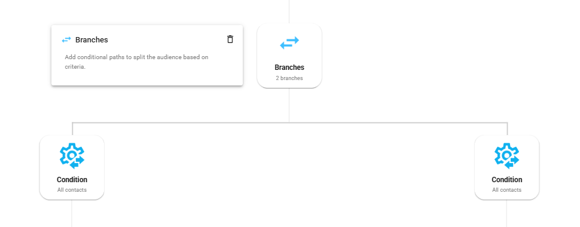

### Condition Node

The **Condition Node** allows you to build dynamic decision paths in your automation. It checks if a contact meets a specific condition based on property values or email activity. If the condition is true, it follows that condition’s sequence, if false, it moves on to evaluate the next condition.

When configuring the filter:
#### Property Tab
- Select a **property** (e.g., `premium`).
- Choose an **operator**: Any, Equals, Does Not Equal, Contains, Does Not Contain.
- Enter a **value** (e.g., `true`).

If the contact **passes** the filter, the automation continues to the next node. If it **fails**, the automation stops for that contact.

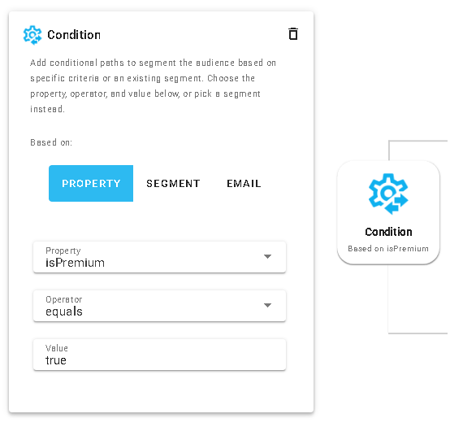

#### Segments Tab

- Select or create a **segment** to filter contacts.

If the contact is in the selected segment, the automation continues to the next node. If not, the automation stops for that contact.

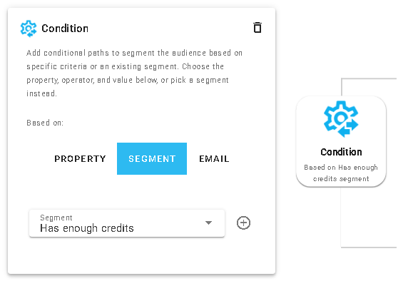

#### Email Activity Tab
- Choose an **operator**: is-opened, is-clicked, is-not-opened, is-not-clicked.
- Choose an earlier **Send Email** node from the automation to evaluate.
- Link (only shown if using `is-clicked` or `is-not-clicked`): 
  - Optionally specify a link (URL) from the email.
  - If set, the condition checks whether that **specific link** was clicked or not.
  - f left blank, it checks whether **any link** in the email was clicked or not.

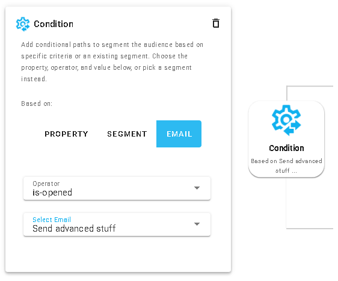

## Set Value Node

The **Set Value Node** allows you to update a contact property within the automation flow.

When configuring the Set Value node:
- Select a **Contact Property** to update (from your [Contact Properties](/docs/projects/settings#contact-properties)).
- Enter a **Value** (e.g., `true`, `5`, `new value`).

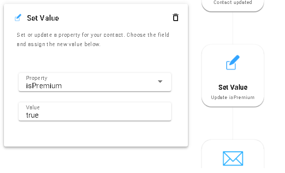

## Exit Critera

The **Exit Criteria** allows you to define conditions under which a contact will exit the automation before reaching the end. This is useful for stopping contacts from continuing in the automation if they meet certain criteria. Check the **Exit Criteria** card to configure it.

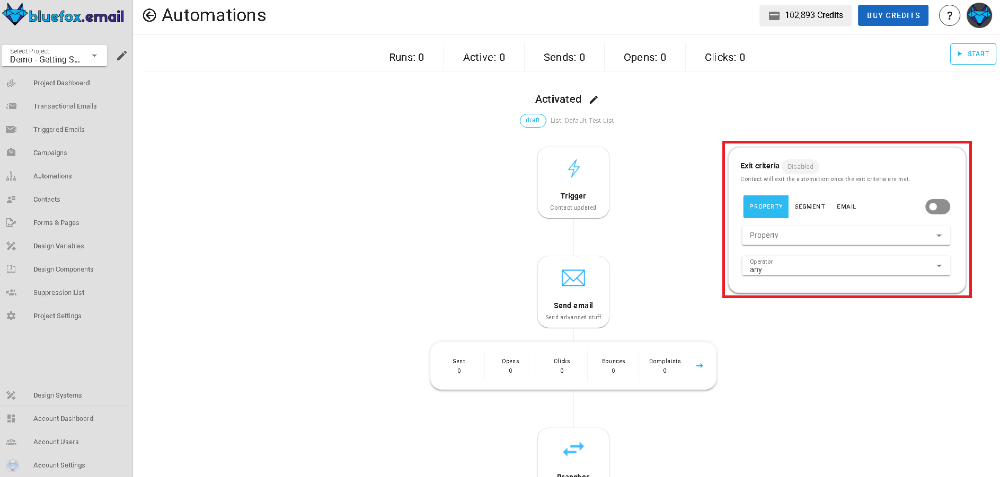

Use the toggle button to enable or disable the exit criteria.

When configuring the exit criteria you have the following options:

- **Property Tab**: Exit if a contact property meets a specific condition.
    - Select a **property** (e.g., `premium`).
    - Choose an **operator**: Any, Equals, Does Not Equal, Contains, Does Not Contain.
    - Enter a **value** (e.g., `true`).

  

- **Segment Tab**: Exit if a contact is added in a specific segment or updated and now falls into the segment.
    - Select or create a **segment** to filter contacts.

  

- **Email Activity Tab**: Exit based on email interactions.
    - Choose an **operator**: is-opened, is-clicked, is-not-opened, is-not-clicked.
    - Link (only shown if using `is-clicked` or `is-not-clicked`): 
      - Optionally specify a link (URL) from the email.
      - If set, the condition checks whether that **specific link** was clicked or not.
      - If left blank, it checks whether **any link** in the email was clicked or not.

  

## Managing Automations

- To **start** an automation, all required fields in all nodes must be completed.
- If any field is missing, an error message will indicate what needs to be fixed.
- You **cannot edit** an automation while it’s active. Switch to **Draft Mode** to make changes, then re-activate when ready.

## Automation Stats
On the automation card, you’ll see the following stats:

- **Runs**: The number of times the automation has been triggered.  
  This is important because it helps you track how often your automation is being executed and whether it’s running as expected.

- **Active**: The number of automations currently running.  
  This is crucial for understanding the status of your ongoing automations and ensuring that they're working properly.

- **Sends**: The sum of all email sends within the automation.  
  This metric shows how many emails have been sent as part of your automation, giving you an idea of its reach and activity.

- **Opens / Clicks**: Aggregate email stats for opens and clicks.  
  These are key performance indicators that help you measure the effectiveness of your emails in terms of engagement and user interaction.

By monitoring these stats, you can gain insights into the performance of your automations and make data-driven decisions to optimize them.

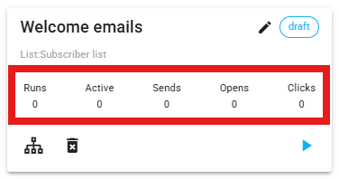