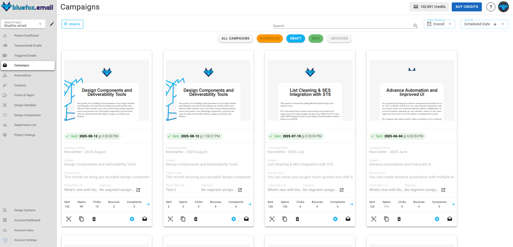
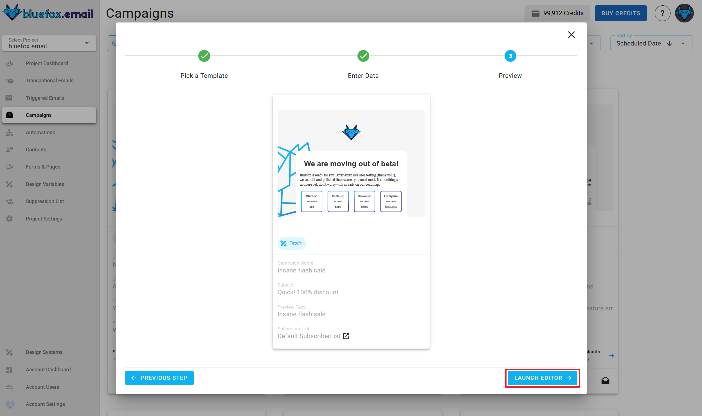
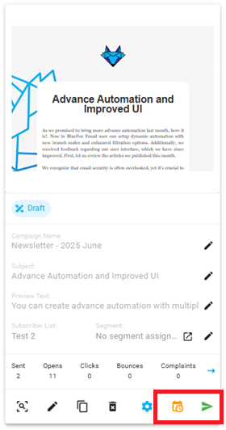
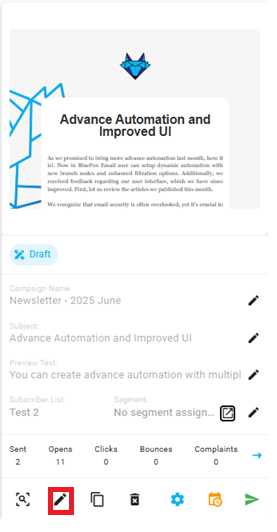
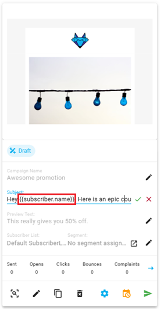
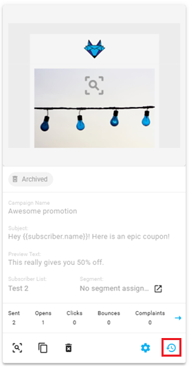
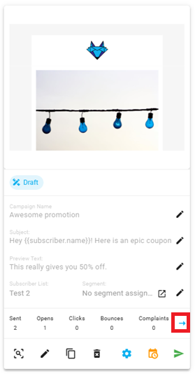
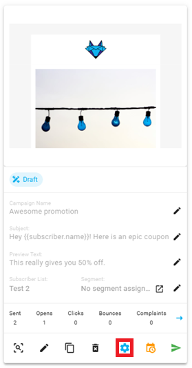

# Campaigns

Unlike transactional and triggered emails, campaigns are not sent by your backend. Campaigns can be scheduled to a specific time or you can send it immediately. All the content is edited within bluefox email. Typical examples are newsletters, promotional emails, or occasional announcements.

Campaigns are sent to the `active` subscribers on a list. Since campaigns are tied to a subscriber list, they must contain an unsubscribe link and optionally a pause subscription link.

You can find the campaigns of a project under the `Campaigns` tab.



## Creating a campaign

In order to create a new campaign, press the `Create` button.


After that, you will have to select a template to start from:


Enter it's name, subject line, and preview text:


Enter its name, subject line, preview text, and select a subscriber list:


After that, you will see a summary page. Click "Launch Editor".



Finally, make changes in the drag 'n' drop email editor:


When you are done, you can schedule your campaign, or you can send it immediately:


## Personalization

Since a campaigns is sent to a subscriber list, subscriber data, unsubscribe link, and pause subscription link are also included. You can use the following merge tags:
```
{{subscriber.name}}
{{subscriber.email}}
{{unsubscribeLink}}
{{pauseSubscriptionLink}}
```

You can use any handlebars variables in your email while editing. Click on the edit icon on the card:


You can use these handlebars variables in your email, while editing:


And you can use merge tags in the email's `subject line` and `preview text` as well!



For more details, read our guide on [personalization with merge tags](/docs/email-personalization) and Handlebars.

## Campaign states

There are five states of a campaign: draft, scheduled, being sent (or the scheduled time is only a few minutes away), sent, and archived.

In each state, different actions are available, and some of them are disabled.

Draft campaigns can be edited, scheduled, and sent:


Scheduled campaigns have the following actions: re-schedule, cancel send, send now. Scheduled campaigns cannot be edited nor deleted!


Campaigns that are being sent currently (or the send time is a few minutes away) should not be modified, so all of their actions are disabled.


Sent campaigns can be archived, and stats should show up:


Archived campaigns can be restored. It means that they become draft again.s


## Campaign Email Statistics

Campaign emails are designed to reach a targeted group of recipients, often based on specific user segments or marketing campaigns. These emails are sent to the subscribers on a list, and unlike triggered emails, they are typically part of larger, planned marketing efforts rather than automated, one-to-one communications.

### Why Campaign Email Statistics Matter

Understanding how your campaign emails perform is essential for refining your marketing strategies and improving your engagement with subscribers. Tracking performance helps you:

- **Monitor Campaign Effectiveness**: Measure the success of your campaign emails by tracking key metrics such as open rates, click-through rates, and bounce rates.
- **Optimize Engagement**: Analyze the success of your subject lines, content, and timing to improve how subscribers interact with your emails.
- **Refine Segmentation**: Use insights into open rates, clicks, and other actions to adjust your subscriber segments for more targeted future campaigns.
- **Detect Issues**: High bounce rates, low open rates, or high unsubscribe rates can indicate potential issues, allowing you to fix problems early.
- **Enhance Subscriber Retention**: Track metrics like unsubscribes, resubscriptions, and paused subscriptions to better manage your subscriber base and improve long-term engagement.

### What Campaign Email Statistics Include

The campaign email statistics section includes the following key metrics:

- **Sent Emails**: Total number of campaign emails sent to recipients.
- **Opens**: Number of times recipients opened your campaign emails.
- **Unique Opens**: Number of individual recipients who opened your campaign emails (counts only one open per recipient).
- **Clicks**: Total number of clicks on links within your campaign emails.
- **Unique Clicks**: Number of individual recipients who clicked on links within your campaign emails (counts only one click per recipient).
- **Bounces**: Number of campaign emails that failed to be delivered.
- **Complaints**: Number of complaints (e.g., emails marked as spam).
- **Unsubscribes**: Number of recipients who unsubscribed after receiving the campaign email.
- **Resubscriptions**: Number of recipients who resubscribed after previously unsubscribing.
- **Paused Subscriptions**: Number of recipients who have paused their subscriptions to your campaign emails.

These metrics provide a comprehensive view of your campaign's performance and help identify areas for optimization, allowing you to adjust strategies and improve future campaigns.

### How to Access Campaign Email Stats

You can access the **Campaign Email Statistics** by clicking the arrow icon:



For more information on how to use the **Campaign Email Statistics**, refer to the [Analytics Documentation](/docs/analytics).


## Advanced Settings

The **Advanced Settings** feature allows you to customize key email-sending options, such as configuring sender identities and reply-to addresses. 

You can access the **Advanced Settings** by clicking the gear icon:



For a detailed guide on using the **Advanced Settings**, refer to the [Advanced Settings Documentation](/docs/projects/settings.html#advanced-settings).


