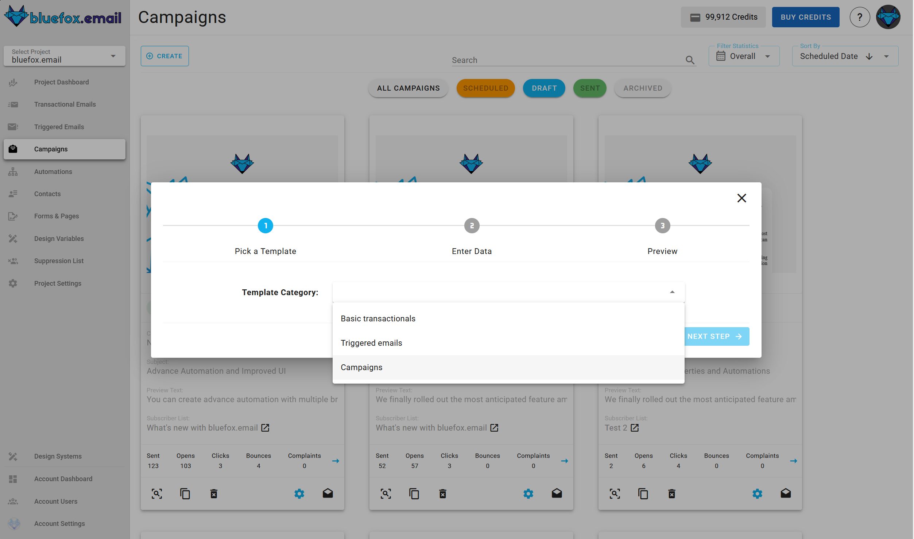
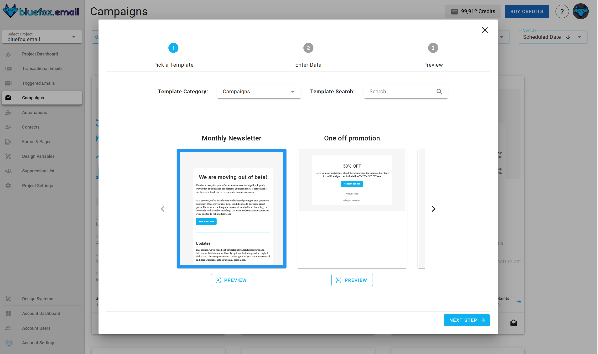
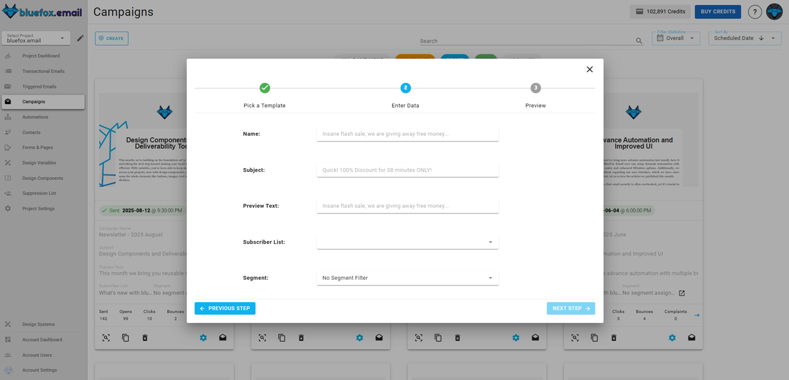
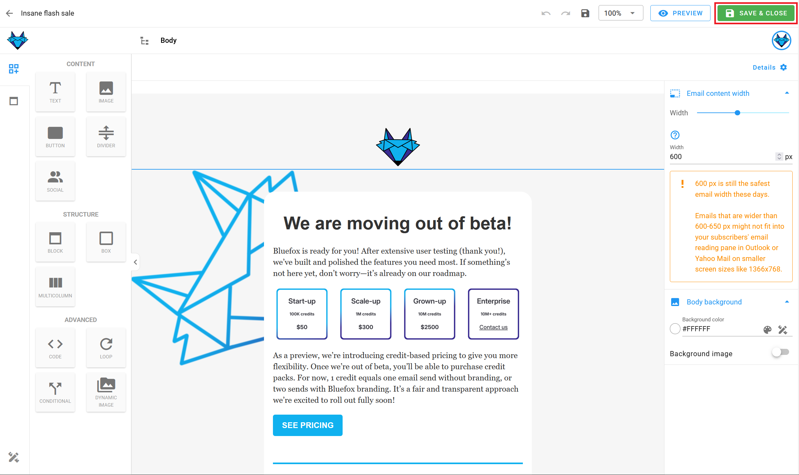
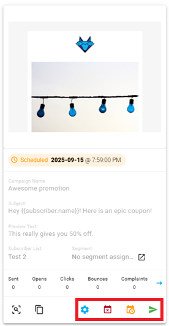
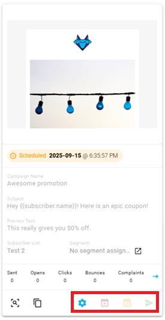
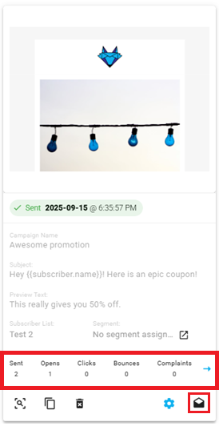

# Campaigns

Unlike transactional and triggered emails, campaigns are not sent by your backend. Campaigns can be scheduled to a specific time or you can send it immediately. All the content is edited within bluefox email. Typical examples are newsletters, promotional emails, or occasional announcements.

Campaigns are sent to the `active` subscribers on a list. Since campaigns are tied to a subscriber list, they must contain an unsubscribe link and optionally a pause subscription link.

You can find the campaigns of a project under the `Campaigns` tab.


## Creating a campaign

In order to create a new campaign, press the `Create` button.


After that, you will have to select a template to start from:



Enter it's name, subject line, and preview text:


Enter its name, subject line, preview text, and select a subscriber list:


After that, you will see a summary page. Click "Launch Editor".


Finally, make changes in the drag 'n' drop email editor:


When you are done, you can schedule your campaign, or you can send it immediately:


## Personalization

Since a campaigns is sent to a subscriber list, subscriber data, unsubscribe link, and pause subscription link are also included. You can use the following merge tags:
```
{{subscriber.name}}
{{subscriber.email}}
{{ubsubscribeLink}}
{{pauseSubscriptionLink}}
```

You can use any handlebars variables in your email while editing. Click on the edit icon on the card:


You can use these handlebars variables in your email, while editing:


And you can use merge tags in the email's `subject line` and `preview text` as well!


For more details, read our guide on [personalization with merge tags](/docs/personalization) and Handlebars.

## Campaign states

There are five states of a campaign: draft, scheduled, being sent (or the scheduled time is only a few minutes away), sent, and archived.

In each state, different actions are available, and some of them are disabled.

Draft campaigns can be edited, scheduled, and sent:


Scheduled campaigns have the following actions: re-schedule, cancel send, send now. Scheduled campaigns cannot be edited nor deleted!


Campaigns that are being sent currently (or the send time is a few minutes away) should not be modified, so all of their actions are disabled.


Sent campaigns can be archived, and stats should show up:


Archived campaigns can be restored. It means that they become draft again.s

