# Contacts

In bluefox.email, Contacts help you manage and organize email recipients. Each contact represents an individual user, storing their email and any additional data. Every project has its own set of contact subscription lists, and you can create as many as needed. Contacts can subscribe to multiple lists, and any updates—such as an email address change—will automatically apply across all subscription lists the contact is subscribed to.

You can find your project's contacts under the Contacts tab:
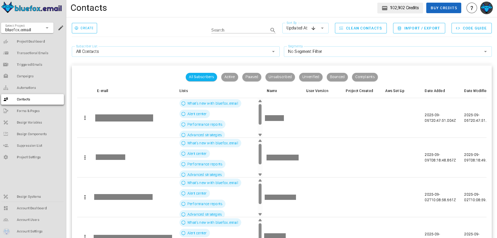

Each contact can be linked to one or more lists. Instead of storing subscriber details directly within a list, lists now reference contacts, creating a flexible and centralized system.

It's a good idea to create separate lists for different topics, like product updates, promotions, tips & tricks, etc.

## Public and Private Lists
When setting up a list, you can choose between **public** and **private** visibility:

- **Public lists** appear on the [subscription preferences](./forms-and-pages#subscription-preferences-page) page, allowing users to manage their subscriptions. The title and description you set for a list help users understand what they’re subscribing to.

- **Private lists** do not appear on the [subscription preferences](./forms-and-pages#subscription-preferences-page) page. Users will only see them if they are already subscribed. These lists are ideal for internal use, testing, or exclusive communications.

You can toggle between **public** and **private** when creating or editing a list using this switch:

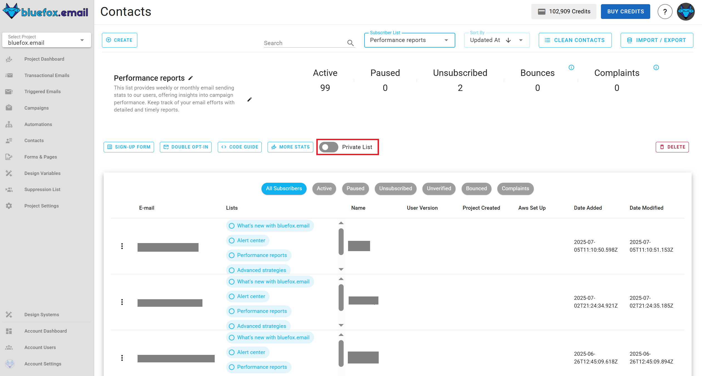

::: info
Private lists are subscription lists that are not visible to users on the subscription preferences page unless they are already subscribed to them. These lists are hidden from general view but become accessible to users who are part of them. This allows for more controlled and targeted management of subscriptions, making private lists ideal for internal use, testing, or exclusive communications.
:::

## Creating Contact or List

To create a contact or list, click the Create button in the Contacts tab.
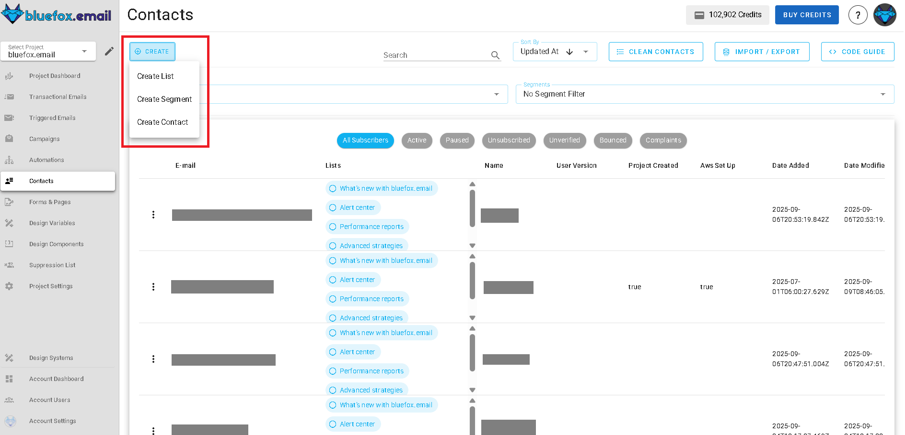

When creating a Contact, you must enter an email. This is the only required field, but you can add additional attributes like name, phone number, or custom data. Contacts can also be subscribed to one or multiple lists during creation.
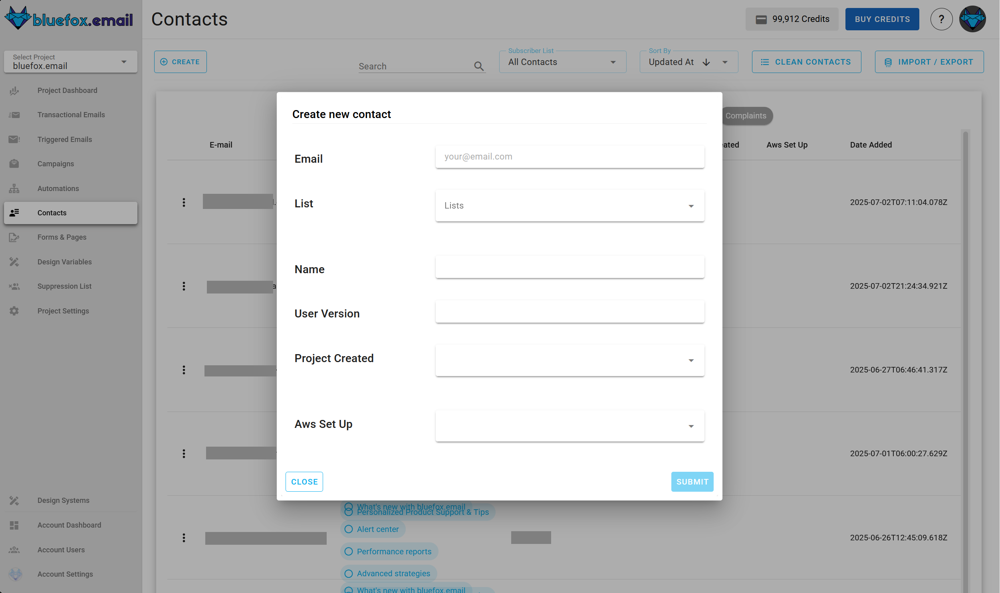

When creating a List, you need to provide a name and description. These details will appear on sign-up forms if the list is public.
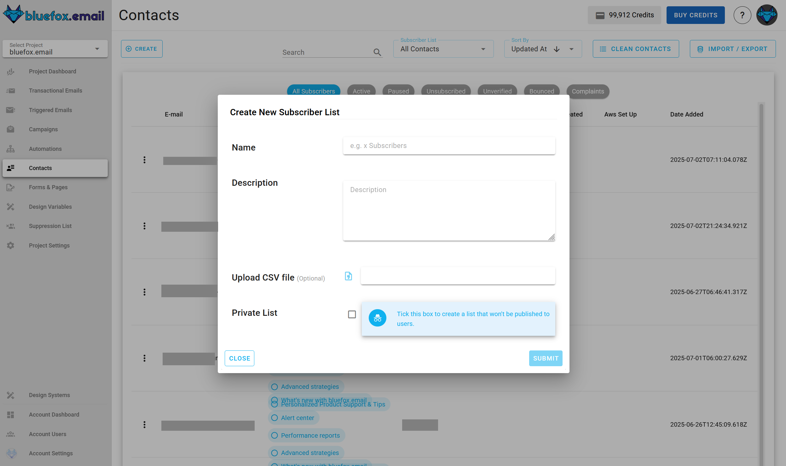

You have the option to upload a CSV file. Read more about it in the import/export CSV section.

## Contact Attributes & Custom Data
Each contact requires an email, but you can store additional data as well. The system provides some predefined attributes, but you can also define custom attributes from Project Settings → Contact Attributes.

For more information on managing custom attributes, visit the [Contact Attributes documentation](/docs/projects/settings#contact-properties)

## Import/Export CSV

The **Import/Export** button allows you to efficiently manage contacts.
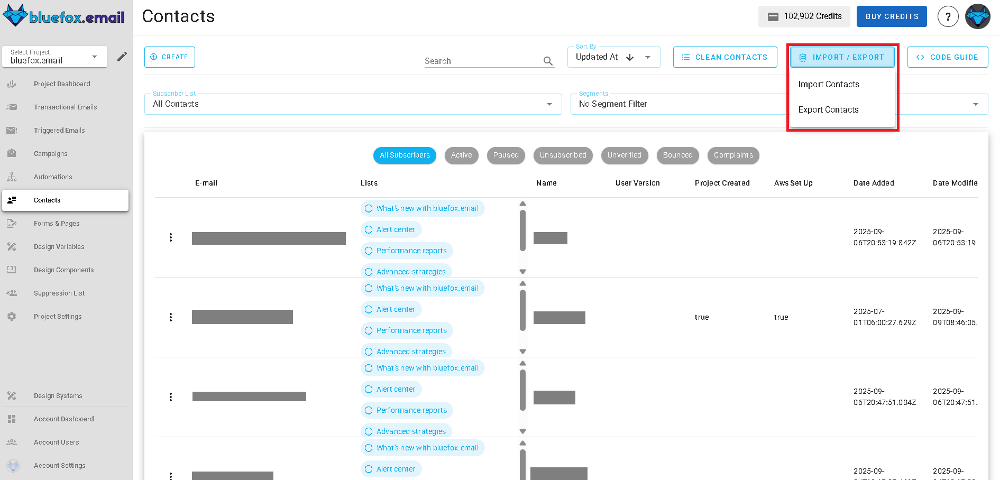

- You can always import Contacts into your full contact database and export all Contacts from your project, regardless of the subscription list selection.

- If a **subscription list** is selected, you also have the option to:

  - Import Contacts into that specific List.

  - Export only the Contacts that belong to the selected list.

When importing contacts, the CSV file must contain an `email` column. Additional attributes can be included as needed.
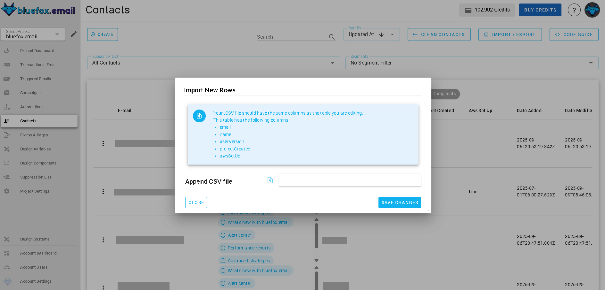

## Subscription Statuses

Inside a list, you will see all contacts that are subscribed to it. The list details section provides insights into:

**unverified** You can create your subscribers via an API call with an `unverified` status. This is useful if you implement (and you should) [double opt-in](/docs/projects/forms-and-pages#double-opt-in). You can change the `unverified` status to `active` when your user verifies their email address.

**active** Only active users will receive your triggered emails or campaigns. If you add a user through the UI (one-by-one or by importing a CSV), they will have an `active` status.

**paused** Users can pause their subscription for a certain amount of time. While paused, they won't receive emails.

**unsubscribed** When users unsubscribe from a list, they won't receive emails through that list anymore.

If you select All Contacts, you will see every contact in your project, regardless of the lists they are subscribed to.

:::tip
Pausing subscription is a great feature because it can significantly reduce the unsubscribe rate.

When you use the `unsubscribeLink` and the `pauseSubscriptionLink` in your emails, they will lead to the subscription preferences page. However, if the user clicks on the second one, the unsubscribe option won't be shown.
:::

## Contacts and Lists Integration

Managing your subscription list in bluefox.email is simple using our [subscription API](/docs/api/subscriber-list-management). This API allows you to subscribe new users, unsubscribe them, activate or pause their subscriptions, list all subscribers, and fetch details about a specific subscriber. We provide code snippets in various programming languages that you can use. Click on the list's "Code guide" button:
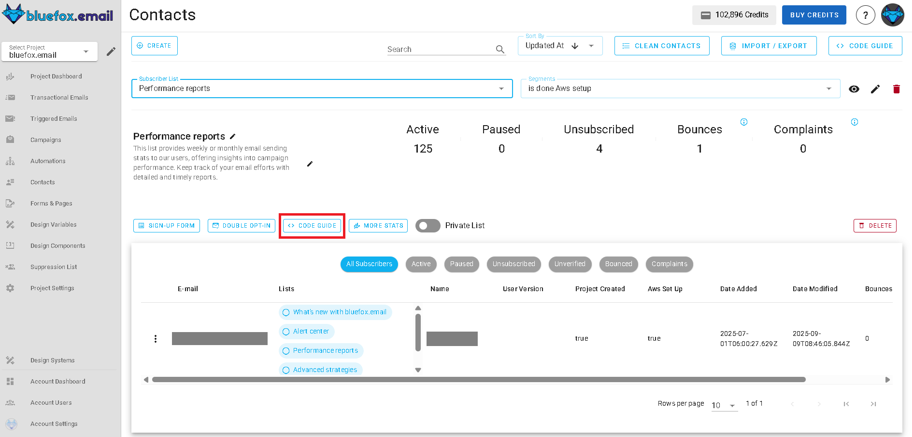

Just copy and modify the code in your preferred programming language:
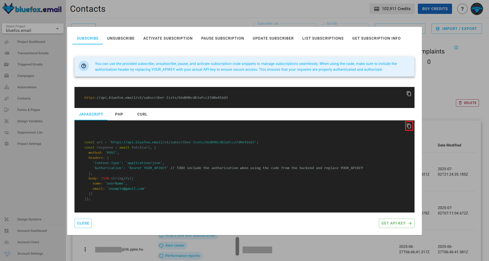

::: danger Security Warning  
Your **bluefox.email** API key must be included in the `Authorization` header of each request. Avoid sending these requests from your frontend to prevent exposing your API key!  
:::  

For more details and guidance on integrating these endpoints, visit our [API documentation](/docs/api/).  

### Contact Filtration

You can filter your contacts with sevral options that allows you to segment your contacts by applying multiple filter conditions.

To access contact filtration, checkout filter options on top in contacts section:
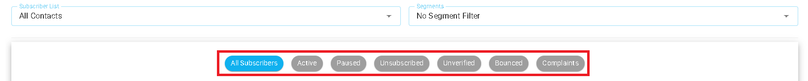

### Double Opt-in
Double opt-in ensures that contacts confirm their subscription before receiving emails. You can enable and customize double opt-in from the double Opt-In settings in **forms and pages** tab.

[Go to double opt-in](/docs/projects/forms-and-pages#double-opt-in).  

When enabled, contacts will receive a verification email and must confirm their subscription before becoming Active.

### Sign-Up Page

The sign-up page in the subscription list allows users to create a form that subscribers can use to sign up directly from their website. This page provides an easy way to customize the form, generate the necessary HTML code, and integrate it into external sites without the need for backend code.

[Go to sign-up page](/docs/projects/forms-and-pages#signup-page).  

## List Statistics  

The **Subscription List Statistics** section provides insights into the performance of your subscription lists, including email activity and subscription trends. This allows you to monitor how well your lists are growing and how subscribers interact with your emails.  

### Why Subscription List Statistics Matter  

Analyzing subscription list statistics helps you:  

- **Monitor Engagement**: Track how subscribers interact with emails sent to a specific list.  
- **Understand Growth Trends**: Visualize how your list is growing or shrinking over time through subscription and unsubscription data.  
- **Improve Retention**: Identify patterns in subscription pauses or unsubscribes to address issues and reduce churn.  
- **Optimize Targeting**: Use insights into subscriber activity to refine your campaigns and re-engagement efforts.  

### What Subscription List Statistics Include  

The subscription list statistics section includes the following key metrics:

Similar to email statistics, this section provides details about the emails sent to this list:  
- **Sent Emails**: Total number of emails sent to the subscription list.  
- **Opens**: Number of times recipients on this list opened emails.  
- **Unique Opens**: Number of individual subscribers who opened emails (counts only one open per subscriber).  
- **Clicks**: Total number of clicks on links within the emails sent to this list.  
- **Unique Clicks**: Number of individual subscribers who clicked on links (counts only one click per subscriber).  
- **Bounces**: Number of emails that failed to deliver.  
- **Complaints**: Number of complaints (e.g., emails marked as spam).   
- **Subscriptions**: Number of new subscribers added to the list during the selected time interval.  
- **Resubscriptions**: Number of previous subscribers who re-subscribed.  
- **Unsubscribes**: Number of subscribers who opted out during the selected period.  
- **Paused Subscriptions**: Number of subscribers who paused their subscriptions temporarily.  

These metrics provide a comprehensive view of your subscription list's performance and behavior. By analyzing this data, you can identify trends, address issues, and refine your strategies to grow and retain your subscriber base more effectively.

### How to Access Subscription List Statistics

You can access the **Subscription List Statistics** by clicking the arrow icon:

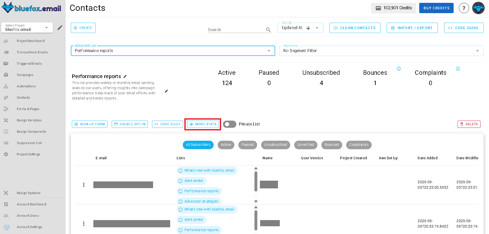

For more information on how to use the **Subscription List Statistics**, refer to the [Analytics Documentation](/docs/analytics).
