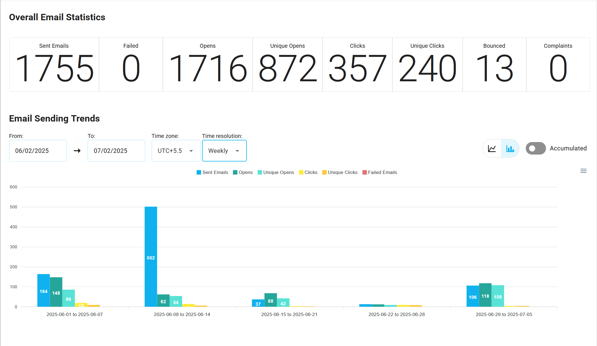
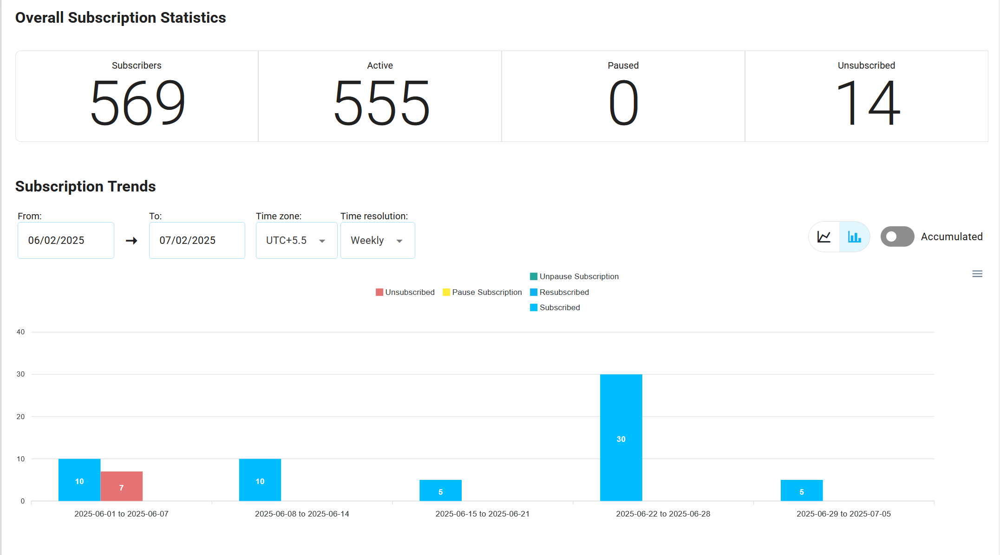

# Project Dashboard

The project dashboard offers a comprehensive view of your email and subscription performance, combining metrics from [**transactional emails**](/docs/projects/transactional-emails#transactional-email-statistics), [**triggered emails**](/docs/projects/triggered-emails#triggered-email-statistics), [**campaigns**](/docs/projects/campaigns#campaign-email-statistics), and [**subscriber lists**](/docs/projects/contacts#list-statistics). By reviewing this data, you can identify trends like high unsubscribes or low engagement, optimize your subscriber lists, and improve email campaigns to boost retention, open rates, and click-through rates. These insights help you track performance, adjust strategies, and maintain a healthy subscriber base.

## Why Project Dashboard Matter

Project Dashboard help you:

- **Track Email Performance**: Measure the effectiveness of your email strategy across all email types (transactional, triggered, and campaign emails).
- **Monitor Subscriber Behavior**: Gain insights into how subscribers are interacting with your project, including whether they are subscribing, unsubscribing, pausing, or resubscribing.
- **Optimize Future Campaigns**: Use data-driven insights to improve subject lines, content, and timing to boost email engagement and conversions.
- **Detect Issues Early**: Identify trends like high bounce rates or low open rates, enabling you to fix potential problems before they affect your performance.
- **Enhance Subscriber Retention**: Track and manage subscription behaviors to help improve long-term subscriber engagement and retention.

## Key Metrics in Project Dashboard

Project dashboard cover both **email performance** and **subscriber activity**, providing you with a comprehensive view of your project.

### 1. **Email Performance Metrics**
- **Sent Emails**: The total number of emails sent across all email types (transactional, triggered, and campaign emails).
- **Opens**: The total number of email opens across all campaigns, reflecting how engaging your content is.
- **Unique Opens**: The number of unique recipients who opened the emails, indicating how widely your emails are being engaged with.
- **Clicks**: The total number of clicks on links inside your emails, helping gauge how many recipients take action.
- **Unique Clicks**: The number of unique recipients who clicked on links in your emails, highlighting the overall engagement level.
- **Bounces**: The number of emails that failed to be delivered, helping to track deliverability issues.
- **Complaints**: The number of recipients who marked your emails as spam or filed complaints, an important indicator of email content quality.

The chart below displays the performance of transactional, triggered, and campaign emails across the project, highlighting opens, clicks, and complaints.

### 2. **Subscriber Metrics**
- **Subscribers**: The total number of subscribers in the project across all lists. This metric reflects the overall reach of your project.
- **Active**: The number of subscribers who are currently receiving emails and have an active subscription status. Active subscribers represent your engaged audience.
- **Paused**: The number of subscribers who have temporarily paused their subscription. These subscribers are not receiving emails but may resume in the future.
- **Unsubscribed**: The number of subscribers who have opted out of receiving emails, signaling a disengagement or loss of interest.
- **Subscribed**: Tracks the number of new subscribers added to your email lists over a specific time period, helping you understand growth patterns.
- **Unsubscribed**: Tracks the number of unsubscribes during a time period, providing insight into periods of disengagement.
- **Paused**: Tracks the number of subscriptions were paused during a time period, providing insight into periods of disengagement.
- **Unpaused Trends**: Tracks the number of subscriptions were unpaused during a time period, providing insight into periods of disengagement.
- **Resubscribed**: The number of subscribers who have rejoined your email lists after previously unsubscribing, indicating successful re-engagement efforts.

The chart above visualizes the subscriber metrics across the project, including active, paused, unsubscribed, and resubscribed users, providing insights into user engagement and retention.

For more information on how to use the **Project Dashboard Statistics**, refer to the [Analytics Documentation](/docs/analytics).
