# Data Feeds

Data feeds let you pull live content from an external source directly into your email at send time. Instead of editing the template every time the content changes, you point the email at a feed URL and bluefox.email fetches the latest items when the email is sent.

This is useful for newsletters, digests, weekly roundups, product highlights, recommended articles, or any email where the content should reflect up-to-date data.

Data feeds are available on every email type:
- [Transactional Emails](/docs/projects/transactional-emails#data-feeds)
- [Triggered Emails](/docs/projects/triggered-emails#data-feeds)
- [Campaigns](/docs/projects/campaigns#data-feeds)
- [Automations](/docs/projects/automations) (inside Send Email and Notify nodes)

Supported feed types:
- **RSS / Atom XML**
- **JSON**

## Adding a Feed

Every email card has a **Feeds** section, just below the Details section. Expand it to see existing feeds or to add a new one. Click **+ Add Feed**.

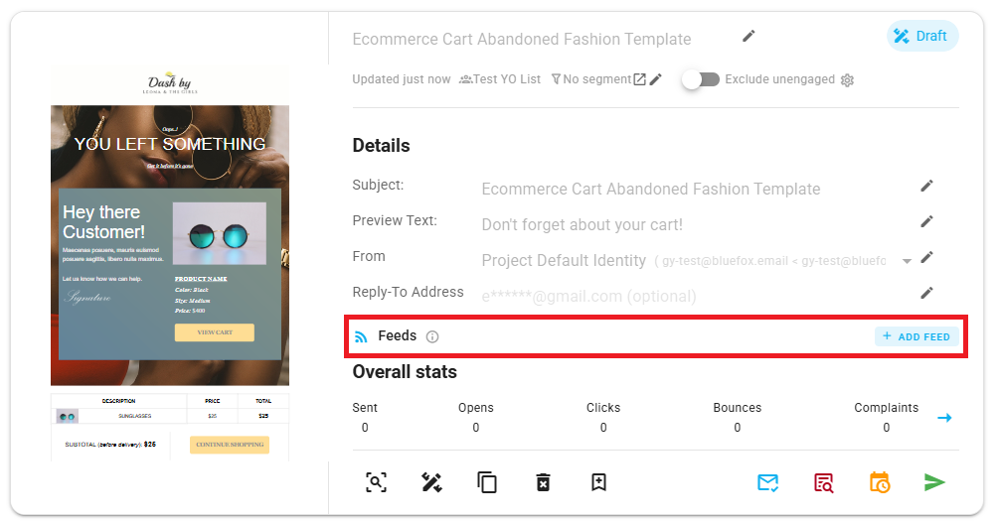

A form expands where you configure the feed:

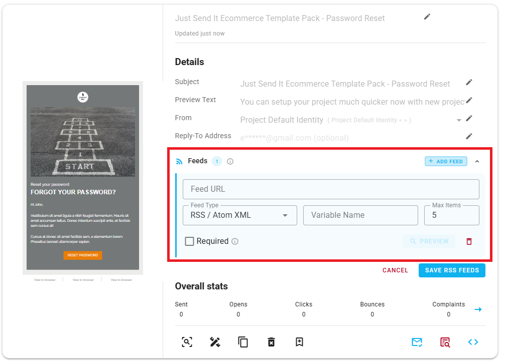

Fill in the following fields:

- **Feed URL**: The URL of the feed you want to pull content from.
- **Feed Type**: Select the type of feed (RSS / Atom XML or JSON).
- **Variable Name**: The name you'll use to reference this feed's data inside your email template using Handlebars syntax. For example, if you name it `news`, you'll reference items as `news` in the loop expression.
- **Required** (checkbox): If checked, the email will not be sent when the feed fails to load. See [Required Feeds](#required-feeds) below.

Click **Preview** to verify the feed is reachable and to see the items + available fields. 

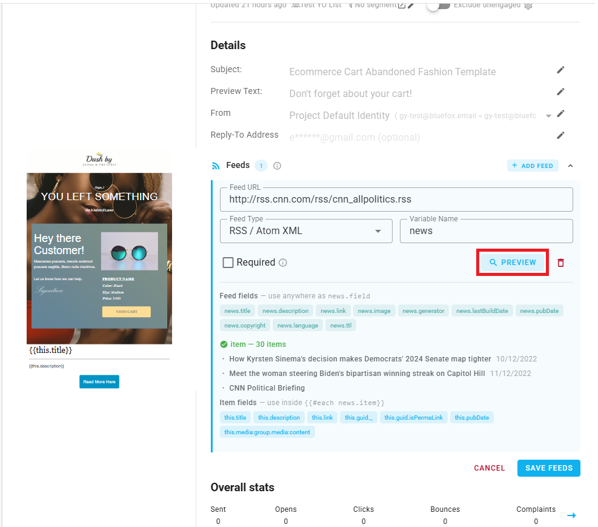

Then click **Save** to store the configuration.

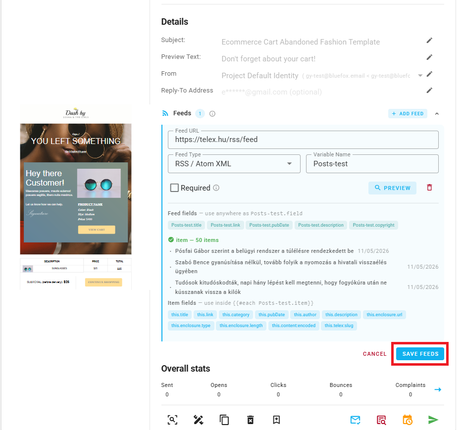

::: tip
You can add multiple feeds to a single email by clicking **+ Add Feed** again after saving the first one.
:::

## Using a Feed in Your Template

A feed is an **array of items**. To render those items in your email, use a **loop** block in the editor.

### Step 1: Insert a Loop

In the drag-and-drop editor, drop a **Loop** block where you want the feed content to appear.

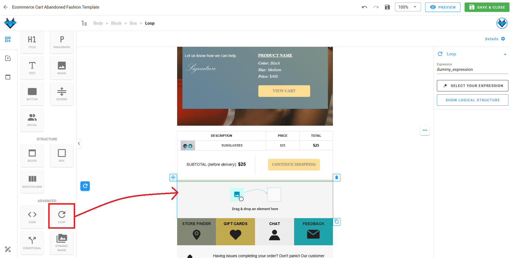

### Step 2: Configure the Loop Expression

On the right side menu you will see the loop's settings and select the expression. 
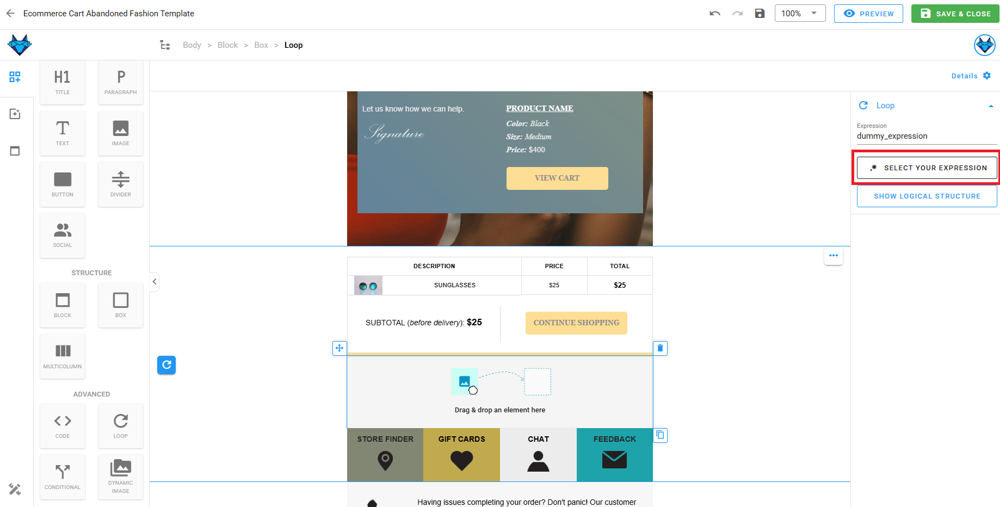

The table you will see, lists every feed you've added to this email by its **Variable Name**. 

Pick the one you want.

You can also set:
- **Skip**: Number of items to skip from the start (e.g. `0`).
- **Limit**: Number of items to render (e.g. `2` to show the first two).

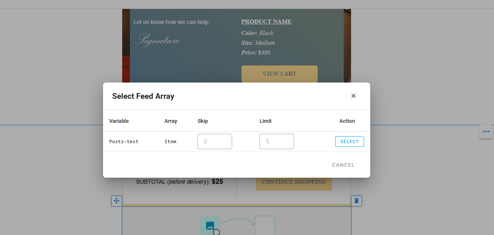

### Step 3: Reference Item Fields Inside the Loop

Inside the loop, you can drop normal content blocks (text, image, button, divider, etc.) and reference the current item's fields using merge tags. So just click the merge tag icon in any block's toolbar to see the available fields from the feed.

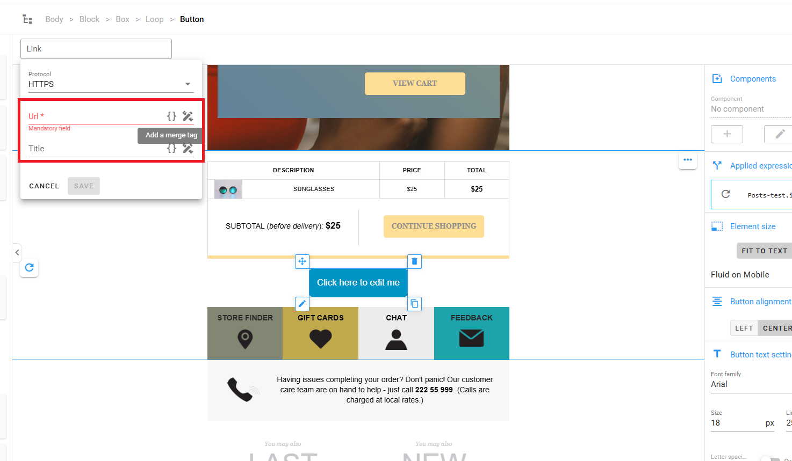

When the merge tag picker is open **inside the loop**, you'll see the item's fields (the keys available on each entry of the feed). Outside the loop, only the top-level/generic keys of the feed are visible per-item fields are only accessible from inside a loop bound to that feed.

Common RSS / Atom fields you'll reference:
- `item.title`
- `item.link`
- `item.description`
- `item.enclosure.url`: the image URL for items that include media

For a JSON feed, the field names depend on your feed's response shape, use **Preview** to discover them.

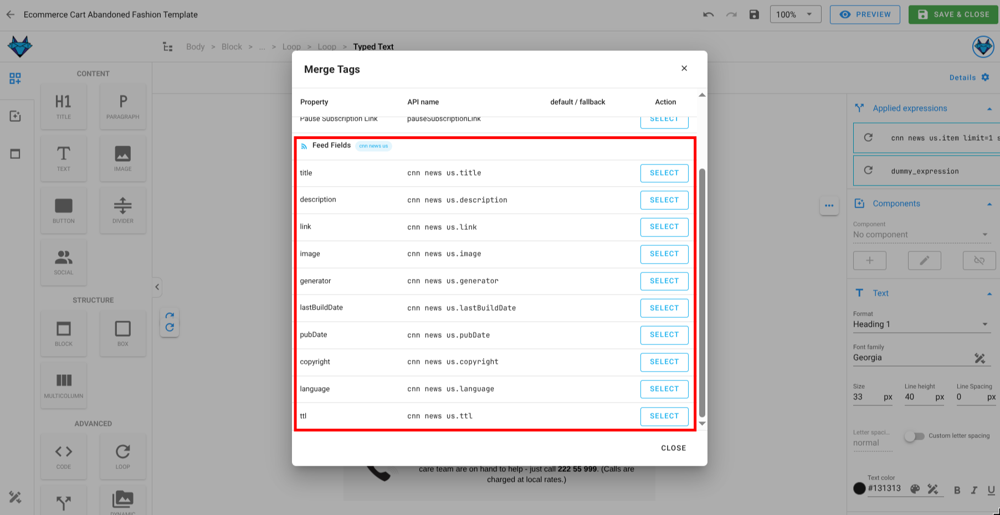

::: warning Images from a feed need the Dynamic Image block
A regular **Image** block expects a static URL set at design time. If you want the image to come from a feed item (e.g. `item.enclosure.url`), use the **Dynamic Image** block instead and set its source to the merge tag. A regular Image block will not render feed-driven URLs correctly.
:::

### Step 4: Preview With Data

Once you've set up the loop and referenced the item fields, click the preview button in the editor. Here you can view the raw email preview, but to see the feed items rendered, switch to **Preview with data** mode. 

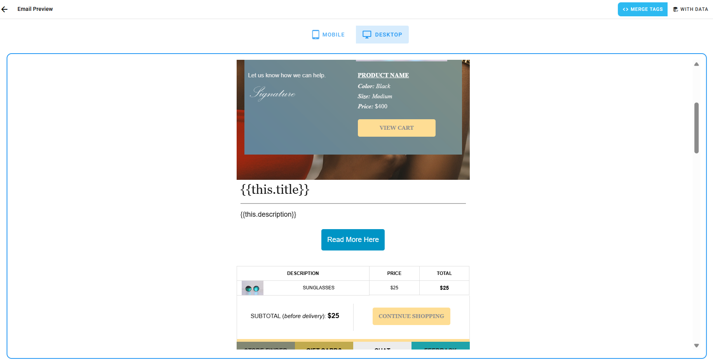

Here you will be able to see the feed items rendered in the loop, and confirm that the fields are pulling through as expected. If you see errors or missing data, double-check the feed URL, type, and field references.

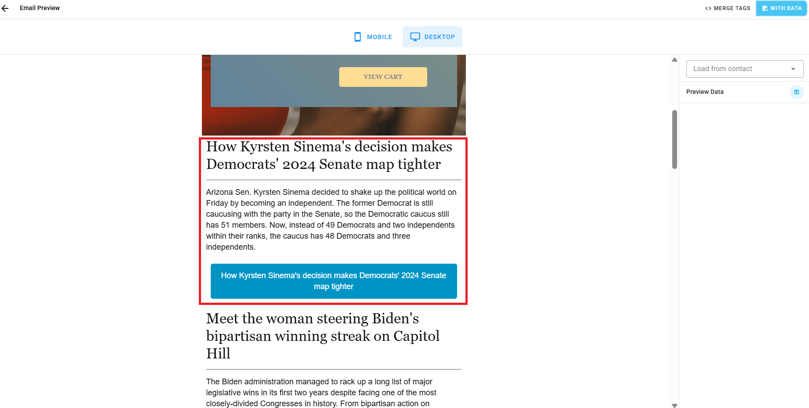

## Required Feeds

The **Required** checkbox on the feed controls what happens when the feed fails to load at send time:

- **Required = on**: If the feed fails to load, **the email will not be sent**. Use this when the feed content is essential (e.g. a digest that is meaningless without it).
- **Required = off**: If the feed fails to load, the email is still sent and the loop simply renders nothing for that feed. Use this for optional/supplementary content.

If an email has multiple feeds, each feed's Required flag is evaluated independently.

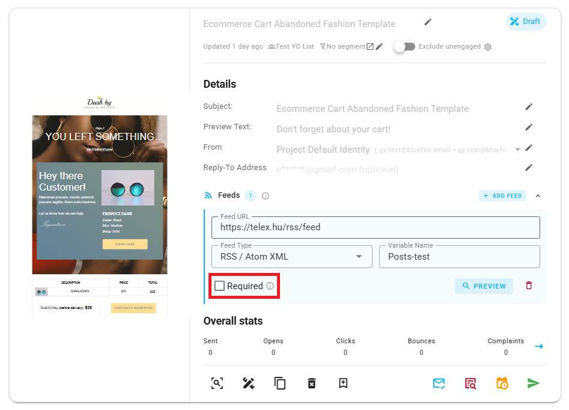

## Multiple Feeds

You can attach as many feeds as you need to a single email. Each feed has its own variable name, so you can loop over them independently in the same template (e.g. one loop for news, another for products).

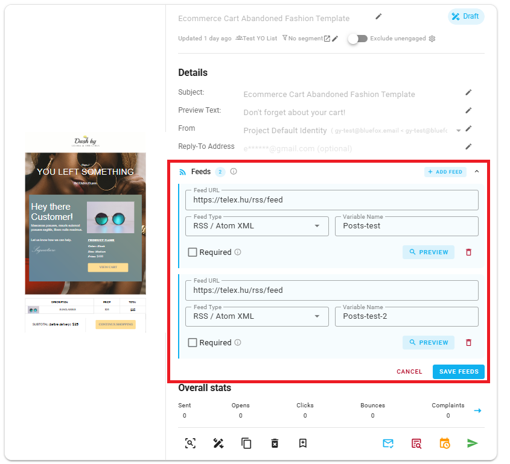

## Editing or Deleting a Feed

In the Feeds section of the email card, expand a feed to edit its fields or delete it. Deleting a feed only affects this email, other emails using the same URL are unchanged. If you delete a feed that's referenced by a loop in the template, that loop will have no items to render (and if it was marked Required, the email will stop sending until you fix it).

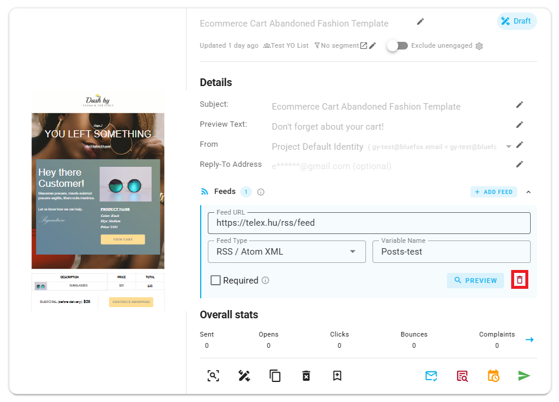
