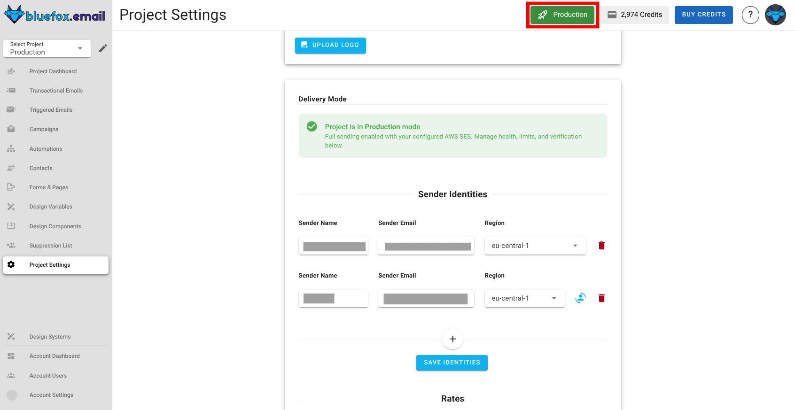
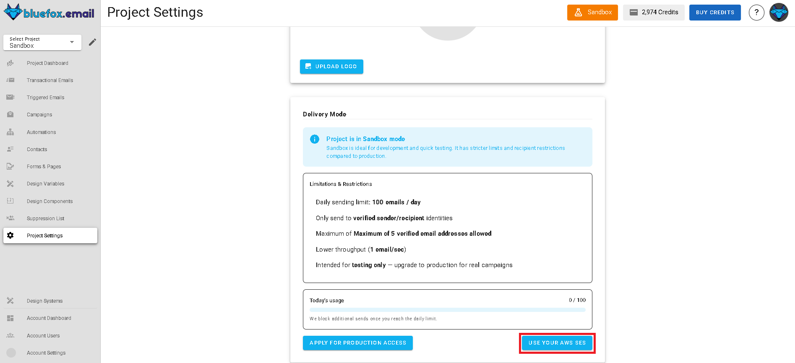

# Delivery Modes

BlueFox Email offers flexible delivery modes that let you start sending emails immediately and scale when ready. Every new project begins in **sandbox mode**, allowing you to send your first email within minutes with some restrictions. When you're ready for unrestricted sending, you can transition to **production mode**. Of course, if you still prefer to use AWS SES directly, you can do that too without any delay or restrictions.

## Sandbox Mode

Whenever you create a new project in BlueFox Email, it starts in **sandbox mode**. This mode is designed to help you get started quickly without needing to set up anything. You can send emails right away, but there are a few limitations to be aware of:

- You can only send emails up to 5 verified email addresses. These emails will be sent through `no-reply@bluefoxemailsandbox.com`. You can verify your domain within BlueFox Email [project settings](/docs/projects/settings.md) to send from your own domain.
- You can send 100 emails per day.
- Lower throughput (1 email/sec).

Sandbox mode is perfect for testing and development. It allows you to explore BlueFox Email's features without any initial setup. You can verify your email addresses and domains directly within BlueFox Email, making it easy to get started.

## Production Mode

When you're ready to send emails without restrictions, you can request to move your project to **production mode**. This mode lifts the limitations of sandbox mode, allowing you to send emails to any address and at higher volumes. To transition to production mode, you need to verify your domain and request production access. For application instructions, click the button below here in your project settings.

Once your project is approved for production mode, you can confirm that with this badge here at the top of your project.

Once your project is in production mode, you can send emails to any recipient, and your sending limits are lifted. 

## Maintaining Production Access

But make sure that you maintain good sending practices. 

You should maintain:
- A low bounce rate (below 2.5%).
- A low complaint rate (below 0.05%).

If your bounce or complaint rates exceed these thresholds, BlueFox Email may suspend your project. Now of course, we will notify you in advance when you are about to reach these limits.

You can always check your bounce and complaint rates in the [project dashboard](/docs/projects/dashboard.md).

## Using AWS SES Directly

If you prefer to use AWS SES directly without any restrictions, you can do so by configuring your AWS credentials in your project settings. This allows you to send emails through your own AWS SES account, giving you full control over your sending limits and practices.

This option is ideal for users who already have an established AWS SES setup and want to leverage BlueFox Email's features while using their own SES account. You can follow the steps in the [project settings documentation](/docs/projects/settings.md) to configure your AWS credentials.