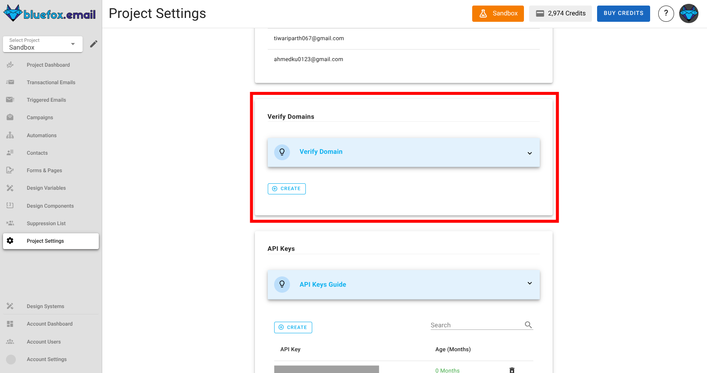
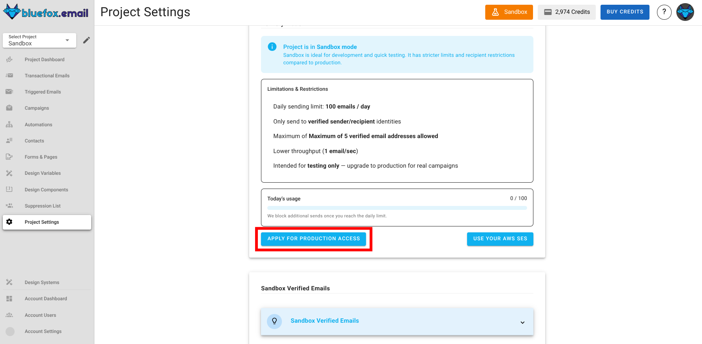
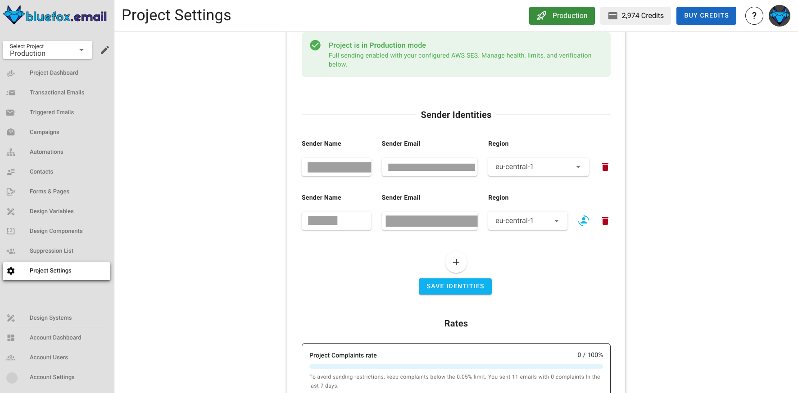
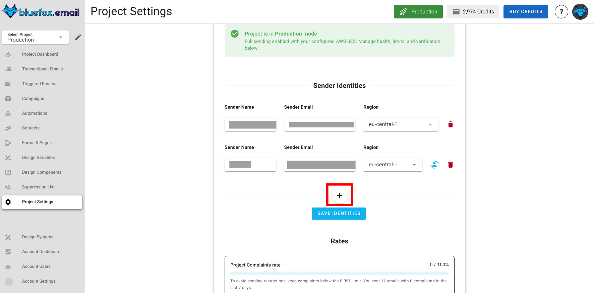
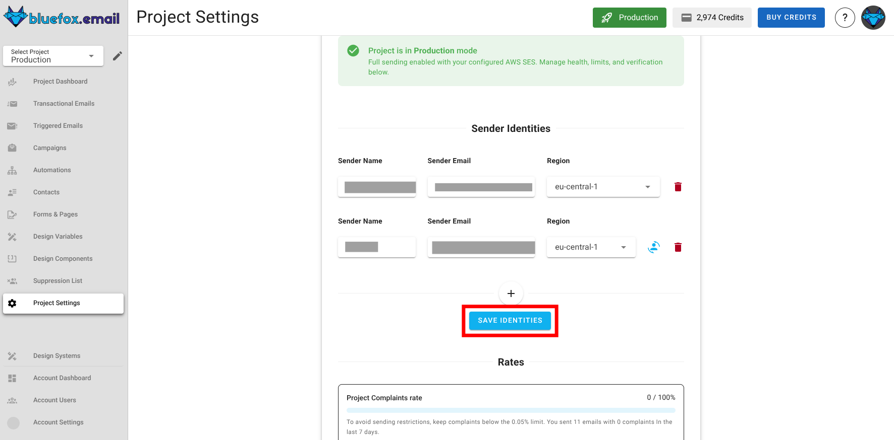
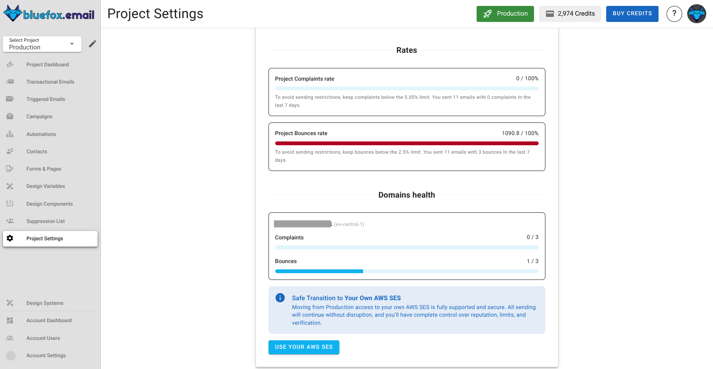
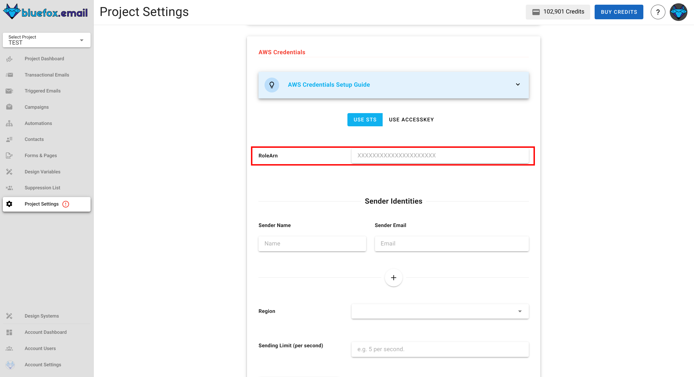
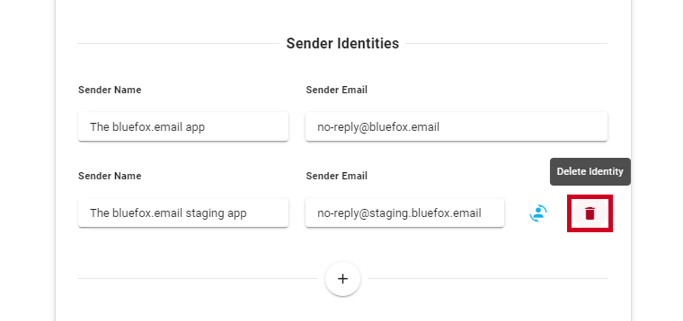

# Delivery Modes

BlueFox Email offers flexible delivery modes that let you start sending emails immediately and scale when ready. Every new project begins in **sandbox mode**, allowing you to send your first email within minutes with some restrictions. When you're ready for unrestricted sending, you can transition to **production mode**. Of course, if you still prefer to use AWS SES directly, you can do that too without any delay or restrictions.

## Sandbox Mode

Whenever you create a new project in BlueFox Email, it starts in **sandbox mode**. 

This mode is designed to help you get started quickly without needing to set up anything. You can send emails right away, but there are a few limitations to be aware of:

- You can only send emails up to 5 verified email addresses. Here is where you can verify them in your project settings.
  

  Also if you verify your domain within BlueFox Email project settings, you can send to that domain as well.
  
  

  - When you hit create and enter the email address, a verification email will be sent to that address. You need to click the link in that email to verify the address.
  
- These emails will be sent from `no-reply@bluefoxemailsandbox.com`.
- You can send 100 emails per day.
- Lower throughput (1 email/sec).

Sandbox mode is perfect for testing and development. It allows you to explore BlueFox Email's features without any initial setup. You can verify your email addresses and domains directly within BlueFox Email, making it easy to get started.

## Production Mode

When you're ready to send emails without restrictions, you can request to move your project to **production mode**. This mode lifts the limitations of sandbox mode, allowing you to send emails to any address and at higher volumes. 

To transition to production mode, you need to verify your domain (same place as [sandbox mode](#sandbox-mode)) and request production access. For application instructions, click the button below here in your project settings.

When you request production access, you'll be asked a few questions about your use case and sending practices.

Answer the questions honestly, and we will review your request as soon as possible.

Once your project is approved for production mode, you can confirm that with this badge here at the top of your project.

Here is what you can do in production mode:

- Send emails to any address.
- No sending limits.
- Higher throughput
- Use your own domain.
- Add identities (emails) directly in your project settings. Make sure that the domain of these emails is verified.
  
### Managing Identities in Production Mode

In production mode, you can manage your sender identities directly within your project settings. This includes adding email addresses that you want to use as sender identities for your emails. Make sure that you verify the domain of these email addresses to ensure successful delivery.

To create an identity: 
- click this plus icon here.
  

- Enter the sender name and email address and select the region. 

  

  Here, if your domain is verified in multiple regions, you can select the region where you want to create this identity.

- If you want to use this identity as the default identity, check this icon here.
  

- When you are done with creating the identitiy, make sure to hit save! 
  

- If you wish to delete an identity, you can do so by clicking the trash icon next to the identity.
  

  :::warning Important Notes
  Before deleting an identity, ensure that it is not connected to any email campaigns, transactional emails, or automations. Deleting an identity that is in use may lead to email delivery issues.
  :::

### Maintaining Production Access

But make sure that you maintain good sending practices. 

You should maintain:
- A low bounce rate (below 2.5%).
- A low complaint rate (below 0.05%).

If your bounce or complaint rates exceed these thresholds, BlueFox Email may suspend your project. Now of course, we will notify you in advance when you are about to reach these limits.

You can always check your bounce and complaint rates here:

:::info Note
- So in the project bounce rate, 100% that you see here in the screenshot is 100% of that 2.5% bounce rate limit and same for complaint rate. So if you see 50% here, that means you are at 1.25% bounce rate.
- Similarly, In domain health section, 0/3 means you have 0 complaints out of 3 email sends and same with bounces. 
:::

## Using AWS SES Directly

If you prefer to use AWS SES directly without any restrictions, you can do so by configuring your AWS credentials in your project settings. This allows you to send emails through your own AWS SES account, giving you full control over your sending limits and practices.

This option is ideal for users who already have an established AWS SES setup and want to leverage BlueFox Email's features while using their own SES account. You can follow the steps below to set up your AWS credentials.

### AWS Credentials

Our platform sends emails using your AWS SES, ensuring high deliverability and preventing spammers from using our platform.

:::info Note
For AWS SES to work smoothly with **bluefox.email**, you’ll need at least these permissions: 

`ses:SendEmail`, `ses:SendRawEmail`, `ses:ListIdentities`, `ses:GetSendQuota`

This is the minimum set needed to send emails, verify identities, and keep an eye on your send limits.
:::

First, set up your AWS `Access Key ID`, `Secret Access Key`, `Sender Identities`, `AWS region`, and `sending limit`.

The access key must be able to send emails via SES from the region and the sending email you set up. The sending limit should be lower or equal to the actual AWS SES sending limit. Keep in mind, that your sending limit in "sandbox" is only 1 per second!

::: tip Your AWS Credentials Are Secure
We store your credentials encrypted, so even in the very unlikely event of data leakage, attackers won't be able to use your credentials.
:::

### Use STS ( Security Token Service )

STS (Security Token Service) is AWS's secure method for temporary, limited-privilege credentials. It's more secure than long-lived access keys because credentials automatically expire and don't need to be stored in your application.

Here's how to set it up:

1. Click the `Use STS` button and expand the instructions banner
2. Follow the step-by-step guide to create and configure your AWS role
3. Copy the generated `RoleArn`.
4. Paste the `RoleArn` into the input field here:

5. Fill up rest of the input fields and once done hit `Save AWS Credentials`.

Once configured, bluefox.email will use your Role ARN to securely generate temporary credentials on demand, eliminating the security risks of storing permanent access keys.

:::warning Important Notes
- You cannot use both STS and regular AWS credentials simultaneously. If you want to switch from STS to standard AWS credentials, you must first remove your STS configuration.
- You cannot remove AWS credentials (either STS or standard) if you have scheduled campaigns or running automations that depend on them.
:::

### Managing Sender Identities

In this section, you can manage the sender names and email addresses that will appear to your recipients. These identities define the sender details used for your emails. By default, emails will use the **default identity**. If you wish to use a specific identity for an email, you can configure it in the **advanced settings** of the email.

- **Adding a new identity**  
  To add a new identity, click the **"add identity"** button and provide the sender name and email address.

  

- **Default identity**  
  When adding identities, the first sender identity is automatically set as the **default identity**.  
  - To change the default identity, click the **"set as default identity"** icon next to any other sender identity.  
  - The default identity is used automatically when no specific sender identity is selected for an email.

  

- **Deleting an identity**  
  If a sender identity is no longer needed, you can delete it by clicking the **trash icon** next to the sender identity.

  

  ### Bounce & Complaint Webhooks
  
  To know the [bounce and complaint numbers](/docs/projects/dashboard) of your emails, set up our webhooks in AWS SNS.
  
  To set up the hooks, expand the banner:
  
  
  
  ... and follow the instructions. After finishing, click on `Run Test` button and if everything is good you should see this:
  
  
  
  The **Identity Name** column displays the identities configured in your project. The green tick marks in the **Bounce Hook** and **Complaint Hook** columns indicate that the webhooks have been successfully set up for each identity. If any webhook fails to configure correctly, you can revisit the setup and re-test.
  
  Additionally, the red **Reset Bounce Webhook** and **Reset Complaint Webhook** buttons allow you to reset and reconfigure the webhooks if needed. This ensures that your setup remains flexible and can be updated whenever required. Once all green ticks are visible, the webhooks are fully operational, confirming that bounce and complaint events will be tracked effectively.