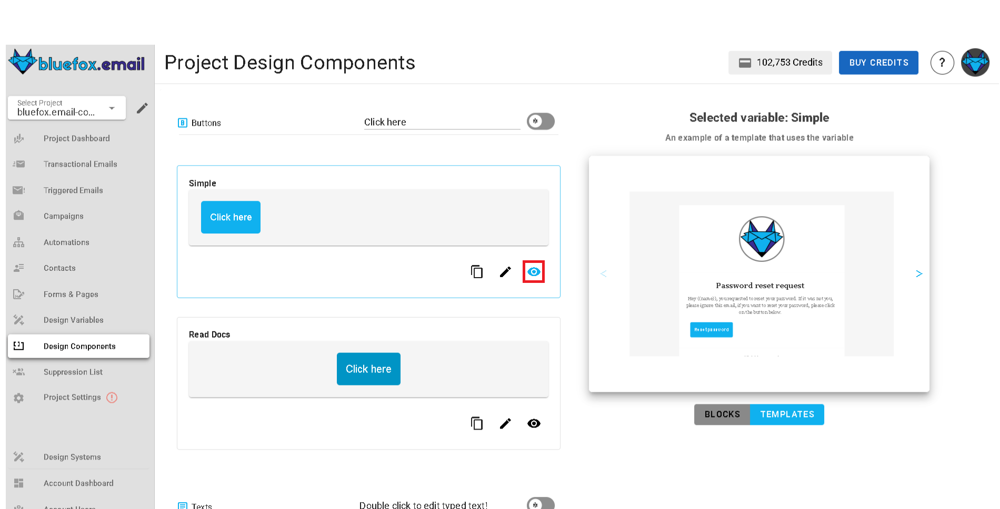

# Design System Components

You can customize the components provided by the design system linked to your project. Component types include buttons, texts, images, and dividers.

These components are used throughout blocks and templates defined in your design system. When you update a component here, the change is reflected everywhere it’s used in the current project, except for campaigns that have already been sent.

How a component appears and behaves depends on the chosen design system. For example, a **`primary-button`** component could define the look and action of your main call‑to‑action, while a **`divider-primary`** component could style section separators in emails.

If you override a component, the change applies **only to this project**. Other projects linked to the same design system remain unaffected.

## Managing Components

- **Edit:** Click the pencil icon next to a component to modify its properties.  
  

  When editing, the right panel switches from showing a static preview to showing editable fields such as size, alignment, text content, paddings, borders, or backgrounds, depending on the component type.
  
  

- **Preview:** Click the preview icon (eye) to see how the component will appear in blocks and templates. The preview is displayed on the right panel.

  

- **Copy:** Click the copy icon to copy a component’s styles or properties.

  

- **Reset:** If you’ve overridden a component, click the reset icon to restore it to its original design system configuration.

  

## Component Types

The exact editable properties vary by component type:

- **Button Components:** Size, alignment, button text settings, margins, paddings, border, background.
- **Text Components:** Content, text alignment, link formatting, paddings, background.
- **Divider Components:** Paddings, line style, background.
- **Image Components:** Size, alignment, margins, paddings, border, background.

## Note on Scope

Changes to a design system component from this page update every instance of that component used in blocks and templates in the current project. Previously sent campaigns are not affected.

## Important

::: warning
The design system linked to a project cannot be changed. If you need to use a different design system, create a new project and select the desired system during setup.
:::