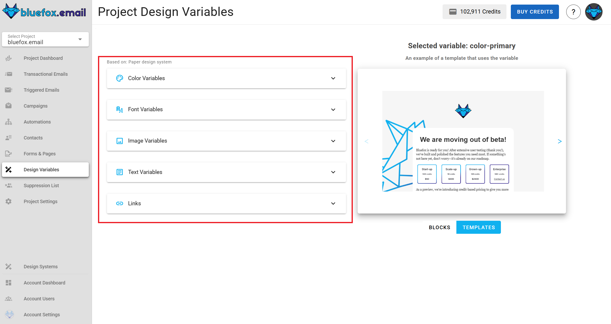
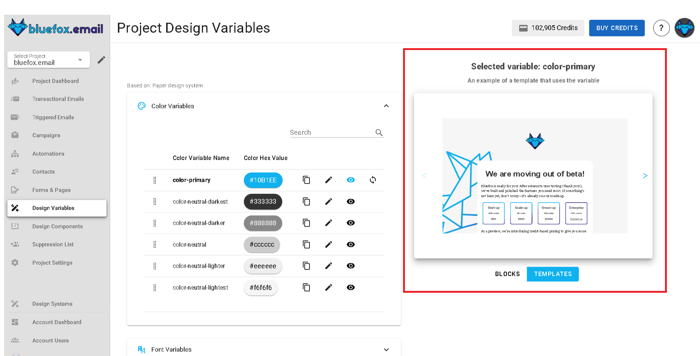
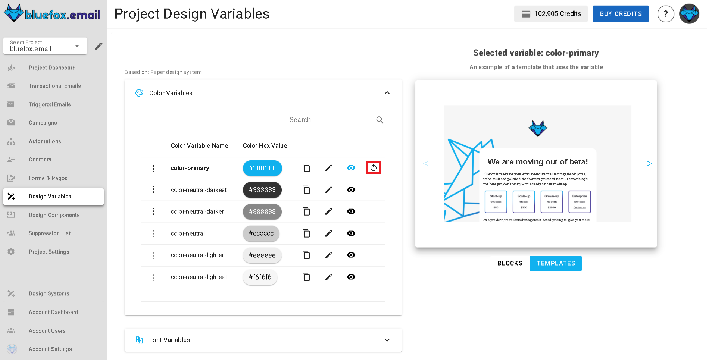

# Theme settings

You can customize the theme you have selected when you created your project, by changing these parameters. There are the following parameter types: colors, font stacks, images, texts, and links.

These variables are used all around the theme's blocks and templates, so if you change them here, they will be changed everywhere, except for campaigns that you already have sent.

What a certain variable exactly does depends on the design system. For example in one design system, primary color might be used for headings and button backgrounds, but in another, it might only be used for button borders.

If you override a theme parameter, that will be only affect this project, other project will be unaffected. You can edit a variable by clicking on the pencil icon next to the variable:

You can click on the preview icon next to a variable to see the blocks and templates in which it is used.

You can see in the preview of the blocks and templates on the right hand side:

You can also reset your parameters to the theme's default values. This is only available when you overrode some values.

  
::: warning
The theme of a project cannot be changed. If you have created a project with a theme, then it will stay as it is. If you need to change the theme of your emails, we suggest to create a new project with another theme.
:::
