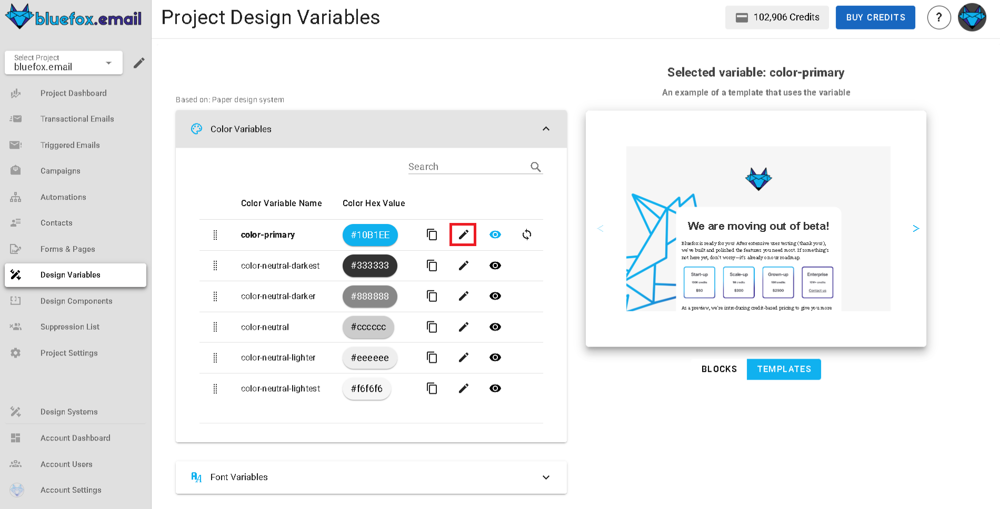

# Design System Settings

You can customize the design system you selected when creating your project by changing these parameters. The parameter types include colors, font stacks, images, texts, and links.

These variables are used throughout the design system's blocks and templates. When you change them here, they will update everywhere, except for campaigns that have already been sent.

The exact function of a variable depends on the design system. For example, in one design system, the primary color might be used for headings and button backgrounds, while in another, it might be used only for button borders.

If you override a design system parameter, the changes will only affect this project. Other projects will remain unaffected. To edit a variable, click the pencil icon next to it:

To see where a variable is used, click the preview icon next to it:

You will see the preview of the blocks and templates on the right-hand side:

You can also reset your parameters to the design system's default values if you have overridden some values:

::: warning
The design system of a project cannot be changed. If you create a project with a design system, it will stay as it is. If you need to change the design system of your emails, create a new project with a different design system.
:::
