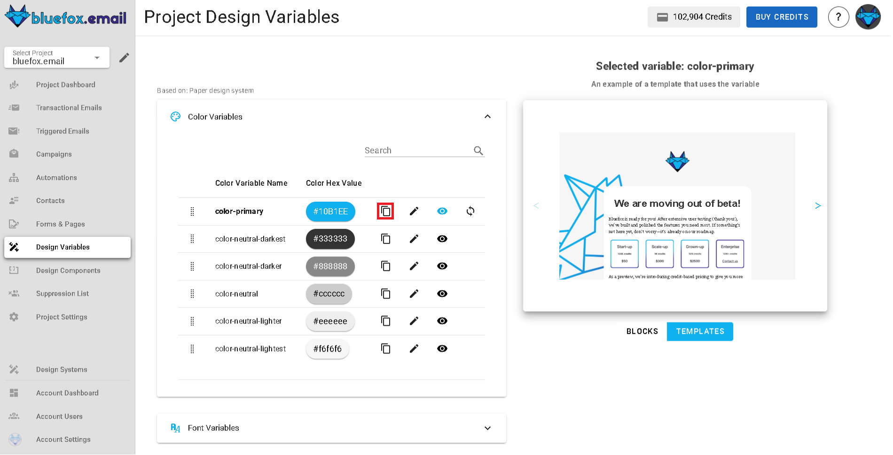

# Design System Variables

You can customize the variables for the design system you selected when creating your project. Variable types include colors, font stacks, images, texts, and links.

These variables are used throughout blocks and templates defined in the design system. When you change a variable here, it updates everywhere in your project—except for campaigns that have already been sent.

How a variable is used depends on the chosen design system. For example, one design system might use a `primary-color` variable for headings and button backgrounds, while another uses it solely for button borders.

If you override any variable, the changes apply only to this project. Other projects remain unaffected.

**To manage variables:**
- **Edit:** Click the pencil icon next to a variable to update its value.

  

- **Preview:** Click the preview icon to see where the variable is used in blocks and templates.

  

- **Copy:** Click the copy icon to copy a variable’s value.

  

- **Preview Panel:** The right-hand side shows live previews of blocks and templates affected by your changes.

  

- **Reset:** If you have overridden values, you can reset any variable to its original design system value.

  

::: warning
The design system linked to a project cannot be changed. If you need to use a different design system, create a new project and choose the desired design system during setup.
:::
