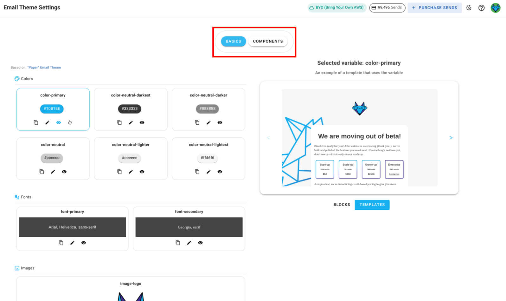
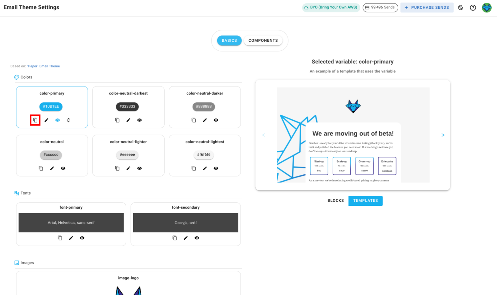
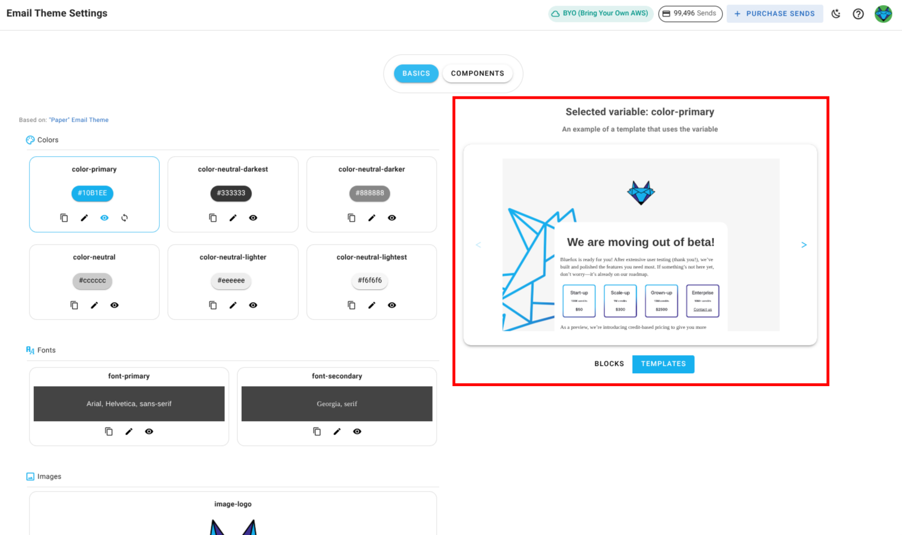
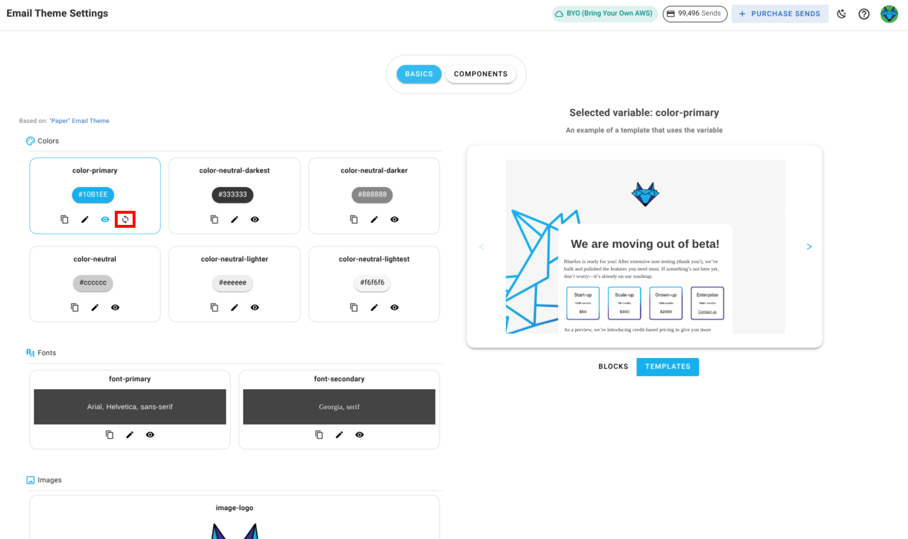

# Email Theme Settings

You can customize the settings for the email theme you selected when creating your project. Setting types include colors, font stacks, images, texts, and links. To access these settings, navigate to your project and select the **Email Theme Settings** tab.

These settings are used throughout blocks and templates defined in the email theme. When you change a setting here, it updates everywhere in your project except for campaigns that have already been sent.

There are two main sections in the email theme settings:
- **Basics** : These are general settings that apply to the entire email theme, such as colors, font family, logos , links,etc.

- **Components** : These are specific blocks that you can use in your emails like buttons, dividers, texts, images,etc.

## Managing Theme settings

Everything you see in the email theme settings is customizable. You can change colors, fonts, images, texts, and links to match your brand. There two main sections in this page, One where you manage settings and another where you preview the changes.

**To manage settings:**
- **Edit:** Click the pencil icon next to a setting to update its value.

  

- **Preview:** Click the preview icon to see where the setting is used in blocks and templates.

  

- **Copy:** Click the copy icon to copy a setting's value.

  

- **Preview Panel:** The right-hand side shows live previews of blocks and templates affected by your changes.

  

- **Reset:** If you have overridden values, you can reset any setting to its original email theme value.

  

::: warning
The email theme linked to a project cannot be changed. If you need to use a different email theme, create a new project and choose the desired email theme during setup.
:::
