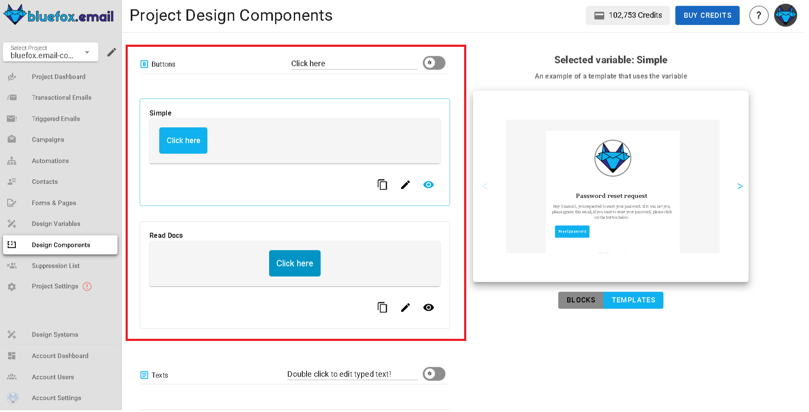
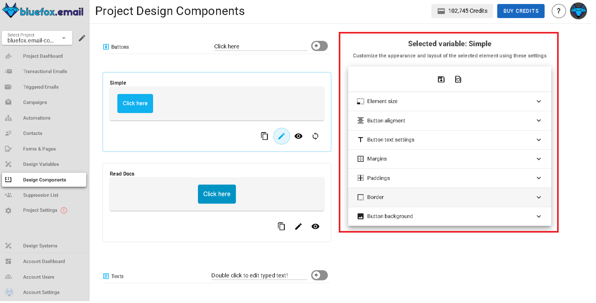
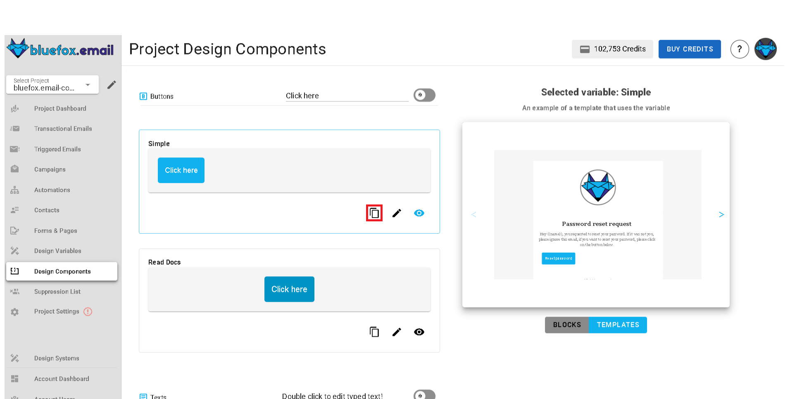

# Email Theme Settings

You can customize the settings for the email theme you selected when creating your project. Setting types include colors, font stacks, images, texts, and links. To access these settings, navigate to your project and select the **Email Theme Settings** tab.

These settings are used throughout blocks and templates defined in the email theme. When you change a setting here, it updates everywhere in your project except for campaigns that have already been sent.

There are two main sections in the email theme settings:
- **Basics** : These are general settings that apply to the entire email theme, such as colors, font family, logos , links,etc.

- **Components** : These are specific blocks that you can use in your emails like buttons, dividers, texts, images,etc.

## Managing Theme settings

Everything you see in the email theme settings is customizable. You can change colors, fonts, images, texts, and links to match your brand. There two main sections in this page, One where you manage settings and another where you preview the changes.

**To manage settings:**
- **Edit:** Click the pencil icon next to a setting to update its value.

  

- **Preview:** Click the preview icon to see where the setting is used in blocks and templates.

  

- **Copy:** Click the copy icon to copy a setting's value.

  

- **Preview Panel:** The right-hand side shows live previews of blocks and templates affected by your changes.

  

- **Reset:** If you have overridden values, you can reset any setting to its original email theme value.

  

::: warning
The email theme linked to a project cannot be changed. If you need to use a different email theme, create a new project and choose the desired email theme during setup.
:::

## Components

Components are the building blocks of your emails, such as buttons, texts, images, and dividers. You can customize these components to match your brand and design preferences.

These components are used throughout blocks and templates defined in your email theme. When you update a component here, the change is reflected everywhere it's used in the current project, except for campaigns that have already been sent.

How a component appears and behaves depends on the chosen email theme. For example, a **`primary-button`** component could define the look and action of your main call‑to‑action, while a **`divider-primary`** component could style section separators in emails.

If you override a component, the change applies **only to this project**. Other projects linked to the same email theme remain unaffected.

### Managing Components

- **Edit:** Click the pencil icon next to a component to modify its properties.  
  

  When editing, the right panel switches from showing a static preview to showing editable fields such as size, alignment, text content, paddings, borders, or backgrounds, depending on the component type.
  
  

- **Preview:** Click the preview icon (eye) to see how the component will appear in blocks and templates. The preview is displayed on the right panel.

  

- **Copy:** Click the copy icon to copy a component's styles or properties.

  

- **Reset:** If you've overridden a component, click the reset icon to restore it to its original email theme configuration.

  

### Component Types

The exact editable properties vary by component type:

- **Button Components:** Size, alignment, button text settings, margins, paddings, border, background.
- **Text Components:** Content, text alignment, link formatting, paddings, background.
- **Divider Components:** Paddings, line style, background.
- **Image Components:** Size, alignment, margins, paddings, border, background.

### Note on Scope

Changes to an email theme component from this page update every instance of that component used in blocks and templates in the current project. Previously sent campaigns are not affected.
