# Forms & Pages

In BlueFox Email, forms & pages are essential tools for managing how users interact with your subscription lists and engage with your content. This section covers how to configure and customize key pages, such as the Subscription Preferences Page and Sign-Up Forms, as well as how to implement Double Opt-In to ensure your subscribers are verified.

## Subscription Preferences Page

We provide a subscription preferences page where users can manage their subscriptions. On this page, users have the ability to unsubscribe, resubscribe, or pause their subscriptions. In triggered emails and campaigns, we provide two merge tags: `unsubscribeLink` and `pauseSubscriptionLink`. Both links direct users to the manage subscription page, but when using the `pauseSubscriptionLink`, the unsubscribe options are removed from the page.

::: tip
The "pause subscription" feature is an effective way to reduce churn.
:::

You can configure the **subscription preferences page** from the **Manage Contacts page**, just head over to **Lists** tab and there you'll find the opiton to manage lists and preview **Subscription Preferences Page**. 
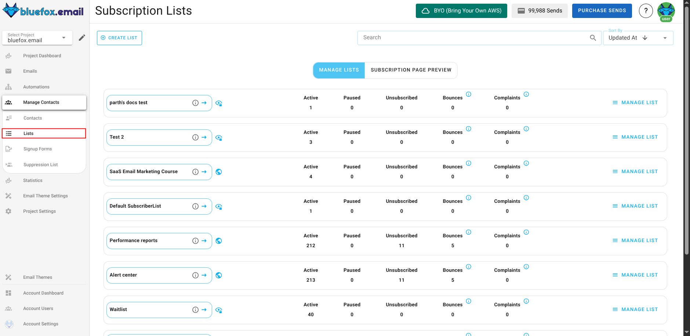

Each project has a single subscription preferences page where users can manage their subscriptions. This page displays all public subscriber lists, showing their names and descriptions to provide users with context about each list. Hit the **subscription preferences page** toggle to preview the page and see how it looks with your lists.

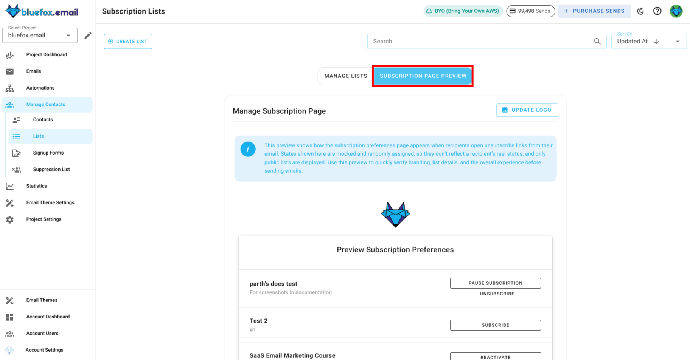

As shown above, there are different states in the user-subscriber list relationship: unsubscribed, paused, and subscribed. Based on these states, different actions are available to the user.

Below is an example of a real subscription preferences page after clicking on the `unsubscribeLink`:

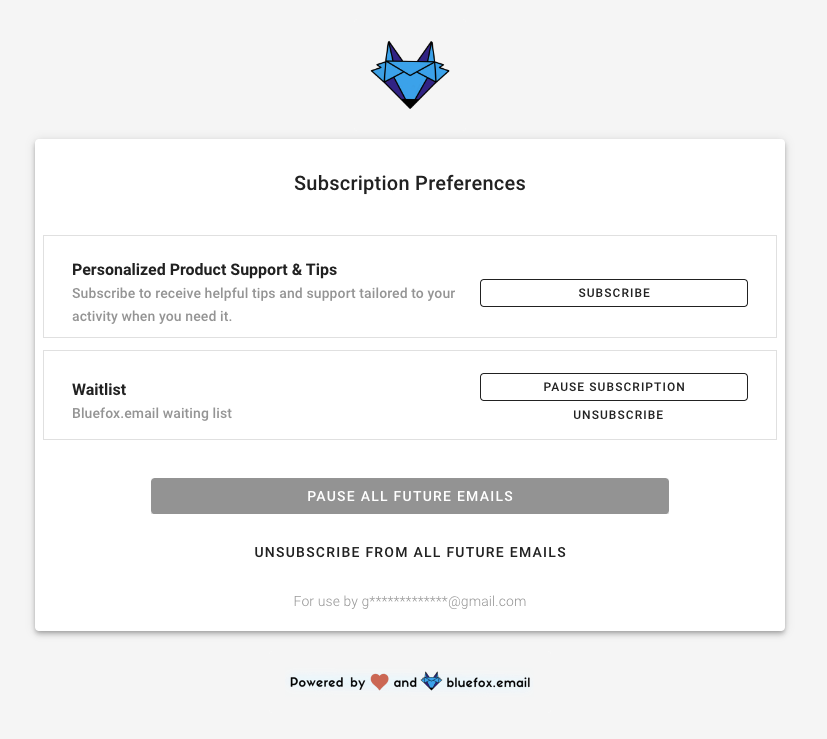

Here is the same page after clicking the `pauseSubscriptionLink`:

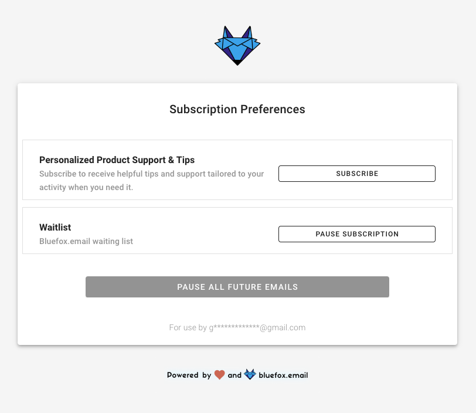

### Project Logo
To manage the logo, click the **update logo** button on the subscription preferences page. This will redirect you to [project logo](/docs/projects/settings#project-logo) in project settings, where you can add, update, or remove the logo.

## Sign-Up Forms

Sign-up forms are now separate entities that you can create, customize, and assign to one or multiple subscriber lists. This flexible approach allows you to design forms once and reuse them across different lists, or create specialized forms for specific audiences. Each form provides an easy way to customize the appearance, generate the necessary HTML code, and integrate it into external sites without the need for backend code.

### How It Works

Users can create multiple forms, customize each form through the interface, and assign them to one or more subscriber lists. Once configured, you can copy the generated HTML code and paste it into your website. When visitors enter their details and submit the form, they will be added to all the subscriber lists assigned to that form.

::: info Important Note:
To ensure the form functions correctly on your website, you must [whitelist](/docs/projects/settings#domain-whitelist) your website domain. Navigate to Project Settings → Whitelist and add your domain to the whitelist.
::: 

### Interface Overview
Below is an example of the sign-up form interface:

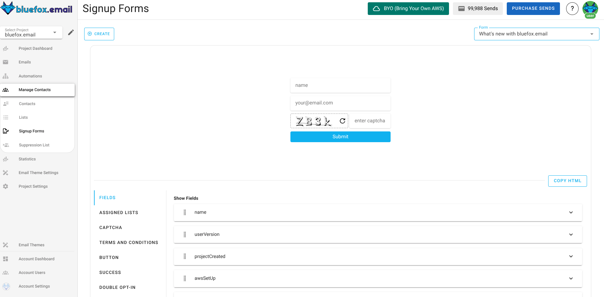

### Managing Forms

From the Forms & Pages tab, you can:
- **Create** new forms from scratch
- **Edit** existing forms
- **Delete** forms you no longer need

In each form you can: 

- **Fields**: Customize the fields shown on the form, set placeholders, and mark fields as required.
- **Assigned Lists**: Assign the form to one or more subscriber lists.
- **Captcha**: Enable or disable CAPTCHA for spam prevention.
- **Terms and Conditions**: Add and customize terms that subscribers must agree to before submitting the form.
- **Button Customization**: Customize the submit button's text, font, color, and size.
- **Success Message Customization**: Customize the message shown to subscribers after they successfully submit the form.
- **Double Opt-In**: Configure double opt-in settings directly at the form level.
- **Form Style Customization**: Choose how form fields are arranged (column or row) and customize font styles and colors.
- **Settings**: Manage Form Name or Delete the form.

### Customization Options

The sign-up form offers several customization options across the following sections: Fields, Form Style, Button, and Success Message.

#### 1. Field Customization

- **Use Captcha:** Enable or disable CAPTCHA for spam prevention.
- **Captcha Placeholder:** Text displayed in the CAPTCHA field (e.g., `Enter the text`).
- **Show Fields:** Choose which fields to display

  - Select the `Show` check box to display a field (e.g., Name).
  - Mark which field is important by checking the `required` check box.
  - Set placeholder text for each field (e.g., `Your Name`, `Your Email`).

  ::: warning Here email is a mandatory field which will always be shown and cannot be **disabled**. 
  :::
  
  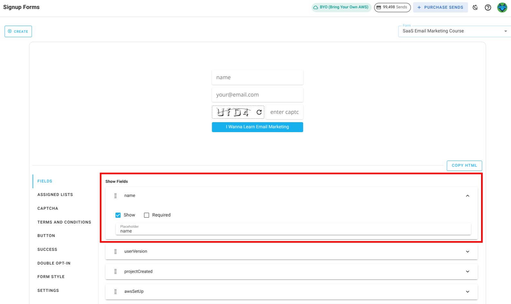

  - You can also adjust the order of the fields by dragging and dropping them.

  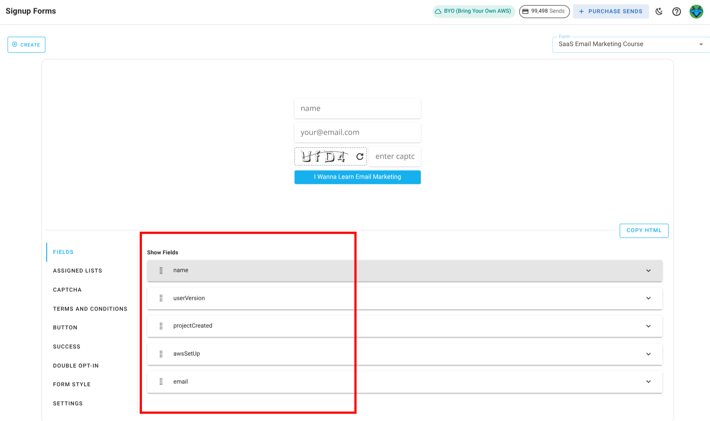

#### 2. Assigned Lists

**Assign to Lists:** Select one or more subscriber lists to which the form will add subscribers upon submission. You can assign the form to multiple lists, allowing you to capture subscribers for different segments or campaigns with a single form.

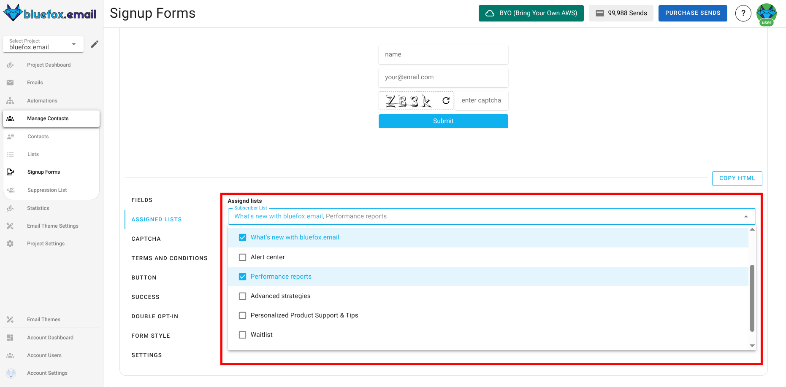

#### 3. Captcha Customization

- **Use Captcha:** Enable or disable CAPTCHA for spam prevention.
- **Captcha Placeholder:** Text displayed in the CAPTCHA field (e.g., `Enter the text`).

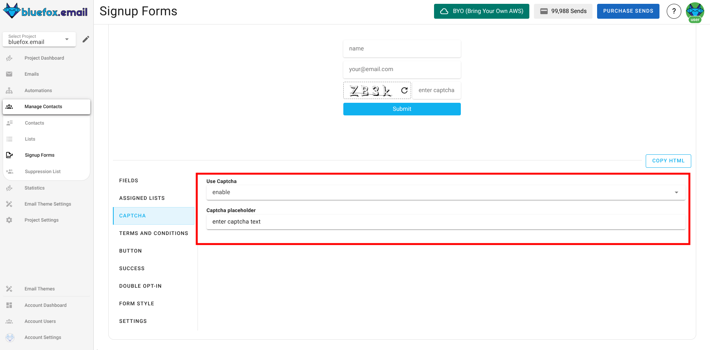

#### 4. Terms and Conditions Customization

- **Show Terms and Conditions:** Enable or disable the display of terms and conditions on the form.
- **Terms and Conditions Text:** Define the text that subscribers must agree to before submitting the form (e.g., `I agree to the terms and conditions`).
- **Terms and Conditions Link Text:** Customize the text for the link to your terms and conditions page (e.g., `Read Terms and Conditions`).
- **Terms and Conditions Link:** Provide a URL to your terms and conditions page (e.g., `https://bluefox.email/terms-of-use`).

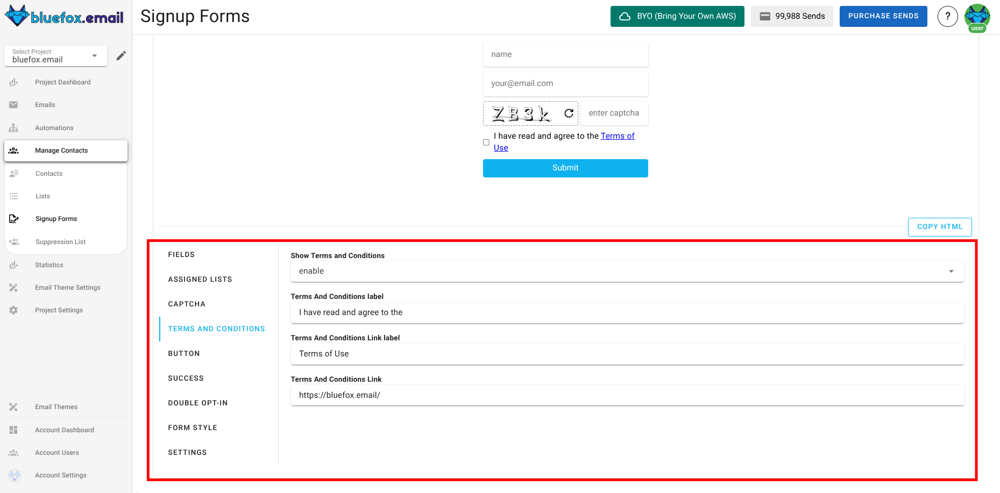

#### 5. Button Customization

- **Button Text:** Customize the text displayed on the submit button (e.g., `Subscribe`).
- **Button Font:** Choose the font family for the button text.
- **Button Font Color:** Set the color of the text on the button.
- **Button Color:** Set the background color of the button.
- **Button Font Size:** Adjust the size of the text on the button.

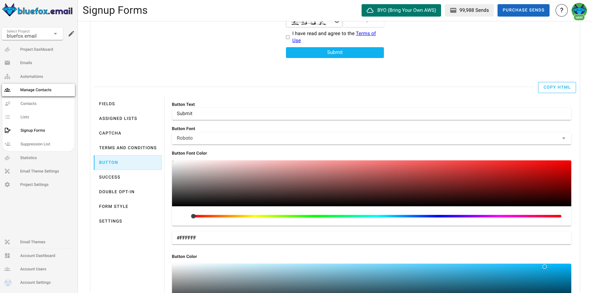

#### 6. Success Message Customization

After a user subscribes successfully, a success message is displayed. You can customize:

- **Success Message Text:** Define the text that appears after successful submission.  
- **Success Message Font:** Choose the font family for the message text.  
- **Success Message Font Color:** Set the color of the success message text.  
- **Success Message Font Size:** Adjust the text size of the success message.  
  
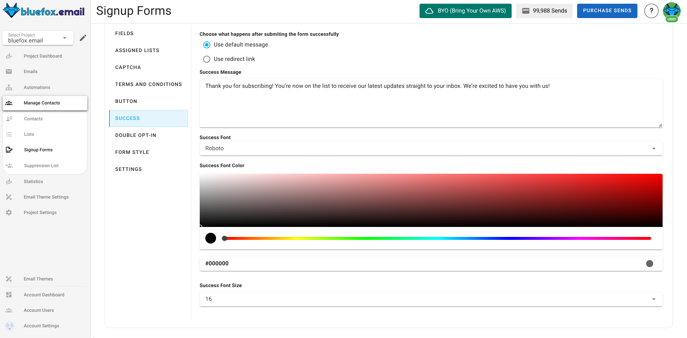

#### 7. Double-opt-in Customization

You can configure double opt-in directly at the form level. When enabled, subscribers who submit the form will receive a verification email before being added as active subscribers to the assigned lists.

- **Activate Double Opt-In:** You will first need to select a proper transactional email mentioned in below steps and then enable double opt-in for the form.

- **Transactional Email:** Select a transactional email containing the `verifyLink` merge tag to be sent to subscribers for verification.
  
- - **Change Email:** Click on this button to open all transactional emails in your project.
    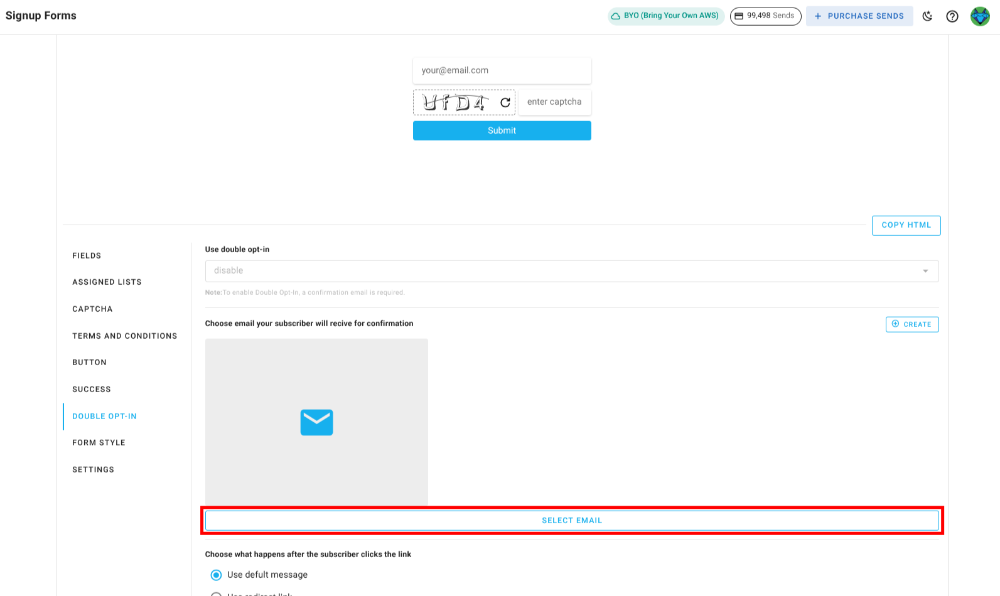

- - **Transactional Email Merge Tag:** Ensure that the selected transactional email includes the `verifyLink` merge tag, if not just click on edit email and add the merge tag to the email body. 
    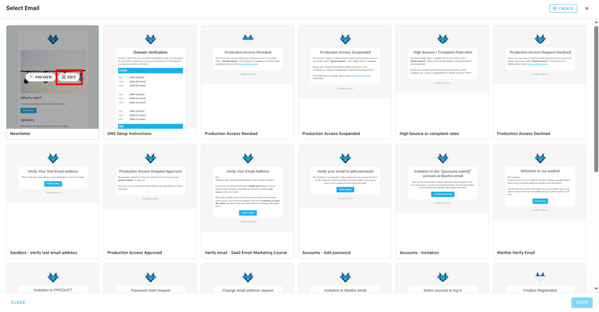
    
    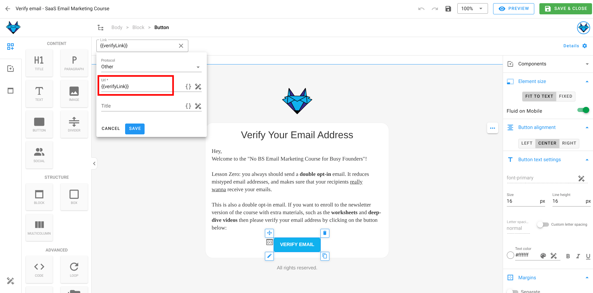

- **Post-Confirmation Action:** Choose what happens after confirmation, either showing a confirmation message or redirecting to a custom page.
- **Confirmation Message Customization:** If you choose to show a confirmation message, you can customize the title and message text that subscribers see after confirming their email.
- **Redirect URL Customization:** If you choose to redirect after confirmation, you can specify the URL to which subscribers will be redirected (e.g., `https://bluefox.email/`).

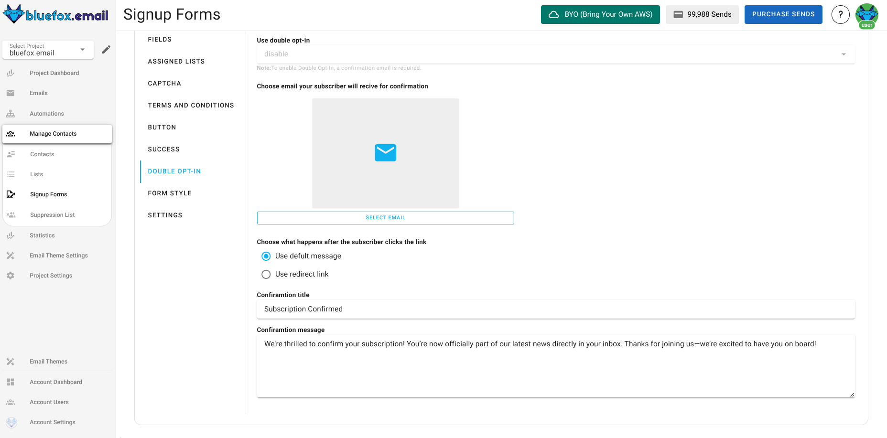

#### 8. Form Customization

- **Form Style:** Choose how form fields are arranged:
  - **Column** - Fields are stacked vertically.
  - **Row** - Fields are placed horizontally.
- **Font Style:** Select the font family for the form fields.
- **Font Color:** Set the color of the text in the form fields.
- **Font Size:** Adjust the size of the text in the form fields.

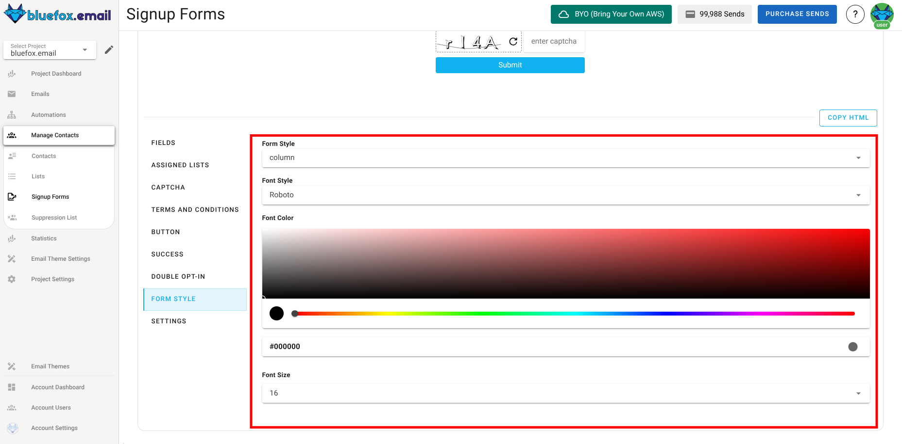 

#### 9. Settings

- **Form Name:** Set or update the name of the form for easy identification.
- **Delete Form:** Permanently delete the form from your project.

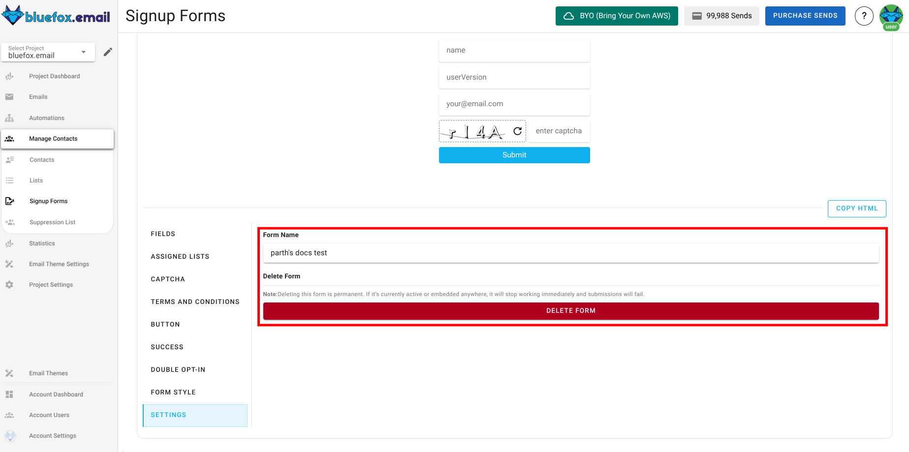
