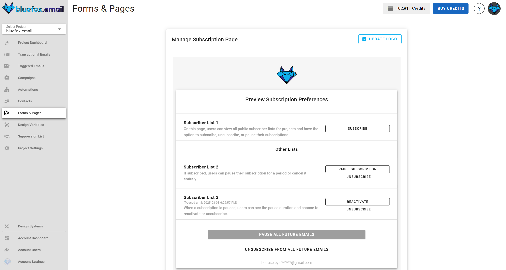
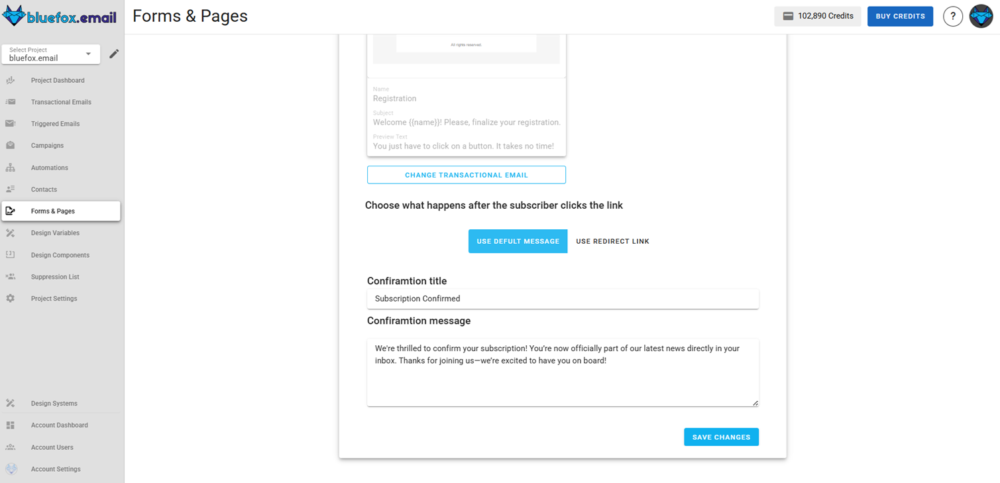

# Forms & Pages

In bluefox.email, forms & pages are essential tools for managing how users interact with your subscription lists and engage with your content. This section covers how to configure and customize key pages, such as the Subscription Preferences Page and Sign-Up Forms, as well as how to implement Double Opt-In to ensure your subscribers are verified.

## Subscription Preferences Page

We provide a subscription preferences page where users can manage their subscriptions. On this page, users have the ability to unsubscribe, resubscribe, or pause their subscriptions. In triggered emails and campaigns, we provide two merge tags: `unsubscribeLink` and `pauseSubscriptionLink`. Both links direct users to the manage subscription page, but when using the `pauseSubscriptionLink`, the unsubscribe options are removed from the page.

::: tip
The "pause subscription" feature is an effective way to reduce churn.
:::

You can configure the **subscription preferences page** from the **forms & pages tab**. Each project has a single subscription preferences page where users can manage their subscriptions. This page displays all public subscriber lists, showing their names and descriptions to provide users with context about each list.

As shown above, there are different states in the user-subscriber list relationship: unsubscribed, paused, and subscribed. Based on these states, different actions are available to the user.

Below is an example of a real subscription preferences page after clicking on the `unsubscribeLink`:

Here is the same page after clicking the `pauseSubscriptionLink`:

### Project Logo
To manage the logo, click the **update logo** button on the subscription preferences page. This will redirect you to [project logo](/docs/projects/settings#project-logo) in project settings, where you can add, update, or remove the logo.

## Signup page

The sign-up page for each list allows users to create a form that subscribers can use to sign up directly from their website. Each List has its own unique sign-up form, ensuring that subscribers are added to the correct audience. This page provides an easy way to customize the form, generate the necessary HTML code, and integrate it into external sites without the need for backend code.

### How It Works

Users can customize the sign-up form through the interface, then copy the generated HTML code and paste it into their website. Once implemented, visitors can enter their details and subscribe directly to the subscriber list in Bluefox.email.

::: info Important Note:
To ensure the form functions correctly on your website, you must [whitelist](/docs/projects/settings#domain-whitelist) your website domain. Navigate to Project Settings → Whitelist and add your domain to the whitelist.
::: 

### Interface Overview
Below is an example of the sign-up form interface:

### Customization Options

The sign-up page offers several customization options across three main sections: Form, Button, and Success Message.

#### 1. Form Customization

- **Form Style:** Choose how form fields are arranged:
  - `Column` – Fields are stacked vertically.  
  - `Inline` – Fields are placed in a single line.  
  - `Row` – Fields are placed horizontally.  
- **Email Placeholder:** Text displayed in the email field (e.g., `Enter your email`).  
- **Font Style:** Select the font family for the form fields.  

#### 2. Button Customization

- **Button Text:** Customize the text displayed on the submit button (e.g., `Subscribe`).  
- **Button Font:** Choose the font family for the button text.  
- **Button Font Color:** Set the color of the text on the button.  
- **Button Color:** Set the background color of the button.  
- **Button Font Size:** Adjust the size of the text on the button.  

#### 3. Success Message Customization

After a user subscribes successfully, a success message is displayed. You can customize:

- **Success Message Text:** Define the text that appears after successful submission.  
- **Success Message Font:** Choose the font family for the message text.  
- **Success Message Font Color:** Set the color of the success message text.  
- **Success Message Font Size:** Adjust the text size of the success message.  

### Using the Form

1. Customize the form using the available options.
2. Click Copy HTML to copy the generated code.
3. Paste the code into your website’s HTML.
4. Make sure your website domain is whitelisted.

The form will now capture subscriber's information and automatically add them to your Bluefox.email subscriber list.

## Double Opt-in

Keep in mind that you should always implement [double opt-in](/email-best-practices-for-saas/double-opt-in), meaning that you only add your users to subscriber lists as active subscribers when they verify their email address!

If you add your users to multiple lists when they sign up for your service:
- Send them a verification email (transactional email) with a unique link.
- If they click on the link (and accept your terms and conditions), you can add them to the subscriber lists as `active` subscribers.

If you just create a newsletter sign-up:
- You can add them to your list as an `unverified` subscriber.
- Send them a verification email (transactional email) with a unique link.
- When they click on it, you can change their status to `active`.

### Activating Double Opt-In

Double Opt-In settings are configured individually for each List. To activate double opt-in for a specific List:

- Go to the **Forms & Pages tab**
- Go to **double opt-in** section 
- Select the list you want to manage
- Switch to Active.
- Select the **double opt-In email** with the ``verifyLink`` merge tag.
- Select what to do after confirmation show confiramtion message or redirect to custom page
- Fill the needed data
- Click **save** to apply the changes.

---

### Customizing the Confirmation Message

Once double opt-in is activated, you can customize the message shown to subscribers after they confirm their email:

- Enter the **Confirmation Title** (e.g., "Thank You for Confirming!").
- Enter the **Confirmation Message** to greet your subscribers.
- Click **Save**.

### Customizing the Redirect URL

Once double opt-in is activated, you can customize the message shown to subscribers after they confirm their email:

- Enter the **Link** (e.g., "https://bluefox.email/").
- Click **Save**.

