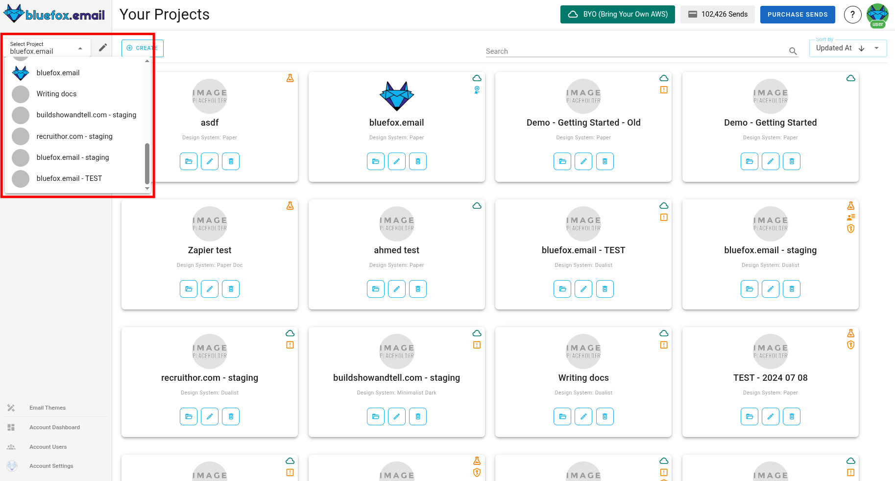

# Projects

In bluefox.email, you can create projects for your SaaS. Projects can represent different environments like development, staging, and production. This way, you can manage emails for each environment separately.

For each project, you need to set up a sending email address and your AWS credentials. This allows bluefox.email to send emails using AWS SES.

## What Each Project Includes

Every project in bluefox.email includes:
- [Transactional emails](./transactional-emails)
- [Triggered emails](./triggered-emails)
- [Campaigns](./campaigns)
- [Subscriber lists](./subscriber-lists)
- [Design system settings](./design-system-settings)
- [Project settings](./settings)

Each project comes with a subscription preferences page, which you can set up under the [subscriber lists](./subscriber-lists) tab.

## Navigating to Projects

You can find the projects section by clicking the last icon on the left-hand side.

## Free vs. Premium Projects

Projects are free by default, but they include bluefox.email's logo and a link to our website in the email footers.

::: tip Upgrade for Whitelabel
Upgrade your project to premium to remove our logo and link from your email footers.
:::

Premium projects have a premium flag:

## Project Warnings

If your project configuration isn't complete, you'll see warnings. Hover over the warning icons for more details. Most issues can be resolved in the project's settings tab.

## Inside a Project

When you enter a project, you'll see a tabbed view with all the project-related sections:

These tabs include:
- [Transactional emails](./transactional-emails)
- [Triggered emails](./triggered-emails)
- [Campaigns](./campaigns)
- [Subscriber lists](./subscriber-lists)
- [Design system settings](./design-system-settings)
- [Project settings](./settings)

Remember, the subscription preferences page is under the [subscriber lists](./subscriber-lists) tab.
