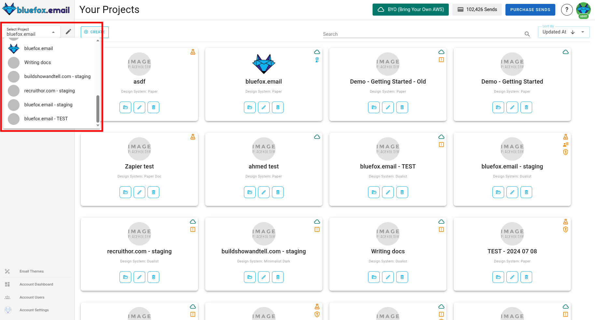
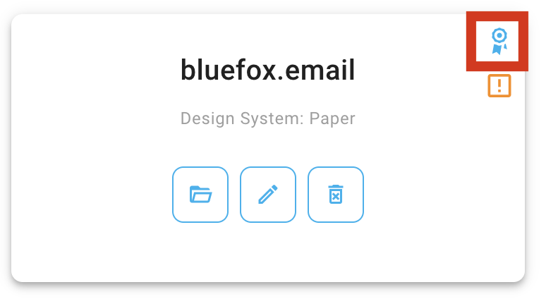
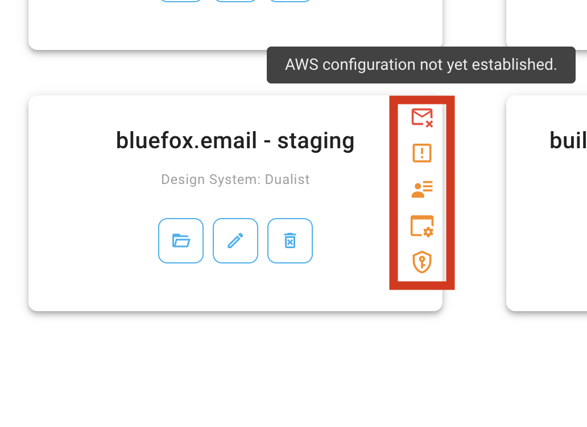

# Projects

Projects in bluefox.email can be associated with your projects' different environments. For example, if you have a SaaS, you might have a dev, a staging, and a production environment. You can create one separate project in bluefox.email for those environments.

Every project is associated with a specific theme (design system) that you can [customize](./design-system-settings).

Every project has
 - subscriber lists
 - transactional emails
 - triggered emails
 - campaigns

A project is also associated with a sending email address, as well as your AWS credentials with allows us to send emails with your AWS SES.

::: tip Upgrade for whitelabel
Projects are free by default. In exchange for being free, we put our logo and a link to our website to your emails' footers. If you would like to remove our post-footer advertisement section, please upgrade your project to premium.
:::

You can find the projects section by clicking on the last icon on the left-hand-side.

Premium projects are denoted by a premium flag:

You can see warnings if your project configuration is not finished yet. By hovering over the icons, you will see a short description about the warning. Most of them can be resolved in the project's settings tab.

If you enter a project, you will see a tabbed view of the project:

On the tabbed view above, you can find all of the project-related things:
 - [transactional emails](./transactional-emails)
 - [triggered emails](./triggered-emails)
 - [campaigns](./campaigns)
 - [subscriber lists](./subscriber-lists)
 - [design system setting](./design-system-settings)
 - [project settings](./settings)

We also provide a subscription preferences page. You can configure that under the [subscriber lists](./subscriber-lists) tab.
